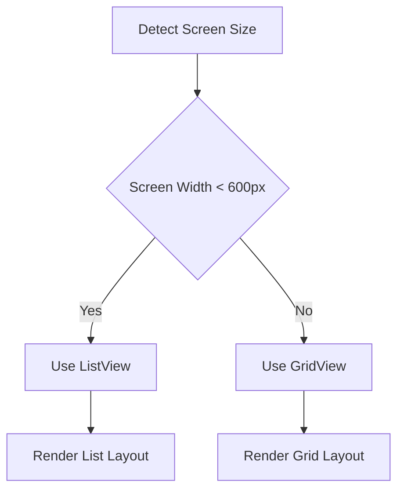

## 5.2.3 Adapting to Screen Sizes

In today's diverse digital landscape, applications must cater to a wide array of devices, from compact smartphones to expansive desktop monitors. Adapting to screen sizes is not just a technical necessity but a fundamental aspect of delivering a seamless user experience. This section delves into the strategies and techniques for creating responsive and adaptive interfaces in Flutter, focusing on the master-detail interface pattern.

### Responsive Design Principles

Responsive design is the cornerstone of modern UI development, ensuring that applications provide an optimal viewing experience across a variety of devices. Here are the key principles:

- **Mobile-First Design:** Start with the smallest screen size and progressively enhance the design for larger screens. This approach ensures that the core functionality is accessible on all devices.
  
- **Progressive Enhancement:** Build on the mobile-first approach by adding layers of complexity and additional features for devices with larger screens and more capabilities.

By adhering to these principles, developers can create applications that are both functional and aesthetically pleasing, regardless of the device used.

### Dynamic Layout Adjustments

Dynamic layout adjustments are crucial for adapting interfaces to different screen sizes. Flutter provides robust tools to facilitate these adjustments, primarily through `MediaQuery`.

#### Screen Size Detection

`MediaQuery` is a powerful Flutter widget that provides information about the size and orientation of the current screen. Here's how to use it:

```dart
import 'package:flutter/material.dart';

class ResponsiveLayout extends StatelessWidget {
  @override
  Widget build(BuildContext context) {
    // Retrieve screen dimensions
    final screenWidth = MediaQuery.of(context).size.width;
    final screenHeight = MediaQuery.of(context).size.height;
    final isPortrait = MediaQuery.of(context).orientation == Orientation.portrait;

    return Scaffold(
      appBar: AppBar(title: Text('Responsive Layout')),
      body: Center(
        child: Text(
          'Screen Width: $screenWidth\nScreen Height: $screenHeight\nOrientation: ${isPortrait ? 'Portrait' : 'Landscape'}',
          textAlign: TextAlign.center,
        ),
      ),
    );
  }
}
```

#### Conditional Layouts

Once screen size is detected, you can implement conditional layouts to adjust the UI dynamically. For example, switching between list and grid views based on screen width:

```dart
Widget build(BuildContext context) {
  final screenWidth = MediaQuery.of(context).size.width;

  return Scaffold(
    appBar: AppBar(title: Text('Dynamic Layout')),
    body: screenWidth < 600
        ? ListView.builder(
            itemCount: 20,
            itemBuilder: (context, index) => ListTile(title: Text('Item $index')),
          )
        : GridView.builder(
            gridDelegate: SliverGridDelegateWithFixedCrossAxisCount(crossAxisCount: 3),
            itemCount: 20,
            itemBuilder: (context, index) => Card(child: Center(child: Text('Item $index'))),
          ),
  );
}
```

### Conditional Rendering

Conditional rendering allows you to show or hide widgets based on certain conditions, such as screen size. Flutter offers several widgets to facilitate this:

#### Widget Visibility

Use widgets like `Visibility`, `Offstage`, and `Expanded` to control widget visibility and layout behavior:

```dart
Widget build(BuildContext context) {
  final screenWidth = MediaQuery.of(context).size.width;

  return Column(
    children: [
      Visibility(
        visible: screenWidth > 600,
        child: Text('Visible on larger screens'),
      ),
      Offstage(
        offstage: screenWidth <= 600,
        child: Text('Hidden on smaller screens'),
      ),
      Expanded(
        child: Container(color: Colors.blue),
      ),
    ],
  );
}
```

### Optimizing for Various Devices

Different devices require different design considerations to optimize user experience:

#### Mobile Devices

For mobile devices, prioritize touch-friendly designs with vertical scrolling:

- Use larger touch targets for buttons and interactive elements.
- Implement vertical scrolling for content-heavy screens.

#### Tablets and Desktops

Leverage larger screens with multi-column layouts and detailed navigation:

- Use `GridView` or `Flex` widgets to create multi-column interfaces.
- Implement side navigation bars for easier access to different sections.

```dart
Widget build(BuildContext context) {
  final screenWidth = MediaQuery.of(context).size.width;

  return Scaffold(
    body: Row(
      children: [
        if (screenWidth > 800) NavigationRail(
          destinations: [
            NavigationRailDestination(icon: Icon(Icons.home), label: Text('Home')),
            NavigationRailDestination(icon: Icon(Icons.settings), label: Text('Settings')),
          ],
        ),
        Expanded(
          child: Center(child: Text('Main Content Area')),
        ),
      ],
    ),
  );
}
```

### User Experience Enhancements

Enhancing user experience involves ensuring that layout changes are seamless and consistent:

- **Seamless Transitions:** Use animations to transition between different layouts smoothly.
- **Consistency:** Maintain consistent navigation and interaction patterns across different layouts to avoid confusing users.

### Implementation Guidance

Here are some comprehensive code snippets demonstrating responsive adjustments:

```dart
class ResponsiveScaffold extends StatelessWidget {
  @override
  Widget build(BuildContext context) {
    final screenWidth = MediaQuery.of(context).size.width;

    return Scaffold(
      appBar: AppBar(title: Text('Responsive Scaffold')),
      body: screenWidth < 600
          ? ListView(
              children: List.generate(10, (index) => ListTile(title: Text('Item $index'))),
            )
          : GridView.count(
              crossAxisCount: 2,
              children: List.generate(10, (index) => Card(child: Center(child: Text('Item $index')))),
            ),
    );
  }
}
```

#### Mermaid.js Diagrams

To better illustrate layout changes based on screen sizes, consider using Mermaid.js diagrams:



### Examples and Case Studies

Let's explore some real-world Flutter projects that dynamically adapt their interfaces to various screen sizes:

- **Flutter Gallery:** This open-source project by the Flutter team showcases a wide range of Flutter widgets and their responsive capabilities.
- **E-commerce Apps:** Many e-commerce apps use responsive design to provide a seamless shopping experience across devices.

These projects maintain usability and aesthetics by leveraging Flutter's responsive design tools effectively.

### Common Pitfalls

When adapting to screen sizes, be aware of these common pitfalls:

- **Inconsistent User Experience:** Ensure that your layouts feel cohesive across different screen sizes. Avoid drastic changes that can confuse users.
- **Overcomplicating Logic:** Keep your responsive logic simple and maintainable. Overly complex conditions can lead to bugs and difficult-to-maintain code.

### Conclusion

Adapting to screen sizes is a critical aspect of modern app development. By leveraging Flutter's powerful tools and following best practices, you can create applications that provide an optimal user experience across all devices. Remember to keep your designs simple, consistent, and user-friendly, ensuring that your app stands out in a competitive digital landscape.

## Quiz Time!



### What is the primary goal of responsive design?

- [x] To provide an optimal viewing experience across a variety of devices
- [ ] To make applications faster
- [ ] To reduce the number of widgets in an app
- [ ] To increase the complexity of the app

> **Explanation:** Responsive design aims to ensure that applications look and function well on a wide range of devices, from small phones to large desktops.

### Which Flutter widget provides information about the size and orientation of the current screen?

- [x] MediaQuery
- [ ] LayoutBuilder
- [ ] OrientationBuilder
- [ ] SizedBox

> **Explanation:** MediaQuery is used to retrieve information about the screen's dimensions and orientation.

### What is the mobile-first design approach?

- [x] Designing for the smallest screen size first and then enhancing for larger screens
- [ ] Designing for the largest screen size first and then reducing for smaller screens
- [ ] Designing only for mobile devices
- [ ] Ignoring desktop users

> **Explanation:** Mobile-first design starts with the smallest screen size to ensure core functionality is accessible on all devices, then enhances for larger screens.

### Which widget can be used to show or hide widgets based on certain conditions?

- [x] Visibility
- [ ] Container
- [ ] Scaffold
- [ ] AppBar

> **Explanation:** The Visibility widget allows you to control the visibility of its child widget based on conditions.

### What is a common pitfall when adapting to screen sizes?

- [x] Inconsistent user experience
- [ ] Using too many widgets
- [ ] Not using enough colors
- [ ] Ignoring animations

> **Explanation:** Inconsistent user experience can occur if layouts feel disjointed or confusing across different screen sizes.

### Which widget is recommended for creating multi-column layouts on larger screens?

- [x] GridView
- [ ] ListView
- [ ] SingleChildScrollView
- [ ] Stack

> **Explanation:** GridView is ideal for creating multi-column layouts, especially on larger screens like tablets and desktops.

### What is the purpose of using animations in responsive design?

- [x] To ensure layout changes are smooth and do not disrupt the user's workflow
- [ ] To make the app load faster
- [ ] To increase the complexity of the UI
- [ ] To reduce the number of widgets

> **Explanation:** Animations help in making layout transitions smooth, enhancing the user experience without disruption.

### How can you maintain consistency in navigation across different layouts?

- [x] By keeping navigation patterns consistent
- [ ] By changing navigation styles frequently
- [ ] By using different navigation methods for each screen size
- [ ] By avoiding navigation altogether

> **Explanation:** Consistent navigation patterns help users feel comfortable and familiar with the app, regardless of the device.

### What is a benefit of using the mobile-first approach?

- [x] Ensures core functionality is accessible on all devices
- [ ] Reduces development time
- [ ] Increases app complexity
- [ ] Limits the app to mobile devices only

> **Explanation:** Mobile-first ensures that the essential features of an app are accessible on all devices, providing a solid foundation to build upon.

### True or False: The Offstage widget can be used to hide widgets without removing them from the widget tree.

- [x] True
- [ ] False

> **Explanation:** The Offstage widget hides its child widget but keeps it in the widget tree, allowing it to maintain its state.


