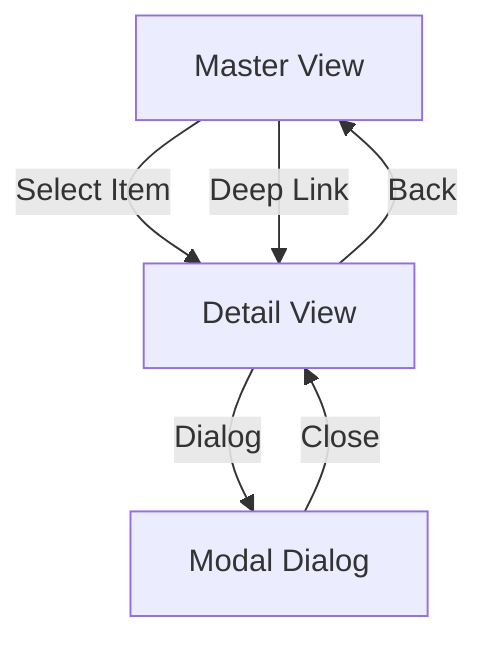

## 5.2.4 Handling Navigation in Master-Detail

In the realm of mobile app development, the master-detail interface is a prevalent design pattern that enhances user experience by organizing content into a primary list (master) and detailed view (detail). This pattern is particularly effective on larger screens, such as tablets, where both views can be displayed simultaneously. However, on smaller screens, such as smartphones, navigation between these views becomes crucial. This section delves into the intricacies of handling navigation within master-detail interfaces using Flutter, covering navigation patterns, state management, routing strategies, and more.

### Navigation Patterns

#### Push/Pop Navigation

Flutter's `Navigator` widget is the cornerstone of navigation, allowing developers to push and pop routes from the navigation stack. In a master-detail interface, this pattern is typically used to transition from the master view to the detail view.

**Example: Push/Pop Navigation**

```dart
// Master View
class MasterView extends StatelessWidget {
  final List<String> items = List.generate(20, (index) => 'Item $index');

  @override
  Widget build(BuildContext context) {
    return Scaffold(
      appBar: AppBar(title: Text('Master View')),
      body: ListView.builder(
        itemCount: items.length,
        itemBuilder: (context, index) {
          return ListTile(
            title: Text(items[index]),
            onTap: () {
              Navigator.push(
                context,
                MaterialPageRoute(
                  builder: (context) => DetailView(item: items[index]),
                ),
              );
            },
          );
        },
      ),
    );
  }
}

// Detail View
class DetailView extends StatelessWidget {
  final String item;

  DetailView({required this.item});

  @override
  Widget build(BuildContext context) {
    return Scaffold(
      appBar: AppBar(title: Text('Detail View')),
      body: Center(child: Text('Details of $item')),
    );
  }
}
```

In this example, tapping an item in the master view pushes a new route onto the stack, displaying the detail view.

#### Dialog-Based Navigation

In some scenarios, displaying detail content in a modal or dialog can enhance user experience, particularly when the detail view is a temporary or supplementary view.

**Example: Dialog-Based Navigation**

```dart
// Function to show detail in a dialog
void showDetailDialog(BuildContext context, String item) {
  showDialog(
    context: context,
    builder: (context) {
      return AlertDialog(
        title: Text('Detail View'),
        content: Text('Details of $item'),
        actions: [
          TextButton(
            onPressed: () => Navigator.pop(context),
            child: Text('Close'),
          ),
        ],
      );
    },
  );
}
```

This approach is useful for quick interactions where returning to the master view is expected immediately after viewing details.

### State Management Considerations

#### Maintaining Consistent State

Consistent state management is crucial for seamless transitions between master and detail views. Without it, users may experience unexpected behavior or data loss when navigating.

#### State Management Solutions

Flutter offers several state management solutions, such as `Provider`, `Bloc`, and `Riverpod`, each with its strengths.

- **Provider:** Simplifies state management by using inherited widgets.
- **Bloc:** Provides a reactive programming model with streams.
- **Riverpod:** An improvement over Provider, offering better performance and flexibility.

**Example: State Management with Provider**

```dart
// State class
class ItemModel with ChangeNotifier {
  String _selectedItem = '';

  String get selectedItem => _selectedItem;

  void selectItem(String item) {
    _selectedItem = item;
    notifyListeners();
  }
}

// Using Provider in the app
void main() {
  runApp(
    ChangeNotifierProvider(
      create: (context) => ItemModel(),
      child: MyApp(),
    ),
  );
}

// Accessing state in Master View
class MasterView extends StatelessWidget {
  @override
  Widget build(BuildContext context) {
    final itemModel = Provider.of<ItemModel>(context);

    return Scaffold(
      appBar: AppBar(title: Text('Master View')),
      body: ListView.builder(
        itemCount: 20,
        itemBuilder: (context, index) {
          final item = 'Item $index';
          return ListTile(
            title: Text(item),
            onTap: () {
              itemModel.selectItem(item);
              Navigator.push(
                context,
                MaterialPageRoute(
                  builder: (context) => DetailView(),
                ),
              );
            },
          );
        },
      ),
    );
  }
}

// Accessing state in Detail View
class DetailView extends StatelessWidget {
  @override
  Widget build(BuildContext context) {
    final selectedItem = Provider.of<ItemModel>(context).selectedItem;

    return Scaffold(
      appBar: AppBar(title: Text('Detail View')),
      body: Center(child: Text('Details of $selectedItem')),
    );
  }
}
```

### Routing Strategies

#### Named Routes

Named routes provide a more organized and scalable approach to navigation, especially in larger applications.

**Example: Named Routes**

```dart
// Define routes in MaterialApp
MaterialApp(
  initialRoute: '/',
  routes: {
    '/': (context) => MasterView(),
    '/detail': (context) => DetailView(),
  },
);

// Navigate using named routes
Navigator.pushNamed(context, '/detail');
```

#### Dynamic Routing

Dynamic routing allows navigation based on user interactions or data, providing flexibility in how routes are handled.

**Example: Dynamic Routing**

```dart
// Dynamic route generation
onGenerateRoute: (settings) {
  if (settings.name == '/detail') {
    final item = settings.arguments as String;
    return MaterialPageRoute(
      builder: (context) => DetailView(item: item),
    );
  }
  return null;
},

// Passing arguments to routes
Navigator.pushNamed(
  context,
  '/detail',
  arguments: 'Item 1',
);
```

### Deep Linking and Navigation

#### Direct Navigation to Detail Views

Deep linking enables users to navigate directly to specific detail content from external sources, such as notifications or web links.

**Example: Implementing Deep Links with go_router**

```dart
// Using go_router for deep linking
final GoRouter _router = GoRouter(
  routes: [
    GoRoute(
      path: '/',
      builder: (context, state) => MasterView(),
    ),
    GoRoute(
      path: '/detail/:id',
      builder: (context, state) {
        final id = state.params['id'];
        return DetailView(item: 'Item $id');
      },
    ),
  ],
);

// Navigate to a detail view using a deep link
_router.go('/detail/1');
```

#### URL Handling

Managing URLs to reflect the current navigation state is essential for deep linking and sharing links.

### Handling Back Navigation

#### Back Button Behavior

Ensuring that back navigation returns the user to the appropriate master view is critical for a smooth user experience.

**Example: Handling Back Navigation**

```dart
// Override back button behavior
WillPopScope(
  onWillPop: () async {
    // Custom back navigation logic
    return true; // Allow back navigation
  },
  child: DetailView(),
)
```

#### State Restoration

State restoration maintains user context after navigation, ensuring that users return to the same state they left.

### Implementation Guidance

#### Code Snippets

The provided code snippets illustrate effective navigation handling within master-detail interfaces, showcasing various patterns and strategies.

#### Mermaid.js Diagrams

Below is a flowchart depicting navigation flows and state transitions in a master-detail interface:



### Examples and Case Studies

Applications like email clients and note-taking apps often implement robust navigation systems within their master-detail interfaces. These apps handle complex navigation scenarios and state management to enhance user experience.

### Common Pitfalls

#### State Inconsistencies

State inconsistencies can lead to unexpected UI behavior. It's crucial to ensure that state is correctly managed across navigation transitions.

#### Overcomplicating Navigation Logic

Keeping navigation logic simple and maintainable is vital. Overcomplicating it can lead to bugs and a poor user experience.

### Conclusion

Handling navigation in master-detail interfaces requires a deep understanding of navigation patterns, state management, and routing strategies. By leveraging Flutter's powerful tools and techniques, developers can create seamless and intuitive navigation experiences that enhance user engagement and satisfaction.

## Quiz Time!



### What is the primary purpose of the master-detail interface pattern?

- [x] To organize content into a primary list and detailed view
- [ ] To enhance animations in mobile apps
- [ ] To simplify state management
- [ ] To improve network performance

> **Explanation:** The master-detail interface pattern organizes content into a primary list (master) and a detailed view (detail), enhancing user experience by providing a structured way to navigate content.

### Which Flutter widget is used for managing push/pop navigation?

- [x] Navigator
- [ ] ListView
- [ ] Scaffold
- [ ] Provider

> **Explanation:** The `Navigator` widget in Flutter is used for managing push/pop navigation, allowing transitions between different views or routes.

### When is dialog-based navigation most appropriate?

- [x] When the detail view is temporary or supplementary
- [ ] When the app requires complex animations
- [ ] When managing large datasets
- [ ] When optimizing for low-end devices

> **Explanation:** Dialog-based navigation is most appropriate when the detail view is temporary or supplementary, providing a quick way to display additional information without leaving the current context.

### Which state management solution is known for using streams and reactive programming?

- [ ] Provider
- [x] Bloc
- [ ] Riverpod
- [ ] Redux

> **Explanation:** Bloc is a state management solution known for using streams and reactive programming, allowing for a more structured approach to managing state changes.

### What is the benefit of using named routes in Flutter?

- [x] Organized and scalable navigation
- [ ] Faster network requests
- [ ] Improved image loading
- [ ] Enhanced animations

> **Explanation:** Named routes provide organized and scalable navigation, making it easier to manage and navigate between different views in larger applications.

### How does deep linking enhance user experience?

- [x] By allowing users to navigate directly to specific content
- [ ] By improving app performance
- [ ] By reducing code complexity
- [ ] By enhancing security

> **Explanation:** Deep linking enhances user experience by allowing users to navigate directly to specific content from external sources, such as notifications or web links.

### What is the purpose of state restoration in navigation?

- [x] To maintain user context after navigation
- [ ] To improve app performance
- [ ] To enhance animations
- [ ] To reduce code complexity

> **Explanation:** State restoration maintains user context after navigation, ensuring that users return to the same state they left, providing a seamless experience.

### Which package is commonly used for implementing deep links in Flutter?

- [ ] Provider
- [ ] Bloc
- [x] go_router
- [ ] sqflite

> **Explanation:** The `go_router` package is commonly used for implementing deep links in Flutter, providing a flexible and powerful routing solution.

### What is a common pitfall when handling navigation in master-detail interfaces?

- [x] State inconsistencies
- [ ] Overuse of animations
- [ ] Excessive network requests
- [ ] Lack of UI elements

> **Explanation:** State inconsistencies are a common pitfall when handling navigation in master-detail interfaces, leading to unexpected UI behavior if not managed properly.

### True or False: Overcomplicating navigation logic can lead to bugs and a poor user experience.

- [x] True
- [ ] False

> **Explanation:** True. Overcomplicating navigation logic can lead to bugs and a poor user experience, making it essential to keep navigation logic simple and maintainable.


