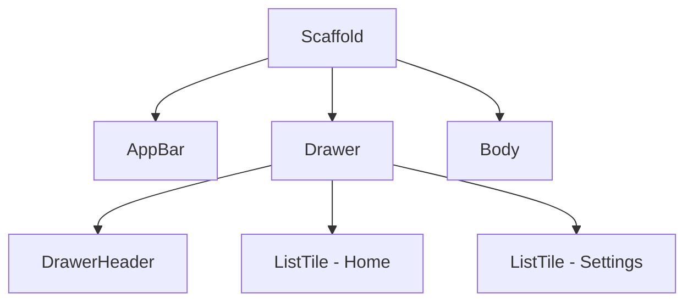
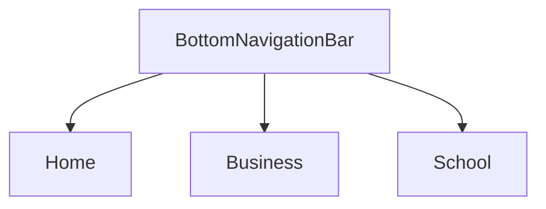

## 5.3.1 Navigation Drawer and Bottom Navigation

In the realm of mobile app development, navigation components play a pivotal role in defining the user experience. Among the most commonly used navigation elements are the Navigation Drawer and Bottom Navigation Bar. These components not only facilitate seamless navigation across different sections of an app but also contribute to the overall aesthetic and usability of the interface. This section delves into the intricacies of implementing these navigation components in Flutter, emphasizing design principles, customization, and responsive adjustments.

### Introduction to Navigation Components

#### Navigation Drawer

The Navigation Drawer is a versatile UI component that provides a hidden menu, typically accessed via a swipe gesture or a hamburger icon. It is particularly useful for apps with numerous sections, as it allows users to navigate without cluttering the main interface. The drawer slides in from the side of the screen, offering a list of navigable items, often accompanied by icons and headers for better organization.

#### Bottom Navigation Bar

The Bottom Navigation Bar serves as a persistent navigation element, usually placed at the bottom of the screen. It is designed to house the primary sections of an app, enabling users to switch between them with ease. This component is ideal for apps with a limited number of main sections, providing quick access and maintaining a clean interface.

### Design Principles

#### Intuitiveness

Navigation components should be intuitive, allowing users to discover and use them effortlessly. The placement, icons, and labels should be clear and self-explanatory, minimizing the learning curve for new users.

#### Consistency

Consistency in navigation behavior across different screens and device sizes is crucial. Users should experience uniformity in how navigation elements function, regardless of the context or platform.

#### Accessibility

Designing for accessibility ensures that navigation components are usable by everyone, including those with disabilities. This involves providing appropriate tap targets, labels, and ensuring compatibility with screen readers.

### Implementing Navigation Drawer

#### Using `Drawer` Widget

The `Drawer` widget in Flutter provides a straightforward way to implement a navigation drawer. Here’s a step-by-step guide to creating one:

1. **Set Up the Scaffold:**

   The `Scaffold` widget is the backbone of any Flutter app, providing a structure for the app’s layout. To integrate a drawer, you need to specify it within the `Scaffold`.

   ```dart
   Scaffold(
     appBar: AppBar(
       title: Text('My App'),
     ),
     drawer: Drawer(
       child: ListView(
         padding: EdgeInsets.zero,
         children: <Widget>[
           DrawerHeader(
             decoration: BoxDecoration(
               color: Colors.blue,
             ),
             child: Text(
               'Drawer Header',
               style: TextStyle(
                 color: Colors.white,
                 fontSize: 24,
               ),
             ),
           ),
           ListTile(
             leading: Icon(Icons.home),
             title: Text('Home'),
             onTap: () {
               // Handle navigation
             },
           ),
           ListTile(
             leading: Icon(Icons.settings),
             title: Text('Settings'),
             onTap: () {
               // Handle navigation
             },
           ),
         ],
       ),
     ),
     body: Center(
       child: Text('Hello, world!'),
     ),
   );
   ```

2. **Customization:**

   Customize the drawer by adding headers, icons, and navigable list items. The `DrawerHeader` widget can be used to display a header, while `ListTile` widgets represent each navigable item.

3. **Integration with `Scaffold`:**

   The `drawer` property of the `Scaffold` widget is used to attach the drawer to the app. This integration ensures that the drawer can be accessed via the hamburger icon in the `AppBar`.

#### Code Examples

Here’s a complete example of a customized navigation drawer:

```dart
import 'package:flutter/material.dart';

void main() {
  runApp(MyApp());
}

class MyApp extends StatelessWidget {
  @override
  Widget build(BuildContext context) {
    return MaterialApp(
      home: Scaffold(
        appBar: AppBar(
          title: Text('Navigation Drawer Example'),
        ),
        drawer: Drawer(
          child: ListView(
            padding: EdgeInsets.zero,
            children: <Widget>[
              DrawerHeader(
                decoration: BoxDecoration(
                  color: Colors.blue,
                ),
                child: Text(
                  'Menu',
                  style: TextStyle(
                    color: Colors.white,
                    fontSize: 24,
                  ),
                ),
              ),
              ListTile(
                leading: Icon(Icons.home),
                title: Text('Home'),
                onTap: () {
                  // Navigate to home
                  Navigator.pop(context);
                },
              ),
              ListTile(
                leading: Icon(Icons.settings),
                title: Text('Settings'),
                onTap: () {
                  // Navigate to settings
                  Navigator.pop(context);
                },
              ),
            ],
          ),
        ),
        body: Center(
          child: Text('Welcome to the app!'),
        ),
      ),
    );
  }
}
```

#### Mermaid.js Diagrams

To better understand the structure of the navigation drawer, consider the following diagram:



### Implementing Bottom Navigation

#### Using `BottomNavigationBar` Widget

The `BottomNavigationBar` widget is used to create a bottom navigation bar. Here’s how to implement it:

1. **Define the BottomNavigationBar:**

   The `BottomNavigationBar` widget is typically placed within the `Scaffold` widget’s `bottomNavigationBar` property.

   ```dart
   Scaffold(
     appBar: AppBar(
       title: Text('Bottom Navigation Example'),
     ),
     body: Center(
       child: Text('Hello, world!'),
     ),
     bottomNavigationBar: BottomNavigationBar(
       items: const <BottomNavigationBarItem>[
         BottomNavigationBarItem(
           icon: Icon(Icons.home),
           label: 'Home',
         ),
         BottomNavigationBarItem(
           icon: Icon(Icons.business),
           label: 'Business',
         ),
         BottomNavigationBarItem(
           icon: Icon(Icons.school),
           label: 'School',
         ),
       ],
       currentIndex: _selectedIndex,
       selectedItemColor: Colors.amber[800],
       onTap: _onItemTapped,
     ),
   );
   ```

2. **Customization Options:**

   Customize icons, labels, and active/inactive states to match the app’s theme and design.

3. **Handling Navigation:**

   Implement a method to handle navigation between different sections based on the selected index.

   ```dart
   int _selectedIndex = 0;

   void _onItemTapped(int index) {
     setState(() {
       _selectedIndex = index;
     });
   }
   ```

#### Code Examples

Here’s a complete example of a functional bottom navigation bar:

```dart
import 'package:flutter/material.dart';

void main() {
  runApp(MyApp());
}

class MyApp extends StatelessWidget {
  @override
  Widget build(BuildContext context) {
    return MaterialApp(
      home: MyHomePage(),
    );
  }
}

class MyHomePage extends StatefulWidget {
  @override
  _MyHomePageState createState() => _MyHomePageState();
}

class _MyHomePageState extends State<MyHomePage> {
  int _selectedIndex = 0;

  static const List<Widget> _widgetOptions = <Widget>[
    Text('Home Page'),
    Text('Business Page'),
    Text('School Page'),
  ];

  void _onItemTapped(int index) {
    setState(() {
      _selectedIndex = index;
    });
  }

  @override
  Widget build(BuildContext context) {
    return Scaffold(
      appBar: AppBar(
        title: const Text('Bottom Navigation Example'),
      ),
      body: Center(
        child: _widgetOptions.elementAt(_selectedIndex),
      ),
      bottomNavigationBar: BottomNavigationBar(
        items: const <BottomNavigationBarItem>[
          BottomNavigationBarItem(
            icon: Icon(Icons.home),
            label: 'Home',
          ),
          BottomNavigationBarItem(
            icon: Icon(Icons.business),
            label: 'Business',
          ),
          BottomNavigationBarItem(
            icon: Icon(Icons.school),
            label: 'School',
          ),
        ],
        currentIndex: _selectedIndex,
        selectedItemColor: Colors.amber[800],
        onTap: _onItemTapped,
      ),
    );
  }
}
```

#### Mermaid.js Diagrams

The following diagram illustrates the navigation flow facilitated by the bottom navigation bar:



### Responsive Adjustments

#### Adapting to Screen Sizes

To create a responsive navigation experience, you might choose to use a navigation drawer on larger screens and a bottom navigation bar on smaller screens.

#### Conditional Rendering

Use `MediaQuery` or `LayoutBuilder` to determine which navigation component to display based on the screen size.

```dart
Widget build(BuildContext context) {
  var screenWidth = MediaQuery.of(context).size.width;

  return Scaffold(
    appBar: AppBar(
      title: Text('Responsive Navigation'),
    ),
    body: Center(
      child: Text('Responsive UI'),
    ),
    drawer: screenWidth > 600 ? Drawer(
      child: ListView(
        padding: EdgeInsets.zero,
        children: <Widget>[
          DrawerHeader(
            decoration: BoxDecoration(
              color: Colors.blue,
            ),
            child: Text(
              'Menu',
              style: TextStyle(
                color: Colors.white,
                fontSize: 24,
              ),
            ),
          ),
          ListTile(
            leading: Icon(Icons.home),
            title: Text('Home'),
            onTap: () {
              // Handle navigation
              Navigator.pop(context);
            },
          ),
          ListTile(
            leading: Icon(Icons.settings),
            title: Text('Settings'),
            onTap: () {
              // Handle navigation
              Navigator.pop(context);
            },
          ),
        ],
      ),
    ) : null,
    bottomNavigationBar: screenWidth <= 600 ? BottomNavigationBar(
      items: const <BottomNavigationBarItem>[
        BottomNavigationBarItem(
          icon: Icon(Icons.home),
          label: 'Home',
        ),
        BottomNavigationBarItem(
          icon: Icon(Icons.business),
          label: 'Business',
        ),
        BottomNavigationBarItem(
          icon: Icon(Icons.school),
          label: 'School',
        ),
      ],
      currentIndex: _selectedIndex,
      selectedItemColor: Colors.amber[800],
      onTap: _onItemTapped,
    ) : null,
  );
}
```

### Examples and Case Studies

Several applications effectively use navigation drawers and bottom navigation bars to enhance user experience. For instance, Google’s apps often employ bottom navigation bars for quick access to main sections, while apps like Gmail use a navigation drawer to manage multiple accounts and settings.

### Common Pitfalls

#### Overcrowding Navigation Elements

Avoid placing too many items in navigation components, as this can overwhelm users and make navigation cumbersome.

#### Inconsistent Navigation Patterns

Ensure consistency in navigation behavior across different parts of the app to avoid confusing users.

### Conclusion

Navigation components like the Navigation Drawer and Bottom Navigation Bar are essential for creating intuitive and accessible user interfaces in Flutter. By adhering to design principles and implementing responsive adjustments, developers can enhance the usability and aesthetic appeal of their apps. As you continue to explore Flutter, consider experimenting with these components to create seamless navigation experiences tailored to your users' needs.

## Quiz Time!



### What is a Navigation Drawer in Flutter?

- [x] A hidden menu that can be accessed via a swipe or hamburger icon.
- [ ] A persistent bar at the bottom of the screen.
- [ ] A widget for displaying images.
- [ ] A tool for debugging Flutter apps.

> **Explanation:** A Navigation Drawer is a hidden menu that provides access to different sections of an app, typically accessed via a swipe gesture or a hamburger icon.

### What is the primary purpose of a Bottom Navigation Bar?

- [x] To provide persistent navigation for main app sections.
- [ ] To display notifications.
- [ ] To show advertisements.
- [ ] To manage user settings.

> **Explanation:** The Bottom Navigation Bar is used to provide quick access to the main sections of an app, making navigation intuitive and efficient.

### Which widget is used to create a navigation drawer in Flutter?

- [x] Drawer
- [ ] BottomNavigationBar
- [ ] AppBar
- [ ] ListView

> **Explanation:** The `Drawer` widget is used in Flutter to create a navigation drawer, which is integrated with the `Scaffold` widget.

### How can you customize a Bottom Navigation Bar in Flutter?

- [x] By changing icons, labels, and active/inactive states.
- [ ] By adding animations.
- [ ] By using the `Image` widget.
- [ ] By modifying the `AppBar`.

> **Explanation:** Customization of a Bottom Navigation Bar involves altering icons, labels, and the appearance of active and inactive states to match the app's design.

### What is a key consideration when designing navigation components?

- [x] Intuitiveness and accessibility.
- [ ] Complexity and opacity.
- [ ] Speed and size.
- [ ] Color and brightness.

> **Explanation:** Navigation components should be intuitive and accessible, ensuring that users can easily discover and use them.

### Which widget property is used to integrate a navigation drawer with a `Scaffold`?

- [x] drawer
- [ ] body
- [ ] bottomNavigationBar
- [ ] appBar

> **Explanation:** The `drawer` property of the `Scaffold` widget is used to attach a navigation drawer to the app.

### How can you determine which navigation component to display based on screen size?

- [x] Using `MediaQuery` or `LayoutBuilder`.
- [ ] Using `Image` widget.
- [ ] By checking the device's battery level.
- [ ] By using the `AppBar` widget.

> **Explanation:** `MediaQuery` or `LayoutBuilder` can be used to determine the screen size and conditionally render navigation components accordingly.

### What is a common pitfall when implementing navigation components?

- [x] Overcrowding navigation elements.
- [ ] Using too few colors.
- [ ] Not using enough animations.
- [ ] Making the app too fast.

> **Explanation:** Overcrowding navigation elements can overwhelm users and make navigation cumbersome, so it's important to keep navigation simple and intuitive.

### What is the role of the `BottomNavigationBar` widget in Flutter?

- [x] To create a bottom navigation bar for switching between app sections.
- [ ] To display a list of images.
- [ ] To manage user input.
- [ ] To handle network requests.

> **Explanation:** The `BottomNavigationBar` widget is used to create a navigation bar at the bottom of the screen, allowing users to switch between different sections of the app.

### True or False: A Navigation Drawer is always visible on the screen.

- [ ] True
- [x] False

> **Explanation:** A Navigation Drawer is not always visible; it is a hidden menu that can be accessed via a swipe gesture or a hamburger icon.


