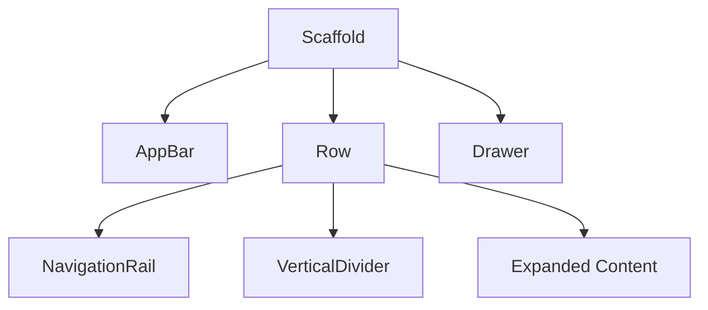

## 5.3.2 Adaptive Navigation Components

As mobile and web applications evolve, providing a seamless navigation experience across various devices becomes increasingly important. Flutter offers several navigation components that cater to different screen sizes and use cases. One such component is the `NavigationRail`, which is particularly beneficial for larger screens like tablets and desktops. In this section, we will delve into the `NavigationRail` widget, exploring its implementation, customization, and how it enhances user experience in responsive applications.

### NavigationRail Introduction

#### Definition and Purpose

The `NavigationRail` widget in Flutter is a versatile navigation component designed to provide a compact and persistent navigation option. It is particularly suitable for larger screens, such as tablets and desktops, where it can be used to present navigation options in a vertical format. This widget allows for a more spacious and organized layout, accommodating more navigation items without overwhelming the user interface.

**Benefits of NavigationRail:**

- **Compact Design:** `NavigationRail` offers a vertical list of navigation destinations, which helps save horizontal space and is ideal for devices with ample vertical space.
- **Persistent Navigation:** Unlike a drawer that slides in and out, `NavigationRail` remains visible, providing constant access to navigation options.
- **Icons and Labels:** It supports both icons and labels, making it easier for users to identify navigation destinations.
- **Customizable:** The widget can be tailored to fit the app's design language, with options to customize icons, labels, and selection behaviors.

### Implementing NavigationRail

#### Basic Setup

To integrate `NavigationRail` into a Flutter application, follow these steps:

1. **Add Dependencies:** Ensure your `pubspec.yaml` includes the necessary Flutter SDK dependencies.
2. **Create a Scaffold:** Use the `Scaffold` widget as the base of your layout, which will host the `NavigationRail`.
3. **Implement NavigationRail:** Add the `NavigationRail` widget to the `Scaffold`'s body or as a part of a `Row` to align it with the main content.

Here is a basic example of setting up a `NavigationRail`:

```dart
import 'package:flutter/material.dart';

void main() {
  runApp(MyApp());
}

class MyApp extends StatelessWidget {
  @override
  Widget build(BuildContext context) {
    return MaterialApp(
      home: HomeScreen(),
    );
  }
}

class HomeScreen extends StatefulWidget {
  @override
  _HomeScreenState createState() => _HomeScreenState();
}

class _HomeScreenState extends State<HomeScreen> {
  int _selectedIndex = 0;

  @override
  Widget build(BuildContext context) {
    return Scaffold(
      body: Row(
        children: <Widget>[
          NavigationRail(
            selectedIndex: _selectedIndex,
            onDestinationSelected: (int index) {
              setState(() {
                _selectedIndex = index;
              });
            },
            destinations: [
              NavigationRailDestination(
                icon: Icon(Icons.home),
                label: Text('Home'),
              ),
              NavigationRailDestination(
                icon: Icon(Icons.business),
                label: Text('Business'),
              ),
              NavigationRailDestination(
                icon: Icon(Icons.school),
                label: Text('School'),
              ),
            ],
          ),
          VerticalDivider(thickness: 1, width: 1),
          // Main content area
          Expanded(
            child: Center(
              child: Text('Selected Index: $_selectedIndex'),
            ),
          )
        ],
      ),
    );
  }
}
```

#### Customization

`NavigationRail` can be customized to enhance its appearance and functionality:

- **Icons and Labels:** Customize icons and labels to match the app's theme.
- **Selection Behavior:** Use the `onDestinationSelected` callback to handle navigation logic.
- **Extended Labels:** Enable extended labels for better readability on larger screens by setting `extended` to `true`.

```dart
NavigationRail(
  extended: true, // Enables extended labels
  selectedIndex: _selectedIndex,
  onDestinationSelected: (int index) {
    setState(() {
      _selectedIndex = index;
    });
  },
  destinations: [
    NavigationRailDestination(
      icon: Icon(Icons.home),
      label: Text('Home'),
    ),
    // Additional destinations...
  ],
)
```

#### Integration with `Scaffold`

`NavigationRail` can be integrated with other navigation components like drawers. This is particularly useful for applications that need to support both compact and expanded navigation modes.

```dart
Scaffold(
  appBar: AppBar(title: Text('NavigationRail Example')),
  body: Row(
    children: <Widget>[
      NavigationRail(
        // NavigationRail setup
      ),
      VerticalDivider(thickness: 1, width: 1),
      Expanded(
        child: Center(
          child: Text('Main Content Area'),
        ),
      ),
    ],
  ),
  drawer: Drawer(
    // Drawer setup
  ),
)
```

#### Code Examples

Here is a complete example illustrating a customized `NavigationRail`:

```dart
import 'package:flutter/material.dart';

void main() {
  runApp(MyApp());
}

class MyApp extends StatelessWidget {
  @override
  Widget build(BuildContext context) {
    return MaterialApp(
      home: HomeScreen(),
    );
  }
}

class HomeScreen extends StatefulWidget {
  @override
  _HomeScreenState createState() => _HomeScreenState();
}

class _HomeScreenState extends State<HomeScreen> {
  int _selectedIndex = 0;

  @override
  Widget build(BuildContext context) {
    return Scaffold(
      appBar: AppBar(title: Text('NavigationRail Example')),
      body: Row(
        children: <Widget>[
          NavigationRail(
            backgroundColor: Colors.blueGrey[50],
            selectedIndex: _selectedIndex,
            onDestinationSelected: (int index) {
              setState(() {
                _selectedIndex = index;
              });
            },
            labelType: NavigationRailLabelType.selected,
            destinations: [
              NavigationRailDestination(
                icon: Icon(Icons.home),
                selectedIcon: Icon(Icons.home_filled),
                label: Text('Home'),
              ),
              NavigationRailDestination(
                icon: Icon(Icons.business),
                selectedIcon: Icon(Icons.business_center),
                label: Text('Business'),
              ),
              NavigationRailDestination(
                icon: Icon(Icons.school),
                selectedIcon: Icon(Icons.school_outlined),
                label: Text('School'),
              ),
            ],
          ),
          VerticalDivider(thickness: 1, width: 1),
          Expanded(
            child: Center(
              child: Text('Selected Index: $_selectedIndex'),
            ),
          )
        ],
      ),
    );
  }
}
```

#### Mermaid.js Diagrams

To visualize the `NavigationRail` placement and its relationship with other UI elements, consider the following diagram:



### Responsive Behavior

#### Visibility Control

Controlling the visibility of `NavigationRail` based on screen size and orientation is crucial for responsive design. Use the `MediaQuery` class to determine the screen size and adjust the layout accordingly.

```dart
bool isLargeScreen(BuildContext context) {
  return MediaQuery.of(context).size.width > 600;
}

@override
Widget build(BuildContext context) {
  return Scaffold(
    body: Row(
      children: <Widget>[
        if (isLargeScreen(context))
          NavigationRail(
            // NavigationRail setup
          ),
        // Other UI components
      ],
    ),
  );
}
```

#### Adaptive Placement

For larger screens, consider positioning the `NavigationRail` side-by-side with the main content. This approach maximizes the use of available space and enhances the user experience.

```dart
@override
Widget build(BuildContext context) {
  return Scaffold(
    body: Row(
      children: <Widget>[
        if (isLargeScreen(context))
          NavigationRail(
            // NavigationRail setup
          ),
        VerticalDivider(thickness: 1, width: 1),
        Expanded(
          child: Center(
            child: Text('Main Content Area'),
          ),
        ),
      ],
    ),
  );
}
```

### User Experience Enhancements

#### Extended Labels

Extended labels improve readability on larger screens by displaying full text labels alongside icons. This feature can be enabled by setting the `extended` property to `true`.

```dart
NavigationRail(
  extended: true,
  // Other properties
)
```

#### Hover and Focus States

Enhance usability on desktop platforms by implementing hover effects and focus states. Use the `MouseRegion` widget to detect hover events and adjust the UI accordingly.

```dart
MouseRegion(
  onEnter: (_) {
    // Handle hover enter
  },
  onExit: (_) {
    // Handle hover exit
  },
  child: NavigationRail(
    // NavigationRail setup
  ),
)
```

#### Customization Tips

- **Styling:** Use the `backgroundColor` and `selectedIconTheme` properties to style the `NavigationRail` to match the app's theme.
- **Icons:** Choose icons that clearly represent the navigation destinations.
- **Labels:** Ensure labels are concise and descriptive.

### Examples and Case Studies

Several applications effectively utilize `NavigationRail` to enhance their navigation systems. For instance, productivity apps often use `NavigationRail` to provide quick access to different sections like tasks, calendar, and notes. These applications typically adopt a layout structure that places the `NavigationRail` on the left side of the screen, with the main content area occupying the remaining space.

**Case Study: Productivity App**

- **Layout Structure:** `NavigationRail` on the left, main content on the right.
- **Customization:** Icons and labels tailored to the app's theme.
- **User Interaction:** Smooth transitions between navigation destinations, with hover effects for desktop users.

### Common Pitfalls

#### Ignoring Responsiveness

A static `NavigationRail` implementation that does not adapt to different screen sizes can lead to a poor user experience. Always ensure that the `NavigationRail` is visible only when appropriate and that it integrates seamlessly with other UI components.

#### Overcomplicating Navigation Structures

Keep navigation structures simple and intuitive. Avoid adding unnecessary complexity that could confuse users. Focus on providing clear and accessible navigation options that enhance the overall user experience.

By understanding and implementing `NavigationRail` effectively, you can create adaptive navigation components that enhance the usability and responsiveness of your Flutter applications. This approach not only improves the user experience but also ensures that your app is well-suited for a wide range of devices and screen sizes.

## Quiz Time!



### What is the primary purpose of the NavigationRail widget in Flutter?

- [x] To provide a compact and persistent navigation option for larger screens
- [ ] To replace the AppBar in mobile applications
- [ ] To serve as a footer navigation component
- [ ] To manage state across different widgets

> **Explanation:** The NavigationRail widget is designed to offer a compact and persistent navigation option, particularly suited for larger screens like tablets and desktops.

### Which property enables extended labels in NavigationRail for better readability?

- [x] `extended`
- [ ] `labelType`
- [ ] `backgroundColor`
- [ ] `selectedIndex`

> **Explanation:** The `extended` property, when set to true, enables extended labels in NavigationRail, enhancing readability on larger screens.

### How can you control the visibility of NavigationRail based on screen size?

- [x] Use MediaQuery to determine screen size and conditionally render NavigationRail
- [ ] Use a Visibility widget to hide NavigationRail
- [ ] Set the opacity of NavigationRail to 0
- [ ] Adjust the z-index of NavigationRail

> **Explanation:** MediaQuery can be used to determine the screen size, allowing you to conditionally render the NavigationRail based on the device's dimensions.

### What is a common pitfall when implementing NavigationRail?

- [x] Ignoring responsiveness and not adapting to different screen sizes
- [ ] Using too few navigation destinations
- [ ] Overusing animations in NavigationRail
- [ ] Not using enough icons

> **Explanation:** A common pitfall is ignoring responsiveness, which results in a static NavigationRail that does not adapt to different screen sizes, leading to a poor user experience.

### Which widget can be used to detect hover events for enhancing desktop interactions?

- [x] MouseRegion
- [ ] GestureDetector
- [ ] InkWell
- [ ] FocusNode

> **Explanation:** The MouseRegion widget can be used to detect hover events, allowing developers to enhance desktop interactions with hover effects.

### What is a benefit of using NavigationRail over a traditional navigation drawer?

- [x] It provides persistent visibility of navigation options
- [ ] It is easier to implement
- [ ] It supports more navigation destinations
- [ ] It is only available on mobile devices

> **Explanation:** NavigationRail provides persistent visibility of navigation options, unlike a drawer that slides in and out, making it more suitable for larger screens.

### How can you enhance the usability of NavigationRail on desktop platforms?

- [x] Implement hover effects and focus states
- [ ] Increase the number of navigation destinations
- [ ] Use only icons without labels
- [ ] Disable user interactions

> **Explanation:** Implementing hover effects and focus states can enhance the usability of NavigationRail on desktop platforms, providing a more interactive experience.

### What should be considered when customizing the NavigationRail?

- [x] Aligning the styling with the app's theme
- [ ] Using only default icons
- [ ] Avoiding the use of labels
- [ ] Keeping the NavigationRail hidden

> **Explanation:** When customizing NavigationRail, it's important to align the styling with the app's theme to ensure a cohesive user experience.

### Which layout structure is commonly used with NavigationRail in productivity apps?

- [x] NavigationRail on the left, main content on the right
- [ ] NavigationRail at the bottom, main content above
- [ ] NavigationRail as a floating widget
- [ ] NavigationRail hidden until needed

> **Explanation:** A common layout structure in productivity apps places the NavigationRail on the left side, with the main content area on the right, maximizing space and accessibility.

### True or False: NavigationRail is only suitable for mobile applications.

- [ ] True
- [x] False

> **Explanation:** False. NavigationRail is particularly suitable for larger screens like tablets and desktops, where it can provide a compact and persistent navigation option.


