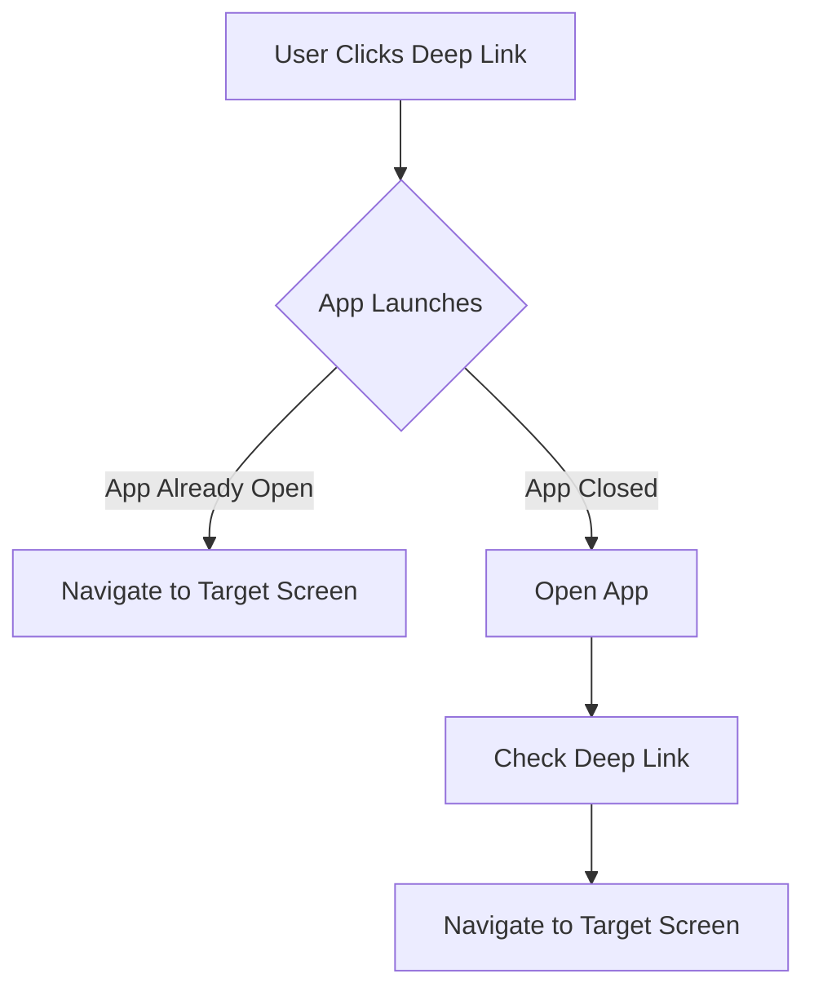

## 5.3.3 Deep Linking and URL Strategies

In the realm of mobile and web applications, deep linking plays a crucial role in enhancing user navigation and engagement. By allowing users to navigate directly to specific content within an app, deep linking not only improves user experience but also facilitates seamless transitions between different sections of an application. In this section, we will delve into the intricacies of deep linking and URL strategies in Flutter, providing you with the knowledge and tools to implement these features effectively in your applications.

### Understanding Deep Linking

#### Definition

Deep linking refers to the practice of using a URL to link directly to a specific page or content within a mobile app or website, bypassing the app's main entry points. This capability allows users to access content more efficiently, enhancing their overall experience by reducing the number of steps needed to reach their desired destination.

#### Benefits

- **Enhanced User Experience:** Deep linking streamlines navigation, allowing users to access specific content quickly without navigating through multiple screens.
- **Increased Engagement:** By providing direct access to relevant content, deep linking can increase user engagement and retention.
- **Improved Marketing and Analytics:** Deep links can be used in marketing campaigns to direct users to promotional content, and they can be tracked for analytics purposes.

### Implementing Deep Linking in Flutter

#### Packages and Tools

Flutter offers several packages to facilitate deep linking, with `go_router` and `flutter_deep_linking` being popular choices. These packages simplify the process of managing deep links and handling navigation within Flutter applications.

- **`go_router`:** A powerful package that provides a declarative approach to routing and deep linking in Flutter.
- **`flutter_deep_linking`:** A package designed to handle deep links and URL schemes, offering a straightforward API for integration.

#### Setup Guide

To implement deep linking in Flutter, follow these steps using the `go_router` package:

1. **Add the Package:**
   Add `go_router` to your `pubspec.yaml` file:

   ```yaml
   dependencies:
     go_router: ^5.0.0
   ```

2. **Configure Routes:**
   Define your app's routes using `GoRouter`:

   ```dart
   final GoRouter _router = GoRouter(
     routes: [
       GoRoute(
         path: '/',
         builder: (context, state) => HomeScreen(),
       ),
       GoRoute(
         path: '/details/:id',
         builder: (context, state) {
           final id = state.params['id'];
           return DetailsScreen(id: id);
         },
       ),
     ],
   );
   ```

3. **Handle Deep Links:**
   Integrate deep link handling in your app's entry point:

   ```dart
   void main() {
     runApp(MyApp());
   }

   class MyApp extends StatelessWidget {
     @override
     Widget build(BuildContext context) {
       return MaterialApp.router(
         routerDelegate: _router.routerDelegate,
         routeInformationParser: _router.routeInformationParser,
       );
     }
   }
   ```

#### Code Examples

Here's a comprehensive example demonstrating deep link configuration and navigation handling:

```dart
import 'package:flutter/material.dart';
import 'package:go_router/go_router.dart';

void main() {
  runApp(MyApp());
}

class MyApp extends StatelessWidget {
  final GoRouter _router = GoRouter(
    routes: [
      GoRoute(
        path: '/',
        builder: (context, state) => HomeScreen(),
      ),
      GoRoute(
        path: '/details/:id',
        builder: (context, state) {
          final id = state.params['id'];
          return DetailsScreen(id: id);
        },
      ),
    ],
  );

  @override
  Widget build(BuildContext context) {
    return MaterialApp.router(
      routerDelegate: _router.routerDelegate,
      routeInformationParser: _router.routeInformationParser,
    );
  }
}

class HomeScreen extends StatelessWidget {
  @override
  Widget build(BuildContext context) {
    return Scaffold(
      appBar: AppBar(title: Text('Home')),
      body: Center(
        child: ElevatedButton(
          onPressed: () {
            context.go('/details/42');
          },
          child: Text('Go to Details'),
        ),
      ),
    );
  }
}

class DetailsScreen extends StatelessWidget {
  final String id;

  DetailsScreen({required this.id});

  @override
  Widget build(BuildContext context) {
    return Scaffold(
      appBar: AppBar(title: Text('Details')),
      body: Center(
        child: Text('Details for item $id'),
      ),
    );
  }
}
```

#### Mermaid.js Diagrams

To visualize how deep links navigate to specific app sections, consider the following flowchart:



### URL Strategies

#### URL Structuring

When implementing deep linking, structuring your URLs to reflect the app's navigation hierarchy is crucial. A well-structured URL should be intuitive and descriptive, providing clear information about the content it links to.

- **Hierarchical Structure:** Use a hierarchical structure to represent the app's navigation. For example, `/category/item` indicates that `item` belongs to `category`.
- **Descriptive Paths:** Ensure that URL paths are descriptive and meaningful, aiding both users and search engines in understanding the content.

#### Handling Parameters

Managing URL parameters is essential for passing data and state information through deep links. Parameters can be included in the URL path or as query parameters.

- **Path Parameters:** Use path parameters for essential data that defines the content, such as `/details/:id`.
- **Query Parameters:** Use query parameters for optional data, such as `/search?query=flutter`.

#### Platform Considerations

Deep linking implementation can vary between mobile platforms and the web. Here are some considerations:

- **iOS:** Use Universal Links for deep linking, which requires setting up an `apple-app-site-association` file on your server.
- **Android:** Implement App Links by defining intent filters in your app's manifest file.
- **Web:** Ensure that your web app handles URL changes appropriately, maintaining consistency with mobile navigation.

#### Code Implementation

Here's an example of handling URL parameters in Flutter:

```dart
GoRoute(
  path: '/search',
  builder: (context, state) {
    final query = state.queryParams['query'];
    return SearchScreen(query: query);
  },
);
```

### Handling Navigation State

#### State Management Integration

Integrating deep linking with state management solutions ensures that your app maintains a consistent state across navigation. This integration is crucial for preserving user context and session information.

- **Provider:** Use Provider to manage state and pass data through deep links.
- **Bloc:** Implement Bloc to handle complex state transitions triggered by deep links.

#### Context Preservation

Preserving user context when navigating via deep links involves maintaining the current session and any unsaved data. This can be achieved by storing state information in a global state management solution.

#### Code Examples

Here's how you can preserve state during deep link navigation using Provider:

```dart
class AppState extends ChangeNotifier {
  String _currentPage = '/';
  String get currentPage => _currentPage;

  void updatePage(String page) {
    _currentPage = page;
    notifyListeners();
  }
}

class MyApp extends StatelessWidget {
  @override
  Widget build(BuildContext context) {
    return ChangeNotifierProvider(
      create: (_) => AppState(),
      child: MaterialApp.router(
        routerDelegate: _router.routerDelegate,
        routeInformationParser: _router.routeInformationParser,
      ),
    );
  }
}
```

### Testing Deep Links

#### Testing Strategies

Testing deep links across different devices and platforms is crucial to ensure they function as expected. Here are some strategies:

- **Manual Testing:** Test deep links manually on various devices to verify navigation and content loading.
- **Automated Testing:** Use Flutter's testing framework to automate deep link tests, ensuring consistent behavior across releases.

#### Debugging Tips

When troubleshooting deep link-related issues, consider the following tips:

- **Check URL Schemes:** Ensure that URL schemes are correctly configured in your app's manifest or info.plist files.
- **Validate Links:** Use tools like Apple's Universal Links validator or Google's App Links Assistant to validate your deep link setup.

#### Code Implementation

Here's an example of testing deep links using Flutter's testing framework:

```dart
testWidgets('Deep link navigates to details screen', (WidgetTester tester) async {
  await tester.pumpWidget(MyApp());

  // Simulate deep link
  await tester.tap(find.text('Go to Details'));
  await tester.pumpAndSettle();

  // Verify navigation
  expect(find.text('Details for item 42'), findsOneWidget);
});
```

### Examples and Case Studies

#### Effective Applications

Applications like Airbnb and Instagram effectively utilize deep linking to enhance navigation and user engagement. These apps use deep links to direct users to specific listings or profiles, improving user experience and increasing retention.

#### Analysis

By analyzing these implementations, we can observe the following benefits:

- **Seamless Navigation:** Users can access content directly, reducing friction in the user journey.
- **Increased Engagement:** Deep links encourage users to explore more content, boosting engagement metrics.

### Common Pitfalls

#### Broken Links

Improperly configured deep links can lead to broken links, resulting in a poor user experience. To avoid this, ensure that all deep links are tested thoroughly and updated as the app evolves.

#### Security Concerns

Deep links can pose security risks if not validated properly. Always validate incoming URLs to prevent unauthorized access and ensure that sensitive data is not exposed through deep links.

### Conclusion

Deep linking and URL strategies are powerful tools for enhancing user navigation and engagement in Flutter applications. By implementing these techniques, you can provide users with a seamless and intuitive experience, improving retention and satisfaction. As you integrate deep linking into your projects, remember to consider platform-specific requirements, test thoroughly, and prioritize security to ensure a robust implementation.

## Quiz Time!



### What is deep linking in the context of mobile applications?

- [x] A method to link directly to specific content within an app.
- [ ] A technique for optimizing app performance.
- [ ] A way to enhance app security.
- [ ] A strategy for improving app design aesthetics.

> **Explanation:** Deep linking allows users to navigate directly to specific content within an app, bypassing the main entry points.

### Which Flutter package is commonly used for managing deep links?

- [x] go_router
- [ ] flutter_bloc
- [ ] provider
- [ ] sqflite

> **Explanation:** The `go_router` package is commonly used for managing deep links and routing in Flutter applications.

### What is a key benefit of deep linking?

- [x] Enhanced user experience by providing direct access to content.
- [ ] Improved app security.
- [ ] Reduced app size.
- [ ] Increased battery efficiency.

> **Explanation:** Deep linking enhances user experience by allowing direct access to specific content, reducing navigation steps.

### How can URL parameters be used in deep linking?

- [x] To pass data and state information through the URL.
- [ ] To enhance the visual design of the app.
- [ ] To improve app performance.
- [ ] To secure the app against unauthorized access.

> **Explanation:** URL parameters can pass data and state information through the URL, allowing for dynamic content loading.

### What is a common pitfall associated with deep linking?

- [x] Broken links leading to non-existent content.
- [ ] Improved user engagement.
- [ ] Enhanced app security.
- [ ] Increased app performance.

> **Explanation:** Broken links can occur if deep links are not properly configured, leading to non-existent or incorrect content.

### How can deep linking be tested in Flutter?

- [x] Using Flutter's testing framework to automate tests.
- [ ] By manually checking each link.
- [ ] By optimizing app performance.
- [ ] By enhancing app security.

> **Explanation:** Flutter's testing framework can be used to automate deep link tests, ensuring consistent behavior across releases.

### What is a security concern with deep linking?

- [x] Unauthorized access if links are not validated.
- [ ] Increased app size.
- [ ] Reduced user engagement.
- [ ] Decreased app performance.

> **Explanation:** Deep links can pose security risks if not validated properly, potentially allowing unauthorized access.

### How does deep linking affect user engagement?

- [x] It increases engagement by providing direct access to content.
- [ ] It decreases engagement by complicating navigation.
- [ ] It has no effect on engagement.
- [ ] It reduces app performance.

> **Explanation:** Deep linking increases user engagement by providing direct access to relevant content, encouraging exploration.

### What is a platform consideration for deep linking on iOS?

- [x] Use of Universal Links.
- [ ] Use of App Links.
- [ ] Use of Web Links.
- [ ] Use of Secure Links.

> **Explanation:** On iOS, Universal Links are used for deep linking, requiring an `apple-app-site-association` file on the server.

### True or False: Deep linking can be used to improve marketing and analytics.

- [x] True
- [ ] False

> **Explanation:** Deep links can be used in marketing campaigns and tracked for analytics purposes, providing insights into user behavior.


