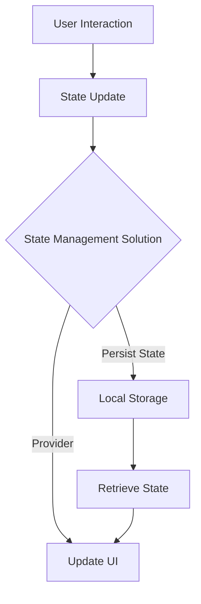

## 5.3.4 State Preservation

In the realm of mobile app development, maintaining a seamless user experience is paramount. One crucial aspect of this experience is state preservation, which ensures that users can navigate through an app without losing their progress or context. This section delves into the importance of state preservation, techniques to achieve it, and practical examples to guide you in implementing these strategies in your Flutter applications.

### Importance of State Preservation

#### User Experience Impact

State preservation plays a vital role in enhancing app usability by maintaining user context. Imagine filling out a lengthy form in an app, only to accidentally navigate away and lose all your input. Such experiences can frustrate users and lead to app abandonment. By preserving state, you ensure that users can pick up right where they left off, thereby improving satisfaction and engagement.

#### Use Cases

State preservation is crucial in various scenarios, including:

- **Form Inputs:** Retaining user input in forms to prevent data loss upon navigation.
- **Scroll Positions:** Maintaining scroll positions in lists or pages, so users return to the same spot.
- **Selected Items:** Keeping track of selected items in lists, such as checkboxes or radio buttons.

### Techniques for State Preservation

#### State Management Solutions

Flutter offers several state management solutions to help maintain state across navigation:

- **Provider:** A lightweight and easy-to-use solution for managing state in Flutter apps.
- **Bloc:** A more structured approach that uses streams to manage state changes.
- **Riverpod:** An improvement over Provider, offering more flexibility and safety.

Each of these solutions has its strengths and can be chosen based on the complexity and requirements of your app.

#### `AutomaticKeepAliveClientMixin`

The `AutomaticKeepAliveClientMixin` is a powerful tool for preserving widget states when they are no longer in the widget tree. This mixin can be particularly useful in scenarios like tabbed interfaces, where you want to keep the state of each tab intact even when it's not currently visible.

```dart
class MyStatefulWidget extends StatefulWidget {
  @override
  _MyStatefulWidgetState createState() => _MyStatefulWidgetState();
}

class _MyStatefulWidgetState extends State<MyStatefulWidget> with AutomaticKeepAliveClientMixin {
  @override
  bool get wantKeepAlive => true;

  @override
  Widget build(BuildContext context) {
    super.build(context); // Important to call super.build when using AutomaticKeepAliveClientMixin
    return Container(
      // Your widget tree here
    );
  }
}
```

### Implementing State Preservation

#### Stateful Widgets

`StatefulWidget` is the cornerstone of managing and preserving state in Flutter. It allows you to maintain state within the widget itself, making it ideal for scenarios where the state is local to a specific part of the UI.

#### Global State Management

For state that needs to be shared across different parts of the app, global state management solutions like Provider or Riverpod can be used. These solutions allow you to define a central state that can be accessed and modified from anywhere in the app.

```dart
class MyApp extends StatelessWidget {
  @override
  Widget build(BuildContext context) {
    return Provider<MyModel>(
      create: (_) => MyModel(),
      child: MaterialApp(
        home: MyHomePage(),
      ),
    );
  }
}

class MyModel {
  // Your global state logic here
}
```

### Handling Lifecycle Events

#### App Lifecycle Management

Handling app lifecycle events is crucial for preserving and restoring state during app pauses or restarts. Flutter provides the `WidgetsBindingObserver` to monitor these changes.

#### Using `WidgetsBindingObserver`

By implementing `WidgetsBindingObserver`, you can respond to lifecycle events such as app pause, resume, or termination, allowing you to save and restore state accordingly.

```dart
class MyAppState extends State<MyApp> with WidgetsBindingObserver {
  @override
  void initState() {
    super.initState();
    WidgetsBinding.instance.addObserver(this);
  }

  @override
  void dispose() {
    WidgetsBinding.instance.removeObserver(this);
    super.dispose();
  }

  @override
  void didChangeAppLifecycleState(AppLifecycleState state) {
    if (state == AppLifecycleState.paused) {
      // Save state
    } else if (state == AppLifecycleState.resumed) {
      // Restore state
    }
  }
}
```

### Persisting State Across Sessions

#### Local Storage Solutions

To persist state data across app sessions, you can use local storage solutions like `SharedPreferences` or `Hive`. These packages allow you to store data locally on the device, ensuring it remains available even after the app is closed.

#### Data Serialization

When storing complex data structures, serialization is necessary. You can convert your data into a format suitable for storage (e.g., JSON) and then deserialize it when retrieving.

```dart
void saveData() async {
  final prefs = await SharedPreferences.getInstance();
  prefs.setString('myData', jsonEncode(myData));
}

void loadData() async {
  final prefs = await SharedPreferences.getInstance();
  final String? myDataString = prefs.getString('myData');
  if (myDataString != null) {
    myData = jsonDecode(myDataString);
  }
}
```

### Implementation Guidance

#### Code Snippets

Below is a comprehensive example demonstrating effective state preservation strategies using Provider and SharedPreferences.

```dart
class MyApp extends StatelessWidget {
  @override
  Widget build(BuildContext context) {
    return ChangeNotifierProvider(
      create: (_) => MyStateModel(),
      child: MaterialApp(
        home: MyHomePage(),
      ),
    );
  }
}

class MyStateModel extends ChangeNotifier {
  String _data = '';

  String get data => _data;

  void updateData(String newData) {
    _data = newData;
    notifyListeners();
    _saveToPreferences();
  }

  void _saveToPreferences() async {
    final prefs = await SharedPreferences.getInstance();
    prefs.setString('data', _data);
  }

  void loadFromPreferences() async {
    final prefs = await SharedPreferences.getInstance();
    _data = prefs.getString('data') ?? '';
    notifyListeners();
  }
}
```

#### Mermaid.js Diagrams

To illustrate state flow and preservation mechanisms, consider the following diagram:



### Examples and Case Studies

#### Showcase Applications

Applications like Todoist and Evernote effectively implement state preservation to enhance user experience. They maintain user inputs, task states, and navigation contexts, ensuring a seamless experience across sessions.

#### Analysis

These apps utilize a combination of local storage and global state management to achieve state preservation, resulting in increased user retention and satisfaction.

### Common Pitfalls

#### State Inconsistencies

One common issue is state becoming outdated or inconsistent with the app's current context. This can occur if the state is not properly synchronized across different parts of the app.

#### Overcomplicating State Management

It's essential to keep state management simple and maintainable. Overcomplicating it can lead to bugs and performance issues. Choose the right state management solution for your app's complexity and needs.

### Conclusion

State preservation is a critical aspect of building responsive and adaptive Flutter applications. By leveraging the right techniques and tools, you can ensure a seamless user experience that keeps users engaged and satisfied. Whether you're using Provider, Bloc, or Riverpod, the key is to maintain a balance between complexity and maintainability, ensuring your app remains performant and user-friendly.

## Quiz Time!



### What is the primary benefit of state preservation in mobile apps?

- [x] Enhances user experience by maintaining context
- [ ] Reduces app size
- [ ] Increases app speed
- [ ] Simplifies code structure

> **Explanation:** State preservation ensures users can continue where they left off, improving usability and satisfaction.

### Which Flutter mixin is used to preserve widget states when they are no longer in the widget tree?

- [x] AutomaticKeepAliveClientMixin
- [ ] WidgetsBindingObserver
- [ ] StatefulWidget
- [ ] ChangeNotifier

> **Explanation:** AutomaticKeepAliveClientMixin helps keep widget states intact even when they're not visible.

### What is a common use case for state preservation?

- [x] Retaining form inputs
- [ ] Optimizing network requests
- [ ] Enhancing animations
- [ ] Improving database performance

> **Explanation:** State preservation is crucial for retaining user inputs in forms to prevent data loss.

### Which state management solution is known for using streams to manage state changes?

- [x] Bloc
- [ ] Provider
- [ ] Riverpod
- [ ] Redux

> **Explanation:** Bloc uses streams to handle state changes, providing a structured approach to state management.

### How can you persist state data across app sessions in Flutter?

- [x] Using local storage solutions like SharedPreferences or Hive
- [ ] By increasing app memory
- [ ] Through network requests
- [ ] By using StatelessWidgets

> **Explanation:** Local storage solutions like SharedPreferences or Hive allow data persistence across sessions.

### What is the role of `WidgetsBindingObserver` in Flutter?

- [x] To monitor app lifecycle changes
- [ ] To manage widget state
- [ ] To handle network requests
- [ ] To optimize animations

> **Explanation:** `WidgetsBindingObserver` helps in responding to lifecycle events like app pause or resume.

### Which of the following is a pitfall of state preservation?

- [x] State inconsistencies
- [ ] Improved user experience
- [ ] Reduced app size
- [ ] Faster animations

> **Explanation:** State inconsistencies can occur if the preserved state is not synchronized with the app's current context.

### What is the benefit of using `Provider` for state management?

- [x] Lightweight and easy-to-use
- [ ] Requires less memory
- [ ] Automatically optimizes performance
- [ ] Eliminates the need for StatefulWidgets

> **Explanation:** Provider is a lightweight solution that simplifies state management in Flutter apps.

### How does `AutomaticKeepAliveClientMixin` help in state preservation?

- [x] It keeps widget states intact even when not visible
- [ ] It optimizes network requests
- [ ] It enhances animations
- [ ] It reduces app size

> **Explanation:** This mixin ensures widget states are preserved even when they're not part of the widget tree.

### True or False: Overcomplicating state management can lead to performance issues.

- [x] True
- [ ] False

> **Explanation:** Overcomplicating state management can introduce bugs and degrade app performance.


