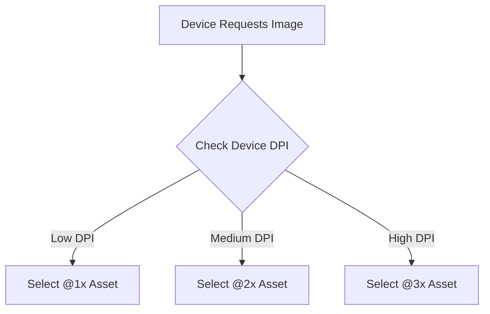

## 5.4.1 Image Resolution and DPI

In the world of mobile app development, ensuring that images appear crisp and clear across a myriad of devices with varying screen densities is paramount. This section delves into the intricacies of managing image resolution and DPI (Dots Per Inch) in Flutter, providing you with the knowledge and tools to deliver visually stunning applications.

### Understanding DPI and Screen Density

#### Definition of DPI

DPI, or Dots Per Inch, is a measure of spatial printing or video dot density. In the context of digital displays, it refers to the number of individual dots that can be placed in a line within the span of one inch. Higher DPI values indicate more dots per inch, resulting in sharper images. Understanding DPI is crucial for developers because it affects how images are rendered on devices with different screen densities.

For instance, a device with a high DPI will display images with more detail and clarity than a device with a lower DPI, assuming the image resolution is sufficient. This is why providing the right image resolution for each screen density is essential to avoid blurry or pixelated images.

#### Flutter's DPI Handling

Flutter simplifies the process of handling multiple image resolutions through the use of asset variants. By providing images at different resolutions, Flutter can automatically select the most appropriate version for the device's screen density. This ensures that images look sharp on all devices, from low-DPI screens to high-DPI displays.

### Providing Multiple Image Resolutions

#### Asset Naming Conventions

To support different screen densities, Flutter uses a naming convention similar to that of iOS and Android. You can provide image assets with suffixes like `@1x`, `@2x`, and `@3x` to indicate their resolution:

- `@1x`: Standard resolution (baseline).
- `@2x`: Double the resolution of `@1x` for medium-density screens.
- `@3x`: Triple the resolution of `@1x` for high-density screens.

For example, if you have an image named `icon.png`, you would provide the following variants:

```
assets/
  icon.png        // @1x
  icon@2x.png     // @2x
  icon@3x.png     // @3x
```

#### Organizing Assets

To organize these assets in your Flutter project, you need to declare them in the `pubspec.yaml` file. This file acts as a manifest for your app's assets, ensuring that Flutter knows where to find them.

```yaml
flutter:
  assets:
    - assets/icon.png
    - assets/icon@2x.png
    - assets/icon@3x.png
```

#### Code Examples

Here is a simple Flutter widget that uses the image assets:

```dart
import 'package:flutter/material.dart';

class ImageExample extends StatelessWidget {
  @override
  Widget build(BuildContext context) {
    return Scaffold(
      appBar: AppBar(
        title: Text('Image Resolution Example'),
      ),
      body: Center(
        child: Image.asset('assets/icon.png'), // Flutter selects the appropriate resolution
      ),
    );
  }
}
```

### Using Asset Bundling

#### Defining Asset Variants

In Flutter, asset variants are defined by providing multiple versions of an asset at different resolutions. This is done by organizing your assets in a way that Flutter can recognize and select the appropriate variant based on the device's DPI.

#### Flutter's Automatic Selection

Flutter automatically selects the best asset variant for the device's screen density. When you reference an asset in your code, Flutter checks the device's DPI and chooses the most suitable version of the asset. This process is seamless and requires no additional code from the developer beyond specifying the assets in the `pubspec.yaml`.

#### Code Implementation

Here's how you can reference image assets in a Flutter widget:

```dart
Image.asset('assets/icon.png')
```

Flutter will automatically choose the correct variant (`icon.png`, `icon@2x.png`, or `icon@3x.png`) based on the device's screen density.

### Leveraging Vector Images

#### Benefits of Vector Graphics

Vector graphics, such as SVG (Scalable Vector Graphics), offer several advantages over raster images:

- **Scalability:** Vector images can be scaled to any size without losing quality, making them ideal for responsive design.
- **Resolution Independence:** Unlike raster images, vectors do not depend on resolution, ensuring they look sharp on any screen density.
- **Smaller File Sizes:** Vectors often have smaller file sizes compared to high-resolution raster images, which can improve app performance.

#### Flutter Packages

To use SVG images in Flutter, you can utilize the `flutter_svg` package. This package allows you to render SVG files as widgets, maintaining their scalability and resolution independence.

#### Code Examples

Here's how you can use the `flutter_svg` package to display an SVG image:

```dart
import 'package:flutter/material.dart';
import 'package:flutter_svg/flutter_svg.dart';

class SvgExample extends StatelessWidget {
  @override
  Widget build(BuildContext context) {
    return Scaffold(
      appBar: AppBar(
        title: Text('SVG Image Example'),
      ),
      body: Center(
        child: SvgPicture.asset('assets/icon.svg'),
      ),
    );
  }
}
```

### Optimizing Image Performance

#### Image Compression

To optimize image performance, it's crucial to compress images without compromising quality. Tools like TinyPNG or ImageOptim can reduce file sizes significantly, leading to faster load times and reduced memory usage.

#### Efficient Formats

Choosing the right image format is essential for balancing quality and performance:

- **PNG:** Best for images with transparency and sharp edges.
- **JPEG:** Suitable for photographs and images with gradients.
- **WebP:** Offers superior compression and quality for both lossy and lossless images.

#### Code Implementation

When handling images in Flutter, you can use the `Image` widget to specify the format and optimize loading:

```dart
Image.asset(
  'assets/photo.webp',
  fit: BoxFit.cover,
)
```

### Implementation Guidance

#### Code Snippets

Here are comprehensive examples showcasing multiple image resolutions and vector image integration:

```dart
import 'package:flutter/material.dart';
import 'package:flutter_svg/flutter_svg.dart';

class ImageResolutionExample extends StatelessWidget {
  @override
  Widget build(BuildContext context) {
    return Scaffold(
      appBar: AppBar(
        title: Text('Image Resolution and SVG Example'),
      ),
      body: Column(
        mainAxisAlignment: MainAxisAlignment.center,
        children: [
          Image.asset('assets/icon.png'), // Raster image with multiple resolutions
          SvgPicture.asset('assets/icon.svg'), // Vector image
        ],
      ),
    );
  }
}
```

#### Mermaid.js Diagrams

To visualize the asset selection process based on DPI, consider the following Mermaid.js diagram:



### Examples and Case Studies

Let's explore some real-world Flutter applications that effectively manage image resolutions and DPI:

- **Case Study: E-commerce App**
  - **Challenge:** Ensure product images are clear on all devices.
  - **Solution:** Implement multiple image resolutions and SVG icons for UI elements.
  - **Result:** Improved image clarity and reduced load times.

- **Case Study: News App**
  - **Challenge:** Display high-quality images without increasing app size.
  - **Solution:** Use WebP format for images and SVG for icons.
  - **Result:** Enhanced performance and user experience.

### Common Pitfalls

#### Missing Asset Variants

Neglecting to include image assets for all necessary DPI levels can lead to blurry or pixelated images on certain devices. Always ensure that you provide assets for `@1x`, `@2x`, and `@3x` resolutions.

#### Ignoring Vector Graphics Benefits

Relying solely on raster images without leveraging vector graphics can result in larger app sizes and less flexibility. Consider using SVGs for icons and simple graphics to take advantage of their scalability and resolution independence.

### Conclusion

Managing image resolution and DPI in Flutter is crucial for delivering high-quality, responsive applications. By understanding DPI, providing multiple image resolutions, leveraging vector graphics, and optimizing image performance, you can ensure that your app's visuals are sharp and clear across all devices. Implement these strategies in your projects to enhance user experience and app performance.

## Quiz Time!



### What does DPI stand for in the context of digital displays?

- [x] Dots Per Inch
- [ ] Digital Pixel Integration
- [ ] Display Pixel Index
- [ ] Density Per Inch

> **Explanation:** DPI stands for Dots Per Inch, a measure of spatial printing or video dot density.

### How does Flutter handle multiple image resolutions?

- [x] Through asset variants with different resolutions
- [ ] By scaling images automatically
- [ ] By using only vector images
- [ ] By compressing images

> **Explanation:** Flutter uses asset variants to handle multiple image resolutions, selecting the appropriate version based on the device's DPI.

### Which naming convention is used for image assets in Flutter to support different screen densities?

- [x] @1x, @2x, @3x
- [ ] low, medium, high
- [ ] small, medium, large
- [ ] 1x, 2x, 3x

> **Explanation:** The naming convention @1x, @2x, @3x is used to indicate different resolutions for image assets in Flutter.

### What is the benefit of using vector graphics like SVG in Flutter?

- [x] Scalability and resolution independence
- [ ] Larger file sizes
- [ ] Limited color support
- [ ] Requires more memory

> **Explanation:** Vector graphics are scalable and resolution-independent, making them ideal for responsive design.

### Which Flutter package is commonly used to render SVG images?

- [x] flutter_svg
- [ ] flutter_vector
- [ ] svg_flutter
- [ ] vector_graphics

> **Explanation:** The `flutter_svg` package is commonly used to render SVG images in Flutter.

### What is a recommended image format for photographs in Flutter?

- [ ] PNG
- [x] JPEG
- [ ] SVG
- [ ] BMP

> **Explanation:** JPEG is suitable for photographs and images with gradients due to its compression capabilities.

### What should you include in the `pubspec.yaml` file to organize image assets?

- [x] Asset paths under the `assets` section
- [ ] Image compression settings
- [ ] Vector graphics settings
- [ ] Device DPI settings

> **Explanation:** Asset paths should be included under the `assets` section in the `pubspec.yaml` file to organize image assets.

### How does Flutter automatically select the appropriate image asset?

- [x] Based on the device's DPI
- [ ] By checking the file size
- [ ] By using the first asset listed
- [ ] By user preference

> **Explanation:** Flutter automatically selects the appropriate image asset based on the device's DPI.

### What is a common pitfall when managing image resolutions in Flutter?

- [x] Missing asset variants for all necessary DPI levels
- [ ] Using too many vector images
- [ ] Over-compressing images
- [ ] Not using enough image formats

> **Explanation:** Missing asset variants for all necessary DPI levels can lead to blurry or pixelated images.

### True or False: Vector images are resolution-dependent.

- [ ] True
- [x] False

> **Explanation:** Vector images are resolution-independent, meaning they can be scaled to any size without losing quality.


