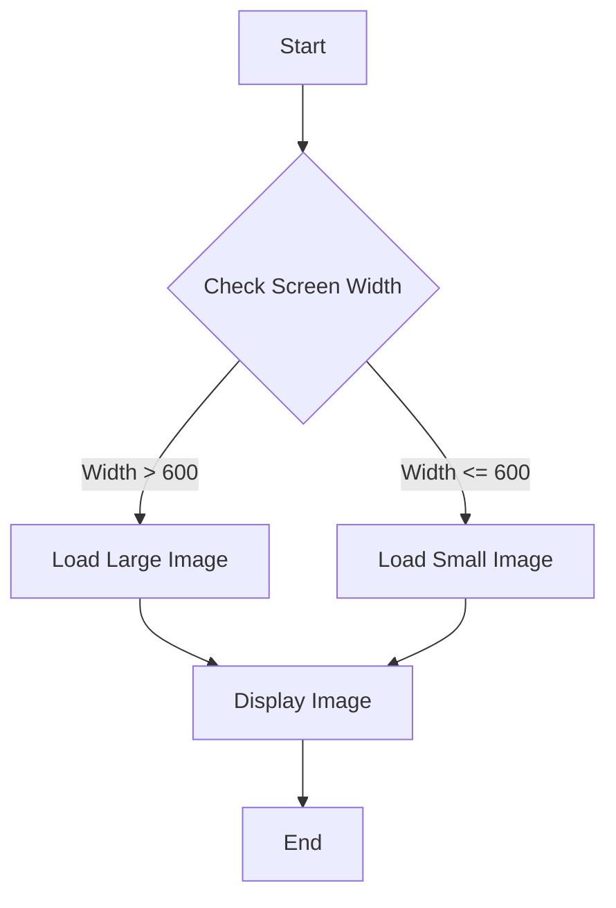

## 5.4.2 Using MediaQuery for Images

In the world of mobile application development, creating a seamless user experience across a multitude of devices is paramount. Flutter, with its robust framework, offers developers tools like `MediaQuery` to craft responsive and adaptive UIs. This section delves into the use of `MediaQuery` for handling images responsively, ensuring that your app not only looks great but also performs efficiently across different devices.

### Role of MediaQuery

#### Definition and Purpose

`MediaQuery` is a powerful Flutter widget that provides information about the current media environment, such as screen size, orientation, and device pixel ratio. It acts as a bridge between the app's UI and the device's characteristics, enabling developers to tailor the user interface dynamically.

- **Screen Size and Orientation:** `MediaQuery` allows you to fetch the width and height of the device screen, as well as its orientation (portrait or landscape).
- **Device Pixel Ratio:** This property helps in understanding the pixel density of the screen, which is crucial for rendering crisp images.
- **Padding and Insets:** It provides information about the safe areas of the screen, such as notches and system UI overlays.

#### Importance in Responsive Design

In responsive design, `MediaQuery` plays a critical role by allowing developers to adapt the UI based on the device's characteristics. This adaptability ensures that the application provides an optimal viewing experience, regardless of the device it runs on. By leveraging `MediaQuery`, developers can:

- **Adjust Layouts:** Dynamically change layouts to fit different screen sizes and orientations.
- **Scale Elements:** Scale UI elements, including images, to maintain visual consistency.
- **Enhance Accessibility:** Adjust UI components to cater to accessibility needs, such as larger text or images.

### Dynamic Image Loading

#### Conditional Asset Selection

One of the key uses of `MediaQuery` is to load different image assets based on the device's characteristics. This technique is particularly useful for optimizing the app's performance and ensuring that images are displayed correctly across various devices.

**Example: Conditional Image Rendering**

```dart
import 'package:flutter/material.dart';

class ResponsiveImage extends StatelessWidget {
  @override
  Widget build(BuildContext context) {
    var screenWidth = MediaQuery.of(context).size.width;

    return Image.asset(
      screenWidth > 600 ? 'assets/images/large_image.png' : 'assets/images/small_image.png',
      fit: BoxFit.cover,
    );
  }
}
```

In this example, the app loads a larger image for screens wider than 600 pixels and a smaller one for narrower screens. This approach not only ensures that images are appropriately sized but also helps in reducing the app's memory footprint on smaller devices.

### Responsive Image Sizing

#### Dynamic Dimensions

Using `MediaQuery`, you can adjust image dimensions dynamically to maintain aspect ratios and prevent distortion. This is crucial for providing a consistent user experience across devices with varying screen sizes.

**Example: Responsive Image Sizing**

```dart
import 'package:flutter/material.dart';

class ResponsiveSizedImage extends StatelessWidget {
  @override
  Widget build(BuildContext context) {
    var screenWidth = MediaQuery.of(context).size.width;
    var imageHeight = screenWidth * 0.75; // Maintain a 4:3 aspect ratio

    return Image.asset(
      'assets/images/responsive_image.png',
      width: screenWidth,
      height: imageHeight,
      fit: BoxFit.cover,
    );
  }
}
```

In this code snippet, the image's height is dynamically calculated to maintain a 4:3 aspect ratio based on the screen width. This ensures that the image scales proportionally, avoiding any distortion.

### Performance Considerations

#### Minimizing Image Loads

Efficient image handling is crucial for maintaining app performance. Strategies such as caching and lazy loading can significantly reduce unnecessary image loads.

- **Caching:** Use packages like `cached_network_image` to cache images locally, reducing network requests and improving load times.
- **Lazy Loading:** Load images only when they are about to be displayed, which can be achieved using widgets like `ListView.builder`.

#### Using Placeholders

Placeholders enhance perceived performance by displaying a temporary image or loading indicator while the actual image is being fetched.

**Example: Image with Placeholder**

```dart
import 'package:flutter/material.dart';
import 'package:cached_network_image/cached_network_image.dart';

class ImageWithPlaceholder extends StatelessWidget {
  @override
  Widget build(BuildContext context) {
    return CachedNetworkImage(
      imageUrl: 'https://example.com/image.png',
      placeholder: (context, url) => CircularProgressIndicator(),
      errorWidget: (context, url, error) => Icon(Icons.error),
    );
  }
}
```

In this example, `CachedNetworkImage` is used to display a circular progress indicator while the image is loading. If the image fails to load, an error icon is shown.

### Accessibility Enhancements

#### Adjustable Image Sizes

`MediaQuery` can be used to adjust image sizes for better visibility, catering to users with visual impairments.

**Example: Accessibility with Adjustable Image Sizes**

```dart
import 'package:flutter/material.dart';

class AccessibleImage extends StatelessWidget {
  @override
  Widget build(BuildContext context) {
    var screenWidth = MediaQuery.of(context).size.width;
    var imageSize = screenWidth * 0.5; // Adjust size for better visibility

    return Image.asset(
      'assets/images/accessible_image.png',
      width: imageSize,
      height: imageSize,
      fit: BoxFit.cover,
    );
  }
}
```

#### Alternative Texts

Providing alternative text for images is crucial for screen readers, ensuring that visually impaired users can understand the content.

**Example: Image with Alternative Text**

```dart
import 'package:flutter/material.dart';

class ImageWithAltText extends StatelessWidget {
  @override
  Widget build(BuildContext context) {
    return Semantics(
      label: 'A beautiful landscape',
      child: Image.asset('assets/images/landscape.png'),
    );
  }
}
```

In this example, the `Semantics` widget is used to provide a description of the image, which can be read by screen readers.

### Implementation Guidance

#### Code Snippets

The following comprehensive example demonstrates how to use `MediaQuery` for responsive image handling in a Flutter app:

```dart
import 'package:flutter/material.dart';
import 'package:cached_network_image/cached_network_image.dart';

class ResponsiveImageExample extends StatelessWidget {
  @override
  Widget build(BuildContext context) {
    var mediaQuery = MediaQuery.of(context);
    var screenWidth = mediaQuery.size.width;
    var imageHeight = screenWidth * 0.75;

    return Scaffold(
      appBar: AppBar(title: Text('Responsive Image Example')),
      body: Center(
        child: CachedNetworkImage(
          imageUrl: screenWidth > 600
              ? 'https://example.com/large_image.png'
              : 'https://example.com/small_image.png',
          placeholder: (context, url) => CircularProgressIndicator(),
          errorWidget: (context, url, error) => Icon(Icons.error),
          width: screenWidth,
          height: imageHeight,
          fit: BoxFit.cover,
        ),
      ),
    );
  }
}
```

#### Mermaid.js Diagrams

To visualize the conditional rendering flow based on `MediaQuery` data, consider the following diagram:



This flowchart illustrates the decision-making process for loading different images based on screen width.

### Examples and Case Studies

#### Flutter Projects Utilizing MediaQuery

1. **E-Commerce App:** An app that dynamically loads product images based on device orientation, ensuring optimal display on both mobile and tablet devices.
2. **News Reader App:** Uses `MediaQuery` to adjust image sizes and layouts for articles, enhancing readability and accessibility.

**Analysis:**

- **Responsiveness:** By leveraging `MediaQuery`, these apps provide a consistent and engaging user experience across devices.
- **Accessibility:** Adjustable image sizes and alternative texts improve accessibility, making the apps more inclusive.

### Common Pitfalls

#### Overcomplicating Logic

While `MediaQuery` is a powerful tool, it's important to avoid overly complex conditional rendering logic, which can make the codebase difficult to maintain. Strive for simplicity and clarity in your implementations.

#### Ignoring Performance Impacts

Balancing responsiveness with performance is crucial. Ensure that your app remains smooth and responsive by minimizing unnecessary image loads and utilizing caching strategies.

### Conclusion

Using `MediaQuery` for responsive image handling in Flutter is a powerful way to enhance your app's adaptability and user experience. By dynamically loading images, adjusting their sizes, and considering performance and accessibility, you can create applications that are not only visually appealing but also efficient and inclusive.

## Quiz Time!



### What is the primary role of MediaQuery in Flutter?

- [x] To provide information about the device's screen size, orientation, and other media-related properties.
- [ ] To manage state across different widgets.
- [ ] To handle network requests and responses.
- [ ] To store local data persistently.

> **Explanation:** MediaQuery provides crucial information about the device's screen and media properties, enabling responsive design.

### How can you use MediaQuery to conditionally load different image assets?

- [x] By checking the screen width and loading appropriate assets based on the size.
- [ ] By using MediaQuery to directly fetch images from the internet.
- [ ] By storing images in a database and querying them with MediaQuery.
- [ ] By using MediaQuery to change the color of images.

> **Explanation:** MediaQuery allows you to check the screen dimensions and load different assets based on the device's characteristics.

### What is a common technique to maintain aspect ratios when resizing images with MediaQuery?

- [x] Calculating dimensions based on the screen width to maintain a consistent aspect ratio.
- [ ] Using fixed pixel values for image dimensions.
- [ ] Ignoring aspect ratios and stretching images to fit.
- [ ] Using random values for width and height.

> **Explanation:** Maintaining aspect ratios involves calculating dimensions dynamically based on screen size to ensure images are not distorted.

### Which package can be used for caching images in Flutter?

- [x] cached_network_image
- [ ] flutter_image_cache
- [ ] image_loader
- [ ] network_image_cache

> **Explanation:** The cached_network_image package is commonly used to cache images, improving load times and performance.

### Why is it important to provide alternative text for images?

- [x] To support screen readers and improve accessibility.
- [ ] To enhance image quality.
- [ ] To reduce image loading times.
- [ ] To change the image format.

> **Explanation:** Alternative text is crucial for accessibility, allowing screen readers to describe images to visually impaired users.

### What is a potential pitfall when using MediaQuery for image handling?

- [x] Overcomplicating conditional rendering logic.
- [ ] Using too few images in the app.
- [ ] Ignoring the device's battery status.
- [ ] Loading images from local storage.

> **Explanation:** Overcomplicating logic can make the codebase difficult to maintain and understand.

### How can you enhance perceived performance when loading images?

- [x] Using placeholders while images are being fetched.
- [ ] Loading all images at app startup.
- [ ] Using high-resolution images for all devices.
- [ ] Ignoring network conditions.

> **Explanation:** Placeholders provide a temporary visual while images load, improving perceived performance.

### What is the benefit of using lazy loading for images?

- [x] It reduces memory usage by loading images only when needed.
- [ ] It increases the app's startup time.
- [ ] It ensures all images are loaded at once.
- [ ] It decreases the app's responsiveness.

> **Explanation:** Lazy loading optimizes memory usage by loading images only when they are about to be displayed.

### How does MediaQuery enhance accessibility in Flutter apps?

- [x] By allowing dynamic adjustments of UI components based on device characteristics.
- [ ] By storing user preferences in the cloud.
- [ ] By automatically translating text to different languages.
- [ ] By providing built-in screen reader functionality.

> **Explanation:** MediaQuery enables dynamic adjustments, such as resizing images, to cater to accessibility needs.

### True or False: MediaQuery can be used to detect the device's battery level.

- [ ] True
- [x] False

> **Explanation:** MediaQuery does not provide information about the device's battery level; it focuses on screen and media properties.


