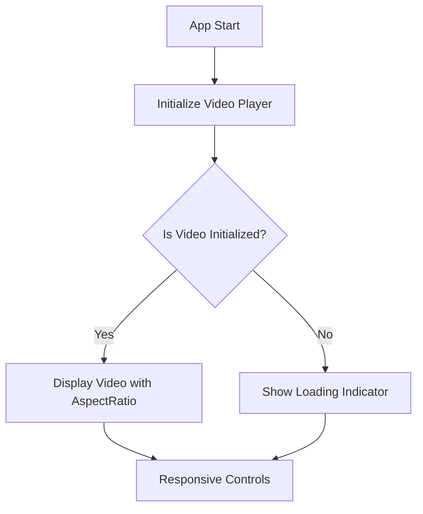
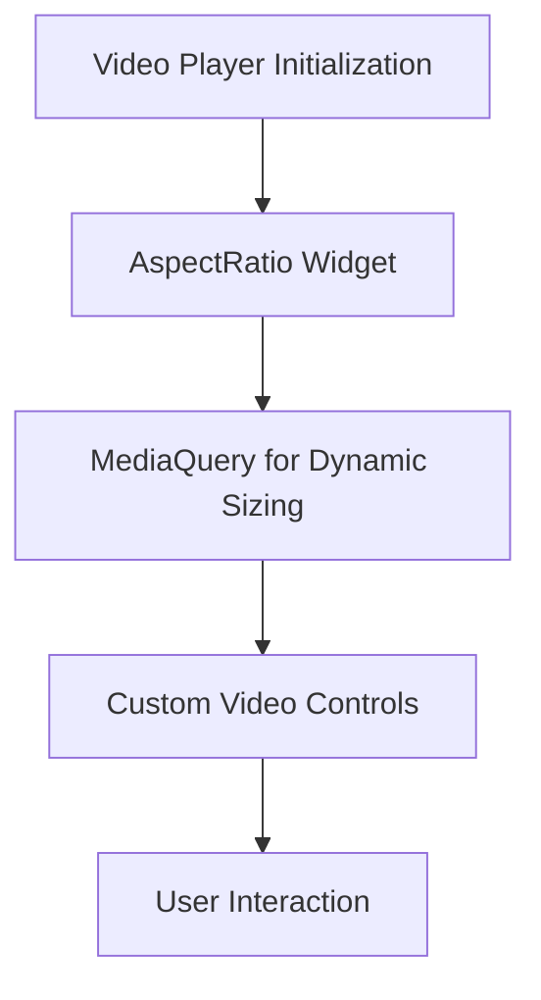

## 5.4.3 Responsive Video Players

### Introduction to Responsive Videos

In today's digital landscape, video content is a cornerstone of user engagement across various platforms. Whether it's a tutorial, a promotional clip, or a live stream, videos need to be accessible and visually appealing on any device. This is where responsive video players come into play, ensuring that media content is delivered effectively across different screen sizes and orientations.

#### Importance of Responsive Media

Responsive video players are crucial because they adapt to the diverse range of devices and screen resolutions that users might have. This adaptability ensures that videos are displayed correctly, maintaining their aspect ratio and quality without distortion. A responsive video player can automatically adjust its size and controls based on the device's screen dimensions, providing a seamless viewing experience.

#### User Experience Benefits

Responsive videos significantly enhance user engagement and accessibility. By ensuring that videos are easy to view and interact with, regardless of the device, users are more likely to consume content without frustration. This leads to higher retention rates and a more satisfying user experience. Additionally, responsive video players can improve accessibility by offering features like subtitles, adjustable playback speeds, and adaptive controls that cater to different user needs.

### Flutter Video Player Packages

Flutter provides several packages that facilitate the integration of video players into applications. Two of the most popular packages are `video_player` and `chewie`.

#### Overview of Packages

- **video_player**: This is the official Flutter plugin for video playback on iOS, Android, and web. It provides a low-level API to control video playback, offering features like play, pause, seek, and listen to playback events.
- **chewie**: Built on top of the `video_player` package, Chewie offers a higher-level API with customizable controls and a more user-friendly interface. It simplifies the implementation of video players by providing out-of-the-box controls and styling options.

#### Features Comparison

| Feature                | video_player | chewie       |
|------------------------|--------------|--------------|
| Basic Playback         | ✔️           | ✔️           |
| Customizable Controls  | ❌           | ✔️           |
| Platform Support       | ✔️           | ✔️           |
| Aspect Ratio Handling  | ✔️           | ✔️           |
| Fullscreen Support     | ✔️           | ✔️           |
| Subtitles              | ❌           | ✔️           |

### Implementing Responsive Video Players

#### Basic Setup

To integrate a responsive video player using the `video_player` package, follow these steps:

1. **Add Dependencies**: First, add the `video_player` package to your `pubspec.yaml` file.

   ```yaml
   dependencies:
     flutter:
       sdk: flutter
     video_player: ^2.2.10
   ```

2. **Import the Package**: In your Dart file, import the `video_player` package.

   ```dart
   import 'package:video_player/video_player.dart';
   ```

3. **Initialize the Video Player**: Create a `VideoPlayerController` and initialize it with the video source.

   ```dart
   VideoPlayerController _controller;

   @override
   void initState() {
     super.initState();
     _controller = VideoPlayerController.network(
       'https://www.example.com/video.mp4',
     )..initialize().then((_) {
         setState(() {}); // Ensure the first frame is shown after the video is initialized.
       });
   }
   ```

4. **Dispose the Controller**: Always dispose of the controller to free resources.

   ```dart
   @override
   void dispose() {
     super.dispose();
     _controller.dispose();
   }
   ```

5. **Build the Video Player Widget**: Use `AspectRatio` to ensure the video maintains its aspect ratio.

   ```dart
   @override
   Widget build(BuildContext context) {
     return Scaffold(
       appBar: AppBar(title: Text('Responsive Video Player')),
       body: Center(
         child: _controller.value.isInitialized
             ? AspectRatio(
                 aspectRatio: _controller.value.aspectRatio,
                 child: VideoPlayer(_controller),
               )
             : CircularProgressIndicator(),
       ),
       floatingActionButton: FloatingActionButton(
         onPressed: () {
           setState(() {
             _controller.value.isPlaying
                 ? _controller.pause()
                 : _controller.play();
           });
         },
         child: Icon(
           _controller.value.isPlaying ? Icons.pause : Icons.play_arrow,
         ),
       ),
     );
   }
   ```

#### Dynamic Sizing

To make the video player responsive, use `MediaQuery` to adjust the dimensions based on the screen size.

```dart
double screenWidth = MediaQuery.of(context).size.width;
double screenHeight = MediaQuery.of(context).size.height;

AspectRatio(
  aspectRatio: _controller.value.aspectRatio,
  child: Container(
    width: screenWidth,
    height: screenHeight * 0.5, // Adjust height dynamically
    child: VideoPlayer(_controller),
  ),
);
```

#### Mermaid.js Diagrams

Below is a diagram illustrating the responsive behavior of a video player within an app layout:



### Adaptive Controls and UI Elements

#### Responsive Controls

Designing video player controls that adapt to different screen sizes and orientations is crucial for usability. Use Flutter's layout widgets to create controls that adjust based on the available space.

```dart
Row(
  mainAxisAlignment: MainAxisAlignment.center,
  children: <Widget>[
    IconButton(
      icon: Icon(Icons.play_arrow),
      onPressed: () {
        setState(() {
          _controller.play();
        });
      },
    ),
    IconButton(
      icon: Icon(Icons.pause),
      onPressed: () {
        setState(() {
          _controller.pause();
        });
      },
    ),
  ],
);
```

#### Custom Controls

To enhance usability, you can create custom video controls tailored to your application's design.

```dart
class CustomVideoControls extends StatelessWidget {
  final VideoPlayerController controller;

  CustomVideoControls({required this.controller});

  @override
  Widget build(BuildContext context) {
    return Row(
      mainAxisAlignment: MainAxisAlignment.spaceEvenly,
      children: <Widget>[
        IconButton(
          icon: Icon(Icons.replay_10),
          onPressed: () {
            final newPosition = controller.value.position - Duration(seconds: 10);
            controller.seekTo(newPosition);
          },
        ),
        IconButton(
          icon: Icon(controller.value.isPlaying ? Icons.pause : Icons.play_arrow),
          onPressed: () {
            controller.value.isPlaying ? controller.pause() : controller.play();
          },
        ),
        IconButton(
          icon: Icon(Icons.forward_10),
          onPressed: () {
            final newPosition = controller.value.position + Duration(seconds: 10);
            controller.seekTo(newPosition);
          },
        ),
      ],
    );
  }
}
```

### Handling Different Video Formats

#### Format Compatibility

Managing various video formats and resolutions is essential for optimal playback performance. The `video_player` package supports common formats like MP4, but you may need to handle different codecs and resolutions.

#### Adaptive Bitrate Streaming

Adaptive bitrate streaming allows videos to be streamed at different bitrates based on network conditions, ensuring smooth playback even on slower connections. Implementing this requires server-side support and client-side logic to switch streams dynamically.

```dart
// Example of switching video source based on network conditions
void switchVideoSource(String url) {
  setState(() {
    _controller = VideoPlayerController.network(url)
      ..initialize().then((_) {
        setState(() {});
      });
  });
}
```

### Performance Optimization

#### Minimizing Latency

Reducing video playback latency involves preloading and buffering optimizations. Ensure that videos are preloaded before playback begins to minimize initial loading times.

```dart
_controller = VideoPlayerController.network(
  'https://www.example.com/video.mp4',
  videoPlayerOptions: VideoPlayerOptions(mixWithOthers: true),
)..initialize().then((_) {
  setState(() {});
});
```

#### Resource Management

Effective resource management prevents excessive memory usage during video playback. Dispose of controllers properly and manage video buffers to avoid memory leaks.

### Implementation Guidance

#### Code Snippets

Below is a comprehensive example showcasing a responsive video player implementation with adaptive controls:

```dart
class ResponsiveVideoPlayer extends StatefulWidget {
  @override
  _ResponsiveVideoPlayerState createState() => _ResponsiveVideoPlayerState();
}

class _ResponsiveVideoPlayerState extends State<ResponsiveVideoPlayer> {
  late VideoPlayerController _controller;

  @override
  void initState() {
    super.initState();
    _controller = VideoPlayerController.network(
      'https://www.example.com/video.mp4',
    )..initialize().then((_) {
        setState(() {});
      });
  }

  @override
  void dispose() {
    super.dispose();
    _controller.dispose();
  }

  @override
  Widget build(BuildContext context) {
    return Scaffold(
      appBar: AppBar(title: Text('Responsive Video Player')),
      body: Center(
        child: _controller.value.isInitialized
            ? Column(
                children: [
                  AspectRatio(
                    aspectRatio: _controller.value.aspectRatio,
                    child: VideoPlayer(_controller),
                  ),
                  CustomVideoControls(controller: _controller),
                ],
              )
            : CircularProgressIndicator(),
      ),
    );
  }
}
```

#### Mermaid.js Diagrams

Here's a diagram depicting the video player's interaction with responsive layout components:



### Examples and Case Studies

Let's explore some real-world Flutter applications that effectively utilize responsive video players:

- **FlutterTube**: A video streaming app that dynamically adjusts video quality and controls based on device and network conditions.
- **EduVid**: An educational platform that uses custom video controls to enhance learning experiences across devices.

### Common Pitfalls

#### Ignoring Platform-Specific Behaviors

Neglecting platform-specific behaviors can lead to inconsistent video playback experiences. Always test your video player on different platforms to ensure compatibility and performance.

#### Performance Bottlenecks

Optimizing video playback is crucial to prevent performance issues, especially on lower-end devices. Consider reducing video resolution or bitrate for such devices to maintain smooth playback.

### Conclusion

Responsive video players are an integral part of modern applications, enhancing user engagement and accessibility. By leveraging Flutter's robust packages and implementing adaptive controls, developers can create seamless media experiences across devices. Remember to consider performance optimizations and platform-specific behaviors to deliver the best possible user experience.

## Quiz Time!



### What is the primary benefit of using responsive video players in Flutter applications?

- [x] They ensure videos are displayed correctly on any device.
- [ ] They increase the app's loading time.
- [ ] They reduce the need for video controls.
- [ ] They limit the video formats that can be used.

> **Explanation:** Responsive video players adapt to different screen sizes and resolutions, ensuring videos are displayed correctly without distortion.

### Which Flutter package provides a higher-level API with customizable controls for video playback?

- [ ] video_player
- [x] chewie
- [ ] flutter_video
- [ ] video_controller

> **Explanation:** Chewie is built on top of the video_player package and offers customizable controls and a more user-friendly interface.

### How can you ensure a video maintains its aspect ratio in a Flutter app?

- [ ] Use a FixedSize widget.
- [x] Use an AspectRatio widget.
- [ ] Use a MediaQuery widget.
- [ ] Use a Container widget.

> **Explanation:** The AspectRatio widget is used to maintain the aspect ratio of a video, ensuring it scales correctly on different screen sizes.

### What is a key consideration when implementing adaptive bitrate streaming?

- [ ] Ensuring the video is always in HD quality.
- [ ] Using only one video format.
- [x] Switching streams dynamically based on network conditions.
- [ ] Disabling video controls.

> **Explanation:** Adaptive bitrate streaming involves switching video streams dynamically based on network conditions to ensure smooth playback.

### Why is it important to dispose of the VideoPlayerController in Flutter?

- [x] To free up resources and prevent memory leaks.
- [ ] To improve video quality.
- [ ] To enable fullscreen mode.
- [ ] To change video formats.

> **Explanation:** Disposing of the VideoPlayerController is important to free up resources and prevent memory leaks in the application.

### What is a common pitfall when implementing video players in Flutter?

- [ ] Using too many video formats.
- [ ] Ignoring the app's color scheme.
- [x] Neglecting platform-specific behaviors.
- [ ] Overusing video controls.

> **Explanation:** Neglecting platform-specific behaviors can lead to inconsistent video playback experiences across different devices.

### How can you minimize video playback latency in Flutter?

- [x] By preloading and optimizing buffering.
- [ ] By using higher resolution videos.
- [ ] By disabling video controls.
- [ ] By using only local video files.

> **Explanation:** Preloading and optimizing buffering can help minimize video playback latency, ensuring a smoother user experience.

### What is the role of MediaQuery in responsive video players?

- [ ] To change the video format.
- [x] To adjust video dimensions based on screen size.
- [ ] To disable video controls.
- [ ] To enhance video quality.

> **Explanation:** MediaQuery is used to adjust video dimensions dynamically based on the screen size, contributing to responsive design.

### Which of the following is a feature of the `chewie` package?

- [x] Customizable video controls.
- [ ] Only supports MP4 format.
- [ ] Requires no initialization.
- [ ] Disables fullscreen mode.

> **Explanation:** The chewie package provides customizable video controls, making it easier to implement user-friendly video players.

### True or False: Adaptive video controls are not necessary for responsive video players.

- [ ] True
- [x] False

> **Explanation:** Adaptive video controls are essential for responsive video players as they enhance usability across different devices and screen sizes.


