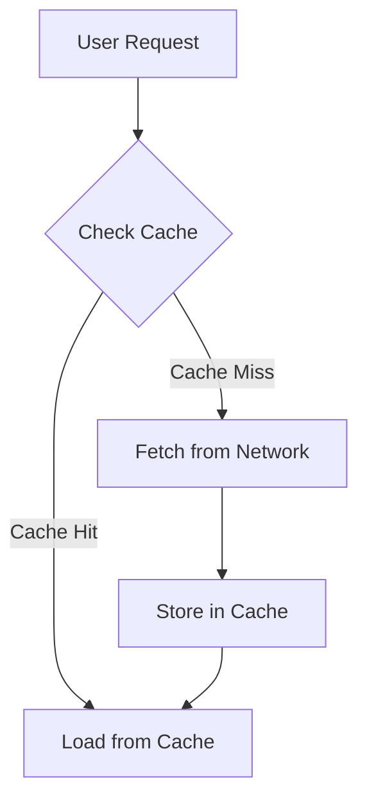

## 5.4.4 Media Caching and Performance

In the realm of mobile applications, media assets such as images and videos play a crucial role in enhancing user engagement and delivering rich content experiences. However, the performance implications of loading these assets over the network can significantly impact the user experience. This section delves into the importance of media caching, strategies for implementing efficient caching mechanisms in Flutter, and techniques for optimizing media performance.

### Importance of Media Caching

#### Performance Enhancement

Media caching is a pivotal strategy for enhancing the performance of mobile applications. By storing media assets locally, caching reduces the need for repeated network requests, thereby decreasing load times and conserving bandwidth. This is particularly beneficial in scenarios where network connectivity is unstable or slow, as cached assets can be retrieved instantly from local storage.

- **Reduced Load Times:** Caching minimizes the delay associated with fetching media from remote servers, leading to faster content display.
- **Network Efficiency:** By reducing the frequency of network requests, caching helps in conserving bandwidth, which is especially crucial for users with limited data plans.

#### Improved User Experience

Efficient media caching directly contributes to a smoother and more responsive user experience. Users expect quick access to content, and delays in media loading can lead to frustration and disengagement.

- **Smoother Playback:** Caching ensures that media playback, such as videos, is uninterrupted and seamless.
- **Quicker Access:** Users can access cached images and videos instantly, enhancing the overall app responsiveness.

### Implementing Image Caching

#### Using `cached_network_image`

The `cached_network_image` package is a popular choice for implementing image caching in Flutter applications. It simplifies the process of downloading, caching, and displaying images from the network.

- **Features:** Automatic caching, placeholder support, and error handling.
- **Benefits:** Reduces boilerplate code and integrates seamlessly with Flutter's widget system.

#### Setup and Integration

To integrate `cached_network_image` into your Flutter project, follow these steps:

1. **Add Dependency:** Include the package in your `pubspec.yaml` file.

   ```yaml
   dependencies:
     flutter:
       sdk: flutter
     cached_network_image: ^3.0.0
   ```

2. **Import the Package:** Import the package in your Dart file.

   ```dart
   import 'package:cached_network_image/cached_network_image.dart';
   ```

3. **Use CachedNetworkImage Widget:** Replace standard Image widgets with `CachedNetworkImage`.

   ```dart
   CachedNetworkImage(
     imageUrl: "https://example.com/image.jpg",
     placeholder: (context, url) => CircularProgressIndicator(),
     errorWidget: (context, url, error) => Icon(Icons.error),
   )
   ```

#### Code Examples

Here's a simple example demonstrating image caching with `cached_network_image`:

```dart
import 'package:flutter/material.dart';
import 'package:cached_network_image/cached_network_image.dart';

class ImageCachingExample extends StatelessWidget {
  @override
  Widget build(BuildContext context) {
    return Scaffold(
      appBar: AppBar(title: Text('Image Caching Example')),
      body: Center(
        child: CachedNetworkImage(
          imageUrl: "https://example.com/sample.jpg",
          placeholder: (context, url) => CircularProgressIndicator(),
          errorWidget: (context, url, error) => Icon(Icons.error),
        ),
      ),
    );
  }
}
```

### Video Caching Strategies

#### Challenges with Video Caching

Caching video content presents unique challenges compared to images due to the larger file sizes and streaming requirements. Videos often require more sophisticated caching strategies to ensure smooth playback.

- **File Size:** Videos are typically larger than images, necessitating efficient storage management.
- **Streaming Needs:** Videos may need to be buffered and played in real-time, complicating caching strategies.

#### Solutions for Video Caching

Several approaches can be employed to cache videos effectively:

- **Local Storage:** Download and store video files locally for offline access.
- **Third-Party Services:** Utilize services like Firebase or AWS for scalable video storage and retrieval.

#### Code Examples

Implementing video caching can be achieved using packages like `flutter_cache_manager` in conjunction with video players:

```dart
import 'package:flutter/material.dart';
import 'package:video_player/video_player.dart';
import 'package:flutter_cache_manager/flutter_cache_manager.dart';

class VideoCachingExample extends StatefulWidget {
  @override
  _VideoCachingExampleState createState() => _VideoCachingExampleState();
}

class _VideoCachingExampleState extends State<VideoCachingExample> {
  VideoPlayerController? _controller;

  @override
  void initState() {
    super.initState();
    _initializeVideo();
  }

  Future<void> _initializeVideo() async {
    final file = await DefaultCacheManager().getSingleFile('https://example.com/video.mp4');
    _controller = VideoPlayerController.file(file)
      ..initialize().then((_) {
        setState(() {});
        _controller!.play();
      });
  }

  @override
  void dispose() {
    _controller?.dispose();
    super.dispose();
  }

  @override
  Widget build(BuildContext context) {
    return Scaffold(
      appBar: AppBar(title: Text('Video Caching Example')),
      body: Center(
        child: _controller != null && _controller!.value.isInitialized
            ? AspectRatio(
                aspectRatio: _controller!.value.aspectRatio,
                child: VideoPlayer(_controller!),
              )
            : CircularProgressIndicator(),
      ),
    );
  }
}
```

### Managing Cache Size and Eviction

#### Cache Size Control

To prevent excessive storage usage, it's essential to implement strategies for controlling cache size. This can be achieved by setting limits on the cache size and the duration for which items are cached.

- **Size Limits:** Define a maximum cache size to prevent the app from consuming too much storage.
- **Time-Based Expiry:** Set expiration times for cached items to ensure they are refreshed periodically.

#### Eviction Policies

Implementing cache eviction policies helps manage outdated or less frequently accessed media. The Least Recently Used (LRU) policy is commonly used to evict the least accessed items first.

#### Implementation Guidance

Here's how you can manage cache size and implement eviction policies in Flutter:

```dart
import 'package:flutter_cache_manager/flutter_cache_manager.dart';

final customCacheManager = CacheManager(
  Config(
    'customCacheKey',
    stalePeriod: Duration(days: 7),
    maxNrOfCacheObjects: 100,
  ),
);

// Use customCacheManager to fetch and cache media
```

### Optimizing Network Requests

#### Media Compression

Compressing media files before caching can significantly reduce network bandwidth usage and improve load times.

- **Image Compression:** Use formats like WebP or JPEG with appropriate quality settings.
- **Video Compression:** Employ codecs like H.264 or VP9 for efficient video compression.

#### Selective Loading

Load media content selectively based on user interactions or screen visibility to optimize performance.

- **Lazy Loading:** Load images or videos only when they are about to be displayed on the screen.
- **Preloading:** Preload media assets that are likely to be accessed soon.

#### Code Examples

Here's an example demonstrating optimized network requests with lazy loading:

```dart
import 'package:flutter/material.dart';
import 'package:cached_network_image/cached_network_image.dart';

class LazyLoadingExample extends StatelessWidget {
  final List<String> imageUrls = [
    "https://example.com/image1.jpg",
    "https://example.com/image2.jpg",
    // Add more URLs
  ];

  @override
  Widget build(BuildContext context) {
    return Scaffold(
      appBar: AppBar(title: Text('Lazy Loading Example')),
      body: ListView.builder(
        itemCount: imageUrls.length,
        itemBuilder: (context, index) {
          return CachedNetworkImage(
            imageUrl: imageUrls[index],
            placeholder: (context, url) => CircularProgressIndicator(),
            errorWidget: (context, url, error) => Icon(Icons.error),
          );
        },
      ),
    );
  }
}
```

### Performance Monitoring

#### Monitoring Tools

Monitoring caching performance is crucial for identifying bottlenecks and optimizing strategies. Flutter DevTools provides insights into network requests, cache usage, and rendering performance.

- **Network Tab:** Analyze network requests and cache hits/misses.
- **Performance Tab:** Monitor frame rendering times and identify jank.

#### Optimizing Based on Metrics

Use performance metrics to refine caching strategies. For instance, if cache misses are high, consider increasing cache size or adjusting eviction policies.

### Implementation Guidance

#### Code Snippets

Here's a comprehensive example demonstrating effective media caching strategies for both images and videos:

```dart
import 'package:flutter/material.dart';
import 'package:cached_network_image/cached_network_image.dart';
import 'package:video_player/video_player.dart';
import 'package:flutter_cache_manager/flutter_cache_manager.dart';

class MediaCachingExample extends StatelessWidget {
  @override
  Widget build(BuildContext context) {
    return Scaffold(
      appBar: AppBar(title: Text('Media Caching Example')),
      body: Column(
        children: [
          CachedNetworkImage(
            imageUrl: "https://example.com/image.jpg",
            placeholder: (context, url) => CircularProgressIndicator(),
            errorWidget: (context, url, error) => Icon(Icons.error),
          ),
          VideoPlayerWidget(url: 'https://example.com/video.mp4'),
        ],
      ),
    );
  }
}

class VideoPlayerWidget extends StatefulWidget {
  final String url;

  VideoPlayerWidget({required this.url});

  @override
  _VideoPlayerWidgetState createState() => _VideoPlayerWidgetState();
}

class _VideoPlayerWidgetState extends State<VideoPlayerWidget> {
  VideoPlayerController? _controller;

  @override
  void initState() {
    super.initState();
    _initializeVideo();
  }

  Future<void> _initializeVideo() async {
    final file = await DefaultCacheManager().getSingleFile(widget.url);
    _controller = VideoPlayerController.file(file)
      ..initialize().then((_) {
        setState(() {});
        _controller!.play();
      });
  }

  @override
  void dispose() {
    _controller?.dispose();
    super.dispose();
  }

  @override
  Widget build(BuildContext context) {
    return _controller != null && _controller!.value.isInitialized
        ? AspectRatio(
            aspectRatio: _controller!.value.aspectRatio,
            child: VideoPlayer(_controller!),
          )
        : CircularProgressIndicator();
  }
}
```

#### Mermaid.js Diagrams

Below is a diagram illustrating the caching workflow and data flow within the app:



### Examples and Case Studies

#### Flutter Applications with Effective Media Caching

1. **Example App 1:** A photo gallery app that uses `cached_network_image` for efficient image loading and caching, resulting in faster browsing and reduced data usage.
2. **Example App 2:** A video streaming app that caches video segments locally, ensuring smooth playback even with intermittent connectivity.

#### Analyzing Caching Mechanisms

- **Performance Improvements:** Both apps demonstrate significant reductions in load times and improved user satisfaction.
- **User Experience Impact:** Users experience seamless media access, enhancing engagement and retention.

### Common Pitfalls

#### Excessive Cache Growth

Allowing the cache to grow uncontrollably can lead to storage issues. It's crucial to implement size limits and eviction policies to manage cache growth effectively.

#### Ignoring Cache Invalidation

Properly invalidating cached media is essential to ensure content freshness and accuracy. Failing to do so can result in outdated or incorrect content being displayed to users.

### Conclusion

Media caching is a powerful technique for enhancing the performance and user experience of Flutter applications. By implementing efficient caching strategies for images and videos, managing cache size, and optimizing network requests, developers can deliver responsive and engaging apps. Monitoring performance and refining caching strategies based on metrics further ensures that applications remain efficient and user-friendly.

## Quiz Time!



### What is a primary benefit of media caching in mobile applications?

- [x] Reduces load times and conserves bandwidth
- [ ] Increases network traffic
- [ ] Decreases app responsiveness
- [ ] Complicates media management

> **Explanation:** Media caching reduces load times by storing assets locally, which conserves bandwidth and enhances app performance.

### Which Flutter package is commonly used for image caching?

- [x] cached_network_image
- [ ] flutter_image_cache
- [ ] image_cache_manager
- [ ] network_image_cache

> **Explanation:** The `cached_network_image` package is widely used in Flutter for efficient image caching.

### What is a challenge associated with video caching compared to image caching?

- [x] Larger file sizes and streaming requirements
- [ ] Easier to implement
- [ ] Requires less storage
- [ ] Simpler network requests

> **Explanation:** Video caching is more challenging due to larger file sizes and the need for real-time streaming.

### What is a common cache eviction policy?

- [x] Least Recently Used (LRU)
- [ ] Most Frequently Used (MFU)
- [ ] First In First Out (FIFO)
- [ ] Random Replacement

> **Explanation:** The Least Recently Used (LRU) policy evicts the least accessed items first, making it a common choice for cache management.

### How can media compression benefit network requests?

- [x] Reduces bandwidth usage
- [ ] Increases file size
- [ ] Slows down loading times
- [ ] Complicates caching strategies

> **Explanation:** Media compression reduces the size of files, thereby decreasing bandwidth usage and improving load times.

### What tool can be used to monitor caching performance in Flutter?

- [x] Flutter DevTools
- [ ] Android Studio Profiler
- [ ] Xcode Instruments
- [ ] Visual Studio Code

> **Explanation:** Flutter DevTools provides insights into network requests, cache usage, and rendering performance.

### What is a potential pitfall of not managing cache size?

- [x] Excessive storage usage
- [ ] Improved app performance
- [ ] Faster network requests
- [ ] Enhanced media quality

> **Explanation:** Not managing cache size can lead to excessive storage usage, which may impact device performance.

### Why is cache invalidation important?

- [x] Ensures content freshness and accuracy
- [ ] Increases cache size
- [ ] Reduces network efficiency
- [ ] Complicates media retrieval

> **Explanation:** Cache invalidation is crucial for ensuring that users receive the most up-to-date and accurate content.

### What strategy can be used to load media content based on user interactions?

- [x] Lazy Loading
- [ ] Eager Loading
- [ ] Preloading
- [ ] Bulk Loading

> **Explanation:** Lazy loading involves loading media content only when it is about to be displayed, optimizing performance.

### True or False: Media caching can lead to a smoother user experience.

- [x] True
- [ ] False

> **Explanation:** True. Media caching reduces load times and ensures smoother playback, enhancing the user experience.


