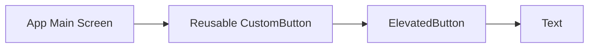

## 6.1.1 Building Reusable Components

In the world of software development, particularly in mobile app development with Flutter, building reusable components is a cornerstone of efficient and maintainable code. Reusable components not only streamline the development process but also enhance the consistency and quality of the user interface. This section delves into the significance of reusability, guides you through creating custom widgets, and shares best practices to ensure your components are both flexible and robust.

### Importance of Reusability

Reusability in software engineering refers to the practice of writing code in a way that allows it to be used in multiple places with minimal modification. Here’s why it’s crucial:

- **Efficiency and Productivity:** Reusable components save time and effort. Once a component is built and tested, it can be used across different parts of the application without rewriting code, thus speeding up the development process.
  
- **Consistency:** By using the same components throughout an app, you ensure a consistent look and feel. This consistency is vital for user experience, as it helps users navigate and interact with the app more intuitively.
  
- **Maintainability:** When updates or bug fixes are needed, changes can be made in one place and automatically propagate wherever the component is used. This reduces the risk of errors and makes the codebase easier to maintain.

- **Scalability:** As applications grow, having a library of reusable components allows for easier scaling. New features can be added more quickly using existing components, ensuring that the app remains cohesive and efficient.

### Creating Custom Widgets

Flutter’s widget-based architecture makes it ideal for creating reusable components. Custom widgets can be built by extending either `StatelessWidget` or `StatefulWidget`, depending on whether the widget needs to manage state.

#### Step-by-Step Guide to Creating Custom Widgets

1. **Identify the Reusable Element:** Determine which part of the UI or functionality can be encapsulated into a widget. This could be a button, a card, a form field, etc.

2. **Choose the Widget Type:** Decide whether your widget should be stateless or stateful. Use `StatelessWidget` for static content and `StatefulWidget` for dynamic content that changes over time.

3. **Define the Widget:** Create a new Dart file for your widget. Use clear and descriptive naming conventions to make your codebase more readable.

4. **Implement the Build Method:** Override the `build` method to define the widget’s UI. Use parameters to allow customization of the widget’s appearance and behavior.

5. **Document Your Widget:** Provide comments and documentation to explain the widget’s purpose, parameters, and usage. This is crucial for future maintenance and for other developers who might use your widget.

#### Example: Creating a Reusable Custom Button

Below is an example of a simple reusable button widget. This button can be customized with different labels, colors, and actions.

```dart
import 'package:flutter/material.dart';

class CustomButton extends StatelessWidget {
  final String label;
  final VoidCallback onPressed;
  final Color color;

  CustomButton({
    required this.label,
    required this.onPressed,
    this.color = Colors.blue,
  });

  @override
  Widget build(BuildContext context) {
    return ElevatedButton(
      style: ElevatedButton.styleFrom(primary: color),
      onPressed: onPressed,
      child: Text(label),
    );
  }
}
```

#### Using the Reusable Custom Button

Here’s how you can use the `CustomButton` widget in your app:

```dart
Widget build(BuildContext context) {
  return Center(
    child: CustomButton(
      label: 'Submit',
      onPressed: () {
        // Handle button press
      },
      color: Colors.green,
    ),
  );
}
```

### Encapsulating Functionality

Encapsulation is a fundamental principle of object-oriented programming that involves bundling the data and methods that operate on the data within a single unit or class. In Flutter, encapsulating functionality into widgets allows for modular and organized code.

#### Use Cases for Encapsulation

- **Custom Buttons:** As shown in the example above, buttons can be encapsulated to allow for consistent styling and behavior across the app.

- **Form Fields:** Create custom form field widgets that handle validation and styling, ensuring consistency in user input areas.

- **Cards and Containers:** Encapsulate common card layouts or container styles to maintain uniformity in how information is presented.

- **Navigation Elements:** Widgets like navigation bars or tabs can be encapsulated to manage navigation logic and styling in one place.

### Mermaid.js Diagrams

To better understand widget composition and reusability, consider the following diagram illustrating the relationship between the main app screen and a reusable custom button:



This diagram shows how the `App Main Screen` uses the `Reusable CustomButton`, which in turn utilizes Flutter’s built-in `ElevatedButton` and `Text` widgets.

### Best Practices

Adhering to best practices ensures that your reusable components are effective and maintainable:

- **Single Responsibility Principle:** Each widget should have a single responsibility or functionality. This makes the widget easier to understand, test, and reuse.

- **Parameterization:** Use parameters to make your widgets flexible and adaptable to different contexts. This allows for customization without altering the widget’s internal logic.

- **Documentation:** Thoroughly document your widgets. Include details about the widget’s purpose, parameters, and usage examples. This is invaluable for other developers and for future maintenance.

- **Testing:** Write unit and widget tests for your components to ensure they work as intended across different scenarios. Testing helps catch bugs early and ensures reliability.

### Conclusion

Building reusable components in Flutter is a powerful way to enhance your app’s efficiency, consistency, and maintainability. By encapsulating functionality into custom widgets, you create a modular and organized codebase that is easier to manage and scale. Remember to follow best practices, such as adhering to the single responsibility principle, parameterizing your widgets, and documenting thoroughly. With these strategies, you can create a robust library of reusable components that will serve your projects well.

## Quiz Time!



### Why is building reusable components important in Flutter development?

- [x] It enhances code efficiency and maintainability.
- [ ] It makes the app run faster.
- [ ] It reduces the need for testing.
- [ ] It eliminates the need for documentation.

> **Explanation:** Reusable components enhance code efficiency and maintainability by allowing developers to use the same code across different parts of the app, ensuring consistency and reducing redundancy.

### What is the primary advantage of using `StatelessWidget` for custom components?

- [x] It is suitable for static content that does not change.
- [ ] It allows for dynamic content updates.
- [ ] It automatically manages state changes.
- [ ] It is easier to debug than `StatefulWidget`.

> **Explanation:** `StatelessWidget` is ideal for static content that does not change over time, making it suitable for simple, reusable components.

### Which principle should be followed to ensure a widget has a single responsibility?

- [x] Single Responsibility Principle
- [ ] Open/Closed Principle
- [ ] Dependency Inversion Principle
- [ ] Liskov Substitution Principle

> **Explanation:** The Single Responsibility Principle states that a class or component should have only one reason to change, ensuring it has a single responsibility.

### How can you make a custom widget flexible and adaptable?

- [x] By using parameters for customization
- [ ] By hardcoding values within the widget
- [ ] By avoiding the use of parameters
- [ ] By using global variables

> **Explanation:** Using parameters allows customization of the widget's appearance and behavior, making it flexible and adaptable to different contexts.

### What is a key benefit of encapsulating functionality into separate widgets?

- [x] It promotes modularity and organization.
- [ ] It increases the complexity of the codebase.
- [ ] It reduces the need for testing.
- [ ] It makes debugging more difficult.

> **Explanation:** Encapsulating functionality into separate widgets promotes modularity and organization, making the codebase easier to manage and understand.

### Which of the following is a best practice for creating reusable components?

- [x] Thoroughly document the widget's purpose and usage.
- [ ] Avoid using parameters to simplify the widget.
- [ ] Use complex logic within the widget to handle all scenarios.
- [ ] Minimize the use of comments to keep the code clean.

> **Explanation:** Thorough documentation of the widget's purpose and usage is a best practice, as it aids in future maintenance and helps other developers understand how to use the component.

### What is the role of the `build` method in a custom widget?

- [x] To define the widget's UI
- [ ] To manage the widget's state
- [ ] To handle user interactions
- [ ] To perform background tasks

> **Explanation:** The `build` method is responsible for defining the widget's UI, specifying how it should be displayed on the screen.

### How can you ensure that a reusable component works across different scenarios?

- [x] By writing unit and widget tests
- [ ] By avoiding the use of parameters
- [ ] By using global variables
- [ ] By hardcoding values

> **Explanation:** Writing unit and widget tests ensures that the component functions correctly across different scenarios, catching potential bugs early.

### What does the Mermaid.js diagram in the article illustrate?

- [x] The relationship between the main app screen and a reusable custom button
- [ ] The internal logic of the `CustomButton` widget
- [ ] The performance metrics of the app
- [ ] The state management flow of the app

> **Explanation:** The Mermaid.js diagram illustrates the relationship between the main app screen and a reusable custom button, showing how components are composed.

### True or False: Encapsulation in Flutter widgets is only useful for UI elements.

- [ ] True
- [x] False

> **Explanation:** False. Encapsulation in Flutter widgets is useful for both UI elements and functionalities, promoting modularity and reusability across the app.


