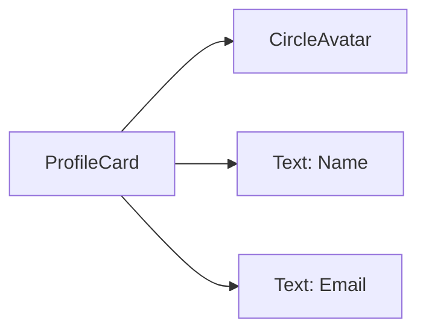

## 6.1.2 Composition Over Inheritance

In the realm of software development, particularly in object-oriented programming (OOP), two fundamental concepts often come into play: composition and inheritance. Both are powerful tools for building applications, but they serve different purposes and have distinct implications for the design and maintainability of your code. In the context of Flutter, a UI toolkit that emphasizes building beautiful, natively compiled applications, understanding these concepts is crucial for creating responsive and adaptive user interfaces.

### Understanding Composition vs. Inheritance

**Composition** and **inheritance** are two paradigms used to establish relationships between classes and objects in OOP. Let's delve into each to understand their roles and why composition is often favored in Flutter development.

- **Inheritance** is a mechanism where a new class (child) derives properties and behaviors (methods) from an existing class (parent). This creates a hierarchical relationship, allowing the child class to inherit and potentially override the functionality of the parent class. While inheritance can simplify code by promoting reuse, it can also lead to tightly coupled systems and rigid hierarchies that are difficult to modify or extend.

- **Composition**, on the other hand, involves building complex functionality by combining simpler, independent components. Instead of inheriting behavior, a class can contain instances of other classes, delegating tasks to these contained objects. This approach promotes loose coupling and enhances flexibility, as components can be easily swapped or modified without affecting the entire system.

In Flutter, composition is often preferred over inheritance for several reasons:

- **Flexibility:** Composition allows developers to combine multiple smaller widgets to create complex UIs without being tightly coupled. This means you can easily adjust or replace parts of your UI without significant refactoring.

- **Reusability:** By composing widgets, you can reuse them in various configurations across different parts of your application, enhancing modularity and reducing duplication.

- **Maintainability:** Composed widgets can be modified independently, simplifying updates and changes. This leads to cleaner, more maintainable codebases.

### Benefits of Composition

Let's explore the benefits of using composition in more detail:

#### Flexibility

Composition provides the flexibility to build complex UIs by assembling smaller, independent widgets. This modular approach allows for:

- **Easy Modifications:** You can change individual components without affecting the entire widget tree, making it easier to iterate on designs and functionality.
- **Dynamic Configurations:** Widgets can be configured dynamically at runtime, allowing for more adaptive and responsive interfaces.

#### Reusability

Composed widgets are inherently reusable. By designing widgets that encapsulate specific functionality, you can:

- **Promote Code Reuse:** Use the same widget in different contexts by passing different parameters or configurations.
- **Reduce Redundancy:** Eliminate duplicate code by reusing existing components, leading to a more concise and efficient codebase.

#### Maintainability

A maintainable codebase is crucial for long-term project success. Composition aids maintainability by:

- **Simplifying Updates:** Changes to one component do not necessitate changes to others, reducing the risk of introducing bugs.
- **Encouraging Clean Architecture:** By breaking down complex UIs into smaller, manageable pieces, you can maintain a clear and organized project structure.

### Implementing Composition in Flutter

In Flutter, composition is achieved by building complex widgets from simpler ones. Let's explore how to implement this through practical examples.

#### Example Use Case: Creating a Profile Card

Imagine you need to create a user profile card that displays a user's avatar, name, and email address. Instead of creating a monolithic widget with all the functionality, you can compose it using smaller widgets.

**Example 1: Composing Widgets to Create a Profile Card**

```dart
import 'package:flutter/material.dart';

class ProfileCard extends StatelessWidget {
  final String name;
  final String email;
  final String imageUrl;

  ProfileCard({
    required this.name,
    required this.email,
    required this.imageUrl,
  });

  @override
  Widget build(BuildContext context) {
    return Card(
      elevation: 4.0,
      shape: RoundedRectangleBorder(borderRadius: BorderRadius.circular(10)),
      child: Padding(
        padding: EdgeInsets.all(16.0),
        child: Column(
          children: [
            CircleAvatar(
              radius: 40,
              backgroundImage: NetworkImage(imageUrl),
            ),
            SizedBox(height: 10),
            Text(name, style: TextStyle(fontSize: 20, fontWeight: FontWeight.bold)),
            SizedBox(height: 5),
            Text(email, style: TextStyle(color: Colors.grey[700])),
          ],
        ),
      ),
    );
  }
}
```

In this example, the `ProfileCard` widget is composed of a `Card`, `CircleAvatar`, and `Text` widgets. Each component is responsible for a specific part of the UI, making it easy to modify or replace individual elements.

**Example 2: Using the ProfileCard Widget**

```dart
Widget build(BuildContext context) {
  return Center(
    child: ProfileCard(
      name: 'John Doe',
      email: 'john.doe@example.com',
      imageUrl: 'https://example.com/profile.jpg',
    ),
  );
}
```

This example demonstrates how to use the `ProfileCard` widget in a Flutter application. By passing different parameters, you can reuse the same widget for multiple users.

### Mermaid.js Diagrams

To visualize the concept of composition over inheritance, consider the following diagram illustrating how the `ProfileCard` is composed of smaller widgets:



This diagram shows the hierarchical relationship between the `ProfileCard` and its components, emphasizing the modular nature of composition.

### Best Practices

When using composition in Flutter, consider the following best practices:

- **Use Composition for Complex Widgets:** Break down complex UIs into smaller, manageable widgets that can be composed. This approach simplifies development and enhances flexibility.

- **Avoid Deep Inheritance Hierarchies:** Prevent creating overly complex widget trees through inheritance, which can lead to rigidity and difficulty in maintenance. Instead, favor composition to keep your codebase clean and adaptable.

- **Promote Reusability:** Design composed widgets to be reusable across different parts of the application by accepting parameters and configurations. This reduces redundancy and promotes a modular architecture.

### Conclusion

In conclusion, composition is a powerful paradigm that offers flexibility, reusability, and maintainability in Flutter development. By composing widgets, you can build complex UIs from simpler components, leading to cleaner, more adaptable code. Embracing composition over inheritance allows you to create responsive and adaptive user interfaces that are easier to maintain and extend.

As you continue your journey in Flutter development, consider how composition can enhance your projects. Experiment with different configurations and explore how composed widgets can streamline your workflow and improve the overall quality of your applications.

## Quiz Time!



### What is the primary advantage of using composition over inheritance in Flutter?

- [x] Flexibility and modularity in UI design
- [ ] Faster performance
- [ ] Simplified syntax
- [ ] Reduced memory usage

> **Explanation:** Composition allows for more flexible and modular UI design by combining smaller widgets into complex structures without the rigidity of inheritance hierarchies.

### In the context of Flutter, what does composition allow developers to do?

- [x] Combine multiple smaller widgets to create complex UIs
- [ ] Inherit properties from a parent widget
- [ ] Automatically optimize performance
- [ ] Simplify the Dart syntax

> **Explanation:** Composition in Flutter allows developers to combine smaller widgets to create complex UIs, promoting flexibility and reusability.

### Which of the following is a benefit of using composition in Flutter?

- [x] Reusability of widgets
- [ ] Increased code complexity
- [ ] Dependency on parent classes
- [ ] Reduced functionality

> **Explanation:** Composition promotes the reusability of widgets by allowing them to be used in various configurations across different parts of the application.

### What is a common pitfall of deep inheritance hierarchies?

- [x] Rigidity and difficulty in maintenance
- [ ] Improved performance
- [ ] Enhanced readability
- [ ] Simplified debugging

> **Explanation:** Deep inheritance hierarchies can lead to rigidity and difficulty in maintenance, making it harder to adapt and extend the codebase.

### How does composition enhance maintainability in Flutter applications?

- [x] By allowing components to be modified independently
- [ ] By reducing the number of lines of code
- [ ] By enforcing strict type checking
- [ ] By using fewer resources

> **Explanation:** Composition enhances maintainability by allowing components to be modified independently, reducing the risk of introducing bugs when making changes.

### Which widget in the provided code example represents the user's avatar?

- [x] CircleAvatar
- [ ] Card
- [ ] Text
- [ ] Column

> **Explanation:** The `CircleAvatar` widget in the code example represents the user's avatar, displaying their image.

### What is the role of the `ProfileCard` widget in the example?

- [x] To display a user's profile information
- [ ] To manage application state
- [ ] To handle user input
- [ ] To perform network requests

> **Explanation:** The `ProfileCard` widget is designed to display a user's profile information, including their avatar, name, and email.

### How can you promote reusability of widgets in Flutter?

- [x] By designing widgets to accept parameters and configurations
- [ ] By using global variables
- [ ] By minimizing the number of widgets
- [ ] By hardcoding values

> **Explanation:** Promoting reusability involves designing widgets to accept parameters and configurations, allowing them to be used in different contexts.

### What does the Mermaid.js diagram illustrate in the context of the article?

- [x] The composition of the `ProfileCard` widget
- [ ] The inheritance hierarchy of Flutter widgets
- [ ] The performance optimization process
- [ ] The state management flow

> **Explanation:** The Mermaid.js diagram illustrates the composition of the `ProfileCard` widget, showing how it is built from smaller components.

### True or False: Composition allows for the dynamic configuration of widgets at runtime.

- [x] True
- [ ] False

> **Explanation:** True. Composition allows for dynamic configuration of widgets at runtime, enabling more adaptive and responsive interfaces.


