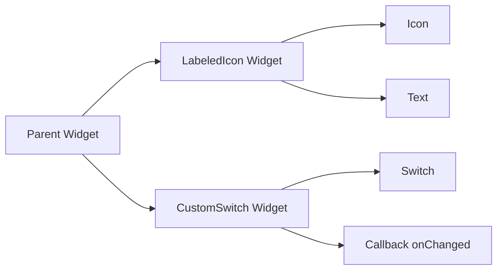

## 6.1.3 Passing Parameters and Callbacks

In the world of Flutter, creating dynamic and responsive user interfaces often hinges on the effective use of parameters and callbacks. These mechanisms allow developers to craft widgets that are not only reusable but also adaptable to varying data and user interactions. In this section, we will delve into the importance of parameterization, explore different types of parameters, and demonstrate how to implement callbacks to handle user events efficiently.

### Importance of Parameterization

Parameterization is a cornerstone of widget customization in Flutter. By passing parameters to widgets, developers can create flexible components that adapt to different contexts and data inputs. This adaptability is crucial for building responsive UIs that cater to diverse user needs and preferences.

- **Dynamic Widgets:** Parameters allow widgets to change their appearance and behavior based on the data they receive. For instance, a button can display different labels or icons depending on the context.
- **User Interactions:** Callbacks, a special type of parameter, enable widgets to respond to user actions, such as button presses or text input changes. This interaction is vital for creating engaging and interactive applications.

### Types of Parameters

Understanding the types of parameters available in Dart and Flutter is essential for effective widget design. Parameters can be categorized into required, optional, and named parameters, each serving a specific purpose.

#### Required vs. Optional Parameters

- **Required Parameters:** These are mandatory for the widget to function correctly. In Dart, the `required` keyword is used to enforce this requirement, ensuring that the caller provides necessary data.
  
  ```dart
  class CustomButton extends StatelessWidget {
    final String label;
    final VoidCallback onPressed;

    CustomButton({required this.label, required this.onPressed});
  }
  ```

- **Optional Parameters:** These parameters are not mandatory and can have default values. They provide flexibility, allowing the widget to operate even if certain data is not provided.

  ```dart
  class CustomButton extends StatelessWidget {
    final String label;
    final VoidCallback onPressed;
    final Color color;

    CustomButton({
      required this.label,
      required this.onPressed,
      this.color = Colors.blue, // Default value
    });
  }
  ```

#### Named Parameters

Named parameters enhance code readability and flexibility by allowing parameters to be specified in any order. They are particularly useful in constructors with multiple parameters.

```dart
class UserProfile extends StatelessWidget {
  final String name;
  final int age;
  final String email;

  UserProfile({required this.name, required this.age, this.email = ''});
}
```

### Implementing Callbacks

Callbacks are functions passed as parameters to widgets, enabling them to execute specific actions in response to user interactions. They are essential for handling events such as button clicks, form submissions, and more.

#### Example Use Cases

- **onPressed for Buttons:** A common use case where a callback is triggered when a button is pressed.

  ```dart
  ElevatedButton(
    onPressed: () {
      print('Button pressed!');
    },
    child: Text('Press Me'),
  )
  ```

- **onChanged for Form Fields:** Used to capture changes in text fields or other input elements.

  ```dart
  TextField(
    onChanged: (text) {
      print('Text changed to: $text');
    },
  )
  ```

- **Custom Event Handlers:** For more complex interactions, custom callbacks can be implemented.

  ```dart
  class CustomSlider extends StatelessWidget {
    final double value;
    final ValueChanged<double> onChanged;

    CustomSlider({required this.value, required this.onChanged});
  }
  ```

### Code Examples

Let's explore some practical code examples to illustrate the concepts of passing parameters and implementing callbacks.

#### Example 1: Passing Parameters to Custom Widgets

```dart
import 'package:flutter/material.dart';

class LabeledIcon extends StatelessWidget {
  final IconData icon;
  final String label;
  final Color color;

  LabeledIcon({
    required this.icon,
    required this.label,
    this.color = Colors.black,
  });

  @override
  Widget build(BuildContext context) {
    return Column(
      mainAxisSize: MainAxisSize.min,
      children: [
        Icon(icon, color: color),
        SizedBox(height: 4),
        Text(label, style: TextStyle(color: color)),
      ],
    );
  }
}

Widget build(BuildContext context) {
  return Center(
    child: LabeledIcon(
      icon: Icons.star,
      label: 'Favorite',
      color: Colors.orange,
    ),
  );
}
```

In this example, the `LabeledIcon` widget takes three parameters: `icon`, `label`, and `color`. The `icon` and `label` are required, while `color` is optional with a default value of `Colors.black`.

#### Example 2: Passing Callbacks to Handle Events

```dart
import 'package:flutter/material.dart';

class CustomSwitch extends StatefulWidget {
  final bool initialValue;
  final ValueChanged<bool> onChanged;

  CustomSwitch({required this.initialValue, required this.onChanged});

  @override
  _CustomSwitchState createState() => _CustomSwitchState();
}

class _CustomSwitchState extends State<CustomSwitch> {
  late bool _value;

  @override
  void initState() {
    super.initState();
    _value = widget.initialValue;
  }

  void _toggleSwitch(bool newValue) {
    setState(() {
      _value = newValue;
    });
    widget.onChanged(newValue);
  }

  @override
  Widget build(BuildContext context) {
    return Switch(
      value: _value,
      onChanged: _toggleSwitch,
    );
  }
}

Widget build(BuildContext context) {
  return Center(
    child: CustomSwitch(
      initialValue: true,
      onChanged: (bool newValue) {
        print('Switch is now: $newValue');
      },
    ),
  );
}
```

Here, the `CustomSwitch` widget uses a callback to notify the parent widget when the switch's state changes. The `onChanged` callback is triggered with the new value whenever the switch is toggled.

### Mermaid.js Diagrams

To better visualize the flow of parameter passing and callbacks, consider the following diagram:



This diagram illustrates how the parent widget interacts with custom widgets like `LabeledIcon` and `CustomSwitch`, passing parameters and handling callbacks.

### Best Practices

- **Use `final` for Immutable Parameters:** Declaring parameters as `final` ensures they remain unchanged within the widget, promoting immutability and reducing potential side effects.
  
  ```dart
  class ExampleWidget extends StatelessWidget {
    final String title;

    ExampleWidget({required this.title});
  }
  ```

- **Leverage Null Safety:** Utilize Dart’s null safety features to handle optional parameters gracefully, avoiding null-related errors.

  ```dart
  class ExampleWidget extends StatelessWidget {
    final String? subtitle;

    ExampleWidget({this.subtitle});
  }
  ```

- **Keep Callbacks Lightweight:** Ensure that callback functions are efficient and do not perform heavy computations, which can affect UI responsiveness. Consider offloading intensive tasks to separate threads or using asynchronous operations.

### Conclusion

Mastering the art of passing parameters and implementing callbacks is crucial for building responsive and adaptable Flutter applications. By understanding the different types of parameters and effectively using callbacks, developers can create widgets that are both flexible and interactive. These techniques not only enhance the user experience but also promote code reusability and maintainability.

As you continue your Flutter journey, remember to experiment with these concepts in your projects, leveraging the power of parameterization and callbacks to build dynamic and engaging user interfaces.

## Quiz Time!



### What is the primary benefit of passing parameters to widgets in Flutter?

- [x] It allows widgets to be dynamic and adaptable based on different data or user interactions.
- [ ] It reduces the size of the widget tree.
- [ ] It eliminates the need for state management.
- [ ] It simplifies the build process.

> **Explanation:** Passing parameters allows widgets to adapt their behavior and appearance based on the data they receive, making them dynamic and flexible.

### Which keyword is used in Dart to enforce that a parameter is mandatory?

- [x] required
- [ ] final
- [ ] const
- [ ] static

> **Explanation:** The `required` keyword is used in Dart to indicate that a parameter must be provided when creating an instance of a class.

### What is the advantage of using named parameters in Dart?

- [x] They enhance code readability and allow parameters to be specified in any order.
- [ ] They automatically initialize parameters with default values.
- [ ] They reduce the number of parameters needed.
- [ ] They eliminate the need for constructors.

> **Explanation:** Named parameters improve code readability and flexibility by allowing parameters to be specified in any order.

### In the context of callbacks, what is a common use case for the onPressed parameter?

- [x] Handling button press events.
- [ ] Changing the color of a widget.
- [ ] Initializing a widget's state.
- [ ] Defining the widget's layout.

> **Explanation:** The `onPressed` parameter is commonly used to handle button press events in Flutter.

### How can you ensure that parameters remain unchanged within a widget?

- [x] Declare them as final.
- [ ] Use the const keyword.
- [ ] Initialize them in the build method.
- [ ] Avoid using constructors.

> **Explanation:** Declaring parameters as `final` ensures they remain immutable within the widget.

### What is the role of the onChanged callback in a TextField widget?

- [x] Capturing changes in the text input.
- [ ] Setting the initial value of the text field.
- [ ] Styling the text field.
- [ ] Defining the text field's layout.

> **Explanation:** The `onChanged` callback is used to capture and respond to changes in the text input of a `TextField`.

### Which of the following is a best practice for implementing callbacks?

- [x] Ensure callbacks are efficient and do not perform heavy computations.
- [ ] Use callbacks to initialize widget state.
- [ ] Avoid using callbacks in interactive widgets.
- [ ] Implement callbacks only in stateful widgets.

> **Explanation:** Callbacks should be efficient and lightweight to maintain UI responsiveness.

### What is a potential benefit of leveraging Dart’s null safety features?

- [x] Handling optional parameters gracefully and avoiding null-related errors.
- [ ] Eliminating the need for error handling.
- [ ] Automatically optimizing widget performance.
- [ ] Simplifying the widget tree structure.

> **Explanation:** Dart's null safety features help handle optional parameters gracefully, reducing the risk of null-related errors.

### Which of the following is an example of a callback function in Flutter?

- [x] onPressed
- [ ] build
- [ ] initState
- [ ] dispose

> **Explanation:** `onPressed` is a callback function commonly used in buttons to handle press events.

### True or False: Callbacks should perform heavy computations to ensure thorough event handling.

- [ ] True
- [x] False

> **Explanation:** Callbacks should be lightweight and efficient to avoid affecting UI responsiveness negatively.


