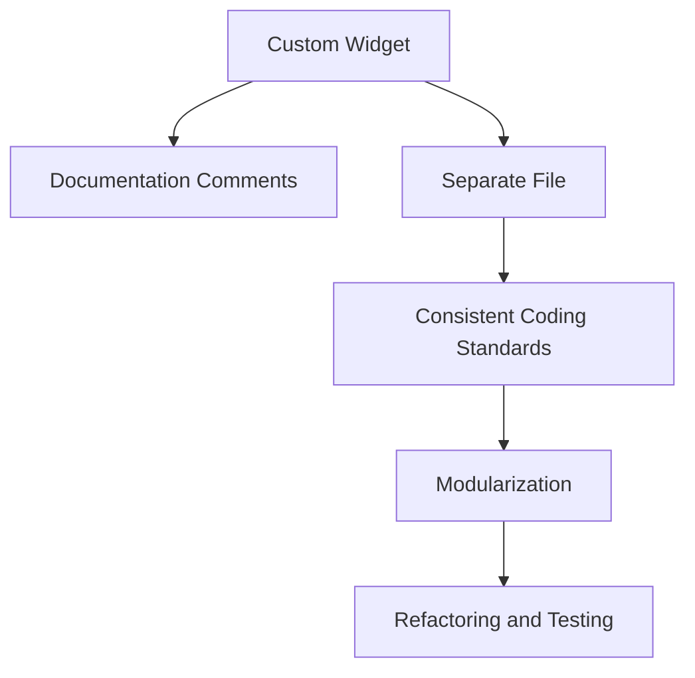

## 6.1.4 Documentation and Maintainability

In the world of software development, especially in a dynamic framework like Flutter, documentation and maintainability are crucial elements that ensure the longevity and usability of your code. This section delves into the importance of documenting custom widgets and maintaining a clean, organized codebase. By following best practices, you can create a code environment that is not only easy to understand but also easy to update and expand upon.

### Importance of Documentation

Documentation serves as the bridge between your code and its users, whether they are other developers or your future self. It plays a pivotal role in making widgets understandable and easy to use. Here’s why documentation is indispensable:

- **Clarity and Communication:** Good documentation communicates the purpose and functionality of your widgets clearly. It helps other developers (or even you, after some time) understand how to use the widget without having to delve into the code.
  
- **Ease of Maintenance:** Well-documented code is easier to maintain and update. When changes are needed, documentation provides a quick reference to understand the existing logic and structure.

- **Onboarding and Collaboration:** For teams, documentation is essential for onboarding new members and facilitating collaboration. It ensures that everyone is on the same page regarding how widgets are supposed to function.

### Documenting Custom Widgets

Flutter, being a Dart-based framework, leverages Dart’s documentation comments (`///`) to describe the purpose, parameters, and usage of custom widgets. Here’s how you can effectively document your custom widgets:

- **Use Dart’s Documentation Comments:** Start with a brief description of what the widget does. Follow this with detailed explanations of its parameters and any important usage notes.

- **Provide Examples:** Including usage examples within the documentation helps illustrate how the widget should be used in practice. This can be especially helpful for complex widgets.

- **Highlight Important Details:** Make sure to note any default values, optional parameters, or special behaviors that might not be immediately obvious.

#### Example: Documenting a Custom Widget

Here’s a practical example of how to document a custom widget using Dart’s documentation comments:

```dart
import 'package:flutter/material.dart';

/// A custom button widget that displays a label and an optional icon.
///
/// The [label] parameter specifies the button's text.
/// The [icon] parameter allows adding an icon alongside the label.
/// The [onPressed] callback is triggered when the button is pressed.
/// The [color] parameter sets the button's background color.
class IconButtonWithLabel extends StatelessWidget {
  final String label;
  final IconData? icon;
  final VoidCallback onPressed;
  final Color color;

  IconButtonWithLabel({
    required this.label,
    this.icon,
    required this.onPressed,
    this.color = Colors.blue,
  });

  @override
  Widget build(BuildContext context) {
    return ElevatedButton.icon(
      style: ElevatedButton.styleFrom(primary: color),
      onPressed: onPressed,
      icon: icon != null ? Icon(icon) : SizedBox.shrink(),
      label: Text(label),
    );
  }
}
```

### Maintainable Code Practices

Maintaining a clean and organized codebase is essential for long-term success. Here are some practices to ensure your code remains maintainable:

- **Consistent Coding Standards:** Adhere to a consistent coding style for naming conventions, indentation, and structuring code. This consistency makes the code easier to read and understand.

- **Modularization:** Organize widgets into separate files and directories based on functionality. This enhances navigability and makes it easier to locate specific components.

- **Refactoring:** Regularly review and refactor widgets to improve performance, readability, and maintainability. Refactoring helps eliminate code smells and enhance the overall quality of the code.

#### Example: Using the Documented Widget

Here’s how you might use the documented widget in a Flutter application:

```dart
Widget build(BuildContext context) {
  return Center(
    child: IconButtonWithLabel(
      label: 'Download',
      icon: Icons.download,
      onPressed: () {
        // Handle download action
      },
      color: Colors.green,
    ),
  );
}
```

### Mermaid.js Diagrams

To visually represent the workflow of documentation and maintainability, we can use Mermaid.js diagrams. Here’s an example diagram illustrating the process:



### Best Practices

- **Comprehensive Documentation:** Provide clear and detailed documentation for every custom widget, including descriptions of parameters and usage examples. This ensures that anyone using the widget understands its purpose and how to implement it correctly.

- **Organized Codebase:** Structure your code logically with separate files and folders for different widget categories. This organization enhances navigability and makes it easier to manage the codebase as it grows.

- **Regular Maintenance:** Continuously update and review documentation and code to reflect any changes or improvements made to widgets. Regular maintenance helps prevent technical debt and keeps the codebase healthy.

### Conclusion

In conclusion, documentation and maintainability are not just optional practices but essential components of professional software development. By documenting your custom widgets thoroughly and maintaining a clean, organized codebase, you set the foundation for a successful and sustainable project. These practices not only enhance the usability of your code but also ensure that it remains adaptable to future changes and improvements.

## Quiz Time!



### What is the primary purpose of documentation in software development?

- [x] To make code understandable and easy to use
- [ ] To increase the size of the codebase
- [ ] To reduce the need for testing
- [ ] To make the code run faster

> **Explanation:** Documentation serves to make code understandable and easy to use for other developers, facilitating maintenance and collaboration.

### Which Dart feature is used for documenting custom widgets?

- [ ] // Comments
- [x] /// Documentation comments
- [ ] /* Block comments */
- [ ] # Hash comments

> **Explanation:** Dart uses `///` for documentation comments, which are used to describe the purpose, parameters, and usage of custom widgets.

### Why is modularization important in maintaining a codebase?

- [x] It enhances navigability and organization
- [ ] It increases code complexity
- [ ] It reduces code readability
- [ ] It makes code execution slower

> **Explanation:** Modularization organizes code into separate files and directories based on functionality, enhancing navigability and organization.

### What is a key benefit of consistent coding standards?

- [x] Easier code readability and understanding
- [ ] Increased code execution speed
- [ ] Reduced code size
- [ ] More complex code structure

> **Explanation:** Consistent coding standards make the code easier to read and understand, facilitating collaboration and maintenance.

### What should be included in the documentation of a custom widget?

- [x] Description of the widget's purpose
- [x] Explanation of parameters
- [x] Usage examples
- [ ] Code obfuscation techniques

> **Explanation:** Documentation should include a description of the widget's purpose, an explanation of parameters, and usage examples to aid understanding.

### How does refactoring contribute to maintainability?

- [x] By improving performance and readability
- [ ] By increasing the number of lines of code
- [ ] By making code more complex
- [ ] By reducing the need for documentation

> **Explanation:** Refactoring improves performance and readability, making the code easier to maintain and understand.

### What is the role of Mermaid.js diagrams in documentation?

- [x] To visually represent workflows and processes
- [ ] To replace code comments
- [ ] To increase code execution speed
- [ ] To reduce code size

> **Explanation:** Mermaid.js diagrams visually represent workflows and processes, enhancing understanding of complex concepts.

### Which of the following is a best practice for maintaining a codebase?

- [x] Regularly updating documentation and code
- [ ] Avoiding code comments
- [ ] Increasing code complexity
- [ ] Reducing code readability

> **Explanation:** Regularly updating documentation and code ensures that the codebase remains accurate and reflects any changes or improvements.

### What is the benefit of providing usage examples in documentation?

- [x] It illustrates how to use the widget in practice
- [ ] It increases the size of the documentation
- [ ] It reduces the need for testing
- [ ] It makes the code run faster

> **Explanation:** Usage examples illustrate how to use the widget in practice, helping developers understand its implementation.

### True or False: Documentation is only necessary for complex widgets.

- [ ] True
- [x] False

> **Explanation:** Documentation is necessary for all widgets, regardless of complexity, to ensure clarity and ease of use.


