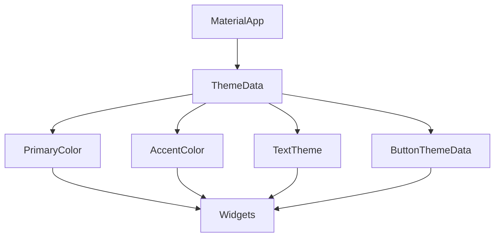

## 6.2.1 Global Themes

In the world of mobile app development, ensuring a consistent look and feel across your application is crucial for providing a seamless user experience. Flutter, with its powerful theming capabilities, allows developers to define global themes that dictate the visual styling of an app. This section will delve into the concept of global themes, how to set them up, and customize them to align with your app's branding.

### Introduction to Themes

Themes in Flutter are a powerful tool for defining the visual styling of your application. They ensure consistency across different screens and components by standardizing colors, fonts, and other design elements. Flutter's theming system is built around the `ThemeData` class, which provides a comprehensive set of properties to customize the appearance of your app.

- **Consistency Across the App:** By defining a theme, you can ensure that all widgets adhere to a consistent style, reducing the need for repetitive styling code.
- **Ease of Maintenance:** Changes to the theme can be made in one place, automatically updating the appearance of all widgets that use the theme.
- **Customization and Branding:** Themes allow you to easily apply your brand's colors, fonts, and styles throughout the app.

### Setting Up Global Themes

Setting up a global theme in Flutter involves defining a `ThemeData` object and applying it to your `MaterialApp` or `CupertinoApp`. This global theme will then be accessible throughout your app, allowing widgets to inherit and apply the defined styles.

#### Step-by-Step Guide

1. **Define the ThemeData:**
   Begin by creating a `ThemeData` object that specifies your desired styling properties. This includes colors, text styles, button themes, and more.

2. **Apply the Theme to MaterialApp:**
   Pass the `ThemeData` object to the `theme` property of your `MaterialApp`. This sets the global theme for your app.

3. **Access Theme Properties:**
   Use `Theme.of(context)` within your widgets to access and apply the theme properties.

Here is a simple example demonstrating how to define and apply a global theme:

```dart
import 'package:flutter/material.dart';

void main() {
  runApp(MyApp());
}

class MyApp extends StatelessWidget {
  @override
  Widget build(BuildContext context) {
    return MaterialApp(
      title: 'Global Theme Example',
      theme: ThemeData(
        primaryColor: Colors.teal,
        accentColor: Colors.orange,
        textTheme: TextTheme(
          bodyText1: TextStyle(fontSize: 18, color: Colors.black),
          bodyText2: TextStyle(fontSize: 16, color: Colors.grey[700]),
        ),
        buttonTheme: ButtonThemeData(
          buttonColor: Colors.teal,
          textTheme: ButtonTextTheme.primary,
        ),
      ),
      home: HomeScreen(),
    );
  }
}

class HomeScreen extends StatelessWidget {
  @override
  Widget build(BuildContext context) {
    return Scaffold(
      appBar: AppBar(title: Text('Home')),
      body: Center(
        child: Column(
          mainAxisAlignment: MainAxisAlignment.center,
          children: [
            Text('Hello, Flutter!', style: Theme.of(context).textTheme.bodyText1),
            SizedBox(height: 20),
            ElevatedButton(
              onPressed: () {},
              child: Text('Press Me'),
            ),
          ],
        ),
      ),
    );
  }
}
```

### Customizing Theme Properties

Flutter's `ThemeData` offers a wide range of properties to customize the appearance of your app. Here are some key properties you can modify:

- **primaryColor:** The primary color of your app, used for app bars, buttons, etc.
- **accentColor:** A secondary color used for highlighting elements.
- **textTheme:** Defines the default text styles for different text elements.
- **buttonTheme:** Customizes the appearance of buttons, including color and text style.

#### Overriding Default Theme Settings

To match your app's branding, you can override the default theme settings. This involves specifying custom values for the theme properties that align with your brand's visual identity.

```dart
theme: ThemeData(
  primaryColor: Colors.teal,
  accentColor: Colors.orange,
  textTheme: TextTheme(
    headline1: TextStyle(fontSize: 32, fontWeight: FontWeight.bold, color: Colors.teal),
    bodyText1: TextStyle(fontSize: 18, color: Colors.black),
  ),
  buttonTheme: ButtonThemeData(
    buttonColor: Colors.teal,
    textTheme: ButtonTextTheme.primary,
  ),
),
```

### Mermaid.js Diagrams

To better understand the structure of a global theme in Flutter, let's visualize it using a Mermaid.js diagram:



This diagram illustrates how the `ThemeData` is applied to the `MaterialApp`, and how various theme properties like `PrimaryColor`, `AccentColor`, `TextTheme`, and `ButtonThemeData` influence the styling of widgets throughout the app.

### Best Practices

When implementing global themes, consider the following best practices to ensure a cohesive and maintainable design:

- **Consistent Branding:** Use global themes to enforce brand colors, fonts, and styles throughout the app. This not only enhances the visual appeal but also strengthens brand recognition.
- **Theme Inheritance:** Leverage theme inheritance to allow child widgets to access and use theme properties seamlessly. This reduces redundancy and ensures consistency.
- **Light and Dark Themes:** Define both light and dark themes to support different user preferences and system settings. This can be achieved by providing separate `ThemeData` objects for light and dark modes and switching between them based on user preference or system settings.

### Practical Example: Implementing Light and Dark Themes

To implement light and dark themes, you can define two separate `ThemeData` objects and switch between them based on user preference or system settings.

```dart
import 'package:flutter/material.dart';

void main() {
  runApp(MyApp());
}

class MyApp extends StatelessWidget {
  @override
  Widget build(BuildContext context) {
    return MaterialApp(
      title: 'Light and Dark Theme Example',
      theme: ThemeData.light().copyWith(
        primaryColor: Colors.blue,
        accentColor: Colors.red,
      ),
      darkTheme: ThemeData.dark().copyWith(
        primaryColor: Colors.blueGrey,
        accentColor: Colors.deepOrange,
      ),
      themeMode: ThemeMode.system, // Automatically switch based on system settings
      home: HomeScreen(),
    );
  }
}

class HomeScreen extends StatelessWidget {
  @override
  Widget build(BuildContext context) {
    return Scaffold(
      appBar: AppBar(title: Text('Home')),
      body: Center(
        child: Column(
          mainAxisAlignment: MainAxisAlignment.center,
          children: [
            Text('Hello, Flutter!', style: Theme.of(context).textTheme.bodyText1),
            SizedBox(height: 20),
            ElevatedButton(
              onPressed: () {},
              child: Text('Press Me'),
            ),
          ],
        ),
      ),
    );
  }
}
```

In this example, the app automatically switches between light and dark themes based on the system settings, providing a seamless experience for users who prefer different modes.

### Conclusion

Global themes in Flutter are a powerful way to ensure consistent styling across your app. By leveraging `ThemeData`, you can define and apply a cohesive visual style that aligns with your brand's identity. Whether you're implementing light and dark themes or customizing specific properties, Flutter's theming system provides the flexibility and control needed to create visually appealing and user-friendly applications.

### Additional Resources

- [Flutter Documentation on Themes](https://flutter.dev/docs/cookbook/design/themes)
- [Theming in Flutter: A Comprehensive Guide](https://medium.com/flutter-community/theming-in-flutter-a-comprehensive-guide-3f3e8b0f7b8a)
- [Flutter: Light and Dark Theme Switcher](https://medium.com/flutter-community/flutter-light-and-dark-theme-switcher-using-provider-3a3b3c4f9c5d)

By understanding and implementing global themes, you can enhance the visual consistency and user experience of your Flutter applications, making them more engaging and professional.

## Quiz Time!



### What is the primary purpose of using global themes in Flutter?

- [x] To ensure consistent styling across the entire app
- [ ] To improve app performance
- [ ] To manage state efficiently
- [ ] To handle network requests

> **Explanation:** Global themes are used to ensure consistent styling across the entire app by defining colors, fonts, and component designs.

### How do you apply a global theme in a Flutter app?

- [x] By passing a `ThemeData` object to the `theme` property of `MaterialApp`
- [ ] By using a global variable
- [ ] By setting a theme in the `main.dart` file
- [ ] By applying styles directly to each widget

> **Explanation:** A global theme is applied by passing a `ThemeData` object to the `theme` property of `MaterialApp` or `CupertinoApp`.

### Which method is used to access theme properties within a widget?

- [x] `Theme.of(context)`
- [ ] `context.theme`
- [ ] `ThemeData.of(context)`
- [ ] `ThemeData.get(context)`

> **Explanation:** `Theme.of(context)` is used to access theme properties within a widget.

### What is the role of `primaryColor` in `ThemeData`?

- [x] It defines the primary color used for app bars, buttons, etc.
- [ ] It sets the background color of the app
- [ ] It specifies the text color for all text widgets
- [ ] It determines the color of icons

> **Explanation:** `primaryColor` in `ThemeData` defines the primary color used for app bars, buttons, and other primary elements.

### How can you define both light and dark themes in a Flutter app?

- [x] By providing separate `ThemeData` objects for light and dark themes
- [ ] By using a single `ThemeData` object
- [ ] By setting a global variable for theme mode
- [ ] By using a third-party package

> **Explanation:** You can define both light and dark themes by providing separate `ThemeData` objects and switching between them based on user preference or system settings.

### Which property allows you to automatically switch themes based on system settings?

- [x] `themeMode`
- [ ] `systemTheme`
- [ ] `autoTheme`
- [ ] `defaultTheme`

> **Explanation:** The `themeMode` property allows you to automatically switch themes based on system settings.

### What is the benefit of using `ThemeData` in Flutter?

- [x] It provides a centralized way to manage app styling
- [ ] It improves app performance
- [ ] It simplifies state management
- [ ] It enhances network connectivity

> **Explanation:** `ThemeData` provides a centralized way to manage app styling, ensuring consistency across the app.

### What is the purpose of the `buttonTheme` property in `ThemeData`?

- [x] To customize the appearance of buttons, including color and text style
- [ ] To set the default font size for buttons
- [ ] To define the shape of buttons
- [ ] To manage button animations

> **Explanation:** The `buttonTheme` property in `ThemeData` is used to customize the appearance of buttons, including their color and text style.

### How can you ensure that child widgets inherit theme properties?

- [x] By leveraging theme inheritance
- [ ] By manually passing theme data to each widget
- [ ] By using a global variable
- [ ] By setting a default theme

> **Explanation:** Leveraging theme inheritance ensures that child widgets automatically inherit theme properties.

### True or False: Global themes in Flutter can only be used for styling text.

- [ ] True
- [x] False

> **Explanation:** False. Global themes in Flutter can be used to style various components, including colors, text, buttons, and more.


