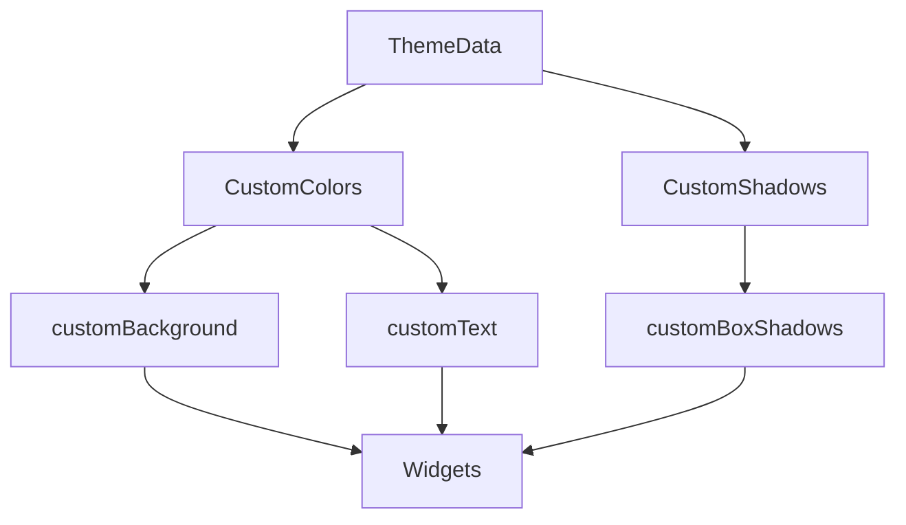

## 6.2.2 Theme Extensions

In the world of mobile app development, creating a consistent and adaptable user interface is paramount. Flutter's theming system provides a robust foundation for styling applications, but sometimes the default `ThemeData` properties may not cover all your design needs. This is where **Theme Extensions** come into play, allowing developers to add custom properties to `ThemeData`, thereby enabling more flexible and granular styling.

### Introduction to Theme Extensions

Theme extensions in Flutter are a powerful tool that allows developers to define custom properties within the `ThemeData` class. This capability is particularly useful when you need to incorporate unique design elements such as custom colors, gradients, shadows, or other stylistic aspects that are not part of the default theme properties.

#### Use Cases for Theme Extensions

- **Custom Colors and Gradients:** Define a palette of colors or gradients specific to your brand or design language.
- **Shadows and Elevations:** Customize shadows for specific components to enhance depth and visual hierarchy.
- **Typography and Text Styles:** Extend text styling beyond the default options for unique typographic needs.
- **Component-Specific Styles:** Create styles for custom widgets or components that require unique theming.

By leveraging theme extensions, you can maintain a clean and organized codebase while ensuring that your app's design remains consistent and adaptable across different screens and devices.

### Creating Custom Theme Extensions

To create a custom theme extension, you need to extend the `ThemeExtension` class. This involves defining the properties you want to include, implementing methods for copying and interpolating (lerping) these properties, and integrating the extension into your app's `ThemeData`.

#### Step-by-Step Guide

1. **Define the Custom Theme Extension:**
   - Create a class that extends `ThemeExtension`.
   - Define the properties you want to include in your theme extension.
   - Implement the `copyWith` and `lerp` methods for your properties.

2. **Integrate the Custom Extension into ThemeData:**
   - Add the custom theme extension to the `extensions` list in `ThemeData`.
   - Ensure that the extension is accessible throughout your app.

3. **Access the Custom Theme Extension in Widgets:**
   - Use `Theme.of(context).extension<YourCustomExtension>()` to retrieve and use the custom properties within your widgets.

#### Example 1: Defining a Custom Theme Extension

Let's start by defining a simple custom theme extension for colors:

```dart
import 'package:flutter/material.dart';

class CustomColors extends ThemeExtension<CustomColors> {
  final Color? customBackground;
  final Color? customText;

  CustomColors({this.customBackground, this.customText});

  @override
  CustomColors copyWith({Color? customBackground, Color? customText}) {
    return CustomColors(
      customBackground: customBackground ?? this.customBackground,
      customText: customText ?? this.customText,
    );
  }

  @override
  CustomColors lerp(ThemeExtension<CustomColors>? other, double t) {
    if (other is! CustomColors) return this;
    return CustomColors(
      customBackground: Color.lerp(customBackground, other.customBackground, t),
      customText: Color.lerp(customText, other.customText, t),
    );
  }
}

void main() {
  runApp(MyApp());
}

class MyApp extends StatelessWidget {
  @override
  Widget build(BuildContext context) {
    return MaterialApp(
      title: 'Theme Extensions Example',
      theme: ThemeData(
        primaryColor: Colors.teal,
        extensions: [
          CustomColors(
            customBackground: Colors.teal.shade50,
            customText: Colors.teal.shade900,
          ),
        ],
      ),
      home: HomeScreen(),
    );
  }
}

class HomeScreen extends StatelessWidget {
  @override
  Widget build(BuildContext context) {
    final customColors = Theme.of(context).extension<CustomColors>()!;
    return Scaffold(
      appBar: AppBar(title: Text('Home')),
      body: Container(
        color: customColors.customBackground,
        child: Center(
          child: Text(
            'Custom Themed Text',
            style: TextStyle(color: customColors.customText, fontSize: 24),
          ),
        ),
      ),
    );
  }
}
```

In this example, we define a `CustomColors` extension with two properties: `customBackground` and `customText`. These properties are integrated into the app's theme and accessed within the `HomeScreen` widget.

#### Example 2: Using Multiple Theme Extensions

You can define multiple theme extensions to handle different aspects of your app's design. Here's how you can manage colors and shadows separately:

```dart
import 'package:flutter/material.dart';

class CustomColors extends ThemeExtension<CustomColors> {
  final Color? customButtonColor;

  CustomColors({this.customButtonColor});

  @override
  CustomColors copyWith({Color? customButtonColor}) {
    return CustomColors(
      customButtonColor: customButtonColor ?? this.customButtonColor,
    );
  }

  @override
  CustomColors lerp(ThemeExtension<CustomColors>? other, double t) {
    if (other is! CustomColors) return this;
    return CustomColors(
      customButtonColor: Color.lerp(customButtonColor, other.customButtonColor, t),
    );
  }
}

class CustomShadows extends ThemeExtension<CustomShadows> {
  final List<BoxShadow>? customBoxShadows;

  CustomShadows({this.customBoxShadows});

  @override
  CustomShadows copyWith({List<BoxShadow>? customBoxShadows}) {
    return CustomShadows(
      customBoxShadows: customBoxShadows ?? this.customBoxShadows,
    );
  }

  @override
  CustomShadows lerp(ThemeExtension<CustomShadows>? other, double t) {
    if (other is! CustomShadows) return this;
    return CustomShadows(
      customBoxShadows: BoxShadow.lerpList(customBoxShadows, other.customBoxShadows, t),
    );
  }
}

void main() {
  runApp(MyApp());
}

class MyApp extends StatelessWidget {
  @override
  Widget build(BuildContext context) {
    return MaterialApp(
      title: 'Multiple Theme Extensions',
      theme: ThemeData(
        extensions: [
          CustomColors(customButtonColor: Colors.purple),
          CustomShadows(customBoxShadows: [
            BoxShadow(color: Colors.black26, blurRadius: 4, offset: Offset(2, 2)),
          ]),
        ],
      ),
      home: HomeScreen(),
    );
  }
}

class HomeScreen extends StatelessWidget {
  @override
  Widget build(BuildContext context) {
    final customColors = Theme.of(context).extension<CustomColors>()!;
    final customShadows = Theme.of(context).extension<CustomShadows>()!;
    return Scaffold(
      appBar: AppBar(title: Text('Home')),
      body: Center(
        child: Container(
          padding: EdgeInsets.all(16.0),
          decoration: BoxDecoration(
            color: customColors.customButtonColor,
            boxShadow: customShadows.customBoxShadows,
            borderRadius: BorderRadius.circular(8.0),
          ),
          child: Text(
            'Custom Styled Container',
            style: TextStyle(color: Colors.white, fontSize: 18),
          ),
        ),
      ),
    );
  }
}
```

In this example, we define two separate extensions: `CustomColors` for button colors and `CustomShadows` for box shadows. This modular approach allows for more organized and maintainable code.

### Diagram Illustrating Theme Extensions Implementation

To better understand how theme extensions fit into the Flutter theming system, let's look at a diagram:



In this diagram, `ThemeData` is extended with `CustomColors` and `CustomShadows`, which provide additional properties (`customBackground`, `customText`, `customBoxShadows`) that are utilized by widgets in the application.

### Best Practices for Theme Extensions

- **Modular Extensions:** Keep theme extensions modular by defining separate extensions for different style aspects. This approach enhances code readability and maintainability.
- **Default Values:** Provide sensible default values within theme extensions to ensure widgets render correctly even if extensions are not applied. This prevents runtime errors and enhances user experience.
- **Theme Inheritance:** Utilize theme inheritance to allow child widgets to seamlessly access and utilize custom theme properties. This ensures consistency across your app's UI.

### Conclusion

Theme extensions in Flutter offer a flexible way to customize your app's appearance beyond the default theming capabilities. By defining custom properties and integrating them into `ThemeData`, you can achieve a high level of design consistency and adaptability. This approach not only enhances the visual appeal of your app but also simplifies the process of maintaining and updating your design system.

As you implement theme extensions in your projects, consider the best practices outlined above to ensure a robust and scalable theming strategy. By doing so, you'll be well-equipped to create visually stunning and cohesive applications that stand out in the competitive app market.

## Quiz Time!



### What is the primary purpose of theme extensions in Flutter?

- [x] To add custom properties to ThemeData for more flexible styling
- [ ] To replace the default ThemeData properties
- [ ] To create animations within the theme
- [ ] To manage state within the theme

> **Explanation:** Theme extensions allow developers to add custom properties to `ThemeData`, enabling more flexible and granular styling.

### Which method must be implemented when creating a custom theme extension?

- [x] copyWith
- [ ] build
- [ ] dispose
- [ ] initState

> **Explanation:** The `copyWith` method is essential for creating a new instance of the theme extension with updated properties.

### What is the role of the lerp method in a custom theme extension?

- [x] To interpolate between two theme extensions
- [ ] To initialize the theme extension
- [ ] To dispose of the theme extension
- [ ] To build the theme extension

> **Explanation:** The `lerp` method is used to interpolate between two instances of the theme extension, which is useful for animations and transitions.

### How can you access a custom theme extension within a widget?

- [x] Theme.of(context).extension<YourCustomExtension>()
- [ ] context.watch<YourCustomExtension>()
- [ ] Provider.of<YourCustomExtension>(context)
- [ ] YourCustomExtension.of(context)

> **Explanation:** You can access a custom theme extension using `Theme.of(context).extension<YourCustomExtension>()`.

### What is a benefit of keeping theme extensions modular?

- [x] Enhances code readability and maintainability
- [ ] Increases the complexity of the code
- [ ] Reduces the number of theme properties
- [ ] Limits the use of custom styles

> **Explanation:** Modular theme extensions enhance code readability and maintainability by organizing different style aspects separately.

### Why should you provide default values in theme extensions?

- [x] To ensure widgets render correctly even if extensions are not applied
- [ ] To increase the size of the theme extension
- [ ] To make the theme extension more complex
- [ ] To limit the flexibility of the theme

> **Explanation:** Providing default values ensures that widgets render correctly even if the extensions are not applied, preventing runtime errors.

### What is the advantage of using theme inheritance?

- [x] It ensures consistency across the app's UI
- [ ] It makes the theme extension more complex
- [ ] It limits the use of custom styles
- [ ] It increases the number of theme properties

> **Explanation:** Theme inheritance ensures consistency across the app's UI by allowing child widgets to access custom theme properties seamlessly.

### What is the purpose of the CustomColors class in the provided examples?

- [x] To define custom color properties for the theme
- [ ] To manage state within the theme
- [ ] To create animations within the theme
- [ ] To replace the default ThemeData properties

> **Explanation:** The `CustomColors` class defines custom color properties for the theme, allowing for more flexible styling.

### How can you define multiple theme extensions in a Flutter app?

- [x] By adding them to the extensions list in ThemeData
- [ ] By creating separate ThemeData instances
- [ ] By using a single theme extension for all properties
- [ ] By overriding the default ThemeData properties

> **Explanation:** Multiple theme extensions can be defined by adding them to the `extensions` list in `ThemeData`.

### True or False: Theme extensions can only be used for color properties.

- [ ] True
- [x] False

> **Explanation:** False. Theme extensions can be used for various properties, including colors, shadows, typography, and more.


