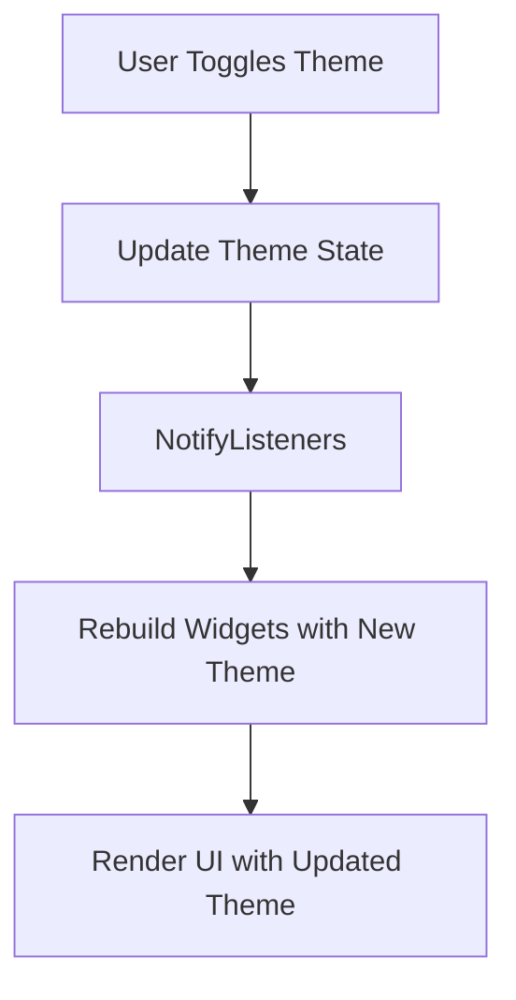

## 6.2.3 Dynamic Theming

In the rapidly evolving landscape of mobile applications, user experience is paramount. One of the key aspects that significantly enhances user experience is the ability to adapt the application's appearance to user preferences and system settings. Dynamic theming in Flutter allows developers to switch themes, such as light and dark modes, at runtime. This capability not only improves accessibility but also aligns with user expectations for modern applications. In this section, we'll delve into the intricacies of dynamic theming, exploring its implementation, benefits, and best practices.

### Introduction to Dynamic Theming

Dynamic theming refers to the capability of an application to change its visual appearance dynamically, based on user preferences or system settings. This feature is particularly useful for:

- **Enhancing User Experience:** By allowing users to choose between different themes, such as light and dark modes, applications can cater to individual preferences and improve readability in various lighting conditions.
- **Improving Accessibility:** Dynamic theming can help users with visual impairments by providing high-contrast themes or larger font sizes.
- **Aligning with System Settings:** Many operating systems now offer system-wide dark mode settings. By supporting dynamic theming, applications can automatically adapt to these settings, providing a seamless user experience.

### Implementing Theme Switching

To implement dynamic theming in Flutter, you need to set up multiple themes and provide a mechanism to toggle between them. This can be achieved using `StatefulWidget` or more robust state management solutions like Provider or Bloc.

#### Step-by-Step Guide to Theme Switching

1. **Define Themes:** Create light and dark theme data using `ThemeData`.

2. **Manage Theme State:** Use a `StatefulWidget` or a state management solution to manage the current theme state.

3. **Toggle Themes:** Implement a mechanism to switch themes, such as a toggle button or a system setting listener.

4. **Rebuild UI:** Ensure that the UI rebuilds with the updated theme when the theme state changes.

#### Example 1: Basic Theme Switching with StatefulWidget

Here's a simple implementation using a `StatefulWidget` to manage theme state:

```dart
import 'package:flutter/material.dart';

void main() {
  runApp(MyApp());
}

class MyApp extends StatefulWidget {
  @override
  _MyAppState createState() => _MyAppState();
}

class _MyAppState extends State<MyApp> {
  bool _isDarkTheme = false;

  void _toggleTheme() {
    setState(() {
      _isDarkTheme = !_isDarkTheme;
    });
  }

  @override
  Widget build(BuildContext context) {
    return MaterialApp(
      title: 'Dynamic Theming Example',
      theme: ThemeData.light(),
      darkTheme: ThemeData.dark(),
      themeMode: _isDarkTheme ? ThemeMode.dark : ThemeMode.light,
      home: HomeScreen(toggleTheme: _toggleTheme, isDarkTheme: _isDarkTheme),
    );
  }
}

class HomeScreen extends StatelessWidget {
  final VoidCallback toggleTheme;
  final bool isDarkTheme;

  HomeScreen({required this.toggleTheme, required this.isDarkTheme});

  @override
  Widget build(BuildContext context) {
    return Scaffold(
      appBar: AppBar(title: Text('Dynamic Theming')),
      body: Center(
        child: SwitchListTile(
          title: Text('Dark Theme'),
          value: isDarkTheme,
          onChanged: (bool value) {
            toggleTheme();
          },
        ),
      ),
    );
  }
}
```

In this example, the `MyApp` widget maintains the theme state and provides a method to toggle between light and dark themes. The `HomeScreen` widget contains a `SwitchListTile` to allow users to switch themes.

#### Example 2: Theme Switching with Provider

For more complex applications, using a state management solution like Provider can help manage theme state more efficiently:

```dart
import 'package:flutter/material.dart';
import 'package:provider/provider.dart';

void main() {
  runApp(
    ChangeNotifierProvider(
      create: (_) => ThemeProvider(),
      child: MyApp(),
    ),
  );
}

class ThemeProvider with ChangeNotifier {
  ThemeMode _themeMode = ThemeMode.light;

  ThemeMode get themeMode => _themeMode;

  void toggleTheme() {
    _themeMode = _themeMode == ThemeMode.light ? ThemeMode.dark : ThemeMode.light;
    notifyListeners();
  }
}

class MyApp extends StatelessWidget {
  @override
  Widget build(BuildContext context) {
    final themeProvider = Provider.of<ThemeProvider>(context);

    return MaterialApp(
      title: 'Provider Theme Example',
      theme: ThemeData.light(),
      darkTheme: ThemeData.dark(),
      themeMode: themeProvider.themeMode,
      home: HomeScreen(),
    );
  }
}

class HomeScreen extends StatelessWidget {
  @override
  Widget build(BuildContext context) {
    final themeProvider = Provider.of<ThemeProvider>(context);

    return Scaffold(
      appBar: AppBar(title: Text('Provider Theme')),
      body: Center(
        child: SwitchListTile(
          title: Text('Dark Theme'),
          value: themeProvider.themeMode == ThemeMode.dark,
          onChanged: (bool value) {
            themeProvider.toggleTheme();
          },
        ),
      ),
    );
  }
}
```

In this implementation, the `ThemeProvider` class extends `ChangeNotifier` to manage theme state. The `MyApp` widget listens for changes in the theme state and updates the UI accordingly.

### Persisting Theme Preferences

To provide a seamless user experience, it's important to persist user theme preferences across sessions. This can be achieved using local storage solutions like `SharedPreferences`.

#### Saving and Retrieving Theme Preferences

1. **Save Theme Preference:** When the user toggles the theme, save the preference using `SharedPreferences`.

2. **Retrieve Theme Preference:** On app startup, retrieve the saved theme preference and apply it.

Here's how you can implement this:

```dart
import 'package:flutter/material.dart';
import 'package:shared_preferences/shared_preferences.dart';

void main() async {
  WidgetsFlutterBinding.ensureInitialized();
  final prefs = await SharedPreferences.getInstance();
  final isDarkTheme = prefs.getBool('isDarkTheme') ?? false;
  runApp(MyApp(isDarkTheme: isDarkTheme));
}

class MyApp extends StatefulWidget {
  final bool isDarkTheme;

  MyApp({required this.isDarkTheme});

  @override
  _MyAppState createState() => _MyAppState();
}

class _MyAppState extends State<MyApp> {
  late bool _isDarkTheme;

  @override
  void initState() {
    super.initState();
    _isDarkTheme = widget.isDarkTheme;
  }

  void _toggleTheme() async {
    setState(() {
      _isDarkTheme = !_isDarkTheme;
    });
    final prefs = await SharedPreferences.getInstance();
    prefs.setBool('isDarkTheme', _isDarkTheme);
  }

  @override
  Widget build(BuildContext context) {
    return MaterialApp(
      title: 'Dynamic Theming with Persistence',
      theme: ThemeData.light(),
      darkTheme: ThemeData.dark(),
      themeMode: _isDarkTheme ? ThemeMode.dark : ThemeMode.light,
      home: HomeScreen(toggleTheme: _toggleTheme, isDarkTheme: _isDarkTheme),
    );
  }
}

class HomeScreen extends StatelessWidget {
  final VoidCallback toggleTheme;
  final bool isDarkTheme;

  HomeScreen({required this.toggleTheme, required this.isDarkTheme});

  @override
  Widget build(BuildContext context) {
    return Scaffold(
      appBar: AppBar(title: Text('Dynamic Theming with Persistence')),
      body: Center(
        child: SwitchListTile(
          title: Text('Dark Theme'),
          value: isDarkTheme,
          onChanged: (bool value) {
            toggleTheme();
          },
        ),
      ),
    );
  }
}
```

In this example, the theme preference is saved and retrieved using `SharedPreferences`, ensuring that the user's choice is retained across app restarts.

### Mermaid.js Diagrams

To visualize the dynamic theming workflow, consider the following diagram:



This diagram illustrates the process flow from the user toggling the theme to the UI being rendered with the updated theme.

### Best Practices

Implementing dynamic theming effectively requires attention to detail and adherence to best practices:

- **Smooth Transitions:** Implement animated transitions when switching themes to enhance the user experience. This can be achieved using Flutter's animation framework to create smooth and visually appealing transitions.

- **Consistent Styling:** Ensure that all widgets and components respond to theme changes uniformly to maintain visual consistency. This includes custom widgets and third-party components.

- **Testing:** Thoroughly test theme switching across all parts of the app to identify and fix any styling issues. Consider edge cases, such as switching themes during animations or while the app is in the background.

### Conclusion

Dynamic theming is a powerful feature that enhances user experience and accessibility in modern applications. By implementing theme switching and persisting user preferences, developers can create applications that are not only visually appealing but also adaptable to user needs and system settings. As you integrate dynamic theming into your Flutter applications, remember to focus on smooth transitions, consistent styling, and thorough testing to ensure a seamless user experience.

For further exploration, consider diving into Flutter's official documentation on theming and experimenting with advanced state management solutions like Bloc for more complex applications.

## Quiz Time!



### What is dynamic theming in Flutter?

- [x] The ability to switch themes at runtime based on user preferences or system settings.
- [ ] The use of static themes that do not change.
- [ ] A method to change only the color of the app bar.
- [ ] A feature that only works on Android devices.

> **Explanation:** Dynamic theming allows apps to switch themes, such as light and dark modes, at runtime, enhancing user experience and accessibility.

### Which widget type is used in the basic theme switching example?

- [x] StatefulWidget
- [ ] StatelessWidget
- [ ] InheritedWidget
- [ ] AnimatedWidget

> **Explanation:** The basic theme switching example uses a `StatefulWidget` to manage the theme state and toggle between light and dark themes.

### What package is used to persist theme preferences across sessions?

- [x] SharedPreferences
- [ ] sqflite
- [ ] hive
- [ ] path_provider

> **Explanation:** `SharedPreferences` is used to save and retrieve user theme preferences, ensuring they persist across app sessions.

### In the Provider example, what method is used to notify widgets of theme changes?

- [x] notifyListeners()
- [ ] setState()
- [ ] updateWidgets()
- [ ] refreshUI()

> **Explanation:** The `notifyListeners()` method is used in the Provider example to notify widgets of changes in the theme state.

### What is a key benefit of dynamic theming?

- [x] Enhancing user experience by allowing theme customization.
- [ ] Reducing app size by using fewer resources.
- [ ] Limiting the app to a single theme.
- [ ] Increasing the complexity of the app.

> **Explanation:** Dynamic theming enhances user experience by allowing users to customize the app's appearance according to their preferences.

### Which of the following is a best practice for dynamic theming?

- [x] Implementing smooth transitions between themes.
- [ ] Using only light themes.
- [ ] Avoiding theme changes during app usage.
- [ ] Disabling theme switching in settings.

> **Explanation:** Implementing smooth transitions between themes enhances the user experience by making theme changes visually appealing.

### How can you ensure consistent styling across theme changes?

- [x] Ensure all widgets respond to theme changes uniformly.
- [ ] Use only default Flutter widgets.
- [ ] Avoid using custom themes.
- [ ] Change themes manually in each widget.

> **Explanation:** Consistent styling is achieved by ensuring all widgets and components respond to theme changes uniformly.

### What should be tested thoroughly when implementing dynamic theming?

- [x] Theme switching across all parts of the app.
- [ ] Only the app's launch screen.
- [ ] The app's performance on older devices.
- [ ] The app's network requests.

> **Explanation:** Thorough testing of theme switching across all parts of the app helps identify and fix any styling issues.

### What is the role of `ThemeData` in Flutter?

- [x] It defines the visual appearance of the app's theme.
- [ ] It manages the app's state.
- [ ] It handles network requests.
- [ ] It stores user data.

> **Explanation:** `ThemeData` defines the visual appearance of the app's theme, including colors, fonts, and other styling properties.

### True or False: Dynamic theming can improve accessibility in apps.

- [x] True
- [ ] False

> **Explanation:** True. Dynamic theming can improve accessibility by providing high-contrast themes or larger font sizes for users with visual impairments.


