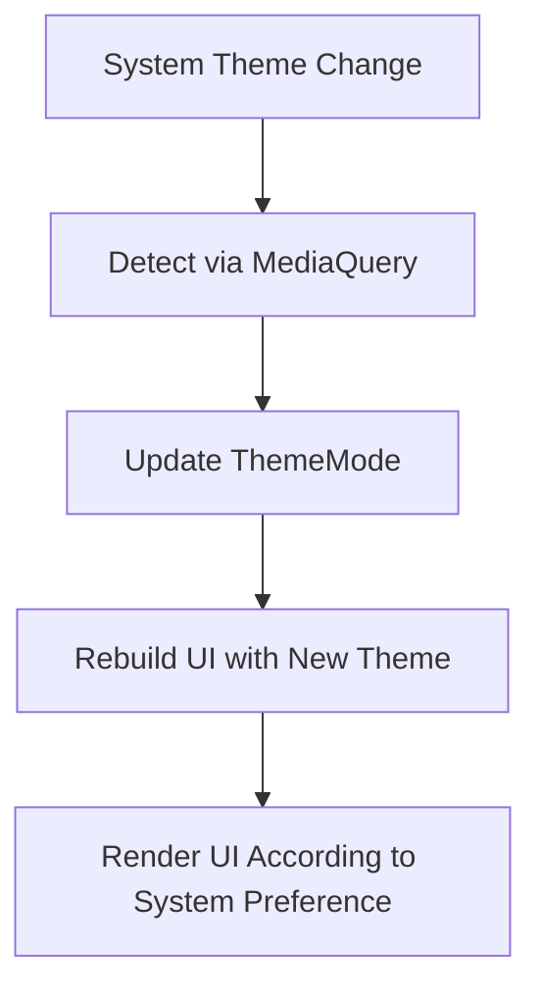

## 6.2.4 Responding to System Theme Changes

In today's mobile ecosystem, users expect applications to seamlessly adapt to their device's system-wide settings, including theme preferences such as light and dark modes. This capability not only enhances user experience but also aligns with accessibility standards and user expectations for modern applications. In this section, we will explore how to implement system theme changes in Flutter, ensuring your app responds dynamically to these settings.

### Understanding System Theme Settings

System theme settings allow users to select a preferred visual mode—light or dark—across their device. This choice can be based on personal preference, environmental lighting conditions, or battery-saving considerations. By respecting these settings, applications can provide a cohesive experience that integrates smoothly with the user's overall device usage.

#### Importance of Automatic Theme Adaptation

- **User Experience:** Automatically adapting to system theme changes ensures that your app feels native and integrated, providing a consistent look and feel with other applications on the device.
- **Accessibility:** Some users rely on dark mode for better readability and reduced eye strain, especially in low-light environments.
- **Battery Efficiency:** On OLED screens, dark themes can help conserve battery life by reducing the amount of light emitted by the screen.

### Implementing System Theme Adaptation

Flutter provides robust tools to detect and respond to system theme changes, allowing developers to create applications that automatically adjust their appearance based on system preferences.

#### Detecting System Theme Changes

To detect the current theme setting, Flutter offers the `MediaQuery` widget, which provides access to the `platformBrightness` property. This property indicates whether the system is currently using a light or dark theme.

```dart
var brightness = MediaQuery.of(context).platformBrightness;
bool isDarkMode = brightness == Brightness.dark;
```

#### Setting `themeMode` to Follow System Settings

Flutter's `MaterialApp` widget includes a `themeMode` property, which can be set to `ThemeMode.system`. This ensures that your app automatically follows the system's theme settings without additional logic.

```dart
MaterialApp(
  theme: ThemeData.light(),
  darkTheme: ThemeData.dark(),
  themeMode: ThemeMode.system,
)
```

### Code Examples

Let's explore some practical examples to see how these concepts are implemented in a Flutter application.

#### Example 1: Automatically Adapting to System Theme

In this example, we create a simple Flutter app that automatically switches between light and dark themes based on the system setting.

```dart
import 'package:flutter/material.dart';

void main() {
  runApp(MyApp());
}

class MyApp extends StatelessWidget {
  @override
  Widget build(BuildContext context) {
    return MaterialApp(
      title: 'System Theme Adaptation',
      theme: ThemeData.light(),
      darkTheme: ThemeData.dark(),
      themeMode: ThemeMode.system,
      home: HomeScreen(),
    );
  }
}

class HomeScreen extends StatelessWidget {
  @override
  Widget build(BuildContext context) {
    var brightness = MediaQuery.of(context).platformBrightness;
    bool isDarkMode = brightness == Brightness.dark;

    return Scaffold(
      appBar: AppBar(title: Text('System Theme Adaptation')),
      body: Center(
        child: Text(
          isDarkMode ? 'Dark Mode' : 'Light Mode',
          style: TextStyle(fontSize: 24),
        ),
      ),
    );
  }
}
```

In this code, the `themeMode` is set to `ThemeMode.system`, allowing the app to automatically adapt to the system's theme preference. The `HomeScreen` widget uses `MediaQuery` to determine the current brightness and display a corresponding message.

#### Example 2: Listening to Theme Changes with WidgetsBindingObserver

For more advanced use cases, such as when you need to perform additional actions upon theme changes, you can use the `WidgetsBindingObserver` to listen for changes in the platform's brightness.

```dart
import 'package:flutter/material.dart';

void main() {
  runApp(MyApp());
}

class MyApp extends StatefulWidget {
  @override
  _MyAppState createState() => _MyAppState();
}

class _MyAppState extends State<MyApp> with WidgetsBindingObserver {
  Brightness? _brightness;

  @override
  void initState() {
    super.initState();
    WidgetsBinding.instance!.addObserver(this);
    _brightness = WidgetsBinding.instance!.window.platformBrightness;
  }

  @override
  void didChangePlatformBrightness() {
    setState(() {
      _brightness = WidgetsBinding.instance!.window.platformBrightness;
    });
  }

  @override
  void dispose() {
    WidgetsBinding.instance!.removeObserver(this);
    super.dispose();
  }

  @override
  Widget build(BuildContext context) {
    bool isDarkMode = _brightness == Brightness.dark;

    return MaterialApp(
      title: 'WidgetBindingObserver Example',
      theme: ThemeData.light(),
      darkTheme: ThemeData.dark(),
      themeMode: ThemeMode.system,
      home: Scaffold(
        appBar: AppBar(title: Text('Respond to System Themes')),
        body: Center(
          child: Text(
            isDarkMode ? 'System Dark Mode' : 'System Light Mode',
            style: TextStyle(fontSize: 24),
          ),
        ),
      ),
    );
  }
}
```

In this example, the `WidgetsBindingObserver` is used to listen for changes in the platform's brightness. When a change is detected, the `didChangePlatformBrightness` method is called, and the state is updated accordingly.

### Mermaid.js Diagrams

To better understand the flow of responding to system theme changes, consider the following diagram:



This diagram illustrates the process of detecting a system theme change, updating the theme mode, and rebuilding the UI to reflect the new theme.

### Best Practices

When implementing system theme adaptation in your Flutter applications, consider the following best practices:

- **Consistent Behavior:** Ensure that all parts of your app respond uniformly to system theme changes. This includes custom widgets, dialogs, and any third-party components.
- **Fallback Mechanisms:** Provide default theme settings in case system preferences cannot be detected. This ensures that your app remains functional even in environments where system theme detection is not possible.
- **User Overrides:** Allow users to manually override system theme settings within the app if desired. This can be achieved by providing a theme toggle in the app's settings.

### Conclusion

By responding to system theme changes, you can create Flutter applications that offer a seamless and integrated user experience. This not only enhances the aesthetic appeal of your app but also aligns with user expectations for modern, responsive applications. By following the examples and best practices outlined in this section, you can ensure that your app adapts gracefully to user preferences, providing a consistent and enjoyable experience across all devices.

### Further Reading and Resources

For more information on theming in Flutter, consider exploring the following resources:

- [Flutter Documentation on Theming](https://flutter.dev/docs/cookbook/design/themes)
- [Material Design Guidelines](https://material.io/design/color/dark-theme.html)
- [Dart API Documentation](https://api.flutter.dev/)

These resources provide additional insights and examples to help you master theming in Flutter and create applications that are both visually appealing and responsive to user preferences.

## Quiz Time!



### What is the primary benefit of adapting to system theme changes in a Flutter app?

- [x] Enhances user experience by providing a consistent look and feel
- [ ] Reduces app size significantly
- [ ] Increases app performance
- [ ] Simplifies code complexity

> **Explanation:** Adapting to system theme changes enhances user experience by ensuring the app's appearance is consistent with the user's device settings.

### How can you detect the current system theme in Flutter?

- [x] Using `MediaQuery.of(context).platformBrightness`
- [ ] Using `Theme.of(context).brightness`
- [ ] Using `WidgetsBinding.instance!.window.platformBrightness`
- [ ] Using `ThemeData.system`

> **Explanation:** `MediaQuery.of(context).platformBrightness` is used to detect the current system theme setting in Flutter.

### What property of `MaterialApp` allows it to follow system theme settings automatically?

- [x] `themeMode`
- [ ] `theme`
- [ ] `darkTheme`
- [ ] `brightness`

> **Explanation:** The `themeMode` property of `MaterialApp` can be set to `ThemeMode.system` to automatically follow system theme settings.

### Which Flutter widget provides access to the current system brightness?

- [x] `MediaQuery`
- [ ] `Theme`
- [ ] `WidgetsBinding`
- [ ] `Scaffold`

> **Explanation:** `MediaQuery` provides access to the current system brightness through its `platformBrightness` property.

### What is the role of `WidgetsBindingObserver` in theme adaptation?

- [x] It listens for changes in system settings, such as theme changes
- [ ] It manages state across widgets
- [ ] It provides access to device sensors
- [ ] It handles network requests

> **Explanation:** `WidgetsBindingObserver` listens for changes in system settings, including theme changes, allowing the app to respond accordingly.

### Which method in `WidgetsBindingObserver` is called when the platform brightness changes?

- [x] `didChangePlatformBrightness`
- [ ] `didChangeAppLifecycleState`
- [ ] `didChangeMetrics`
- [ ] `didChangeAccessibilityFeatures`

> **Explanation:** The `didChangePlatformBrightness` method is called when the platform brightness changes, allowing the app to update its theme.

### Why is it important to provide a fallback theme in your app?

- [x] To ensure the app remains functional if system preferences cannot be detected
- [ ] To reduce app size
- [ ] To improve network performance
- [ ] To simplify the codebase

> **Explanation:** Providing a fallback theme ensures the app remains functional even if system preferences cannot be detected.

### What is a potential benefit of allowing users to override system theme settings in your app?

- [x] It provides users with more control over their app experience
- [ ] It reduces app development time
- [ ] It increases app performance
- [ ] It simplifies code complexity

> **Explanation:** Allowing users to override system theme settings provides them with more control over their app experience, enhancing user satisfaction.

### Which of the following is NOT a best practice for implementing system theme adaptation?

- [ ] Ensuring consistent behavior across the app
- [ ] Providing fallback mechanisms
- [ ] Allowing user overrides
- [x] Ignoring system theme settings

> **Explanation:** Ignoring system theme settings is not a best practice, as it can lead to a disjointed user experience.

### True or False: Setting `themeMode` to `ThemeMode.system` in `MaterialApp` automatically adapts the app's theme to match the system's theme settings.

- [x] True
- [ ] False

> **Explanation:** Setting `themeMode` to `ThemeMode.system` in `MaterialApp` automatically adapts the app's theme to match the system's theme settings.


