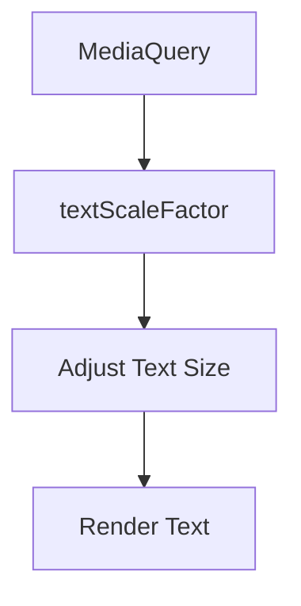

## 6.3.1 Scaling Text with MediaQuery

In the realm of modern mobile application development, ensuring that your app's typography is responsive and adaptive is crucial for delivering a seamless user experience. As devices come in various sizes and users have different preferences, scaling text dynamically can significantly enhance readability and accessibility. In Flutter, `MediaQuery` provides a powerful toolset to achieve this adaptability. This section delves into the importance of responsive typography, how to implement text scaling using `MediaQuery`, and best practices to maintain design consistency and legibility.

### Importance of Responsive Typography

Responsive typography is not just about making text look good; it's about ensuring that text is readable and accessible across a myriad of devices and user settings. Here are some key reasons why responsive typography is essential:

- **Enhanced Readability:** By adjusting text size according to the device's screen size and user preferences, you ensure that your content is easily readable, reducing eye strain and improving user engagement.
- **Accessibility:** Users may have different visual abilities, and some may prefer larger text sizes. Responsive typography accommodates these needs, making your app more inclusive.
- **Consistency Across Devices:** With the vast array of devices available, from small smartphones to large tablets, maintaining a consistent text appearance is vital for a cohesive user experience.
- **User Preference Adaptation:** Leveraging system settings like text scaling allows your app to respect user preferences, providing a personalized experience.

### Implementing Text Scaling

Flutter's `MediaQuery` is a powerful class that provides information about the size and orientation of the current device screen, as well as user preferences such as text scaling. By using `MediaQuery.of(context).textScaleFactor`, you can dynamically adjust text sizes in your app.

#### Accessing and Utilizing `MediaQuery`

To implement text scaling, you first need to access the `MediaQuery` data within your widget's build method. Here's a step-by-step guide:

1. **Access MediaQuery Data:**
   Use `MediaQuery.of(context)` to retrieve the current media query data, which includes the `textScaleFactor`.

2. **Adjust Text Size:**
   Multiply your base font size by the `textScaleFactor` to adjust the text size dynamically.

3. **Maintain Design Consistency:**
   Ensure that all text elements scale uniformly to maintain a harmonious design.

#### Code Examples

Let's explore some practical examples to illustrate how you can implement text scaling in your Flutter applications.

**Example 1: Scaling Text Dynamically**

In this example, we scale the text size dynamically based on the `textScaleFactor`:

```dart
Widget build(BuildContext context) {
  double textScale = MediaQuery.of(context).textScaleFactor;

  return Scaffold(
    appBar: AppBar(title: Text('Responsive Typography')),
    body: Center(
      child: Text(
        'Scaled Text Example',
        style: TextStyle(fontSize: 16 * textScale),
      ),
    ),
  );
}
```

**Explanation:**
- We retrieve the `textScaleFactor` from `MediaQuery`.
- The base font size of 16 is multiplied by the `textScaleFactor` to adjust the text size dynamically.

**Example 2: Conditional Font Size Based on TextScaleFactor**

This example demonstrates how to apply conditional logic to adjust font sizes:

```dart
Widget build(BuildContext context) {
  double textScale = MediaQuery.of(context).textScaleFactor;

  return Scaffold(
    appBar: AppBar(title: Text('Conditional Font Size')),
    body: Padding(
      padding: EdgeInsets.all(16.0),
      child: Text(
        'This text adjusts its size based on the text scale factor.',
        style: TextStyle(
          fontSize: textScale > 1.2 ? 20 : 16,
        ),
      ),
    ),
  );
}
```

**Explanation:**
- We check if the `textScaleFactor` is greater than 1.2.
- If true, we set the font size to 20; otherwise, it remains 16.

### Diagram Showing Text Scaling Process

To better understand the text scaling process, let's visualize it using a Mermaid.js diagram:



**Explanation:**
- The process begins with accessing `MediaQuery` to retrieve the `textScaleFactor`.
- The `textScaleFactor` is then used to adjust the text size.
- Finally, the adjusted text size is rendered on the screen.

### Best Practices

When implementing responsive typography, consider the following best practices to ensure a seamless user experience:

- **Maintain Readability:** Avoid setting font sizes too small, even when scaling down. Ensure that text remains legible at all scaling levels.
- **Consistent Scaling:** Apply uniform scaling factors across different text elements to maintain a harmonious design. This consistency helps in creating a visually appealing interface.
- **Responsive Design Tools:** Utilize Flutter’s built-in text scaling tools and properties to facilitate dynamic adjustments. This includes leveraging `MediaQuery` and other responsive design patterns.
- **Test Across Devices:** Regularly test your app on various devices and screen sizes to ensure that your typography remains consistent and readable.

### Conclusion

Responsive typography is a critical component of modern app design, ensuring that your application is accessible and user-friendly across a wide range of devices and user preferences. By leveraging `MediaQuery` in Flutter, you can dynamically adjust text sizes to enhance readability and accessibility. Remember to maintain consistency and readability across your app's typography, and always consider user preferences and device capabilities.

### Further Reading and Resources

- [Flutter Documentation on MediaQuery](https://api.flutter.dev/flutter/widgets/MediaQuery-class.html)
- [Responsive Design in Flutter](https://flutter.dev/docs/development/ui/layout/responsive)
- [Accessibility in Flutter](https://flutter.dev/docs/development/accessibility-and-localization/accessibility)

By understanding and implementing responsive typography, you can significantly improve the user experience of your Flutter applications, making them more adaptable and inclusive.

## Quiz Time!



### What is the primary purpose of responsive typography in mobile applications?

- [x] To enhance readability and accessibility across different devices and user preferences.
- [ ] To increase the visual appeal of the application.
- [ ] To reduce the amount of text displayed on smaller screens.
- [ ] To ensure text is always displayed in bold.

> **Explanation:** Responsive typography ensures that text is readable and accessible across various devices and user settings, enhancing the overall user experience.

### How does `MediaQuery` help in scaling text in Flutter?

- [x] By providing the `textScaleFactor` which can be used to adjust text sizes dynamically.
- [ ] By automatically resizing text based on screen size.
- [ ] By changing the color of the text based on device orientation.
- [ ] By providing pre-defined font sizes for different devices.

> **Explanation:** `MediaQuery` provides the `textScaleFactor`, which developers can use to adjust text sizes dynamically based on user preferences and device metrics.

### In the provided code example, what does `MediaQuery.of(context).textScaleFactor` return?

- [x] A factor that indicates the user's preferred text scale.
- [ ] The current screen width.
- [ ] The device's pixel density.
- [ ] The default font size for the device.

> **Explanation:** `MediaQuery.of(context).textScaleFactor` returns a factor that reflects the user's preferred text scaling, which can be used to adjust text sizes.

### Why is it important to maintain consistent scaling across different text elements?

- [x] To maintain a harmonious and visually appealing design.
- [ ] To ensure all text elements are the same size.
- [ ] To reduce the complexity of the code.
- [ ] To make the application load faster.

> **Explanation:** Consistent scaling ensures a harmonious design, which is visually appealing and improves the user experience.

### What is a potential pitfall of not using responsive typography?

- [x] Text may become unreadable on certain devices or user settings.
- [ ] The application may crash on smaller screens.
- [ ] The text will always appear in the default system font.
- [ ] Users will not be able to change the text color.

> **Explanation:** Without responsive typography, text may become unreadable on certain devices or user settings, negatively impacting accessibility and user experience.

### What is the role of `textScaleFactor` in responsive typography?

- [x] It determines how much to scale the text based on user preferences.
- [ ] It sets the default font size for the application.
- [ ] It changes the font style of the text.
- [ ] It adjusts the text color based on the theme.

> **Explanation:** `textScaleFactor` determines how much to scale the text, allowing for adjustments based on user preferences and device settings.

### Which of the following is a best practice when implementing responsive typography?

- [x] Ensure text remains legible at all scaling levels.
- [ ] Use different fonts for different devices.
- [ ] Avoid using `MediaQuery` for text scaling.
- [ ] Set all text sizes to a fixed value.

> **Explanation:** Ensuring text remains legible at all scaling levels is a best practice to maintain readability and accessibility.

### What should you do to ensure your app's typography is consistent across devices?

- [x] Test your app on various devices and screen sizes.
- [ ] Use only one font size throughout the app.
- [ ] Avoid using `MediaQuery` for text adjustments.
- [ ] Set the text color to black for all devices.

> **Explanation:** Testing your app on various devices ensures that typography remains consistent and readable across different screen sizes and resolutions.

### How can you respect user preferences for text size in your Flutter app?

- [x] By using `MediaQuery.of(context).textScaleFactor` to adjust text sizes.
- [ ] By setting a fixed font size for all text elements.
- [ ] By using only system default fonts.
- [ ] By disabling text scaling in the app settings.

> **Explanation:** Using `MediaQuery.of(context).textScaleFactor` allows you to adjust text sizes according to user preferences, respecting their settings.

### True or False: Responsive typography only benefits users with visual impairments.

- [ ] True
- [x] False

> **Explanation:** Responsive typography benefits all users by enhancing readability and accessibility, not just those with visual impairments.


