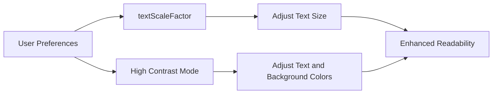

## 6.3.2 Accessibility Considerations in Responsive Typography

In today's digital age, ensuring accessibility in mobile applications is not just a legal requirement but a moral imperative. Accessibility in typography plays a crucial role in making apps usable for everyone, including individuals with visual impairments. This section delves into the importance of accessibility in typography, practical techniques for implementing accessible text, and best practices to ensure your Flutter applications are inclusive and user-friendly.

### Importance of Accessibility in Typography

Accessibility ensures that all users, regardless of their abilities, can effectively interact with your app. Typography is a fundamental aspect of user interface design that significantly impacts readability and user experience. Responsive typography, which adapts to user preferences and device capabilities, is essential for accessibility. Here's why:

- **Inclusivity:** By accommodating users with visual impairments, such as low vision or color blindness, you ensure that your app is accessible to a broader audience.
- **User Preferences:** Responsive typography allows users to adjust text size according to their needs, enhancing readability and comfort.
- **Legal Compliance:** Many regions have accessibility laws and guidelines, such as the Americans with Disabilities Act (ADA) and the Web Content Accessibility Guidelines (WCAG), which mandate accessible digital content.

### Implementing Accessible Text

To create accessible text in your Flutter applications, consider the following techniques:

- **Support Larger Text Sizes:** Implement dynamic type to allow text to scale based on user settings. This ensures that users who prefer larger text can read content comfortably.
- **Ensure Contrast Ratios:** Maintain sufficient contrast between text and background colors to enhance readability, especially for users with color vision deficiencies.
- **Use Semantic Text Widgets:** Employ widgets like `Text` with semantic labels to support screen readers and assistive technologies.

#### Features to Support Accessibility

1. **Dynamic Type:**
   - Automatically adjust font sizes based on user settings. This can be achieved using the `textScaleFactor` property in Flutter, which scales text according to the user's preferred font size settings.

2. **Contrast Ratios:**
   - Ensure that text and background colors have a sufficient contrast ratio. The WCAG recommends a minimum contrast ratio of 4.5:1 for normal text and 3:1 for large text.

### Code Examples

Let's explore some practical code examples to illustrate these concepts:

#### Example 1: Ensuring Text Contrast

This example demonstrates how to adjust text color based on the app's theme to ensure proper contrast.

```dart
Widget build(BuildContext context) {
  bool isDarkMode = Theme.of(context).brightness == Brightness.dark;
  return Scaffold(
    appBar: AppBar(title: Text('Accessibility Text')),
    body: Center(
      child: Text(
        'Accessible Text with Proper Contrast',
        style: TextStyle(
          fontSize: 18,
          color: isDarkMode ? Colors.white : Colors.black,
        ),
      ),
    ),
  );
}
```

In this code snippet, the text color changes based on whether the app is in dark mode or light mode, ensuring that the text is always readable.

#### Example 2: Supporting Dynamic Type with TextScaleFactor

This example shows how to use the `textScaleFactor` to adjust text size dynamically.

```dart
Widget build(BuildContext context) {
  double textScale = MediaQuery.of(context).textScaleFactor;
  return Scaffold(
    appBar: AppBar(title: Text('Dynamic Type Support')),
    body: Padding(
      padding: EdgeInsets.all(16.0),
      child: Text(
        'This text scales with user preferences.',
        style: TextStyle(fontSize: 16 * textScale),
      ),
    ),
  );
}
```

Here, the text size is multiplied by the `textScaleFactor`, allowing it to scale according to the user's settings.

### Mermaid.js Diagrams

To visualize the process of enhancing accessibility through typography, consider the following diagram:



This diagram illustrates how user preferences influence text scaling and contrast adjustments, ultimately leading to enhanced readability.

### Best Practices

To ensure your app's typography is accessible, follow these best practices:

- **Semantic Labels:** Use meaningful labels and descriptions to support screen readers. This helps visually impaired users understand the content and context of text elements.
- **Avoid Text Clipping:** Ensure that text does not overflow or get clipped when scaled. Use layout widgets like `Flexible` or `Expanded` to accommodate larger text sizes.
- **Consistent Application:** Apply accessibility enhancements consistently across all text elements in the app. This includes maintaining uniform contrast ratios and text scaling.

### Conclusion

By prioritizing accessibility in typography, you create a more inclusive and user-friendly experience for all users. Implementing dynamic type, ensuring proper contrast ratios, and using semantic text widgets are essential steps in achieving this goal. As you continue to develop your Flutter applications, remember that accessibility is not just a feature—it's a fundamental aspect of good design.

### Further Resources

To deepen your understanding of accessibility in Flutter, consider exploring the following resources:

- [Flutter Accessibility Documentation](https://flutter.dev/docs/development/accessibility)
- [Web Content Accessibility Guidelines (WCAG)](https://www.w3.org/WAI/standards-guidelines/wcag/)
- [Material Design Accessibility](https://material.io/design/usability/accessibility.html)

By integrating these practices into your development workflow, you'll be well-equipped to create accessible and responsive applications that cater to a diverse audience.

## Quiz Time!



### What is the primary goal of accessibility in typography?

- [x] To ensure all users, including those with visual impairments, can effectively interact with the app.
- [ ] To make the app look more modern and stylish.
- [ ] To reduce the app's load time.
- [ ] To increase the app's market value.

> **Explanation:** Accessibility in typography aims to make text readable and understandable for all users, including those with visual impairments, ensuring inclusivity.

### Which property in Flutter helps adjust text size based on user preferences?

- [ ] fontSize
- [x] textScaleFactor
- [ ] fontWeight
- [ ] letterSpacing

> **Explanation:** The `textScaleFactor` property in Flutter adjusts text size according to the user's preferred font size settings.

### What is the recommended minimum contrast ratio for normal text according to WCAG?

- [ ] 2:1
- [ ] 3:1
- [x] 4.5:1
- [ ] 5:1

> **Explanation:** The WCAG recommends a minimum contrast ratio of 4.5:1 for normal text to ensure readability.

### How can you ensure text does not overflow when scaled?

- [ ] Use a smaller font size.
- [x] Use layout widgets like Flexible or Expanded.
- [ ] Decrease the textScaleFactor.
- [ ] Increase the letterSpacing.

> **Explanation:** Using layout widgets like `Flexible` or `Expanded` helps accommodate larger text sizes, preventing overflow.

### Which of the following is a best practice for supporting screen readers?

- [ ] Use random labels for text elements.
- [x] Use meaningful labels and descriptions.
- [ ] Avoid using labels altogether.
- [ ] Use the same label for all elements.

> **Explanation:** Meaningful labels and descriptions help screen readers convey the correct information to users with visual impairments.

### What is the effect of using the `textScaleFactor` property?

- [ ] It changes the font style.
- [ ] It adjusts the text color.
- [x] It scales the text size based on user preferences.
- [ ] It changes the text alignment.

> **Explanation:** The `textScaleFactor` property scales text size according to user preferences, enhancing readability.

### Why is it important to ensure sufficient contrast between text and background?

- [ ] To make the app look more colorful.
- [ ] To reduce battery consumption.
- [x] To enhance readability, especially for users with color vision deficiencies.
- [ ] To increase the app's performance.

> **Explanation:** Sufficient contrast between text and background enhances readability, making content accessible to users with color vision deficiencies.

### What is the purpose of semantic text widgets?

- [ ] To improve app performance.
- [x] To support screen readers and assistive technologies.
- [ ] To reduce app size.
- [ ] To enhance visual appeal.

> **Explanation:** Semantic text widgets provide meaningful information to screen readers, aiding users with visual impairments.

### How can you ensure consistent application of accessibility enhancements?

- [ ] Apply enhancements only to the main screen.
- [ ] Use different enhancements for each screen.
- [x] Apply enhancements consistently across all text elements.
- [ ] Avoid using enhancements altogether.

> **Explanation:** Consistent application of accessibility enhancements across all text elements ensures a uniform user experience.

### True or False: Accessibility is an optional feature in app design.

- [ ] True
- [x] False

> **Explanation:** Accessibility is a fundamental aspect of app design, ensuring inclusivity and usability for all users.


