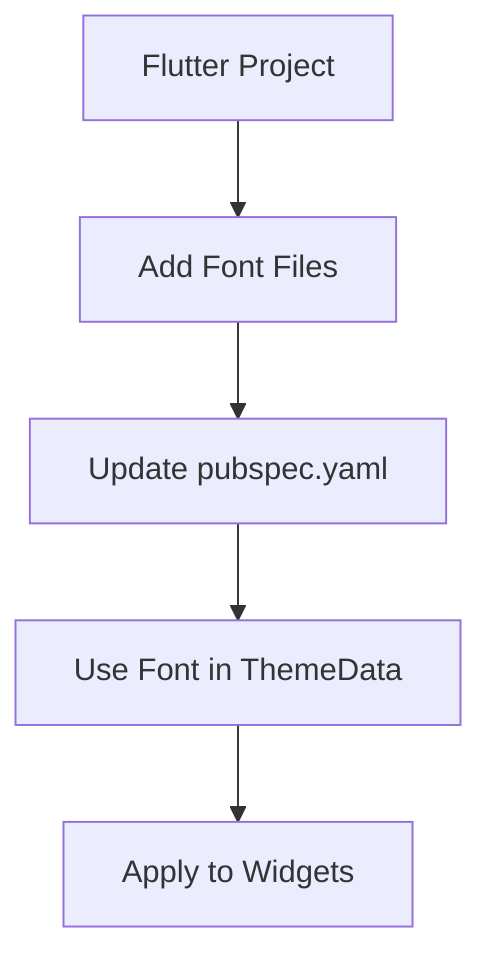

## 6.3.3 Using Google Fonts and Custom Fonts

Typography plays a crucial role in the design and user experience of mobile applications. It not only affects readability but also contributes significantly to the overall aesthetic and branding of an app. In Flutter, the ability to customize fonts allows developers to create visually appealing and brand-consistent interfaces. This section will guide you through the process of integrating Google Fonts and custom fonts into your Flutter projects, providing practical examples and best practices to ensure optimal performance and accessibility.

### Introduction to Custom Fonts

Custom fonts offer several benefits that can enhance your application's design:

- **Brand Alignment:** Custom fonts can help align your app's typography with your brand's identity, ensuring consistency across different platforms and media.
- **Visual Appeal:** A well-chosen font can significantly enhance the visual appeal of your app, making it more engaging and pleasant for users.
- **Differentiation:** Using unique fonts can help your app stand out in a crowded marketplace, providing a distinct look and feel.

Google Fonts is a popular resource for free, open-source fonts that can be easily integrated into Flutter projects. It offers a wide variety of typefaces suitable for different design needs, from minimalist sans-serifs to decorative display fonts.

### Integrating Google Fonts

To integrate Google Fonts into your Flutter project, you can use the `google_fonts` package, which simplifies the process of applying Google Fonts to your app's text styles.

#### Step-by-Step Guide to Adding Google Fonts

1. **Add the `google_fonts` Package:**
   First, include the `google_fonts` package in your `pubspec.yaml` file:

   ```yaml
   dependencies:
     flutter:
       sdk: flutter
     google_fonts: ^2.1.0
   ```

   Run `flutter pub get` to install the package.

2. **Apply Google Fonts Globally:**
   You can apply a Google Font to your entire app by setting it in the `ThemeData` of your `MaterialApp`. Here's how you can use the Lato font:

   ```dart
   import 'package:flutter/material.dart';
   import 'package:google_fonts/google_fonts.dart';

   void main() {
     runApp(MyApp());
   }

   class MyApp extends StatelessWidget {
     @override
     Widget build(BuildContext context) {
       return MaterialApp(
         title: 'Google Fonts Example',
         theme: ThemeData(
           textTheme: GoogleFonts.latoTextTheme(
             Theme.of(context).textTheme,
           ),
         ),
         home: HomeScreen(),
       );
     }
   }

   class HomeScreen extends StatelessWidget {
     @override
     Widget build(BuildContext context) {
       return Scaffold(
         appBar: AppBar(title: Text('Google Fonts')),
         body: Center(
           child: Text(
             'This is Lato font',
             style: TextStyle(fontSize: 24),
           ),
         ),
       );
     }
   }
   ```

3. **Apply Google Fonts to Specific Widgets:**
   If you prefer to apply a Google Font to specific widgets, you can do so using the `GoogleFonts` class directly:

   ```dart
   Text(
     'This is Roboto font',
     style: GoogleFonts.roboto(fontSize: 24),
   )
   ```

### Using Custom Fonts

In addition to Google Fonts, you might want to use custom fonts that are not available in the Google Fonts library. This involves adding font files to your project and referencing them in your app.

#### Including Custom Font Files

1. **Add Font Files to Assets:**
   Place your custom font files in the `assets/fonts/` directory of your Flutter project. Ensure that the directory structure is correctly set up.

2. **Update `pubspec.yaml`:**
   Reference the font files in your `pubspec.yaml` under the `fonts` section:

   ```yaml
   flutter:
     fonts:
       - family: CustomFont
         fonts:
           - asset: assets/fonts/CustomFont-Regular.ttf
           - asset: assets/fonts/CustomFont-Bold.ttf
             weight: 700
   ```

3. **Apply Custom Fonts in Your App:**
   Set the custom font as the default font in your app's `ThemeData`:

   ```dart
   Widget build(BuildContext context) {
     return MaterialApp(
       title: 'Custom Fonts Example',
       theme: ThemeData(
         fontFamily: 'CustomFont',
       ),
       home: Scaffold(
         appBar: AppBar(title: Text('Custom Fonts')),
         body: Center(
           child: Text(
             'This is CustomFont',
             style: TextStyle(fontSize: 24, fontWeight: FontWeight.bold),
           ),
         ),
       ),
     );
   }
   ```

#### Choosing and Licensing Custom Fonts

When selecting custom fonts, consider the following guidelines:

- **Legibility:** Ensure that the font is easy to read across different devices and screen sizes.
- **Licensing:** Verify the licensing terms of the font to ensure compliance with usage rights. Many fonts require a license for commercial use.
- **Consistency:** Use fonts consistently throughout your app to maintain a cohesive look and feel.

### Mermaid.js Diagrams

To visualize the process of integrating custom fonts, consider the following diagram:



### Best Practices

- **Performance Optimization:** Use font subsets to minimize the size of your app's assets, which can improve loading times. Subsetting involves including only the characters you need in your font files.
- **Consistent Usage:** Maintain consistency in font usage across your app to reinforce branding and enhance user experience. Avoid using too many different fonts, which can make your app look cluttered.
- **Accessibility:** Choose fonts that are legible and accessible to all users, avoiding overly decorative typefaces that may hinder readability.

### Conclusion

Integrating Google Fonts and custom fonts into your Flutter app can significantly enhance its visual appeal and align it with your brand's identity. By following the steps outlined in this section, you can easily incorporate a wide variety of typefaces into your projects, ensuring that your app stands out while maintaining optimal performance and accessibility.

For further exploration, consider the following resources:

- [Google Fonts](https://fonts.google.com/)
- [Flutter Documentation on Custom Fonts](https://flutter.dev/docs/cookbook/design/fonts)
- [Typography in UI Design](https://www.smashingmagazine.com/2019/02/typography-ui-design/)

By mastering the use of custom fonts, you can create a more engaging and visually appealing user experience in your Flutter applications.

## Quiz Time!



### What is one of the main benefits of using custom fonts in a Flutter app?

- [x] Aligning the app's typography with the brand's identity
- [ ] Increasing the app's loading time
- [ ] Making the app look more like other apps
- [ ] Reducing the app's file size

> **Explanation:** Custom fonts help align the app's typography with the brand's identity, enhancing visual appeal and consistency.

### Which package is used to easily integrate Google Fonts into a Flutter project?

- [ ] font_awesome
- [x] google_fonts
- [ ] flutter_fonts
- [ ] custom_fonts

> **Explanation:** The `google_fonts` package is specifically designed to integrate Google Fonts into Flutter projects.

### How do you apply a Google Font globally in a Flutter app?

- [ ] By setting it in the `Text` widget directly
- [ ] By using the `fontFamily` property in `TextStyle`
- [x] By setting it in the `ThemeData` of the `MaterialApp`
- [ ] By importing it in every widget

> **Explanation:** Applying a Google Font globally is done by setting it in the `ThemeData` of the `MaterialApp`.

### What is the first step in using custom fonts in a Flutter project?

- [ ] Applying the font in the `Text` widget
- [ ] Updating the `pubspec.yaml` file
- [x] Adding the font files to the assets directory
- [ ] Setting the font in `ThemeData`

> **Explanation:** The first step is to add the font files to the assets directory of the Flutter project.

### What should you consider when choosing custom fonts for your app?

- [x] Legibility and licensing
- [ ] The number of characters in the font
- [ ] The color of the font
- [ ] The size of the font files

> **Explanation:** Legibility and licensing are crucial considerations when choosing custom fonts to ensure readability and compliance with usage rights.

### How can you optimize performance when using custom fonts?

- [ ] By using only decorative fonts
- [x] By using font subsets
- [ ] By using as many fonts as possible
- [ ] By avoiding the use of `ThemeData`

> **Explanation:** Using font subsets helps reduce the app's asset size, improving loading times and performance.

### Why is consistent font usage important in an app?

- [ ] It makes the app more colorful
- [x] It reinforces branding and enhances user experience
- [ ] It allows for more creative design
- [ ] It reduces the need for custom fonts

> **Explanation:** Consistent font usage reinforces branding and enhances user experience by providing a cohesive look and feel.

### What is a potential pitfall of using overly decorative typefaces?

- [ ] They are more expensive
- [ ] They are easier to read
- [x] They may hinder readability
- [ ] They load faster

> **Explanation:** Overly decorative typefaces can hinder readability, making it difficult for users to read the text.

### How do you reference custom fonts in the `pubspec.yaml` file?

- [ ] By listing them under `dependencies`
- [ ] By adding them to the `flutter` section
- [x] By specifying them under the `fonts` section
- [ ] By including them in the `assets` section

> **Explanation:** Custom fonts are referenced in the `pubspec.yaml` file under the `fonts` section.

### True or False: Google Fonts can only be applied to specific widgets, not globally.

- [ ] True
- [x] False

> **Explanation:** Google Fonts can be applied both globally using `ThemeData` and to specific widgets using the `GoogleFonts` class.


