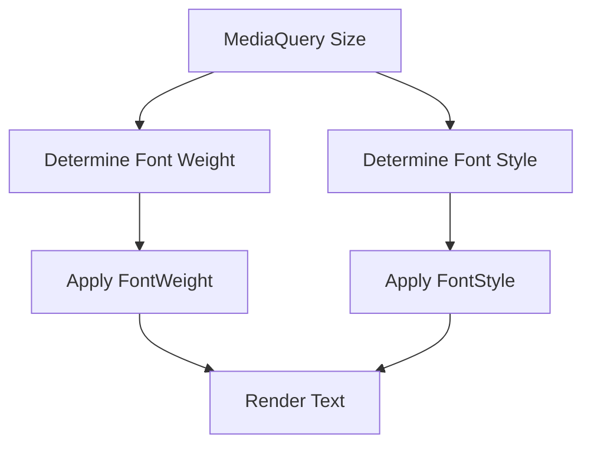

## 6.3.4 Font Weight and Style Adaptation

Typography is a crucial aspect of user interface design, significantly influencing readability, user engagement, and the overall aesthetic of an application. In the context of responsive and adaptive design, adapting font weight and style is essential to ensure that text remains legible and visually appealing across various devices and screen sizes. This section delves into the importance of font weight and style adaptation, provides practical implementation strategies, and offers code examples to illustrate these concepts in Flutter.

### Importance of Font Weight and Style

Font weight and style play a pivotal role in establishing a visual hierarchy, guiding users' attention, and enhancing the readability of text elements. By varying font weights (such as light, regular, bold) and styles (such as italic, normal), designers can:

- **Enhance Visual Hierarchy:** Different font weights and styles can be used to differentiate headings, subheadings, and body text, creating a clear structure that helps users navigate content easily.
- **Improve Readability:** Adjusting font styles based on context and screen size ensures that text remains readable, especially on smaller screens or in low-light conditions.
- **Support Adaptive Design:** By adapting typography dynamically, applications can provide a consistent user experience across different platforms and devices, accommodating user preferences and accessibility needs.

### Implementing Font Weight and Style Adaptations

In Flutter, adapting font weight and style can be achieved using conditional logic, theme extensions, and responsive design principles. Here are some guidelines and strategies for implementing these adaptations:

- **Adjusting Based on Screen Size:** Use `MediaQuery` to determine the screen size and apply different font weights or styles accordingly. This approach ensures that text remains legible and appropriately styled on both small and large screens.
- **User Preferences and Accessibility:** Consider user preferences, such as increased font size for accessibility, and adapt font styles to enhance readability for users with visual impairments.
- **Design Consistency:** Maintain a consistent use of typography throughout the application to reinforce design patterns and improve user familiarity.

#### Code Examples

Below are code examples demonstrating how to adapt font weight and style in Flutter based on screen size and other conditions.

**Example 1: Adapting Font Weight Based on Screen Size**

```dart
Widget build(BuildContext context) {
  double screenWidth = MediaQuery.of(context).size.width;
  FontWeight fontWeight = screenWidth > 600 ? FontWeight.bold : FontWeight.normal;

  return Scaffold(
    appBar: AppBar(title: Text('Font Weight Adaptation')),
    body: Center(
      child: Text(
        'Adaptive Font Weight',
        style: TextStyle(fontSize: 20, fontWeight: fontWeight),
      ),
    ),
  );
}
```

In this example, the font weight is adjusted based on the screen width. If the screen width exceeds 600 pixels, the text is displayed in bold; otherwise, it uses a normal weight. This approach helps in maintaining a clear visual hierarchy on larger screens.

**Example 2: Applying Different Font Styles Conditionally**

```dart
Widget build(BuildContext context) {
  bool isItalic = MediaQuery.of(context).size.width > 800;

  return Scaffold(
    appBar: AppBar(title: Text('Font Style Adaptation')),
    body: Center(
      child: Text(
        'Responsive Font Style',
        style: TextStyle(
          fontSize: 20,
          fontStyle: isItalic ? FontStyle.italic : FontStyle.normal,
        ),
      ),
    ),
  );
}
```

This example demonstrates how to apply a different font style based on screen width. If the screen width is greater than 800 pixels, the text is rendered in italic; otherwise, it remains in a normal style. This technique can be particularly useful for emphasizing text on larger displays.

### Mermaid.js Diagram: Font Weight and Style Adaptation Flow

To visualize the process of adapting font weight and style, consider the following flowchart:



This diagram illustrates the decision-making process involved in adapting font weight and style based on screen size. The `MediaQuery` provides the necessary information to determine the appropriate font attributes, which are then applied before rendering the text.

### Best Practices

When adapting font weight and style in responsive designs, consider the following best practices:

- **Hierarchy and Emphasis:** Use font weights and styles strategically to establish a clear hierarchy, emphasizing important text elements without overwhelming the user.
- **Readability:** Ensure that changes in font weight and style do not compromise readability, especially on smaller screens or low-resolution displays. Test your typography across different devices to verify its effectiveness.
- **Consistency:** Maintain consistent usage of font weights and styles throughout the app to reinforce design patterns and improve user familiarity. Consistency helps users understand the structure and flow of information more intuitively.

### Conclusion

Adapting font weight and style is a powerful tool in responsive and adaptive design, enabling developers to create visually appealing and accessible applications. By following the guidelines and examples provided, you can enhance the typography of your Flutter applications, ensuring that text elements are both functional and aesthetically pleasing across all devices.

### Further Exploration

For more information on typography in Flutter, consider exploring the following resources:

- [Flutter Typography Documentation](https://flutter.dev/docs/cookbook/design/fonts)
- [Material Design Typography](https://material.io/design/typography/the-type-system.html)
- [Responsive Design in Flutter](https://flutter.dev/docs/development/ui/layout/responsive)

These resources provide additional insights into best practices and advanced techniques for implementing responsive typography in Flutter applications.

## Quiz Time!



### What is the primary benefit of adapting font weight and style in responsive design?

- [x] Enhancing visual hierarchy and readability
- [ ] Reducing application size
- [ ] Increasing animation speed
- [ ] Improving network performance

> **Explanation:** Adapting font weight and style enhances visual hierarchy and readability, making text elements more accessible and engaging across different devices.

### Which Flutter widget is commonly used to determine screen size for responsive typography?

- [x] MediaQuery
- [ ] Container
- [ ] Column
- [ ] ListView

> **Explanation:** `MediaQuery` is used to access screen dimensions and other device information, which is crucial for implementing responsive typography.

### In the provided code examples, what condition is used to apply bold font weight?

- [x] Screen width greater than 600 pixels
- [ ] Screen width less than 400 pixels
- [ ] Device orientation is landscape
- [ ] User preference for dark mode

> **Explanation:** The code checks if the screen width is greater than 600 pixels to apply a bold font weight, ensuring better visibility on larger screens.

### What is a key consideration when changing font styles for readability?

- [x] Ensuring changes do not compromise readability
- [ ] Increasing font size to maximum
- [ ] Using only italic styles
- [ ] Avoiding any font weight changes

> **Explanation:** It's important to ensure that changes in font styles do not compromise readability, especially on smaller screens or low-resolution displays.

### How can you maintain consistency in font usage across an app?

- [x] By using consistent font weights and styles
- [ ] By using different fonts for each screen
- [ ] By avoiding any font styles
- [ ] By using random font weights

> **Explanation:** Consistent use of font weights and styles helps reinforce design patterns and improves user familiarity with the app's interface.

### Which of the following is NOT a benefit of adapting font weight and style?

- [ ] Enhancing visual hierarchy
- [ ] Improving readability
- [ ] Supporting adaptive design
- [x] Increasing app download speed

> **Explanation:** Adapting font weight and style does not directly affect app download speed; it primarily enhances visual hierarchy, readability, and supports adaptive design.

### What is the role of `FontWeight` in Flutter?

- [x] It specifies the thickness of the glyphs used to draw text.
- [ ] It determines the color of the text.
- [ ] It sets the background color of text.
- [ ] It adjusts the text alignment.

> **Explanation:** `FontWeight` in Flutter specifies the thickness of the glyphs used to draw text, allowing for variations such as bold or light.

### Which font style is applied when the screen width is greater than 800 pixels in the example?

- [x] Italic
- [ ] Bold
- [ ] Underline
- [ ] Strikethrough

> **Explanation:** The example applies an italic font style when the screen width is greater than 800 pixels, demonstrating conditional styling based on screen size.

### What is the purpose of the `TextStyle` widget in Flutter?

- [x] To define the visual properties of text
- [ ] To create a new screen
- [ ] To handle user input
- [ ] To manage state

> **Explanation:** The `TextStyle` widget in Flutter is used to define the visual properties of text, such as font size, weight, style, and color.

### True or False: Consistent typography helps improve user familiarity with an app's interface.

- [x] True
- [ ] False

> **Explanation:** Consistent typography helps reinforce design patterns, making the app's interface more intuitive and familiar to users.


