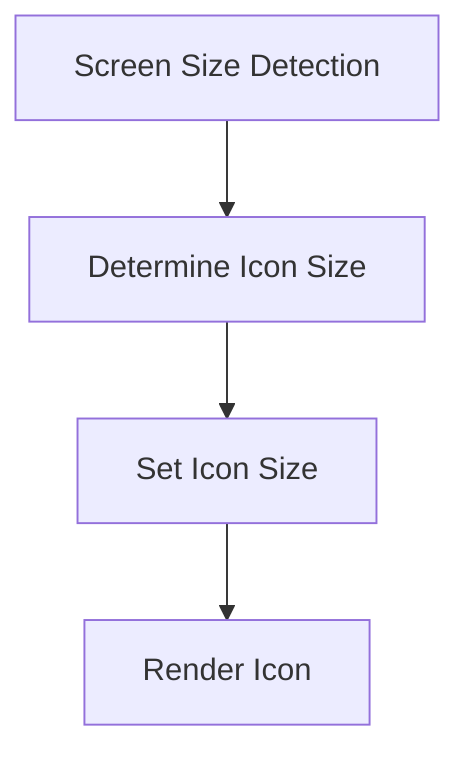

## 6.4.1 Scaling Icons

In the world of mobile app development, ensuring that your user interface looks crisp and professional across a multitude of devices is paramount. Icons, being a fundamental part of any UI, must be scalable to maintain their clarity and effectiveness. This section delves into the importance of scalable icons, how to implement icon scaling in Flutter, and best practices to follow for optimal results.

### Importance of Scalable Icons

Icons play a crucial role in user interfaces by providing visual cues that enhance navigation and usability. Here's why scalable icons are essential:

- **Crisp and Clear Appearance:** Scalable icons ensure that your UI elements remain sharp and clear, regardless of the screen size or resolution. This is particularly important as devices range from small smartphones to large tablets and desktops.
  
- **Vector-Based Icons:** Utilizing vector graphics, such as SVGs, allows icons to scale without losing quality. Unlike raster images, vector graphics are resolution-independent, meaning they can be resized to any dimension without pixelation.

- **Consistency Across Devices:** With a wide variety of devices in the market, maintaining a consistent look and feel is crucial. Scalable icons help achieve this consistency, providing a uniform experience for users on different platforms.

### Implementing Icon Scaling

Flutter provides several tools and techniques to implement icon scaling effectively. Let's explore how you can use these tools to ensure your icons adapt to different screen sizes.

#### Using Flutter’s `Icon` Widget

The `Icon` widget in Flutter is a versatile tool that allows you to easily incorporate scalable icons into your app. Key properties include:

- **`size`:** This property controls the size of the icon. By adjusting this value, you can scale the icon to fit different UI requirements.
  
- **`semanticLabel`:** This property is used to provide a textual description of the icon for accessibility purposes, ensuring that screen readers can convey the icon's purpose to visually impaired users.

#### Dynamic Icon Scaling with `MediaQuery` and `LayoutBuilder`

To dynamically adjust icon sizes based on screen dimensions, you can use `MediaQuery` and `LayoutBuilder`. These tools allow you to create responsive designs that adapt to the available screen space.

**Example 1: Scaling Icons Based on Screen Width**

In this example, we use `MediaQuery` to determine the screen width and adjust the icon size accordingly.

```dart
Widget build(BuildContext context) {
  double screenWidth = MediaQuery.of(context).size.width;
  double iconSize = screenWidth > 600 ? 48.0 : 24.0;

  return Scaffold(
    appBar: AppBar(title: Text('Icon Scaling Example')),
    body: Center(
      child: Icon(
        Icons.star,
        size: iconSize,
        color: Colors.amber,
      ),
    ),
  );
}
```

**Example 2: Using `LayoutBuilder` for Icon Size Adaptation**

`LayoutBuilder` provides the constraints of the parent widget, allowing you to adjust the icon size based on the available space.

```dart
Widget build(BuildContext context) {
  return Scaffold(
    appBar: AppBar(title: Text('LayoutBuilder Icon Scaling')),
    body: LayoutBuilder(
      builder: (context, constraints) {
        double iconSize = constraints.maxWidth > 800 ? 64.0 : 32.0;
        return Center(
          child: Icon(
            Icons.favorite,
            size: iconSize,
            color: Colors.red,
          ),
        );
      },
    ),
  );
}
```

### Mermaid.js Diagrams

To visualize the process of icon scaling, consider the following diagram:



This flowchart illustrates the mechanism of detecting screen size, determining the appropriate icon size, setting the icon size, and rendering it on the screen.

### Best Practices

When implementing scalable icons in your Flutter applications, consider the following best practices:

- **Use Vector Icons:** Always prefer vector-based icons over raster images. SVGs are a great choice for scalable icons as they maintain quality at any size.

- **Consistency in Icon Sizes:** Ensure that icons within the same UI component are of consistent size to maintain visual harmony and avoid a cluttered appearance.

- **Accessibility Considerations:** Icons should be appropriately sized for touch targets and visibility. This enhances usability, especially for users with accessibility needs.

- **Testing Across Devices:** Regularly test your application on different devices and screen sizes to ensure that icons scale correctly and maintain their intended appearance.

### Conclusion

Scaling icons effectively is a crucial aspect of building responsive and adaptive UIs in Flutter. By leveraging tools like `MediaQuery` and `LayoutBuilder`, you can ensure that your icons look great on any device. Remember to follow best practices for consistency and accessibility to provide the best user experience possible.

By understanding and implementing these techniques, you can create applications that are not only visually appealing but also highly functional across a wide range of devices.

## Quiz Time!



### Why are scalable icons important in UI design?

- [x] They ensure icons appear crisp and clear on various screen sizes.
- [ ] They make icons more colorful.
- [ ] They reduce the app's memory usage.
- [ ] They increase the app's loading speed.

> **Explanation:** Scalable icons maintain clarity and sharpness across different screen sizes and resolutions, which is crucial for a consistent and professional UI appearance.

### What is the advantage of using vector-based icons?

- [x] They can be resized without losing quality.
- [ ] They are easier to animate.
- [ ] They load faster than raster images.
- [ ] They use less memory than raster images.

> **Explanation:** Vector-based icons, such as SVGs, are resolution-independent and can be resized to any dimension without pixelation, unlike raster images.

### Which Flutter widget property is used to control the size of an icon?

- [x] `size`
- [ ] `color`
- [ ] `semanticLabel`
- [ ] `iconData`

> **Explanation:** The `size` property of the `Icon` widget is used to control the icon's size.

### How can you dynamically adjust icon sizes in Flutter?

- [x] By using `MediaQuery` and `LayoutBuilder`.
- [ ] By using `setState` only.
- [ ] By using `FutureBuilder`.
- [ ] By using `StreamBuilder`.

> **Explanation:** `MediaQuery` and `LayoutBuilder` are used to dynamically adjust icon sizes based on screen dimensions and available space.

### What does the `semanticLabel` property in the `Icon` widget do?

- [x] Provides a textual description for accessibility.
- [ ] Changes the icon's color.
- [ ] Adjusts the icon's size.
- [ ] Sets the icon's animation.

> **Explanation:** The `semanticLabel` property provides a textual description of the icon for screen readers, enhancing accessibility.

### Which tool is used to visualize the process of icon scaling in this article?

- [x] Mermaid.js
- [ ] GraphQL
- [ ] JSON
- [ ] SQL

> **Explanation:** Mermaid.js is used to create diagrams that illustrate the process of icon scaling.

### What is a best practice for maintaining consistency in icon sizes?

- [x] Ensure icons within the same UI component are of consistent size.
- [ ] Use different sizes for each icon to create variety.
- [ ] Randomly change icon sizes to test responsiveness.
- [ ] Use the largest possible size for all icons.

> **Explanation:** Maintaining consistent icon sizes within the same UI component ensures visual harmony and a professional appearance.

### Why should icons be appropriately sized for touch targets?

- [x] To enhance usability and accessibility.
- [ ] To make them more colorful.
- [ ] To reduce app memory usage.
- [ ] To increase loading speed.

> **Explanation:** Appropriately sized icons improve usability, especially for users with accessibility needs, by ensuring they are easy to interact with.

### What should you do to ensure icons scale correctly across devices?

- [x] Regularly test your application on different devices and screen sizes.
- [ ] Only test on high-resolution screens.
- [ ] Avoid testing on low-end devices.
- [ ] Use the same icon size for all devices.

> **Explanation:** Testing on various devices and screen sizes ensures that icons scale correctly and maintain their intended appearance.

### True or False: Raster images are better than vector images for scalable icons.

- [ ] True
- [x] False

> **Explanation:** Vector images are better for scalable icons because they can be resized without losing quality, unlike raster images.


