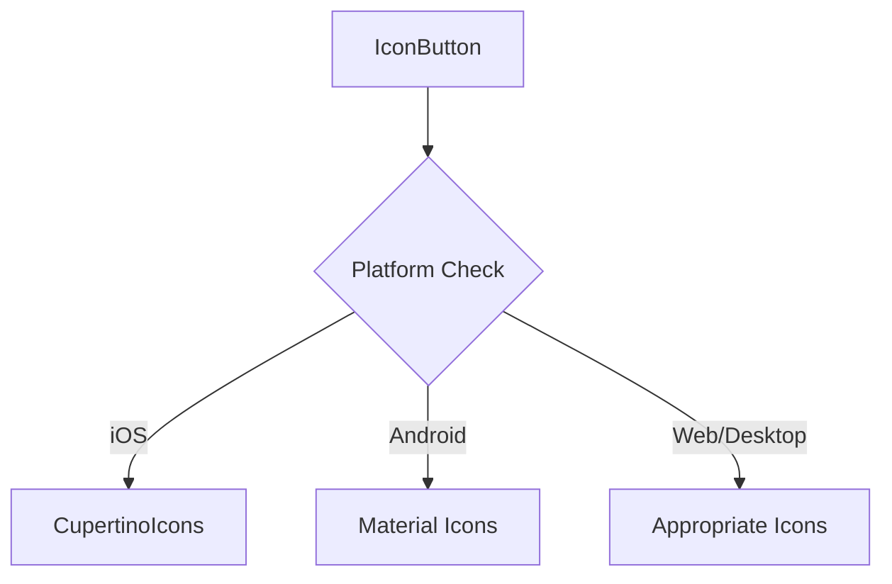

## 6.4.2 Adaptive Icons

In the ever-evolving landscape of mobile and web applications, creating a seamless user experience across different platforms is paramount. One of the key elements in achieving this is the use of adaptive icons. Adaptive icons are designed to automatically adjust their shape and style based on the platform and device, ensuring a native look and feel. This section delves into the intricacies of adaptive icons, their implementation in Flutter, and best practices for their use.

### Definition of Adaptive Icons

Adaptive icons are a crucial aspect of modern app design, providing a consistent and native appearance across various platforms. They are particularly important in maintaining the aesthetic integrity of an application as it transitions between different operating systems like Android, iOS, web, and desktop environments.

- **Adaptive Icons on Android:** Android adaptive icons are designed to display in different shapes, such as circles, squares, or squircles, depending on the device's launcher settings. This adaptability ensures that icons blend seamlessly with the overall device theme.
  
- **Adaptive Icons on iOS:** iOS does not support adaptive icons in the same way as Android. Instead, iOS icons are typically uniform in shape, but developers can use platform-specific icons to achieve a native look.

- **Web and Desktop Icons:** On web and desktop platforms, adaptive icons can adjust based on the browser or operating system's theme, providing a cohesive experience across different devices.

### Implementing Adaptive Icons

Implementing adaptive icons in Flutter involves using built-in widgets and third-party packages to detect the platform and switch icons accordingly. This section will guide you through creating and customizing adaptive icons for different platforms.

#### Creating Adaptive Icons with Flutter

Flutter provides a straightforward way to create adaptive icons using its rich set of widgets. By leveraging platform detection, developers can switch between Material and Cupertino icons to match the native design language of the platform.

**Example 1: Adaptive Icon with Material and Cupertino Icons**

```dart
import 'dart:io' show Platform;
import 'package:flutter/cupertino.dart';
import 'package:flutter/material.dart';

class AdaptiveIcon extends StatelessWidget {
  final String label;

  AdaptiveIcon({required this.label});

  @override
  Widget build(BuildContext context) {
    return IconButton(
      icon: Platform.isIOS
          ? Icon(CupertinoIcons.home, size: 30)
          : Icon(Icons.home, size: 30),
      onPressed: () {},
      tooltip: label,
    );
  }
}

Widget build(BuildContext context) {
  return Scaffold(
    appBar: AppBar(title: Text('Adaptive Icons')),
    body: Center(
      child: AdaptiveIcon(label: 'Home'),
    ),
  );
}
```

In this example, the `AdaptiveIcon` widget uses Dart's `Platform` class to check the operating system. It then selects the appropriate icon set—Cupertino for iOS and Material for Android.

**Example 2: Using flutter_platform_icons Package for Adaptive Icons**

For more complex applications, using a package like `flutter_platform_icons` can simplify the process of implementing adaptive icons.

```dart
import 'package:flutter/material.dart';
import 'package:flutter_platform_icons/flutter_platform_icons.dart';

class PlatformSpecificIcon extends StatelessWidget {
  @override
  Widget build(BuildContext context) {
    return IconButton(
      icon: Icon(
        Platform.isIOS ? Ionicons.md_settings : Icons.settings,
        size: 30,
      ),
      onPressed: () {},
    );
  }
}

Widget build(BuildContext context) {
  return Scaffold(
    appBar: AppBar(title: Text('Platform Specific Icons')),
    body: Center(
      child: PlatformSpecificIcon(),
    ),
  );
}
```

This example demonstrates how to use the `flutter_platform_icons` package to automatically select the correct icon based on the platform. This approach reduces the need for manual platform checks and enhances code readability.

### Mermaid.js Diagrams

To better understand how adaptive icons switch based on the platform, consider the following Mermaid.js diagram:



This diagram illustrates the decision-making process for selecting the appropriate icon set based on the detected platform.

### Best Practices for Adaptive Icons

When implementing adaptive icons, consider the following best practices to ensure a seamless user experience:

- **Maintain Clarity:** Ensure that icons remain clear and recognizable across different styles and shapes. This is crucial for maintaining usability and accessibility.

- **Consistent Sizing:** Keep icon sizes consistent within UI elements to maintain balance and prevent visual clutter. Consistent sizing helps in creating a harmonious and professional-looking interface.

- **Fallback Icons:** Provide fallback icons or default styles to handle edge cases where platform detection might fail. This ensures that your application remains functional and visually appealing even in unexpected scenarios.

### Conclusion

Adaptive icons play a vital role in creating a cohesive and native user experience across multiple platforms. By leveraging Flutter's capabilities and adhering to best practices, developers can ensure that their applications not only look great but also feel native to the platform they are running on. As you continue to build and refine your Flutter applications, consider the impact of adaptive icons on user perception and engagement.

### Further Reading and Resources

- [Flutter Official Documentation](https://flutter.dev/docs)
- [Material Design Guidelines](https://material.io/design)
- [Cupertino Design Guidelines](https://developer.apple.com/design/human-interface-guidelines/ios/overview/themes/)
- [flutter_platform_icons Package](https://pub.dev/packages/flutter_platform_icons)

By exploring these resources, you can deepen your understanding of adaptive icons and their role in cross-platform app development.

## Quiz Time!



### What is the primary purpose of adaptive icons?

- [x] To adjust their shape and style based on the platform and device
- [ ] To provide a uniform look across all platforms
- [ ] To enhance the performance of the application
- [ ] To reduce the app size

> **Explanation:** Adaptive icons are designed to automatically adjust their shape and style based on the platform and device, ensuring a native look and feel.

### Which Flutter widget is used to create adaptive icons in the provided example?

- [x] IconButton
- [ ] FloatingActionButton
- [ ] RaisedButton
- [ ] TextButton

> **Explanation:** The `IconButton` widget is used in the example to create adaptive icons by switching between Material and Cupertino icons based on the platform.

### How does the `flutter_platform_icons` package help in implementing adaptive icons?

- [x] It simplifies the process of selecting the correct icon based on the platform
- [ ] It provides a new set of icons exclusive to Flutter
- [ ] It automatically resizes icons for different screen sizes
- [ ] It enhances the color of icons

> **Explanation:** The `flutter_platform_icons` package simplifies the process of implementing adaptive icons by automatically selecting the correct icon based on the platform.

### What is a key consideration when maintaining clarity in adaptive icons?

- [x] Ensuring icons remain clear and recognizable across different styles and shapes
- [ ] Using the same color for all icons
- [ ] Making icons as large as possible
- [ ] Using complex designs for icons

> **Explanation:** Maintaining clarity involves ensuring that icons remain clear and recognizable across different styles and shapes, which is crucial for usability and accessibility.

### What is the role of fallback icons in adaptive icon design?

- [x] To handle edge cases where platform detection might fail
- [ ] To provide a backup for missing icons
- [ ] To enhance the visual appeal of the application
- [ ] To reduce the number of icons needed

> **Explanation:** Fallback icons are used to handle edge cases where platform detection might fail, ensuring that the application remains functional and visually appealing.

### Which platform does not natively support adaptive icons in the same way as Android?

- [x] iOS
- [ ] Web
- [ ] Desktop
- [ ] Linux

> **Explanation:** iOS does not support adaptive icons in the same way as Android. Instead, iOS icons are typically uniform in shape.

### What is the benefit of consistent sizing in adaptive icons?

- [x] It maintains balance and prevents visual clutter
- [ ] It makes icons more colorful
- [ ] It allows for more icons to be displayed
- [ ] It reduces the app's memory usage

> **Explanation:** Consistent sizing helps maintain balance and prevents visual clutter, contributing to a harmonious and professional-looking interface.

### Which diagramming tool is used to illustrate the adaptive icon switching process?

- [x] Mermaid.js
- [ ] UML
- [ ] Flowchart.js
- [ ] Graphviz

> **Explanation:** Mermaid.js is used to create diagrams that illustrate the adaptive icon switching process based on platform detection.

### What is a common pitfall when implementing adaptive icons?

- [x] Inconsistent icon sizes
- [ ] Using too many colors
- [ ] Overusing animations
- [ ] Lack of icon descriptions

> **Explanation:** Inconsistent icon sizes can lead to visual clutter and imbalance, which is a common pitfall when implementing adaptive icons.

### True or False: Adaptive icons are only necessary for mobile applications.

- [ ] True
- [x] False

> **Explanation:** Adaptive icons are important for both mobile and web/desktop applications to ensure a cohesive experience across different platforms.


