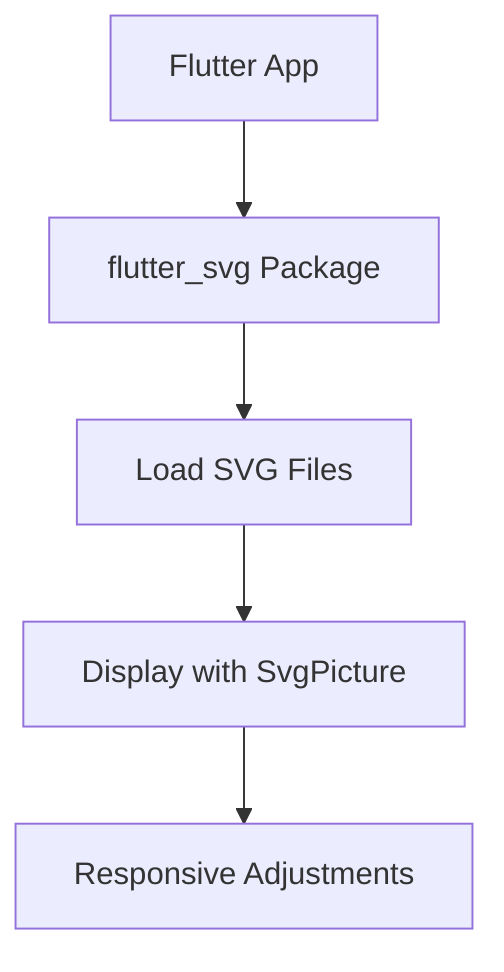

## 6.4.3 Vector Graphics with SVG

In the realm of modern UI design, vector graphics have become an essential tool for creating scalable and responsive interfaces. SVG (Scalable Vector Graphics) stands out due to its ability to maintain quality at any size, making it ideal for responsive applications. This section delves into the benefits of using SVGs in Flutter, how to integrate them into your projects, and best practices for optimizing their use.

### Benefits of Using SVGs

SVGs are vector-based graphics, which means they are composed of paths defined by mathematical expressions rather than pixels. This characteristic offers several advantages:

- **Infinite Scalability:** SVGs can be scaled to any size without losing quality, making them perfect for responsive designs where elements need to adjust to different screen sizes.
- **Small File Size:** Typically, SVG files are smaller than raster images, which can lead to faster load times and reduced bandwidth usage.
- **Editability:** SVGs can be easily edited with text editors or vector graphic software, allowing for quick adjustments and customizations.
- **Interactivity and Animation:** SVGs can be manipulated via CSS and JavaScript, enabling dynamic and interactive graphics.

These benefits make SVGs an excellent choice for icons, illustrations, and complex graphics in Flutter applications.

### Integrating SVGs in Flutter

To use SVGs in a Flutter project, you need to integrate the `flutter_svg` package. This package provides a rich set of features for rendering SVG files in your Flutter applications.

#### Step-by-Step Guide to Adding SVG Support

1. **Add the `flutter_svg` Package:**

   First, include the `flutter_svg` package in your `pubspec.yaml` file:

   ```yaml
   dependencies:
     flutter:
       sdk: flutter
     flutter_svg: ^1.0.0
   ```

   Run `flutter pub get` to install the package.

2. **Import the Package:**

   In your Dart file, import the `flutter_svg` package:

   ```dart
   import 'package:flutter_svg/flutter_svg.dart';
   ```

3. **Load and Display SVG Files:**

   You can load SVG files from assets or network sources. Here’s how to display an SVG from a network:

   ```dart
   import 'package:flutter/material.dart';
   import 'package:flutter_svg/flutter_svg.dart';

   class SvgExample extends StatelessWidget {
     @override
     Widget build(BuildContext context) {
       return Scaffold(
         appBar: AppBar(title: Text('SVG Example')),
         body: Center(
           child: SvgPicture.network(
             'https://dev.w3.org/SVG/tools/svgweb/samples/svg-files/android.svg',
             width: 150,
             height: 150,
             semanticsLabel: 'Android Logo',
           ),
         ),
       );
     }
   }
   ```

   This example demonstrates how to load an SVG from a URL and display it with specified dimensions.

### Handling SVG Responsiveness

To ensure SVG graphics are responsive, you can adjust their properties based on screen size or user interactions. This involves using Flutter’s layout capabilities and MediaQuery to dynamically alter SVG attributes.

#### Example: Responsive SVG Icon

Here's an example of how to create a responsive SVG icon that changes size based on the screen width:

```dart
import 'package:flutter/material.dart';
import 'package:flutter_svg/flutter_svg.dart';

class ResponsiveSvgIcon extends StatelessWidget {
  @override
  Widget build(BuildContext context) {
    double screenWidth = MediaQuery.of(context).size.width;
    double iconSize = screenWidth > 600 ? 100 : 50;

    return Scaffold(
      appBar: AppBar(title: Text('Responsive SVG Icon')),
      body: Center(
        child: SvgPicture.asset(
          'assets/icons/custom_icon.svg',
          width: iconSize,
          height: iconSize,
          color: Colors.teal,
        ),
      ),
    );
  }
}
```

In this example, the icon size is adjusted based on the screen width, ensuring that it remains proportionate on both small and large screens.

### Best Practices for SVGs in Flutter

- **Optimize SVG Files:** Use tools like SVGO to minimize file size and complexity. This helps improve performance and load times.
- **Use Semantics:** Always provide a `semanticsLabel` for SVGs to enhance accessibility for users relying on screen readers.
- **Consistent Styling:** Ensure that SVGs maintain consistent styling with your app’s theme, including colors and strokes, to provide a cohesive user experience.

### Mermaid.js Diagram: SVG Integration in Flutter

To visualize the process of integrating SVGs in Flutter, consider the following diagram:



This diagram outlines the flow from integrating the `flutter_svg` package to making responsive adjustments to SVG graphics.

### Conclusion

SVGs are a powerful tool for creating responsive and adaptive UIs in Flutter. By leveraging the `flutter_svg` package, developers can easily integrate scalable vector graphics into their applications, enhancing both performance and user experience. By following best practices, such as optimizing SVG files and ensuring accessibility, you can create visually appealing and responsive designs that cater to a wide range of devices.

### Further Resources

- **Official Flutter Documentation:** [flutter.dev](https://flutter.dev/docs)
- **flutter_svg Package:** [pub.dev](https://pub.dev/packages/flutter_svg)
- **SVG Optimization Tools:** [SVGO](https://github.com/svg/svgo)

## Quiz Time!



### What is a primary benefit of using SVGs in responsive design?

- [x] Infinite scalability without quality loss
- [ ] Larger file sizes compared to raster images
- [ ] Limited color options
- [ ] Requires complex integration steps

> **Explanation:** SVGs are vector-based, allowing them to scale infinitely without losing quality, making them ideal for responsive design.

### How do you add SVG support to a Flutter project?

- [x] By adding the `flutter_svg` package to `pubspec.yaml`
- [ ] By using the `flutter_vector_graphics` package
- [ ] By converting SVGs to PNGs
- [ ] By writing custom rendering code

> **Explanation:** The `flutter_svg` package provides support for rendering SVG files in Flutter applications.

### Which widget is used to display SVG images in Flutter?

- [x] SvgPicture
- [ ] Image
- [ ] VectorWidget
- [ ] SvgImage

> **Explanation:** The `SvgPicture` widget from the `flutter_svg` package is used to display SVG images.

### How can you make an SVG icon responsive in Flutter?

- [x] By adjusting its size based on screen width using MediaQuery
- [ ] By using fixed dimensions
- [ ] By converting it to a bitmap
- [ ] By using the `Image` widget

> **Explanation:** You can use MediaQuery to dynamically adjust the size of an SVG icon based on the screen width.

### What is a best practice for optimizing SVG files?

- [x] Using tools like SVGO to minimize file size
- [ ] Increasing the number of paths
- [ ] Adding more colors
- [ ] Using raster images instead

> **Explanation:** Optimizing SVG files with tools like SVGO helps reduce file size and complexity, improving performance.

### Why is it important to provide a `semanticsLabel` for SVGs?

- [x] To enhance accessibility for screen readers
- [ ] To increase file size
- [ ] To improve rendering speed
- [ ] To change the SVG color

> **Explanation:** Providing a `semanticsLabel` improves accessibility by allowing screen readers to describe the SVG content.

### What is the purpose of the `flutter_svg` package?

- [x] To render SVG files in Flutter applications
- [ ] To convert SVGs to PNGs
- [ ] To create custom animations
- [ ] To manage state

> **Explanation:** The `flutter_svg` package is specifically designed to render SVG files in Flutter applications.

### Which of the following is NOT a benefit of using SVGs?

- [ ] Infinite scalability
- [ ] Small file size
- [ ] Editability
- [x] Limited to black and white colors

> **Explanation:** SVGs support a wide range of colors and are not limited to black and white.

### How can you ensure consistent styling for SVGs in your app?

- [x] By aligning SVG colors and strokes with the app’s theme
- [ ] By using random colors
- [ ] By ignoring the app's theme
- [ ] By using only black and white

> **Explanation:** Consistent styling involves aligning SVG colors and strokes with the app’s theme for a cohesive look.

### True or False: SVGs can be manipulated using CSS and JavaScript.

- [x] True
- [ ] False

> **Explanation:** SVGs can be styled and animated using CSS and JavaScript, allowing for dynamic and interactive graphics.


