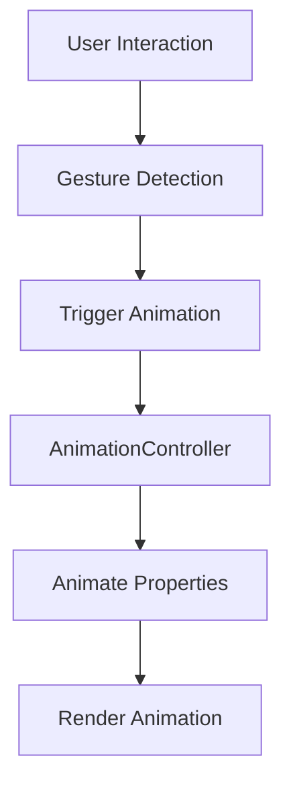

## 6.4.4 Animation and Interactivity

In the realm of mobile application development, animations and interactivity are not just embellishments but essential components that significantly enhance user experience. They provide visual feedback, guide user attention, and make navigation intuitive and enjoyable. This section delves into how you can leverage Flutter's powerful animation framework to create engaging and interactive UI elements.

### Enhancing User Experience with Animations

Animations play a crucial role in modern app design. They can transform a static interface into a dynamic experience, making interactions more intuitive and enjoyable. Here’s how animations enhance user experience:

- **Visual Feedback:** Animations provide immediate feedback to user actions, confirming that their input has been recognized. For example, a button might slightly enlarge when tapped, indicating a successful interaction.
- **Guiding Attention:** Subtle animations can guide users' attention to important elements or changes in the UI. For instance, a bouncing notification icon can draw attention to new messages.
- **Improving Navigation:** Animations can make transitions between screens smoother, helping users understand the flow of the app. A sliding transition between pages can indicate a forward or backward navigation.
- **Engagement:** Interactive animations can make an app feel more alive and engaging, encouraging users to explore more.

### Implementing Interactive Icons and Graphics

Interactive icons and graphics can greatly enhance the interactivity of your app. By responding to user gestures and incorporating animations, you can create a more engaging user experience. Here’s how to implement interactive icons and graphics in Flutter:

#### Using Gesture Detectors

Flutter provides the `GestureDetector` widget, which allows you to capture various user gestures such as taps, swipes, and long presses. By combining this with animations, you can create interactive icons that respond to user input.

#### Animation Controllers and Flutter’s Animation Framework

Flutter’s animation framework is built around the concept of `AnimationController`, which controls the animation’s duration and progress. By using `AnimationController` in conjunction with `Tween` and `Animation`, you can create custom animations that respond to user interactions.

### Code Examples

Let's explore some practical examples to understand how to implement animations and interactivity in Flutter.

#### Example 1: Animating an Icon on Tap

In this example, we create an animated icon that scales up when tapped and scales back down when tapped again. This provides visual feedback to the user, enhancing the interactivity of the icon.

```dart
import 'package:flutter/material.dart';

class AnimatedIconButton extends StatefulWidget {
  @override
  _AnimatedIconButtonState createState() => _AnimatedIconButtonState();
}

class _AnimatedIconButtonState extends State<AnimatedIconButton> with SingleTickerProviderStateMixin {
  late AnimationController _controller;
  late Animation<double> _animation;

  @override
  void initState() {
    super.initState();
    _controller = AnimationController(
      duration: Duration(milliseconds: 300),
      vsync: this,
    );
    _animation = Tween<double>(begin: 1.0, end: 1.5).animate(_controller);
  }

  void _onTap() {
    if (_controller.status == AnimationStatus.completed) {
      _controller.reverse();
    } else {
      _controller.forward();
    }
  }

  @override
  Widget build(BuildContext context) {
    return Scaffold(
      appBar: AppBar(title: Text('Animated Icon')),
      body: Center(
        child: GestureDetector(
          onTap: _onTap,
          child: ScaleTransition(
            scale: _animation,
            child: Icon(Icons.favorite, color: Colors.red, size: 50),
          ),
        ),
      ),
    );
  }

  @override
  void dispose() {
    _controller.dispose();
    super.dispose();
  }
}
```

**Explanation:**
- **AnimationController:** Manages the animation's duration and progress.
- **Tween:** Defines the range of values for the animation.
- **ScaleTransition:** Animates the scale of the icon based on the animation value.
- **GestureDetector:** Detects tap gestures to trigger the animation.

#### Example 2: Interactive SVG with Hover Animation

This example demonstrates how to make an SVG graphic interactive by changing its size and color when hovered over. This is particularly useful for web applications where hover effects are common.

```dart
import 'package:flutter/material.dart';
import 'package:flutter_svg/flutter_svg.dart';

class InteractiveSvg extends StatefulWidget {
  @override
  _InteractiveSvgState createState() => _InteractiveSvgState();
}

class _InteractiveSvgState extends State<InteractiveSvg> with SingleTickerProviderStateMixin {
  bool _isHovered = false;

  @override
  Widget build(BuildContext context) {
    return Scaffold(
      appBar: AppBar(title: Text('Interactive SVG')),
      body: Center(
        child: MouseRegion(
          onEnter: (_) => setState(() => _isHovered = true),
          onExit: (_) => setState(() => _isHovered = false),
          child: GestureDetector(
            onTap: () {
              // Handle tap
            },
            child: AnimatedContainer(
              duration: Duration(milliseconds: 300),
              width: _isHovered ? 120 : 100,
              height: _isHovered ? 120 : 100,
              child: SvgPicture.asset(
                'assets/icons/interactive_icon.svg',
                color: _isHovered ? Colors.blue : Colors.grey,
              ),
            ),
          ),
        ),
      ),
    );
  }
}
```

**Explanation:**
- **MouseRegion:** Detects when the mouse enters or exits the widget area, allowing for hover effects.
- **AnimatedContainer:** Smoothly transitions between different sizes and colors.
- **SvgPicture:** Displays an SVG asset, which can be styled dynamically.

### Mermaid.js Diagrams

To better understand the flow of animations in Flutter, consider the following diagram that illustrates the process from user interaction to rendering the animation.



**Diagram Explanation:**
- **User Interaction:** The starting point where the user interacts with the app.
- **Gesture Detection:** Captures user gestures using widgets like `GestureDetector`.
- **Trigger Animation:** Initiates the animation process.
- **AnimationController:** Manages the animation's lifecycle.
- **Animate Properties:** Changes properties such as scale, color, or position.
- **Render Animation:** The final step where the animation is rendered on the screen.

### Best Practices

When implementing animations and interactivity, consider the following best practices to ensure a smooth and user-friendly experience:

- **Performance Optimization:** Minimize rebuilds and use optimized assets to keep animations smooth. Avoid complex animations that can cause jank on lower-end devices.
- **User Control:** Provide options for users to disable animations if they prefer reduced motion, catering to accessibility needs.
- **Consistent Animation Themes:** Maintain a cohesive design language by using consistent animation styles and patterns throughout your app.

### Additional Resources

To further enhance your understanding of animations and interactivity in Flutter, consider exploring the following resources:

- [Flutter Animation Documentation](https://flutter.dev/docs/development/ui/animations)
- [Flutter Widget of the Week: AnimatedContainer](https://www.youtube.com/watch?v=65HoWqBboI8)
- [Creating Beautiful Animations with Flutter](https://medium.com/flutter-community/creating-beautiful-animations-with-flutter-2e0f6da8f4b9)

By mastering animations and interactivity, you can create apps that are not only functional but also delightful to use, providing a seamless and engaging experience for your users.

## Quiz Time!



### What is the primary role of animations in user interfaces?

- [x] To provide visual feedback and enhance user experience
- [ ] To increase the app's loading time
- [ ] To replace all static elements in the UI
- [ ] To make the app more complex

> **Explanation:** Animations provide visual feedback, enhance user experience, guide attention, and improve navigation.

### Which Flutter widget is used to detect user gestures like taps and swipes?

- [x] GestureDetector
- [ ] AnimatedContainer
- [ ] AnimationController
- [ ] Tween

> **Explanation:** GestureDetector is used to detect various user gestures such as taps, swipes, and long presses.

### What does the AnimationController manage in Flutter?

- [x] The animation's duration and progress
- [ ] The app's main theme
- [ ] The layout of widgets
- [ ] The app's navigation flow

> **Explanation:** AnimationController manages the animation's duration and progress, controlling how it evolves over time.

### In the context of animations, what is a Tween used for?

- [x] Defining the range of values for an animation
- [ ] Managing user input
- [ ] Creating complex layouts
- [ ] Handling network requests

> **Explanation:** Tween defines the range of values that an animation can take, specifying the start and end points.

### How can you make an SVG graphic interactive in Flutter?

- [x] By using MouseRegion and GestureDetector
- [ ] By embedding it directly in a Text widget
- [ ] By converting it to a bitmap
- [ ] By using a ListView

> **Explanation:** MouseRegion and GestureDetector can be used to make SVG graphics interactive by responding to user gestures.

### What is a key benefit of using AnimatedContainer in Flutter?

- [x] It allows smooth transitions between different sizes and colors
- [ ] It automatically manages app state
- [ ] It replaces the need for GestureDetector
- [ ] It provides network connectivity

> **Explanation:** AnimatedContainer allows smooth transitions between different properties like size and color, enhancing UI dynamics.

### Why is it important to provide options for users to disable animations?

- [x] To cater to accessibility needs and preferences for reduced motion
- [ ] To make the app more complex
- [ ] To increase the app's loading time
- [ ] To replace all static elements in the UI

> **Explanation:** Providing options to disable animations caters to users who prefer reduced motion, enhancing accessibility.

### Which widget is used to display SVG assets in Flutter?

- [x] SvgPicture
- [ ] Image
- [ ] Icon
- [ ] Text

> **Explanation:** SvgPicture is used to display SVG assets, allowing for scalable and dynamic graphics.

### What is the purpose of the ScaleTransition widget in Flutter?

- [x] To animate the scale of a widget
- [ ] To manage app state
- [ ] To handle network requests
- [ ] To create complex layouts

> **Explanation:** ScaleTransition animates the scale of a widget, providing visual feedback through size changes.

### True or False: Consistent animation styles throughout an app reinforce a cohesive design language.

- [x] True
- [ ] False

> **Explanation:** Consistent animation styles help maintain a cohesive design language, enhancing the overall user experience.


