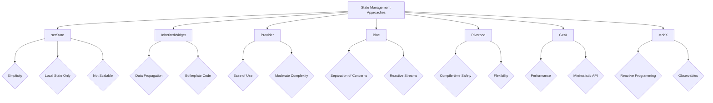

## 7.1.2 Common State Management Approaches

State management is a crucial aspect of building responsive and adaptive applications in Flutter. It determines how your app responds to user interactions, updates the UI, and manages data flow. In this section, we will explore various state management approaches available in Flutter, each with its unique strengths and use cases. Understanding these approaches will empower you to choose the right tools for your projects, ensuring efficient and maintainable code.

### SetState

The `setState` method is the most straightforward way to manage state in Flutter. It is used to update the state of a `StatefulWidget` and trigger a rebuild of the widget tree.

#### How `setState` Works

The `setState` method is called within a `StatefulWidget` to notify the framework that the internal state of the widget has changed. This method takes a callback function where you can update the state variables, and once the function completes, the framework triggers a rebuild of the widget tree.

```dart
class Counter extends StatefulWidget {
  @override
  _CounterState createState() => _CounterState();
}

class _CounterState extends State<Counter> {
  int _count = 0;

  void _incrementCounter() {
    setState(() {
      _count++;
    });
  }

  @override
  Widget build(BuildContext context) {
    return Column(
      mainAxisAlignment: MainAxisAlignment.center,
      children: <Widget>[
        Text('Count: $_count'),
        ElevatedButton(
          onPressed: _incrementCounter,
          child: Text('Increment'),
        ),
      ],
    );
  }
}
```

#### Simplicity and Limitations

- **Simplicity:** `setState` is easy to use and understand, making it ideal for managing local state within a single widget.
- **Limitations:** It becomes cumbersome in larger applications where state needs to be shared across multiple widgets. It can lead to code duplication and makes it challenging to manage complex state logic.

### InheritedWidget and InheritedModel

`InheritedWidget` and `InheritedModel` provide a way to pass data down the widget tree without explicitly passing it through constructors.

#### InheritedWidget

`InheritedWidget` is a base class that allows data to be efficiently propagated down the widget tree. It is often used to implement shared state or configuration settings.

```dart
class MyInheritedWidget extends InheritedWidget {
  final int data;

  MyInheritedWidget({
    Key? key,
    required this.data,
    required Widget child,
  }) : super(key: key, child: child);

  @override
  bool updateShouldNotify(MyInheritedWidget oldWidget) {
    return oldWidget.data != data;
  }

  static MyInheritedWidget? of(BuildContext context) {
    return context.dependOnInheritedWidgetOfExactType<MyInheritedWidget>();
  }
}
```

#### Use Cases and Challenges

- **Use Cases:** Ideal for propagating immutable data or configuration settings across the widget tree.
- **Challenges:** Managing mutable state with `InheritedWidget` can be complex and error-prone. It requires manual implementation of update logic, which can lead to boilerplate code.

### Provider

The `Provider` package is a popular state management solution that builds on top of `InheritedWidget`, offering a simpler and more flexible API.

#### Introduction to Provider

`Provider` is a wrapper around `InheritedWidget` that simplifies state management by providing a consistent and easy-to-use API. It is widely used in the Flutter community for managing both simple and moderately complex state scenarios.

```dart
class CounterProvider with ChangeNotifier {
  int _count = 0;

  int get count => _count;

  void increment() {
    _count++;
    notifyListeners();
  }
}

void main() {
  runApp(
    ChangeNotifierProvider(
      create: (context) => CounterProvider(),
      child: MyApp(),
    ),
  );
}
```

#### Popularity and Ease of Use

- **Popularity:** `Provider` is one of the most widely adopted state management solutions in Flutter due to its simplicity and flexibility.
- **Ease of Use:** It provides a straightforward API for managing state, making it easy to integrate into existing projects.

### Bloc (Business Logic Component)

The Bloc pattern is a reactive state management approach that focuses on separating business logic from the UI.

#### Defining the Bloc Pattern

Bloc stands for Business Logic Component. It leverages Streams and Sinks to manage state reactively, allowing for a clear separation of concerns between the UI and business logic.

```dart
class CounterBloc {
  final _counterController = StreamController<int>();
  int _count = 0;

  Stream<int> get counterStream => _counterController.stream;

  void increment() {
    _count++;
    _counterController.sink.add(_count);
  }

  void dispose() {
    _counterController.close();
  }
}
```

#### Streams and Sinks

- **Streams:** Used to listen for state changes and update the UI accordingly.
- **Sinks:** Used to send events or actions to the Bloc, triggering state changes.

### Riverpod

Riverpod is an improvement over Provider, offering enhanced flexibility and scalability.

#### Benefits of Riverpod

Riverpod addresses some of the limitations of Provider, such as compile-time safety and better testability. It provides a more robust and flexible API for managing state.

```dart
final counterProvider = StateProvider<int>((ref) => 0);

class Counter extends ConsumerWidget {
  @override
  Widget build(BuildContext context, ScopedReader watch) {
    final count = watch(counterProvider).state;
    return Column(
      mainAxisAlignment: MainAxisAlignment.center,
      children: <Widget>[
        Text('Count: $count'),
        ElevatedButton(
          onPressed: () => context.read(counterProvider).state++,
          child: Text('Increment'),
        ),
      ],
    );
  }
}
```

#### Enhanced Flexibility and Scalability

- **Flexibility:** Riverpod allows for more granular control over state management, making it suitable for complex applications.
- **Scalability:** It scales well with larger applications, providing a clear and maintainable structure.

### GetX

GetX is a lightweight state management solution that combines state management, dependency injection, and route management.

#### Simplicity and Performance

GetX is known for its simplicity and performance advantages. It provides a minimalistic API that is easy to learn and use.

```dart
class CounterController extends GetxController {
  var count = 0.obs;

  void increment() => count++;
}

class Counter extends StatelessWidget {
  @override
  Widget build(BuildContext context) {
    final CounterController controller = Get.put(CounterController());
    return Column(
      mainAxisAlignment: MainAxisAlignment.center,
      children: <Widget>[
        Obx(() => Text('Count: ${controller.count}')),
        ElevatedButton(
          onPressed: controller.increment,
          child: Text('Increment'),
        ),
      ],
    );
  }
}
```

### MobX

MobX is a reactive state management library inspired by reactive programming principles.

#### Observables, Actions, and Reactions

MobX uses observables to track state changes, actions to modify state, and reactions to respond to state changes.

```dart
class Counter = _Counter with _$Counter;

abstract class _Counter with Store {
  @observable
  int count = 0;

  @action
  void increment() {
    count++;
  }
}
```

### Comparison Table

To help you choose the right state management approach for your project, here's a comparative table that highlights the key features of each solution:



### Implementation Guidance

Choosing the right state management approach depends on several factors, including project size, complexity, and developer familiarity. Here are some guidelines to help you decide:

- **Use `setState` for simple, local state management within a single widget.**
- **Consider `InheritedWidget` for propagating immutable data across the widget tree.**
- **Adopt `Provider` for small to moderately complex applications where state needs to be shared across multiple widgets.**
- **Leverage `Bloc` for larger applications that require a clear separation of business logic and UI.**
- **Explore `Riverpod` for projects that demand enhanced flexibility and scalability.**
- **Try `GetX` for lightweight applications that benefit from its simplicity and performance.**
- **Experiment with `MobX` if you prefer a reactive programming approach with observables.**

### Conclusion

State management is a critical component of building responsive and adaptive applications in Flutter. By understanding the strengths and limitations of each approach, you can make informed decisions that enhance your app's performance and maintainability. Encourage experimentation with different solutions to find the best fit for your specific project needs.

## Quiz Time!



### Which method is used to update the state of a `StatefulWidget` in Flutter?

- [x] setState
- [ ] notifyListeners
- [ ] updateState
- [ ] refreshState

> **Explanation:** The `setState` method is used to update the state of a `StatefulWidget` and trigger a rebuild of the widget tree.

### What is a primary limitation of using `setState` in larger applications?

- [x] It can lead to code duplication and makes managing complex state logic challenging.
- [ ] It is too complex for small applications.
- [ ] It requires a lot of boilerplate code.
- [ ] It does not support local state management.

> **Explanation:** In larger applications, `setState` can lead to code duplication and makes managing complex state logic challenging, as it is designed for local state management within a single widget.

### How does `InheritedWidget` propagate data?

- [x] By allowing data to be efficiently passed down the widget tree.
- [ ] By using Streams and Sinks.
- [ ] By providing a global state accessible from anywhere.
- [ ] By using observables and reactions.

> **Explanation:** `InheritedWidget` allows data to be efficiently passed down the widget tree, making it ideal for propagating immutable data or configuration settings.

### What is one of the main benefits of using the `Provider` package?

- [x] It simplifies state management by wrapping `InheritedWidget` with a more flexible API.
- [ ] It is the only state management solution that supports Streams.
- [ ] It requires less code than `setState`.
- [ ] It is the fastest state management solution available.

> **Explanation:** The `Provider` package simplifies state management by wrapping `InheritedWidget` with a more flexible API, making it easier to manage state across multiple widgets.

### What pattern does Bloc use to separate business logic from the UI?

- [x] Streams and Sinks
- [ ] Observables and Reactions
- [ ] Dependency Injection
- [ ] Global State Management

> **Explanation:** Bloc uses Streams and Sinks to separate business logic from the UI, allowing for a clear separation of concerns.

### What advantage does Riverpod offer over Provider?

- [x] Compile-time safety and better testability.
- [ ] It is easier to learn.
- [ ] It requires less setup.
- [ ] It is faster than Provider.

> **Explanation:** Riverpod offers compile-time safety and better testability compared to Provider, making it more robust and flexible for complex applications.

### What is a key feature of GetX?

- [x] It combines state management, dependency injection, and route management.
- [ ] It is the most complex state management solution.
- [ ] It only supports local state management.
- [ ] It requires a lot of boilerplate code.

> **Explanation:** GetX combines state management, dependency injection, and route management, providing a lightweight and minimalistic API.

### Which library uses observables, actions, and reactions for state management?

- [x] MobX
- [ ] Bloc
- [ ] Riverpod
- [ ] GetX

> **Explanation:** MobX uses observables, actions, and reactions to manage state, inspired by reactive programming principles.

### What is a common use case for `InheritedWidget`?

- [x] Propagating immutable data or configuration settings across the widget tree.
- [ ] Managing complex state logic in large applications.
- [ ] Handling user authentication.
- [ ] Implementing global state management.

> **Explanation:** `InheritedWidget` is commonly used for propagating immutable data or configuration settings across the widget tree.

### True or False: `setState` is suitable for managing global state in large applications.

- [ ] True
- [x] False

> **Explanation:** `setState` is not suitable for managing global state in large applications as it is designed for local state management within a single widget.


