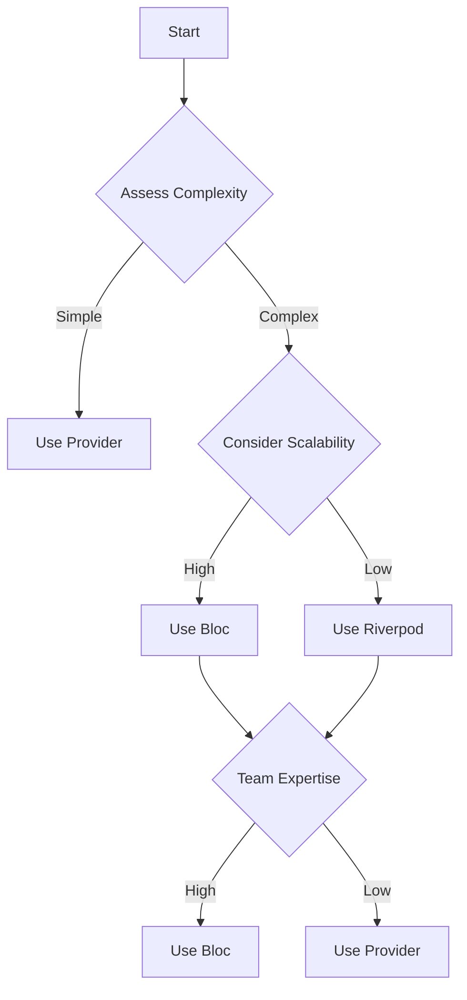

---

linkTitle: "7.1.3 Choosing the Right Solution"
title: "Choosing the Right State Management Solution in Flutter"
description: "Explore how to choose the right state management solution in Flutter, considering project requirements, scalability, team expertise, and more."
categories:
- Flutter Development
- State Management
- Mobile App Development
tags:
- Flutter
- State Management
- Provider
- Bloc
- Riverpod
- GetX
- Scalability
date: 2024-10-25
type: docs
nav_weight: 723000
canonical: "https://fluttermasterylibrary.com/6/7/2/3"
license: "© 2023 Tokenizer Inc. CC BY-NC-SA 4.0"
---

## 7.1.3 Choosing the Right State Management Solution

Choosing the right state management solution in Flutter is a critical decision that can significantly impact the development process and the application's long-term success. This section will guide you through assessing your project's specific requirements, understanding scalability needs, considering team expertise, and evaluating community support. We'll also discuss performance considerations, maintenance, and extensibility, providing real-world examples and a decision framework to help you make an informed choice.

### Project Requirements Assessment

Before diving into specific state management solutions, it's essential to assess your project's requirements. Consider the following aspects:

- **Complexity:** Determine the complexity of your application. Is it a simple app with minimal state changes, or does it involve complex interactions and data flows?
- **Scalability:** Consider whether your app will need to scale in the future. Will you be adding new features or handling more users?
- **Team Expertise:** Evaluate your team's familiarity with different state management solutions. Are they comfortable with more advanced patterns, or would they benefit from simpler approaches?
- **Maintenance:** Think about the long-term maintenance of your application. How easy will it be to update and extend the app with the chosen state management solution?

### Scalability Needs

The choice of state management can significantly impact your application's scalability. Here are some considerations:

- **Start Simple:** For smaller projects or prototypes, starting with simpler solutions like `setState` or `Provider` can be beneficial. These solutions are easy to implement and understand.
- **Transition as Needed:** As your application grows in complexity, you may need to transition to more robust solutions like `Bloc` or `Riverpod`. These solutions offer better separation of concerns and can handle more complex state management needs.
- **Future-Proofing:** Choose a solution that can grow with your application. Consider how easy it will be to refactor and scale your state management as your app evolves.

### Team Expertise and Learning Curve

The team's expertise and the learning curve associated with different state management solutions are crucial factors:

- **Familiarity:** If your team is already familiar with a particular state management solution, it may be more efficient to use that approach.
- **Learning Curve:** Some solutions, like `Bloc`, have a steeper learning curve but offer powerful features. Others, like `Provider`, are more straightforward and quicker to learn.
- **Training and Resources:** Consider the availability of training resources and documentation. Investing in training can help your team become proficient with more complex solutions.

### Community and Ecosystem Support

Choosing a solution with strong community support and a vibrant ecosystem can provide several benefits:

- **Documentation:** Comprehensive documentation can significantly reduce the learning curve and help resolve issues quickly.
- **Active Maintenance:** Solutions with active maintenance and regular updates are more likely to be reliable and secure.
- **Community Contributions:** A strong community can provide plugins, extensions, and third-party libraries that enhance the state management solution.

### Performance Considerations

Different state management solutions can affect application performance, especially in responsive designs where state changes frequently:

- **Efficiency:** Some solutions, like `Provider`, are lightweight and efficient for smaller apps. Others, like `Bloc`, can handle complex state changes more effectively.
- **Rebuilds:** Consider how the solution handles widget rebuilds. Efficient state management minimizes unnecessary rebuilds, improving performance.
- **Responsiveness:** Ensure that the chosen solution can handle frequent state changes without impacting the app's responsiveness.

### Maintenance and Extensibility

The maintainability and extensibility of your state management approach are vital for future updates and feature additions:

- **Code Organization:** Choose a solution that encourages clean and organized code. This makes it easier to maintain and extend the application.
- **Separation of Concerns:** Solutions like `Bloc` promote a clear separation of concerns, making it easier to manage complex applications.
- **Extensibility:** Consider how easy it will be to add new features or modify existing functionality with the chosen solution.

### Real-World Examples

Let's look at some real-world examples of applications that benefited from selecting a specific state management approach:

- **Simple Apps:** A small e-commerce app might start with `Provider` for its simplicity and ease of use. As the app grows, it can transition to `Bloc` to handle more complex state management needs.
- **Complex Apps:** A large social media platform might choose `Bloc` from the start to manage complex interactions and data flows efficiently.
- **Cross-Platform Apps:** An app targeting multiple platforms (iOS, Android, web) might use `Riverpod` for its flexibility and ability to manage state across different environments.

### Decision Framework

To help developers choose the most suitable state management solution, consider creating a decision-making framework or checklist:

- **Assess Complexity:** Evaluate the complexity of your application and choose a solution that matches your needs.
- **Evaluate Scalability:** Consider future scalability and choose a solution that can grow with your application.
- **Consider Expertise:** Take into account your team's expertise and the learning curve associated with each solution.
- **Check Community Support:** Choose a solution with strong community support and comprehensive documentation.
- **Performance Needs:** Consider the performance implications of each solution, especially in responsive designs.
- **Maintenance and Extensibility:** Choose a solution that promotes maintainable and extensible code.

### Implementation Guidance

When implementing state management, consider the pros and cons of each approach:

- **Provider:**
  - **Pros:** Simple, easy to learn, lightweight, good for small to medium apps.
  - **Cons:** May become cumbersome for complex apps, less structured than some other solutions.
- **Bloc:**
  - **Pros:** Strong separation of concerns, scalable, good for complex apps.
  - **Cons:** Steeper learning curve, more boilerplate code.
- **Riverpod:**
  - **Pros:** Flexible, supports multiple environments, good for cross-platform apps.
  - **Cons:** Newer solution, may have less community support than more established solutions.
- **GetX:**
  - **Pros:** All-in-one solution, easy to use, good for rapid development.
  - **Cons:** Can lead to tightly coupled code, less structured than some other solutions.

To visually aid in the selection process, consider using decision trees or flowcharts. Here's an example using Mermaid.js:

This flowchart provides a visual representation of the decision-making process, helping developers choose the right state management solution based on their project's needs.

### Conclusion

Choosing the right state management solution in Flutter requires careful consideration of various factors, including project requirements, scalability, team expertise, community support, performance, and maintainability. By assessing these factors and using a decision-making framework, you can select a solution that best fits your application's needs and ensures its long-term success.

## Quiz Time!



### What is the first step in choosing the right state management solution?

- [x] Assessing project-specific requirements
- [ ] Evaluating community support
- [ ] Considering performance implications
- [ ] Checking team expertise

> **Explanation:** The first step is to assess project-specific requirements, such as complexity, scalability, team expertise, and maintenance needs.

### Which state management solution is recommended for simple apps?

- [x] Provider
- [ ] Bloc
- [ ] Riverpod
- [ ] GetX

> **Explanation:** Provider is recommended for simple apps due to its simplicity and ease of use.

### What should you consider if your app needs to scale in the future?

- [x] Transitioning to more robust solutions as complexity grows
- [ ] Sticking with the simplest solution
- [ ] Avoiding any changes to state management
- [ ] Focusing only on team expertise

> **Explanation:** As your app scales, transitioning to more robust solutions like Bloc or Riverpod can help manage increased complexity.

### How does community support benefit a state management solution?

- [x] Provides comprehensive documentation and active maintenance
- [ ] Reduces the need for team expertise
- [ ] Eliminates performance issues
- [ ] Guarantees scalability

> **Explanation:** Strong community support offers comprehensive documentation, active maintenance, and additional resources like plugins and extensions.

### What is a key advantage of the Bloc pattern?

- [x] Strong separation of concerns
- [ ] Simplicity and ease of use
- [ ] Minimal boilerplate code
- [ ] Rapid development

> **Explanation:** Bloc provides a strong separation of concerns, making it suitable for complex applications.

### Which solution is known for its flexibility and support for multiple environments?

- [ ] Provider
- [ ] Bloc
- [x] Riverpod
- [ ] GetX

> **Explanation:** Riverpod is known for its flexibility and ability to manage state across different environments.

### What is a potential downside of using GetX?

- [ ] Strong separation of concerns
- [ ] Comprehensive documentation
- [x] Tightly coupled code
- [ ] High learning curve

> **Explanation:** GetX can lead to tightly coupled code, which may affect maintainability.

### Why is it important to consider the learning curve of a state management solution?

- [ ] It affects the app's scalability
- [x] It impacts development time and team efficiency
- [ ] It guarantees better performance
- [ ] It ensures community support

> **Explanation:** The learning curve impacts development time and team efficiency, influencing how quickly a team can adopt a new solution.

### What is a benefit of starting with a simple state management solution?

- [x] Easier implementation and understanding
- [ ] Guaranteed scalability
- [ ] Eliminates the need for future transitions
- [ ] Reduces community support

> **Explanation:** Starting with a simple solution like Provider allows for easier implementation and understanding, especially for smaller projects.

### True or False: Performance considerations are irrelevant in choosing a state management solution.

- [ ] True
- [x] False

> **Explanation:** Performance considerations are crucial, especially in responsive designs where state changes frequently.


