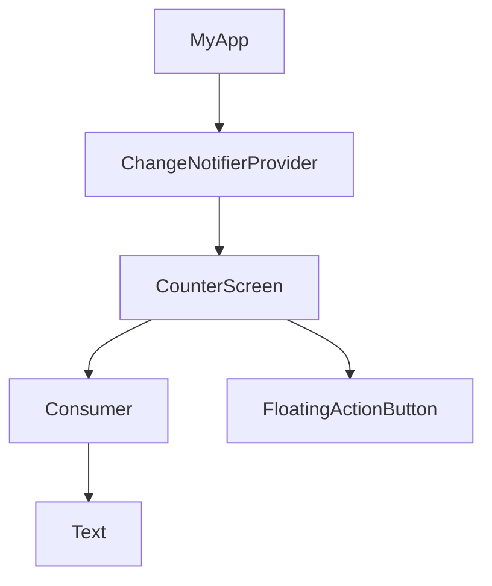

---

linkTitle: "7.2.1 Provider Package Basics"
title: "Provider Package Basics: Simplifying State Management in Flutter"
description: "Explore the fundamentals of the Provider package in Flutter, a powerful tool for managing state efficiently. Learn about its core concepts, advantages, and how to implement it in your Flutter applications."
categories:
- Flutter Development
- State Management
- Mobile App Development
tags:
- Flutter
- Provider
- State Management
- Mobile Development
- Dart
date: 2024-10-25
type: docs
nav_weight: 731000
canonical: "https://fluttermasterylibrary.com/6/7/3/1"
license: "© 2023 Tokenizer Inc. CC BY-NC-SA 4.0"
---

## 7.2.1 Provider Package Basics

State management is a cornerstone of building responsive and adaptive applications in Flutter. The `Provider` package is a popular choice among Flutter developers for its simplicity and efficiency in managing state. In this section, we will delve into the basics of the `Provider` package, exploring its core concepts, advantages, and practical implementation.

### Introduction to Provider

The `Provider` package is a community-driven library that simplifies state management in Flutter applications. It is built on top of Flutter's `InheritedWidget`, which allows data to be efficiently passed down the widget tree. By abstracting the complexity of `InheritedWidget`, `Provider` offers a more intuitive API for managing state.

#### What is Provider?

At its core, `Provider` is a dependency injection system that allows you to manage and distribute state across your application. It helps you separate business logic from UI code, making your application more modular and easier to maintain. The `Provider` package is highly flexible, supporting various types of state management patterns, including simple state, asynchronous data, and complex state management scenarios.

#### Foundation on InheritedWidget

The `InheritedWidget` is a fundamental part of Flutter's widget system, allowing widgets to access data higher up in the widget tree without passing it through constructors. However, using `InheritedWidget` directly can be cumbersome and error-prone. `Provider` abstracts this complexity, providing a cleaner and more efficient way to manage state.

### Core Concepts

Understanding the core concepts of the `Provider` package is essential for effectively using it in your Flutter applications. Let's explore the different types of providers and how they work with consumers.

#### Providers

Providers are the backbone of the `Provider` package. They are responsible for holding and managing the state. Here are some common types of providers and their use cases:

- **Provider:** This is the simplest form of provider, used for providing a single value or object to the widget tree. It is ideal for immutable data or configurations.

- **ChangeNotifierProvider:** This provider is used for managing mutable state. It listens to a `ChangeNotifier` and rebuilds widgets when the state changes. It is suitable for scenarios where you need to notify listeners of state changes.

- **FutureProvider:** This provider is used for handling asynchronous data that will be available in the future. It is useful for loading data from a network or database.

- **StreamProvider:** This provider listens to a stream and provides the latest value to the widget tree. It is ideal for real-time data updates, such as a chat application.

#### Consumers

The `Consumer` widget is a key component of the `Provider` package. It listens to changes in the provided state and rebuilds the UI components that depend on it. By using `Consumer`, you can ensure that only the necessary parts of your UI are rebuilt when the state changes, improving performance.

### Advantages of Using Provider

The `Provider` package offers several advantages that make it an attractive choice for state management in Flutter applications.

#### Simplicity

One of the main benefits of using `Provider` is its simplicity. It is easy to integrate into existing projects, requiring minimal boilerplate code. The intuitive API makes it accessible to developers of all skill levels.

#### Performance

`Provider` efficiently manages widget rebuilds by ensuring that only the widgets that depend on the changed state are rebuilt. This selective rebuilding minimizes unnecessary UI updates, leading to better performance.

#### Scalability

The `Provider` package is highly scalable, capable of handling both simple and moderately complex state scenarios. It can be used in small applications as well as large, enterprise-level projects.

### Installation and Setup

To start using the `Provider` package in your Flutter application, you need to add it to your project and set it up correctly.

#### Adding Provider to pubspec.yaml

First, add the `Provider` package to your `pubspec.yaml` file:

```yaml
dependencies:
  flutter:
    sdk: flutter
  provider: ^6.0.0
```

After adding the dependency, run `flutter pub get` to install the package.

#### Importing and Initializing Provider

To use `Provider` in your application, import it into your Dart files:

```dart
import 'package:provider/provider.dart';
```

Initialize `Provider` at the root of your application, typically in the `main.dart` file:

```dart
void main() {
  runApp(
    ChangeNotifierProvider(
      create: (context) => Counter(),
      child: MyApp(),
    ),
  );
}
```

### Basic Implementation

Let's walk through a basic implementation of the `Provider` package to manage a simple piece of state, such as a counter.

#### Code Example: Counter App

Below is a simple Flutter application that uses `Provider` to manage a counter state.

```dart
import 'package:flutter/material.dart';
import 'package:provider/provider.dart';

// Define a ChangeNotifier class to manage the counter state
class Counter extends ChangeNotifier {
  int _count = 0;

  int get count => _count;

  void increment() {
    _count++;
    notifyListeners(); // Notify listeners when the state changes
  }
}

void main() {
  runApp(
    ChangeNotifierProvider(
      create: (context) => Counter(),
      child: MyApp(),
    ),
  );
}

class MyApp extends StatelessWidget {
  @override
  Widget build(BuildContext context) {
    return MaterialApp(
      home: CounterScreen(),
    );
  }
}

class CounterScreen extends StatelessWidget {
  @override
  Widget build(BuildContext context) {
    return Scaffold(
      appBar: AppBar(
        title: Text('Counter App'),
      ),
      body: Center(
        child: Column(
          mainAxisAlignment: MainAxisAlignment.center,
          children: <Widget>[
            Text('You have pushed the button this many times:'),
            Consumer<Counter>(
              builder: (context, counter, child) {
                return Text(
                  '${counter.count}',
                  style: Theme.of(context).textTheme.headline4,
                );
              },
            ),
          ],
        ),
      ),
      floatingActionButton: FloatingActionButton(
        onPressed: () {
          Provider.of<Counter>(context, listen: false).increment();
        },
        tooltip: 'Increment',
        child: Icon(Icons.add),
      ),
    );
  }
}
```

In this example, the `Counter` class extends `ChangeNotifier` to manage the counter state. The `ChangeNotifierProvider` is used to provide the `Counter` instance to the widget tree. The `Consumer` widget listens to changes in the `Counter` and rebuilds the `Text` widget displaying the count.

#### Mermaid.js Diagram: Widget Tree

Below is a Mermaid.js diagram illustrating the widget tree structure with `Provider` and `Consumer`:



### Best Practices

To make the most of the `Provider` package, consider the following best practices:

#### Avoid Overusing Providers

While `Provider` is powerful, using too many providers indiscriminately can complicate the widget tree and make the application harder to maintain. Use providers judiciously and only when necessary.

#### Organizing Providers

Organize providers logically, grouping related providers together. This organization can improve code readability and maintainability.

### Implementation Guidance

When implementing `Provider` in your projects, ensure that each code example is thoroughly explained. Consider providing downloadable code repositories for readers to experiment with and extend.

### Conclusion

The `Provider` package is a powerful tool for managing state in Flutter applications. Its simplicity, performance, and scalability make it a popular choice among developers. By understanding the core concepts and best practices, you can effectively integrate `Provider` into your projects and build responsive, adaptive UIs.

## Quiz Time!



### What is the primary role of the `Provider` package in Flutter?

- [x] Simplifying state management
- [ ] Enhancing UI animations
- [ ] Managing network requests
- [ ] Handling user authentication

> **Explanation:** The `Provider` package simplifies state management by providing an easy way to manage and distribute state across the application.

### Which of the following is NOT a type of provider in the `Provider` package?

- [ ] ChangeNotifierProvider
- [ ] FutureProvider
- [ ] StreamProvider
- [x] AnimationProvider

> **Explanation:** `AnimationProvider` is not a type of provider in the `Provider` package. The package includes `ChangeNotifierProvider`, `FutureProvider`, and `StreamProvider`.

### What does the `Consumer` widget do in the `Provider` package?

- [x] Listens to provider changes and rebuilds UI components
- [ ] Provides a way to manage asynchronous data
- [ ] Handles network requests
- [ ] Manages user authentication

> **Explanation:** The `Consumer` widget listens to changes in the provided state and rebuilds the UI components that depend on it.

### How does the `Provider` package improve performance?

- [x] By ensuring only necessary widgets are rebuilt
- [ ] By optimizing network requests
- [ ] By caching images
- [ ] By reducing app size

> **Explanation:** The `Provider` package improves performance by ensuring that only the widgets that depend on the changed state are rebuilt, minimizing unnecessary UI updates.

### What is the purpose of the `ChangeNotifier` class in the `Provider` package?

- [x] To manage mutable state and notify listeners of changes
- [ ] To handle network requests
- [ ] To manage user authentication
- [ ] To enhance UI animations

> **Explanation:** The `ChangeNotifier` class is used to manage mutable state and notify listeners of changes, allowing the UI to update accordingly.

### Which command is used to install the `Provider` package after adding it to `pubspec.yaml`?

- [x] flutter pub get
- [ ] flutter install provider
- [ ] flutter add provider
- [ ] flutter update provider

> **Explanation:** After adding the `Provider` package to `pubspec.yaml`, you use the `flutter pub get` command to install it.

### What is a key advantage of using the `Provider` package?

- [x] It simplifies state management with minimal boilerplate code
- [ ] It enhances UI animations
- [ ] It manages network requests
- [ ] It handles user authentication

> **Explanation:** A key advantage of using the `Provider` package is that it simplifies state management with minimal boilerplate code, making it accessible to developers of all skill levels.

### In the provided code example, what does the `increment` method do?

- [x] Increases the counter value and notifies listeners
- [ ] Decreases the counter value
- [ ] Resets the counter value
- [ ] Displays the counter value

> **Explanation:** The `increment` method increases the counter value and calls `notifyListeners()` to notify listeners of the state change.

### What is the purpose of the `ChangeNotifierProvider` in the code example?

- [x] To provide the `Counter` instance to the widget tree
- [ ] To manage network requests
- [ ] To handle user authentication
- [ ] To enhance UI animations

> **Explanation:** The `ChangeNotifierProvider` is used to provide the `Counter` instance to the widget tree, allowing widgets to access and listen to the counter state.

### True or False: The `Provider` package can only be used for simple state management scenarios.

- [ ] True
- [x] False

> **Explanation:** False. The `Provider` package is highly scalable and can handle both simple and moderately complex state management scenarios.


