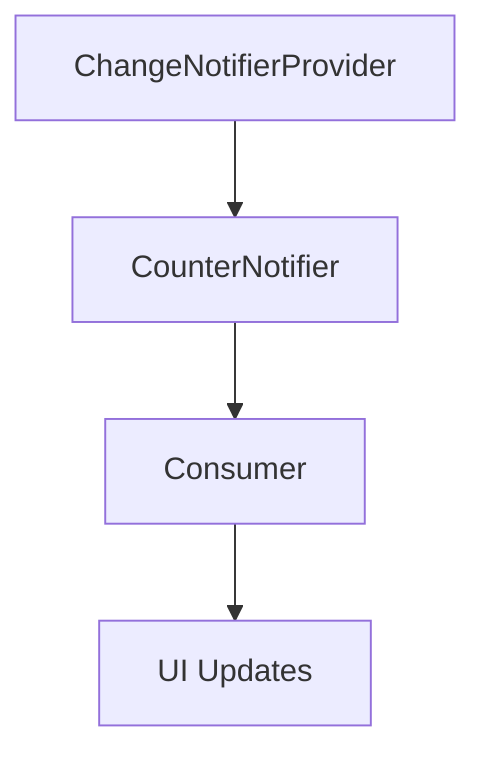

## 7.2.2 ChangeNotifier and ChangeNotifierProvider

In the world of Flutter, managing state efficiently is crucial for building responsive and adaptive applications. One of the most popular and straightforward approaches to state management in Flutter is using the `Provider` package, specifically through `ChangeNotifier` and `ChangeNotifierProvider`. This section will delve into these concepts, providing you with the knowledge and tools to implement them effectively in your Flutter projects.

### Understanding ChangeNotifier

The `ChangeNotifier` class is a part of the Flutter framework, designed to provide a simple way to manage state. It acts as a bridge between your application's state and the UI, notifying listeners when the state changes so that they can rebuild the necessary parts of the UI.

- **Role of ChangeNotifier:**
  - `ChangeNotifier` is a class that provides change notifications to its listeners. It is particularly useful when you have a state that changes over time and you need to update the UI accordingly.
  - By extending `ChangeNotifier`, you can create custom state objects that encapsulate your application's state logic.

- **Extending ChangeNotifier:**
  - When you extend `ChangeNotifier`, you create a class that can manage its own state and notify listeners when changes occur. This is achieved through the `notifyListeners()` method, which triggers a rebuild of any listening widgets.

### Implementing Change Notifier Classes

To illustrate how to implement a `ChangeNotifier`, let's create a simple example: a counter application. This application will have a `CounterNotifier` class that manages the state of a counter.

#### Creating a Notifier

Here is a step-by-step guide to creating a custom `ChangeNotifier` class:

1. **Define the Class:**
   - Create a class that extends `ChangeNotifier`.

2. **Add State Variables:**
   - Define the state variables that you want to manage. In this case, a simple integer counter.

3. **Implement Methods to Modify State:**
   - Add methods to modify the state, such as incrementing or decrementing the counter.

4. **Notify Listeners:**
   - Call `notifyListeners()` within these methods to update any listeners when the state changes.

#### Code Example: CounterNotifier

```dart
import 'package:flutter/foundation.dart';

class CounterNotifier extends ChangeNotifier {
  int _count = 0;

  int get count => _count;

  void increment() {
    _count++;
    notifyListeners(); // Notify listeners of state change
  }

  void decrement() {
    _count--;
    notifyListeners(); // Notify listeners of state change
  }
}
```

### Using ChangeNotifierProvider

The `ChangeNotifierProvider` is a widget from the `Provider` package that supplies an instance of a `ChangeNotifier` to the widget tree. It ensures that the notifier is available to all descendant widgets.

#### Provider Setup

To use `ChangeNotifierProvider`, you need to wrap your widget tree with it and provide an instance of your `ChangeNotifier`.

#### Code Example: Setting Up ChangeNotifierProvider

```dart
import 'package:flutter/material.dart';
import 'package:provider/provider.dart';

void main() {
  runApp(
    ChangeNotifierProvider(
      create: (context) => CounterNotifier(),
      child: MyApp(),
    ),
  );
}

class MyApp extends StatelessWidget {
  @override
  Widget build(BuildContext context) {
    return MaterialApp(
      home: CounterScreen(),
    );
  }
}

class CounterScreen extends StatelessWidget {
  @override
  Widget build(BuildContext context) {
    return Scaffold(
      appBar: AppBar(title: Text('Counter App')),
      body: Center(
        child: Column(
          mainAxisAlignment: MainAxisAlignment.center,
          children: <Widget>[
            Text('You have pushed the button this many times:'),
            Consumer<CounterNotifier>(
              builder: (context, counter, child) {
                return Text(
                  '${counter.count}',
                  style: Theme.of(context).textTheme.headline4,
                );
              },
            ),
          ],
        ),
      ),
      floatingActionButton: FloatingActionButton(
        onPressed: () {
          Provider.of<CounterNotifier>(context, listen: false).increment();
        },
        tooltip: 'Increment',
        child: Icon(Icons.add),
      ),
    );
  }
}
```

### Listening to Changes

The `Consumer` widget is used to listen to changes in the `ChangeNotifier` and rebuild the UI accordingly. It listens to the `ChangeNotifier` provided by `ChangeNotifierProvider` and rebuilds the widget tree whenever `notifyListeners()` is called.

#### Code Example: Using Consumer

In the above code example, the `Consumer` widget is used to listen to changes in the `CounterNotifier`. Whenever the counter value changes, the `Consumer` widget rebuilds the `Text` widget displaying the counter value.

### Optimizing Performance

To optimize performance, you can limit widget rebuilds by using the `Selector` widget or carefully specifying dependencies.

- **Selective Listening with Selector:**
  - The `Selector` widget allows you to select a specific part of the state to listen to, reducing unnecessary rebuilds.

#### Code Example: Using Selector

```dart
Consumer<CounterNotifier>(
  builder: (context, counter, child) {
    return Text(
      '${counter.count}',
      style: Theme.of(context).textTheme.headline4,
    );
  },
)
```

### Best Practices

- **Encapsulation:**
  - Encapsulate state logic within `ChangeNotifier` classes to promote separation of concerns. This makes your code more modular and easier to maintain.

- **Disposal:**
  - Properly dispose of `ChangeNotifier` instances to prevent memory leaks. This is typically handled by the `Provider` package, but it's important to be aware of.

### Mermaid.js Diagrams

To better understand how `ChangeNotifier`, `ChangeNotifierProvider`, and `Consumer` interact within the widget tree, consider the following diagram:



### Implementation Guidance

- **Comprehensive Explanations:**
  - Ensure that you understand each step of the implementation process. The code snippets provided should be clear and well-documented.

- **Interactive Examples:**
  - Experiment with the code examples by modifying the state and observing how the UI updates. This hands-on practice will reinforce your understanding.

### Conclusion

The `ChangeNotifier` and `ChangeNotifierProvider` are powerful tools in Flutter for managing state efficiently. By encapsulating state logic within `ChangeNotifier` classes and using `ChangeNotifierProvider` to supply these notifiers to the widget tree, you can build responsive and adaptive applications with ease. Remember to follow best practices, such as encapsulating state logic and properly disposing of notifiers, to ensure your applications remain performant and maintainable.

## Quiz Time!



### What is the primary role of the `ChangeNotifier` class in Flutter?

- [x] To notify listeners about state changes
- [ ] To manage routing in the application
- [ ] To handle network requests
- [ ] To provide animations

> **Explanation:** The `ChangeNotifier` class is used to notify listeners about changes in state, allowing the UI to update accordingly.

### How do you notify listeners of a state change in a `ChangeNotifier`?

- [x] By calling `notifyListeners()`
- [ ] By calling `setState()`
- [ ] By using `Navigator.push()`
- [ ] By using `Future.delayed()`

> **Explanation:** The `notifyListeners()` method is used within a `ChangeNotifier` to inform listeners of state changes.

### What widget is used to provide a `ChangeNotifier` to the widget tree?

- [x] `ChangeNotifierProvider`
- [ ] `InheritedWidget`
- [ ] `StreamBuilder`
- [ ] `FutureBuilder`

> **Explanation:** The `ChangeNotifierProvider` widget is used to supply a `ChangeNotifier` to the widget tree.

### Which widget listens to changes in a `ChangeNotifier` and rebuilds the UI?

- [x] `Consumer`
- [ ] `Scaffold`
- [ ] `AppBar`
- [ ] `Container`

> **Explanation:** The `Consumer` widget listens to changes in a `ChangeNotifier` and rebuilds the UI when changes occur.

### How can you limit widget rebuilds to optimize performance?

- [x] By using the `Selector` widget
- [ ] By using `setState()`
- [ ] By using `Future.delayed()`
- [ ] By using `Navigator.push()`

> **Explanation:** The `Selector` widget allows you to select specific parts of the state to listen to, reducing unnecessary rebuilds.

### What is a best practice for encapsulating state logic in Flutter?

- [x] Encapsulating state logic within `ChangeNotifier` classes
- [ ] Using global variables for state management
- [ ] Hardcoding values in the UI
- [ ] Using `setState()` in every widget

> **Explanation:** Encapsulating state logic within `ChangeNotifier` classes promotes separation of concerns and modularity.

### Why is it important to dispose of `ChangeNotifier` instances?

- [x] To prevent memory leaks
- [ ] To increase network speed
- [ ] To improve animation performance
- [ ] To enhance UI design

> **Explanation:** Properly disposing of `ChangeNotifier` instances prevents memory leaks and ensures efficient resource management.

### Which method is typically used to increment a counter in a `ChangeNotifier`?

- [x] A custom method like `increment()`
- [ ] `setState()`
- [ ] `Navigator.push()`
- [ ] `Future.delayed()`

> **Explanation:** Custom methods like `increment()` are used to modify state within a `ChangeNotifier`.

### What does the `Consumer` widget do when the state changes?

- [x] Rebuilds the UI components that depend on the state
- [ ] Sends a network request
- [ ] Navigates to a new screen
- [ ] Plays an animation

> **Explanation:** The `Consumer` widget rebuilds UI components that depend on the state when changes occur.

### True or False: The `ChangeNotifier` class can be used to manage routing in a Flutter application.

- [ ] True
- [x] False

> **Explanation:** The `ChangeNotifier` class is not used for managing routing; it is used for state management.


