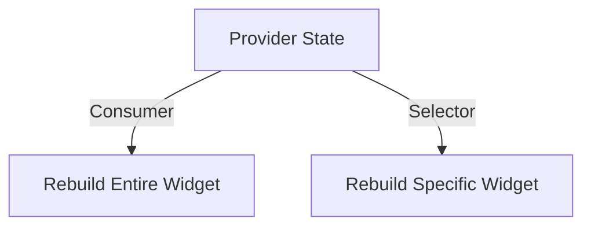

## 7.2.3 Consumer and Selector Widgets

In the world of Flutter development, managing state efficiently is crucial for building responsive and adaptive applications. The Provider package offers powerful tools to help developers manage state with ease and precision. Among these tools, the `Consumer` and `Selector` widgets stand out for their ability to optimize UI updates and improve performance. In this section, we'll delve into the functionalities, use cases, and best practices for using these widgets, providing you with the knowledge to make informed decisions in your Flutter projects.

### Consumer Widget

#### Functionality

The `Consumer` widget is a cornerstone of the Provider package, designed to listen to changes in a provider and rebuild its child widget tree accordingly. This widget is particularly useful when you need to update specific parts of your UI in response to state changes. By wrapping a widget with a `Consumer`, you ensure that it only rebuilds when the relevant provider's state changes, thus optimizing performance.

#### Usage Scenarios

The `Consumer` widget is appropriate in scenarios where you want to update a specific part of the UI based on changes in the state. For example, if you have a counter app, you might use a `Consumer` to rebuild only the widget displaying the counter value, rather than the entire screen.

#### Code Example

Let's look at a simple example of using the `Consumer` widget in a Flutter application:

```dart
import 'package:flutter/material.dart';
import 'package:provider/provider.dart';

// Define a simple ChangeNotifier class
class Counter with ChangeNotifier {
  int _count = 0;

  int get count => _count;

  void increment() {
    _count++;
    notifyListeners();
  }
}

void main() {
  runApp(
    ChangeNotifierProvider(
      create: (context) => Counter(),
      child: MyApp(),
    ),
  );
}

class MyApp extends StatelessWidget {
  @override
  Widget build(BuildContext context) {
    return MaterialApp(
      home: Scaffold(
        appBar: AppBar(title: Text('Consumer Example')),
        body: Center(
          child: Consumer<Counter>(
            builder: (context, counter, child) {
              return Text(
                'Counter: ${counter.count}',
                style: TextStyle(fontSize: 24),
              );
            },
          ),
        ),
        floatingActionButton: FloatingActionButton(
          onPressed: () {
            context.read<Counter>().increment();
          },
          child: Icon(Icons.add),
        ),
      ),
    );
  }
}
```

In this example, the `Consumer` widget listens to the `Counter` provider and rebuilds the `Text` widget whenever the counter value changes.

### Selector Widget

#### Functionality

The `Selector` widget offers more granular control over state listening by allowing you to select specific parts of the state to listen to. This widget is particularly useful when you want to optimize performance by preventing unnecessary rebuilds.

#### Advantages over Consumer

- **Performance Optimization:** The `Selector` widget can significantly reduce widget rebuilds by only listening to specific state changes. This is especially beneficial in complex applications where multiple widgets depend on different parts of the state.
  
- **Enhanced Flexibility:** The `Selector` widget allows you to transform or filter the state data before it's used in the UI, providing a flexible way to manage state dependencies.

#### Code Example

Here's an example demonstrating the use of the `Selector` widget:

```dart
import 'package:flutter/material.dart';
import 'package:provider/provider.dart';

// Define a simple ChangeNotifier class
class Counter with ChangeNotifier {
  int _count = 0;

  int get count => _count;

  void increment() {
    _count++;
    notifyListeners();
  }
}

void main() {
  runApp(
    ChangeNotifierProvider(
      create: (context) => Counter(),
      child: MyApp(),
    ),
  );
}

class MyApp extends StatelessWidget {
  @override
  Widget build(BuildContext context) {
    return MaterialApp(
      home: Scaffold(
        appBar: AppBar(title: Text('Selector Example')),
        body: Center(
          child: Selector<Counter, int>(
            selector: (context, counter) => counter.count,
            builder: (context, count, child) {
              return Text(
                'Counter: $count',
                style: TextStyle(fontSize: 24),
              );
            },
          ),
        ),
        floatingActionButton: FloatingActionButton(
          onPressed: () {
            context.read<Counter>().increment();
          },
          child: Icon(Icons.add),
        ),
      ),
    );
  }
}
```

In this example, the `Selector` widget listens only to the `count` property of the `Counter` provider, ensuring that only the relevant part of the UI is rebuilt when the count changes.

### Comparing Consumer and Selector

#### When to Use Each

- **Consumer:** Use the `Consumer` widget when you need to listen to the entire provider or when the state changes are not frequent enough to cause performance issues. It's simpler and more straightforward for general use cases.

- **Selector:** Opt for the `Selector` widget when you want to optimize performance by listening to specific parts of the state. This is ideal for complex applications where different widgets depend on different state properties.

#### Performance Implications

The `Selector` widget can be more efficient in certain scenarios by reducing unnecessary widget rebuilds. By selecting only the relevant parts of the state, you can minimize the performance overhead associated with frequent UI updates.

### Best Practices

#### Minimal Rebuilds

- Use the `Selector` widget when only a subset of the state affects the UI component. This approach minimizes unnecessary rebuilds and enhances performance.

#### Clear Separation

- Maintain a clear separation between the state logic and UI components by appropriately using `Consumer` and `Selector`. This separation ensures that your code remains clean and maintainable.

### Mermaid.js Diagrams

To better understand the differences between `Consumer` and `Selector`, let's visualize their interaction with the state using Mermaid.js diagrams.



In this diagram, the `Consumer` widget listens to the entire provider state, potentially triggering a rebuild of the entire widget tree. In contrast, the `Selector` widget listens to specific parts of the state, allowing for more targeted and efficient rebuilds.

### Implementation Guidance

- Provide side-by-side comparisons of `Consumer` and `Selector` implementations to illustrate their differences. This approach helps you understand the impact of each widget on performance and UI updates.

- Encourage readers to experiment with both widgets to understand their impact on performance and UI updates. By trying out different scenarios, you can gain a deeper understanding of when to use each widget effectively.

### Conclusion

The `Consumer` and `Selector` widgets are powerful tools in Flutter's Provider package, offering flexibility and performance optimization for state management. By understanding their functionalities and use cases, you can make informed decisions to enhance the responsiveness and efficiency of your Flutter applications. Remember to experiment with both widgets to find the best fit for your specific use cases and to maintain a clear separation between state logic and UI components for clean and maintainable code.

## Quiz Time!



### What is the primary function of the `Consumer` widget in Flutter?

- [x] To listen to changes in a provider and rebuild its child widget tree accordingly.
- [ ] To manage state directly within the widget.
- [ ] To provide a global state management solution.
- [ ] To handle navigation between screens.

> **Explanation:** The `Consumer` widget listens to changes in a provider and rebuilds its child widget tree accordingly, optimizing UI updates based on state changes.

### In which scenario is the `Consumer` widget most appropriate?

- [x] When you want to update a specific part of the UI based on state changes.
- [ ] When you need to manage global state across the entire app.
- [ ] When you want to prevent any widget rebuilds.
- [ ] When you need to handle complex animations.

> **Explanation:** The `Consumer` widget is appropriate for updating specific parts of the UI based on state changes, ensuring efficient and targeted UI updates.

### What advantage does the `Selector` widget have over the `Consumer` widget?

- [x] It allows for more granular control by selecting specific parts of the state to listen to.
- [ ] It automatically handles all state changes without manual intervention.
- [ ] It provides built-in animations for state transitions.
- [ ] It simplifies the entire state management process.

> **Explanation:** The `Selector` widget offers more granular control by allowing developers to select specific parts of the state to listen to, optimizing performance by reducing unnecessary rebuilds.

### How does the `Selector` widget enhance performance?

- [x] By preventing unnecessary rebuilds by only listening to specific state changes.
- [ ] By automatically caching all state changes.
- [ ] By reducing the memory footprint of the application.
- [ ] By handling network requests more efficiently.

> **Explanation:** The `Selector` widget enhances performance by preventing unnecessary rebuilds, as it only listens to specific state changes, reducing the overhead associated with frequent UI updates.

### When should you use the `Selector` widget instead of the `Consumer` widget?

- [x] When you want to optimize performance by listening to specific parts of the state.
- [ ] When you need to manage global state across the entire app.
- [x] When different widgets depend on different state properties.
- [ ] When you need to handle complex animations.

> **Explanation:** The `Selector` widget is ideal for optimizing performance by listening to specific parts of the state, especially in complex applications where different widgets depend on different state properties.

### What is a best practice when using the `Selector` widget?

- [x] Use it when only a subset of the state affects the UI component.
- [ ] Use it for all state management needs.
- [ ] Avoid using it in performance-critical applications.
- [ ] Use it only for managing global state.

> **Explanation:** A best practice when using the `Selector` widget is to use it when only a subset of the state affects the UI component, minimizing unnecessary rebuilds and enhancing performance.

### How can you maintain a clear separation between state logic and UI components?

- [x] By appropriately using `Consumer` and `Selector` widgets.
- [ ] By managing state directly within the UI components.
- [x] By keeping state logic separate from UI components.
- [ ] By avoiding any state management solutions.

> **Explanation:** Maintaining a clear separation between state logic and UI components can be achieved by appropriately using `Consumer` and `Selector` widgets, ensuring clean and maintainable code.

### What does the `Selector` widget allow you to do with state data before it's used in the UI?

- [x] Transform or filter the state data.
- [ ] Automatically cache the state data.
- [ ] Encrypt the state data.
- [ ] Compress the state data.

> **Explanation:** The `Selector` widget allows you to transform or filter the state data before it's used in the UI, providing flexibility in managing state dependencies.

### Which widget is simpler and more straightforward for general use cases?

- [x] Consumer
- [ ] Selector
- [ ] Provider
- [ ] ChangeNotifier

> **Explanation:** The `Consumer` widget is simpler and more straightforward for general use cases, making it a suitable choice for listening to the entire provider state.

### True or False: The `Selector` widget can be more efficient than the `Consumer` widget in certain scenarios.

- [x] True
- [ ] False

> **Explanation:** True. The `Selector` widget can be more efficient than the `Consumer` widget in certain scenarios by reducing unnecessary widget rebuilds and optimizing performance.


