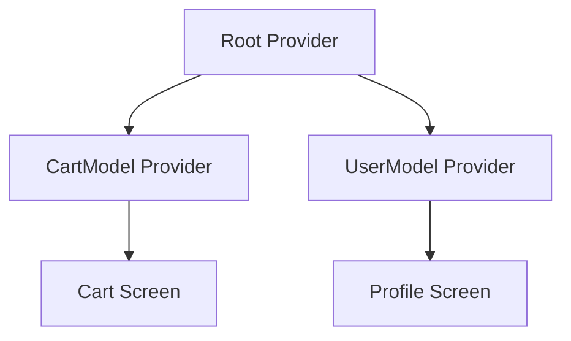

## 7.2.4 Handling Complex State with Provider

In the world of Flutter development, managing complex state efficiently is crucial for building responsive and adaptive user interfaces. As applications grow in complexity, so does the state they need to manage. This section delves into handling complex state scenarios using the Provider package, a popular choice for state management in Flutter. We will explore how to organize providers, handle asynchronous state, optimize performance, and follow best practices to ensure your application remains maintainable and performant.

### Defining Complex State Scenarios

Complex state scenarios often involve:

- **Multiple Interconnected Properties:** When state consists of various properties that depend on each other, such as a shopping cart where the total price depends on the items and their quantities.
- **Nested Data Structures:** Handling data that is deeply nested, like a JSON response from an API.
- **Asynchronous Operations:** Managing state that relies on data fetched from a network or database, which introduces latency and potential errors.

These scenarios require a structured approach to state management to ensure data consistency and responsiveness.

### Organizing Providers for Complex State

#### Multi-Provider Setup

In complex applications, it's common to have multiple state objects that need to be managed separately. The `MultiProvider` widget allows you to provide multiple providers at once, making it easier to manage different aspects of your application's state.

```dart
import 'package:flutter/material.dart';
import 'package:provider/provider.dart';

void main() {
  runApp(
    MultiProvider(
      providers: [
        ChangeNotifierProvider(create: (_) => CartModel()),
        ChangeNotifierProvider(create: (_) => UserModel()),
      ],
      child: MyApp(),
    ),
  );
}

class CartModel extends ChangeNotifier {
  // Cart-related state and methods
}

class UserModel extends ChangeNotifier {
  // User-related state and methods
}

class MyApp extends StatelessWidget {
  @override
  Widget build(BuildContext context) {
    return MaterialApp(
      home: HomeScreen(),
    );
  }
}
```

#### Provider Hierarchy

Structuring providers hierarchically ensures that data flows correctly through the widget tree and is accessible where needed. This approach also helps in optimizing performance by limiting the scope of state changes to relevant parts of the UI.



### Combining Provider with Other State Management Tools

While Provider is powerful on its own, combining it with other state management solutions like Bloc or Riverpod can be beneficial for handling highly complex state scenarios. This hybrid approach allows you to leverage the strengths of each tool.

- **Bloc:** Use Bloc for managing complex business logic and Provider for simpler state management tasks.
- **Riverpod:** Riverpod offers a more robust and flexible API compared to Provider, making it suitable for larger applications.

### Handling Asynchronous State

#### FutureProvider and StreamProvider

Provider offers `FutureProvider` and `StreamProvider` to handle asynchronous data. These providers automatically manage the lifecycle of asynchronous operations, making it easier to integrate network calls or database queries.

```dart
import 'package:flutter/material.dart';
import 'package:provider/provider.dart';

void main() {
  runApp(
    FutureProvider<String>(
      create: (_) async => fetchDataFromApi(),
      initialData: 'Loading...',
      child: MyApp(),
    ),
  );
}

Future<String> fetchDataFromApi() async {
  // Simulate network delay
  await Future.delayed(Duration(seconds: 2));
  return 'Data fetched from API';
}

class MyApp extends StatelessWidget {
  @override
  Widget build(BuildContext context) {
    final data = Provider.of<String>(context);
    return MaterialApp(
      home: Scaffold(
        appBar: AppBar(title: Text('FutureProvider Example')),
        body: Center(child: Text(data)),
      ),
    );
  }
}
```

### State Modularity and Reusability

#### Creating Modular State Classes

Breaking down complex state into smaller, reusable `ChangeNotifier` classes enhances modularity and reusability. Each class should manage a specific aspect of the state, promoting separation of concerns.

```dart
class CartModel extends ChangeNotifier {
  List<Item> _items = [];

  List<Item> get items => _items;

  void addItem(Item item) {
    _items.add(item);
    notifyListeners();
  }
}

class UserModel extends ChangeNotifier {
  String _name;

  String get name => _name;

  void updateName(String newName) {
    _name = newName;
    notifyListeners();
  }
}
```

### Performance Optimization

#### Memoization and Caching

Memoization and caching are techniques to prevent redundant computations and improve performance. By caching frequently accessed data, you can reduce the load on your application and improve responsiveness.

#### Efficient State Access

Accessing state efficiently minimizes widget rebuilds. Use `Consumer` and `Selector` widgets to rebuild only the parts of the UI that depend on specific pieces of state.

```dart
Consumer<CartModel>(
  builder: (context, cart, child) {
    return Text('Total items: ${cart.items.length}');
  },
);
```

### Best Practices

#### Separation of Concerns

Maintain clear boundaries between different state aspects to enhance maintainability. Each `ChangeNotifier` should focus on a single responsibility.

#### Testing Complex State

Testing complex state logic is crucial for ensuring reliability. Use unit tests to verify state changes and widget tests to ensure the UI responds correctly.

```dart
void main() {
  test('Adding item increases cart size', () {
    final cart = CartModel();
    final item = Item(name: 'Test Item');

    cart.addItem(item);

    expect(cart.items.length, 1);
  });
}
```

### Implementation Guidance

To effectively manage complex state with Provider, consider the following:

- **Use `MultiProvider`** to manage multiple state objects.
- **Structure providers hierarchically** to ensure efficient data flow.
- **Combine Provider with other tools** like Bloc for complex scenarios.
- **Utilize `FutureProvider` and `StreamProvider`** for asynchronous operations.
- **Break down state into modular classes** for better reusability.
- **Optimize performance** by minimizing widget rebuilds and caching data.
- **Follow best practices** for separation of concerns and testing.

By applying these techniques, you can build robust and responsive applications that handle complex state efficiently.

### Mermaid.js Diagrams

To visualize the relationships between multiple providers and their respective state classes, consider creating diagrams like the one shown earlier. These diagrams help in understanding the data flow and dependencies within your application.

### Real-World Examples

In a real-world scenario, consider an e-commerce application where you need to manage user authentication, product listings, and a shopping cart. Each of these can be managed by separate `ChangeNotifier` classes, provided using `MultiProvider`, and accessed efficiently throughout the application.

By mastering these concepts, you can tackle even the most complex state management challenges in your Flutter applications.

## Quiz Time!



### Which of the following scenarios is an example of complex state?

- [x] Managing a shopping cart with items and total price
- [ ] Displaying a static list of items
- [ ] Showing a single image on the screen
- [ ] Changing the background color of a button

> **Explanation:** Complex state involves interconnected properties, such as a shopping cart where the total price depends on the items and their quantities.


### What is the purpose of using MultiProvider in Flutter?

- [x] To provide multiple providers at once
- [ ] To manage a single state object
- [ ] To handle asynchronous operations
- [ ] To optimize widget rebuilds

> **Explanation:** MultiProvider allows you to provide multiple providers at once, making it easier to manage different aspects of your application's state.


### How does Provider ensure efficient data flow in a Flutter application?

- [x] By structuring providers hierarchically
- [ ] By using only one provider for all state
- [ ] By avoiding the use of ChangeNotifier
- [ ] By relying solely on FutureProvider

> **Explanation:** Structuring providers hierarchically ensures that data flows correctly through the widget tree and is accessible where needed.


### Which provider is used to handle asynchronous data in Flutter?

- [x] FutureProvider
- [ ] ChangeNotifierProvider
- [ ] MultiProvider
- [ ] ProxyProvider

> **Explanation:** FutureProvider is used to handle asynchronous data, such as network calls or database queries.


### What is a benefit of breaking down complex state into smaller ChangeNotifier classes?

- [x] Enhances modularity and reusability
- [ ] Increases the complexity of the application
- [ ] Reduces the number of providers needed
- [ ] Eliminates the need for testing

> **Explanation:** Breaking down complex state into smaller ChangeNotifier classes enhances modularity and reusability.


### How can you minimize widget rebuilds in a Flutter application?

- [x] By using Consumer and Selector widgets
- [ ] By using only one provider for all state
- [ ] By avoiding the use of FutureProvider
- [ ] By caching all data

> **Explanation:** Using Consumer and Selector widgets allows you to rebuild only the parts of the UI that depend on specific pieces of state, minimizing widget rebuilds.


### What is a key benefit of combining Provider with other state management tools like Bloc?

- [x] Leverages the strengths of each tool
- [ ] Reduces the number of providers needed
- [ ] Eliminates the need for asynchronous operations
- [ ] Simplifies the application architecture

> **Explanation:** Combining Provider with other state management tools like Bloc allows you to leverage the strengths of each tool for handling highly complex state scenarios.


### Which technique can prevent redundant computations and improve performance?

- [x] Memoization and caching
- [ ] Using only ChangeNotifierProvider
- [ ] Avoiding asynchronous operations
- [ ] Using only one provider for all state

> **Explanation:** Memoization and caching are techniques that prevent redundant computations and improve performance by caching frequently accessed data.


### Why is testing complex state logic important?

- [x] Ensures reliability and correctness
- [ ] Increases the complexity of the application
- [ ] Reduces the number of providers needed
- [ ] Eliminates the need for asynchronous operations

> **Explanation:** Testing complex state logic is crucial for ensuring the reliability and correctness of your application.


### True or False: Provider can only be used for synchronous state management.

- [ ] True
- [x] False

> **Explanation:** False. Provider can be used for both synchronous and asynchronous state management, with tools like FutureProvider and StreamProvider handling asynchronous data.


