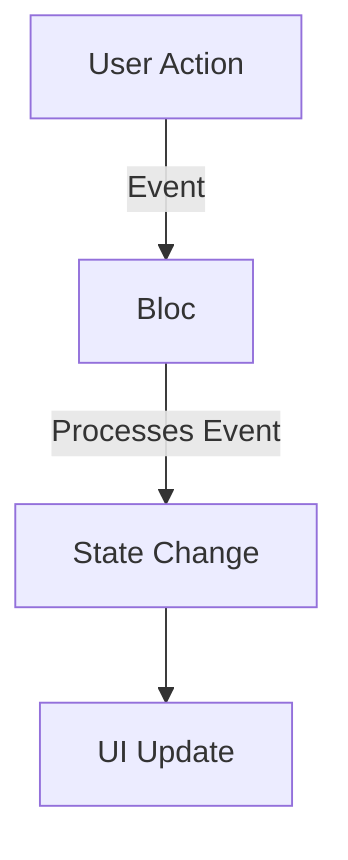

## 7.3.1 Introduction to Bloc Pattern

In the realm of Flutter development, managing state efficiently is crucial for building responsive and adaptive applications. The Bloc (Business Logic Component) pattern is a powerful state management solution that helps developers achieve a clean separation between business logic and the presentation layer. This article delves into the Bloc pattern, exploring its core concepts, advantages, and practical implementation in Flutter.

### Definition and Purpose

The Bloc pattern is a design pattern that aims to separate business logic from the UI, promoting a unidirectional data flow. This separation enhances code predictability and testability, making it easier to manage complex applications. By using the Bloc pattern, developers can ensure that their applications are scalable and maintainable.

- **Unidirectional Data Flow:** Bloc enforces a unidirectional data flow, where data moves in a single direction from the source to the UI. This approach simplifies debugging and ensures that state changes are predictable.

- **Separation of Concerns:** By decoupling business logic from the UI, Bloc allows developers to focus on building robust business logic without worrying about UI intricacies.

### Core Concepts

Understanding the core concepts of the Bloc pattern is essential for effectively implementing it in Flutter applications. These concepts include events, states, and the use of streams and sinks.

#### Events

Events are inputs to the Bloc, representing user actions or lifecycle changes. They trigger state changes within the Bloc. For example, in a counter application, pressing a button to increment or decrement the counter would be considered an event.

#### States

States are outputs from the Bloc, representing the UI's current condition based on the events processed. Each state reflects a specific point in the application's lifecycle, such as a loading state, a success state, or an error state.

#### Streams and Sinks

Bloc leverages Dart streams to handle asynchronous data flows. Streams allow the Bloc to emit new states in response to incoming events, while sinks are used to add events to the Bloc. This mechanism ensures that state changes are handled efficiently and asynchronously.

### Advantages of Using Bloc

The Bloc pattern offers several advantages that make it a popular choice for state management in Flutter applications.

- **Separation of Concerns:** Bloc enforces a clear separation between UI and business logic, making the codebase more organized and easier to maintain.

- **Scalability:** Bloc is well-suited for large and complex applications that require robust state management. Its structured approach allows developers to scale applications without compromising performance.

- **Testability:** The decoupled structure of Bloc facilitates easier unit and integration testing. Developers can test business logic independently from the UI, ensuring that the application behaves as expected.

### Installation and Setup

To get started with Bloc in your Flutter project, you need to add the `flutter_bloc` package to your `pubspec.yaml` file and import the necessary libraries.

```yaml
dependencies:
  flutter:
    sdk: flutter
  flutter_bloc: ^8.0.0
```

After adding the dependency, run `flutter pub get` to install the package. Then, import the Bloc libraries into your Dart files:

```dart
import 'package:flutter_bloc/flutter_bloc.dart';
```

### Code Example: Counter App with Bloc

Let's explore a basic Bloc implementation using a counter app. This example demonstrates how to manage increment and decrement events using Bloc.

#### Bloc Class

First, define the events and states for the counter app.

```dart
// counter_event.dart
abstract class CounterEvent {}

class Increment extends CounterEvent {}

class Decrement extends CounterEvent {}

// counter_state.dart
class CounterState {
  final int counterValue;

  CounterState(this.counterValue);
}
```

Next, create the Bloc class to handle the events and emit states.

```dart
// counter_bloc.dart
class CounterBloc extends Bloc<CounterEvent, CounterState> {
  CounterBloc() : super(CounterState(0));

  @override
  Stream<CounterState> mapEventToState(CounterEvent event) async* {
    if (event is Increment) {
      yield CounterState(state.counterValue + 1);
    } else if (event is Decrement) {
      yield CounterState(state.counterValue - 1);
    }
  }
}
```

#### UI Integration with BlocBuilder

Finally, integrate the Bloc with the UI using `BlocBuilder`.

```dart
// main.dart
import 'package:flutter/material.dart';
import 'package:flutter_bloc/flutter_bloc.dart';
import 'counter_bloc.dart';
import 'counter_event.dart';
import 'counter_state.dart';

void main() {
  runApp(MyApp());
}

class MyApp extends StatelessWidget {
  @override
  Widget build(BuildContext context) {
    return MaterialApp(
      home: BlocProvider(
        create: (context) => CounterBloc(),
        child: CounterPage(),
      ),
    );
  }
}

class CounterPage extends StatelessWidget {
  @override
  Widget build(BuildContext context) {
    final CounterBloc counterBloc = BlocProvider.of<CounterBloc>(context);

    return Scaffold(
      appBar: AppBar(title: Text('Bloc Counter')),
      body: Center(
        child: BlocBuilder<CounterBloc, CounterState>(
          builder: (context, state) {
            return Text(
              'Counter: ${state.counterValue}',
              style: TextStyle(fontSize: 24.0),
            );
          },
        ),
      ),
      floatingActionButton: Column(
        mainAxisAlignment: MainAxisAlignment.end,
        children: <Widget>[
          FloatingActionButton(
            onPressed: () => counterBloc.add(Increment()),
            tooltip: 'Increment',
            child: Icon(Icons.add),
          ),
          SizedBox(height: 8),
          FloatingActionButton(
            onPressed: () => counterBloc.add(Decrement()),
            tooltip: 'Decrement',
            child: Icon(Icons.remove),
          ),
        ],
      ),
    );
  }
}
```

### Mermaid.js Diagrams

To visualize the Bloc pattern's data flow, we can create a flow diagram illustrating the transition from events to states.



### Best Practices

Implementing Bloc effectively requires adhering to best practices to ensure optimal performance and maintainability.

- **Immutable States:** Use immutable state objects to prevent unintended side effects. This practice ensures that states are predictable and consistent.

- **Stream Management:** Properly manage streams to avoid memory leaks. Always close streams when they are no longer needed, especially in complex applications.

### Implementation Guidance

To gain a deeper understanding of the Bloc pattern, consider experimenting with interactive examples. Observe how events trigger state changes and how the UI responds accordingly. This hands-on approach will solidify your grasp of Bloc's capabilities and benefits.

### Conclusion

The Bloc pattern is a powerful tool for managing state in Flutter applications. By separating business logic from the UI and promoting a unidirectional data flow, Bloc enhances code predictability, scalability, and testability. With the knowledge gained from this article, you are well-equipped to implement Bloc in your projects and build responsive, adaptive UIs.

## Quiz Time!



### What is the primary goal of the Bloc pattern in Flutter?

- [x] To separate business logic from the presentation layer
- [ ] To enhance UI design capabilities
- [ ] To simplify network requests
- [ ] To improve database management

> **Explanation:** The Bloc pattern aims to separate business logic from the presentation layer, promoting a clean architecture and unidirectional data flow.

### Which of the following best describes an event in the Bloc pattern?

- [x] An input to the Bloc representing user actions or lifecycle changes
- [ ] An output from the Bloc representing the UI's current condition
- [ ] A method that updates the UI directly
- [ ] A configuration file for the Bloc

> **Explanation:** Events are inputs to the Bloc, representing user actions or lifecycle changes that trigger state changes.

### What is a state in the context of the Bloc pattern?

- [x] An output from the Bloc representing the UI's current condition
- [ ] An input to the Bloc representing user actions
- [ ] A function that processes events
- [ ] A stream that handles asynchronous data flows

> **Explanation:** States are outputs from the Bloc, representing the UI's current condition based on the events processed.

### How does Bloc handle asynchronous data flows?

- [x] By leveraging Dart streams
- [ ] By using synchronous functions
- [ ] By directly modifying the UI
- [ ] By employing HTTP requests

> **Explanation:** Bloc uses Dart streams to handle asynchronous data flows, allowing it to emit new states in response to events.

### What is a key advantage of using Bloc for state management?

- [x] It enforces a clear separation between UI and business logic
- [ ] It simplifies database interactions
- [ ] It enhances network security
- [ ] It reduces application size

> **Explanation:** One of the key advantages of Bloc is that it enforces a clear separation between UI and business logic, making the codebase more organized and maintainable.

### How can you add the `flutter_bloc` package to your Flutter project?

- [x] By adding it to the `pubspec.yaml` file under dependencies
- [ ] By downloading it from the Flutter website
- [ ] By writing custom code to implement Bloc functionality
- [ ] By using a built-in Flutter widget

> **Explanation:** To use the `flutter_bloc` package, you need to add it to your `pubspec.yaml` file under dependencies and run `flutter pub get`.

### What is the purpose of the `BlocBuilder` widget?

- [x] To rebuild the UI in response to state changes
- [ ] To handle HTTP requests
- [ ] To manage user authentication
- [ ] To store application settings

> **Explanation:** The `BlocBuilder` widget is used to rebuild the UI in response to state changes emitted by the Bloc.

### Why is it important to use immutable state objects in Bloc?

- [x] To prevent unintended side effects
- [ ] To enhance UI animations
- [ ] To simplify event handling
- [ ] To improve network performance

> **Explanation:** Using immutable state objects prevents unintended side effects, ensuring that states are predictable and consistent.

### What should you do to avoid memory leaks when using streams in Bloc?

- [x] Properly manage and close streams when they are no longer needed
- [ ] Use synchronous functions instead of streams
- [ ] Avoid using streams altogether
- [ ] Increase application memory allocation

> **Explanation:** Properly managing and closing streams when they are no longer needed is essential to avoid memory leaks in applications using Bloc.

### True or False: Bloc is only suitable for small applications.

- [ ] True
- [x] False

> **Explanation:** False. Bloc is suitable for both small and large applications, especially those requiring robust state management and scalability.


