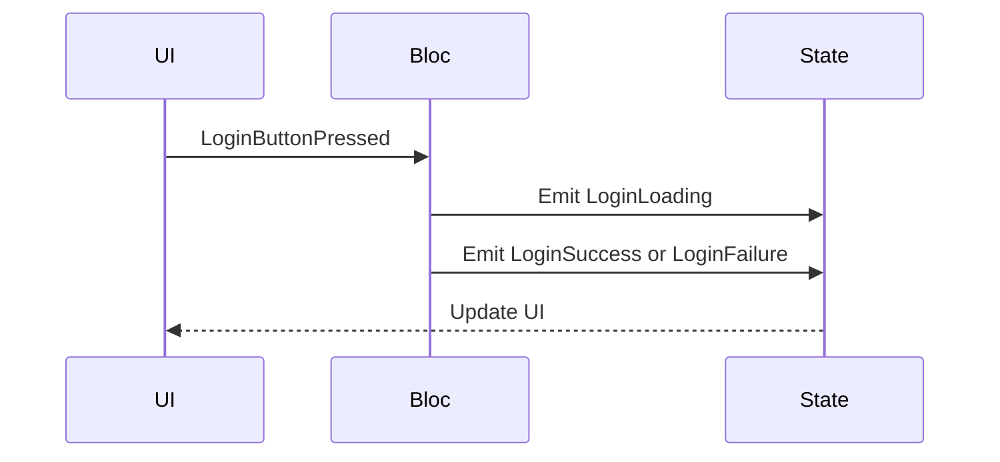

## 7.3.2 Setting Up Bloc in Flutter

In this section, we will delve into setting up Bloc in Flutter, a powerful state management solution that leverages reactive programming principles. Bloc (Business Logic Component) helps you separate business logic from UI, making your Flutter applications more manageable and scalable. We'll cover everything from project structure to integrating Bloc with your UI, ensuring you have a solid foundation to build responsive and adaptive applications.

### Project Structure for Bloc

Organizing your project structure is crucial for maintaining clarity and scalability in your Flutter applications. When using Bloc, it's recommended to follow a structured approach to separate concerns effectively. Here's a typical folder structure for a Bloc-based project:

```
lib/
│
├── blocs/
│   ├── login/
│   │   ├── login_bloc.dart
│   │   ├── login_event.dart
│   │   └── login_state.dart
│   └── ...
│
├── models/
│   └── user.dart
│
├── repositories/
│   └── user_repository.dart
│
├── screens/
│   ├── login_screen.dart
│   └── ...
│
└── main.dart
```

- **blocs/**: Contains all Bloc-related files. Each feature or domain has its own subdirectory (e.g., `login/`) with separate files for Bloc, events, and states.
- **models/**: Holds data models used across the application.
- **repositories/**: Includes classes that handle data fetching and storage, abstracting data sources.
- **screens/**: Contains UI components, typically one file per screen.
- **main.dart**: The entry point of the application.

### Installing Dependencies

To get started with Bloc in Flutter, you need to add the necessary dependencies to your project. The primary packages are `flutter_bloc` and `bloc`. Here's how you can add them:

1. Open your `pubspec.yaml` file.
2. Add the following dependencies:

```yaml
dependencies:
  flutter:
    sdk: flutter
  flutter_bloc: ^8.0.0
  bloc: ^8.0.0
```

3. Run `flutter pub get` in your terminal to install the packages.

### Creating Bloc Classes

Bloc classes are the core of the Bloc pattern, responsible for handling events and emitting states. Let's break down the creation of Bloc classes into three main components: Event classes, State classes, and the Bloc class itself.

#### Event Classes

Event classes represent the various actions that can occur in your application. Start by creating an abstract event class and then implement specific events.

```dart
// login_event.dart
import 'package:equatable/equatable.dart';

abstract class LoginEvent extends Equatable {
  const LoginEvent();

  @override
  List<Object> get props => [];
}

class LoginButtonPressed extends LoginEvent {
  final String username;
  final String password;

  const LoginButtonPressed({required this.username, required this.password});

  @override
  List<Object> get props => [username, password];
}
```

- **LoginEvent**: An abstract class that extends `Equatable` for value comparison.
- **LoginButtonPressed**: A concrete event class with properties for username and password.

#### State Classes

State classes represent the various states of your application. Similar to events, start with an abstract state class and implement specific states.

```dart
// login_state.dart
import 'package:equatable/equatable.dart';

abstract class LoginState extends Equatable {
  const LoginState();

  @override
  List<Object> get props => [];
}

class LoginInitial extends LoginState {}

class LoginLoading extends LoginState {}

class LoginSuccess extends LoginState {}

class LoginFailure extends LoginState {
  final String error;

  const LoginFailure({required this.error});

  @override
  List<Object> get props => [error];
}
```

- **LoginState**: An abstract class for different login states.
- **LoginInitial, LoginLoading, LoginSuccess, LoginFailure**: Concrete state classes representing various states of the login process.

#### Bloc Class

The Bloc class maps incoming events to outgoing states. Here's how you can create a Bloc class for a login feature:

```dart
// login_bloc.dart
import 'package:flutter_bloc/flutter_bloc.dart';
import 'login_event.dart';
import 'login_state.dart';

class LoginBloc extends Bloc<LoginEvent, LoginState> {
  LoginBloc() : super(LoginInitial());

  @override
  Stream<LoginState> mapEventToState(LoginEvent event) async* {
    if (event is LoginButtonPressed) {
      yield LoginLoading();

      try {
        // Simulate a network call
        await Future.delayed(Duration(seconds: 2));
        yield LoginSuccess();
      } catch (error) {
        yield LoginFailure(error: error.toString());
      }
    }
  }
}
```

- **LoginBloc**: Extends `Bloc` with `LoginEvent` and `LoginState`.
- **mapEventToState**: Asynchronous generator function that maps events to states.

### Code Example

Let's put it all together with a comprehensive code example demonstrating the creation of events, states, and a Bloc class for a simple login feature.

```dart
// main.dart
import 'package:flutter/material.dart';
import 'package:flutter_bloc/flutter_bloc.dart';
import 'blocs/login/login_bloc.dart';
import 'screens/login_screen.dart';

void main() {
  runApp(MyApp());
}

class MyApp extends StatelessWidget {
  @override
  Widget build(BuildContext context) {
    return MaterialApp(
      title: 'Flutter Bloc Example',
      home: BlocProvider(
        create: (context) => LoginBloc(),
        child: LoginScreen(),
      ),
    );
  }
}
```

```dart
// login_screen.dart
import 'package:flutter/material.dart';
import 'package:flutter_bloc/flutter_bloc.dart';
import '../blocs/login/login_bloc.dart';
import '../blocs/login/login_event.dart';
import '../blocs/login/login_state.dart';

class LoginScreen extends StatelessWidget {
  final TextEditingController _usernameController = TextEditingController();
  final TextEditingController _passwordController = TextEditingController();

  @override
  Widget build(BuildContext context) {
    return Scaffold(
      appBar: AppBar(title: Text('Login')),
      body: BlocListener<LoginBloc, LoginState>(
        listener: (context, state) {
          if (state is LoginFailure) {
            ScaffoldMessenger.of(context).showSnackBar(
              SnackBar(content: Text(state.error)),
            );
          }
        },
        child: BlocBuilder<LoginBloc, LoginState>(
          builder: (context, state) {
            if (state is LoginLoading) {
              return Center(child: CircularProgressIndicator());
            }

            return Padding(
              padding: EdgeInsets.all(16.0),
              child: Column(
                children: [
                  TextField(
                    controller: _usernameController,
                    decoration: InputDecoration(labelText: 'Username'),
                  ),
                  TextField(
                    controller: _passwordController,
                    decoration: InputDecoration(labelText: 'Password'),
                    obscureText: true,
                  ),
                  SizedBox(height: 20),
                  ElevatedButton(
                    onPressed: () {
                      BlocProvider.of<LoginBloc>(context).add(
                        LoginButtonPressed(
                          username: _usernameController.text,
                          password: _passwordController.text,
                        ),
                      );
                    },
                    child: Text('Login'),
                  ),
                ],
              ),
            );
          },
        ),
      ),
    );
  }
}
```

### Integration with UI

Integrating Bloc with your UI involves using `BlocProvider`, `BlocBuilder`, and `BlocListener`.

#### BlocProvider

`BlocProvider` is used to supply the Bloc instance to the widget tree. It ensures that the Bloc is available to all widgets within its subtree.

```dart
BlocProvider(
  create: (context) => LoginBloc(),
  child: LoginScreen(),
)
```

#### BlocBuilder and BlocListener

- **BlocBuilder**: Rebuilds UI components based on state changes.
- **BlocListener**: Reacts to state changes for side effects, such as showing a `SnackBar`.

```dart
BlocListener<LoginBloc, LoginState>(
  listener: (context, state) {
    if (state is LoginFailure) {
      ScaffoldMessenger.of(context).showSnackBar(
        SnackBar(content: Text(state.error)),
      );
    }
  },
  child: BlocBuilder<LoginBloc, LoginState>(
    builder: (context, state) {
      if (state is LoginLoading) {
        return Center(child: CircularProgressIndicator());
      }

      // UI for LoginInitial and LoginFailure states
    },
  ),
)
```

### Mermaid.js Diagrams

To visualize the interaction between UI events, Bloc handling, and state updates, consider using Mermaid.js sequence diagrams. Here's an example diagram:



### Best Practices

- **Single Responsibility**: Each Bloc should handle a specific feature or domain to maintain clarity and manageability.
- **Reusable Components**: Create reusable Bloc components to avoid code duplication and enhance maintainability.

### Implementation Guidance

- Include comments within code examples to explain key sections and logic.
- Provide a downloadable repository link for readers to access the complete Bloc setup.

### Conclusion

Setting up Bloc in Flutter involves organizing your project structure, creating event and state classes, and integrating Bloc with your UI. By following the best practices and guidelines outlined in this section, you'll be well-equipped to manage state effectively in your Flutter applications.

For further exploration, consider checking out the official [Bloc documentation](https://bloclibrary.dev/#/) and exploring open-source projects that utilize Bloc for state management.

## Quiz Time!



### What is the primary purpose of using Bloc in Flutter?

- [x] To separate business logic from UI components
- [ ] To enhance UI animations
- [ ] To improve network requests
- [ ] To manage app themes

> **Explanation:** Bloc is used to separate business logic from UI components, making the application more manageable and scalable.

### Which package is essential for implementing Bloc in Flutter?

- [x] flutter_bloc
- [ ] provider
- [ ] redux
- [ ] riverpod

> **Explanation:** The `flutter_bloc` package is essential for implementing Bloc in Flutter applications.

### What is the role of `BlocProvider` in a Flutter application?

- [x] To supply the Bloc instance to the widget tree
- [ ] To handle network requests
- [ ] To manage app themes
- [ ] To enhance UI animations

> **Explanation:** `BlocProvider` supplies the Bloc instance to the widget tree, making it available to all widgets within its subtree.

### What is the purpose of `BlocBuilder`?

- [x] To rebuild UI components based on state changes
- [ ] To handle network requests
- [ ] To manage app themes
- [ ] To enhance UI animations

> **Explanation:** `BlocBuilder` rebuilds UI components based on state changes, ensuring the UI reflects the current state.

### Which class represents actions that can occur in a Bloc-based application?

- [x] Event classes
- [ ] State classes
- [ ] Repository classes
- [ ] UI classes

> **Explanation:** Event classes represent actions that can occur in a Bloc-based application.

### What is the primary function of the `mapEventToState` method in a Bloc class?

- [x] To map incoming events to outgoing states
- [ ] To handle network requests
- [ ] To manage app themes
- [ ] To enhance UI animations

> **Explanation:** The `mapEventToState` method maps incoming events to outgoing states, controlling the state transitions.

### How does `BlocListener` differ from `BlocBuilder`?

- [x] `BlocListener` reacts to state changes for side effects, while `BlocBuilder` rebuilds UI components
- [ ] `BlocListener` rebuilds UI components, while `BlocBuilder` reacts to state changes for side effects
- [ ] Both have the same functionality
- [ ] Neither is used in Bloc

> **Explanation:** `BlocListener` reacts to state changes for side effects, such as showing a `SnackBar`, while `BlocBuilder` rebuilds UI components.

### What is a recommended practice for organizing Bloc-related files?

- [x] Use a structured folder approach with separate directories for Bloc, events, and states
- [ ] Place all files in a single directory
- [ ] Use random file organization
- [ ] Store files in the `assets` directory

> **Explanation:** A structured folder approach with separate directories for Bloc, events, and states is recommended for clarity and maintainability.

### Which of the following is a best practice when using Bloc in Flutter?

- [x] Ensure each Bloc handles a specific feature or domain
- [ ] Use a single Bloc for the entire application
- [ ] Avoid using Bloc for complex applications
- [ ] Use Bloc only for UI animations

> **Explanation:** Ensuring each Bloc handles a specific feature or domain helps maintain clarity and manageability.

### True or False: Bloc is suitable for managing complex state transitions in Flutter applications.

- [x] True
- [ ] False

> **Explanation:** Bloc is suitable for managing complex state transitions in Flutter applications, providing a clear separation of business logic and UI.


