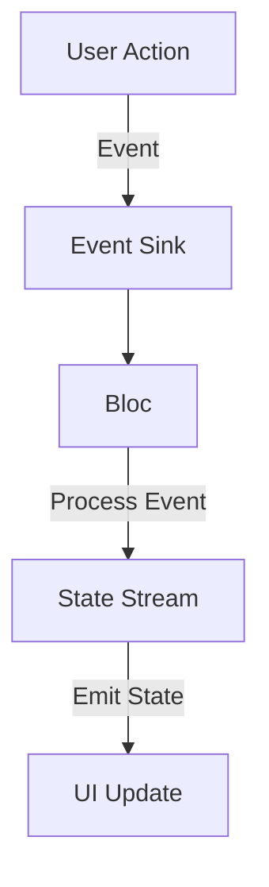

## 7.3.3 Managing State with Streams

In the realm of Flutter development, managing state efficiently is crucial for building responsive and adaptive applications. The Bloc (Business Logic Component) pattern leverages Dart streams to handle asynchronous data and state management, providing a robust framework for managing state changes in response to user interactions and data updates. This section delves into the intricacies of managing state with streams in Bloc, offering insights, practical examples, and best practices to empower you in crafting efficient Flutter applications.

### Understanding Streams in Bloc

Streams are a core component of Dart's asynchronous programming model, enabling the flow of data over time. In the Bloc pattern, streams are used to handle the flow of events and states, allowing for a reactive programming approach where the UI reacts to changes in state. This model is particularly effective in managing complex state transitions and asynchronous data handling, such as fetching data from an API or responding to user inputs.

**Key Concepts:**
- **Event Streams:** Represent user actions or data changes that trigger state transitions.
- **State Streams:** Emit new states to the UI in response to events.

### Stream Controllers

Stream controllers are pivotal in managing the flow of events and states within the Bloc pattern. They act as the bridge between the event sink and the state stream, controlling the data flow and ensuring that events are processed correctly.

#### Role of StreamControllers

A `StreamController` in Dart manages the lifecycle of a stream, providing methods to add data, listen to the stream, and close the stream when it's no longer needed. In the context of Bloc, stream controllers are used to handle both event and state streams, ensuring that data flows seamlessly between the UI and the business logic.

#### Broadcast vs. Single Subscription

- **Single Subscription Streams:** Allow only one listener at a time. These are typically used in Bloc to ensure that each event is processed in order and that no data is missed.
- **Broadcast Streams:** Allow multiple listeners and can be used when you need to share the same data stream across different parts of your application.

### Mapping Events to States

Mapping events to states is a fundamental process in the Bloc pattern, where events are dispatched to the Bloc, processed, and result in new states being emitted.

#### Event Sinks

An event sink is a mechanism through which events are added to the Bloc. When an event is added to the sink, it triggers the Bloc to process the event and determine the resulting state.

```dart
class CounterBloc extends Bloc<CounterEvent, int> {
  CounterBloc() : super(0);

  @override
  Stream<int> mapEventToState(CounterEvent event) async* {
    if (event is IncrementEvent) {
      yield state + 1;
    } else if (event is DecrementEvent) {
      yield state - 1;
    }
  }
}
```

In this example, the `CounterBloc` listens for `IncrementEvent` and `DecrementEvent` and updates the state accordingly.

#### State Streams

State streams emit new states to the UI, allowing the application to react to changes. The Bloc pattern ensures that the UI is always in sync with the current state, providing a seamless user experience.

### Stream Transformation

Stream transformation allows you to modify the data flowing through a stream before it reaches the Bloc, enabling advanced data processing techniques such as debouncing and throttling.

#### Using Transformers

Stream transformers can be used to process event streams, filtering, mapping, or modifying data as needed.

```dart
class SearchBloc extends Bloc<SearchEvent, SearchState> {
  SearchBloc() : super(SearchInitial());

  @override
  Stream<SearchState> mapEventToState(SearchEvent event) async* {
    if (event is SearchQueryChanged) {
      yield* _mapSearchQueryChangedToState(event);
    }
  }

  Stream<SearchState> _mapSearchQueryChangedToState(SearchQueryChanged event) async* {
    yield SearchLoading();
    try {
      final results = await _searchRepository.search(event.query);
      yield SearchSuccess(results);
    } catch (_) {
      yield SearchFailure();
    }
  }
}
```

#### Debouncing and Throttling

Debouncing and throttling are techniques used to control the rate of event firing, preventing excessive state updates and improving performance.

- **Debouncing:** Delays the processing of an event until a specified time has passed since the last event.
- **Throttling:** Limits the number of events processed within a given timeframe.

```dart
EventTransformer<Event> debounce<Event>(Duration duration) {
  return (events, mapper) => events.debounceTime(duration).flatMap(mapper);
}

class SearchBloc extends Bloc<SearchEvent, SearchState> {
  SearchBloc() : super(SearchInitial()) {
    on<SearchQueryChanged>(_onSearchQueryChanged, transformer: debounce(Duration(milliseconds: 300)));
  }

  void _onSearchQueryChanged(SearchQueryChanged event, Emitter<SearchState> emit) async {
    emit(SearchLoading());
    try {
      final results = await _searchRepository.search(event.query);
      emit(SearchSuccess(results));
    } catch (_) {
      emit(SearchFailure());
    }
  }
}
```

### Error Handling in Streams

Handling errors in streams is crucial to maintaining application stability and providing a robust user experience.

#### Catching Errors

Errors in streams can be caught and handled using try-catch blocks or by listening for error events.

```dart
Stream<SearchState> _mapSearchQueryChangedToState(SearchQueryChanged event) async* {
  yield SearchLoading();
  try {
    final results = await _searchRepository.search(event.query);
    yield SearchSuccess(results);
  } catch (error) {
    yield SearchFailure(error: error.toString());
  }
}
```

#### Emitting Error States

In response to stream errors, specific error states can be emitted to inform the UI of the failure and allow for appropriate user feedback.

### Mermaid.js Diagrams

To visualize the flow of events through streams and state emissions within the Bloc, consider the following diagram:



This diagram illustrates the lifecycle of an event in the Bloc pattern, from user action to UI update.

### Best Practices

#### Avoiding Memory Leaks

Closing stream controllers is essential to free up resources and prevent memory leaks. Always ensure that controllers are closed when they are no longer needed.

```dart
@override
Future<void> close() {
  _controller.close();
  return super.close();
}
```

#### Managing Stream Subscriptions

Efficient management of stream subscriptions is crucial, especially in complex applications with multiple streams. Consider using composite subscriptions to manage multiple subscriptions together.

### Implementation Guidance

- **Use `async` and `await`:** Leverage Dart's asynchronous programming features to handle operations within streams effectively.
- **Detailed Explanations:** Provide comprehensive explanations alongside code examples to clarify stream management concepts.

By understanding and implementing these concepts, you can harness the power of streams in the Bloc pattern to build responsive and adaptive Flutter applications. The ability to manage state efficiently and reactively is a cornerstone of modern app development, and mastering these techniques will significantly enhance your development skills.

## Quiz Time!



### What is the primary role of streams in the Bloc pattern?

- [x] To handle asynchronous data and state management
- [ ] To manage UI layout changes
- [ ] To store persistent data
- [ ] To handle user authentication

> **Explanation:** Streams in the Bloc pattern are used to handle asynchronous data and state management, allowing the UI to react to changes in state.

### Which type of stream allows only one listener at a time?

- [x] Single Subscription Stream
- [ ] Broadcast Stream
- [ ] Multi-Subscription Stream
- [ ] Shared Stream

> **Explanation:** Single Subscription Streams allow only one listener at a time, ensuring that each event is processed in order.

### What is the purpose of an event sink in Bloc?

- [x] To add events to the Bloc for processing
- [ ] To emit states to the UI
- [ ] To store application settings
- [ ] To handle network requests

> **Explanation:** An event sink is used to add events to the Bloc, triggering the processing of these events and resulting in state changes.

### How does debouncing help in stream management?

- [x] It delays processing of an event until a specified time has passed since the last event
- [ ] It increases the frequency of event processing
- [ ] It combines multiple events into one
- [ ] It cancels all pending events

> **Explanation:** Debouncing delays the processing of an event until a specified time has passed since the last event, preventing excessive state updates.

### What is the main difference between debouncing and throttling?

- [x] Debouncing delays event processing, while throttling limits the number of events processed in a timeframe
- [ ] Debouncing increases event frequency, while throttling decreases it
- [ ] Debouncing combines events, while throttling splits them
- [ ] Debouncing cancels events, while throttling processes them immediately

> **Explanation:** Debouncing delays event processing until a specified time has passed, while throttling limits the number of events processed within a given timeframe.

### How can errors in streams be handled in Bloc?

- [x] Using try-catch blocks or listening for error events
- [ ] By ignoring them
- [ ] By restarting the application
- [ ] By logging them to a file

> **Explanation:** Errors in streams can be handled using try-catch blocks or by listening for error events to prevent application crashes.

### Why is it important to close stream controllers?

- [x] To free up resources and prevent memory leaks
- [ ] To improve application speed
- [ ] To enhance UI performance
- [ ] To increase data storage

> **Explanation:** Closing stream controllers is essential to free up resources and prevent memory leaks, ensuring efficient resource management.

### What is the function of a stream transformer?

- [x] To modify the data flowing through a stream
- [ ] To store data permanently
- [ ] To increase data processing speed
- [ ] To encrypt data

> **Explanation:** A stream transformer is used to modify the data flowing through a stream, enabling advanced data processing techniques.

### Which keyword is recommended for handling asynchronous operations in streams?

- [x] async and await
- [ ] sync and wait
- [ ] try and catch
- [ ] start and stop

> **Explanation:** The `async` and `await` keywords are recommended for handling asynchronous operations in streams effectively.

### True or False: Broadcast streams allow multiple listeners.

- [x] True
- [ ] False

> **Explanation:** Broadcast streams allow multiple listeners, making them suitable for sharing the same data stream across different parts of an application.


