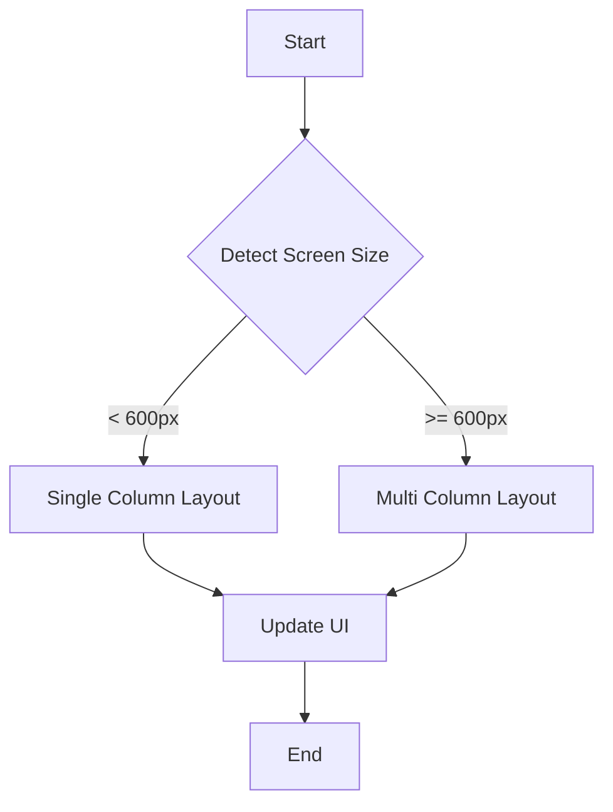

## 7.3.4 Bloc in Responsive Apps

In the ever-evolving landscape of mobile and web applications, creating responsive and adaptive user interfaces is crucial. The Bloc (Business Logic Component) pattern in Flutter offers a robust solution for managing state in such applications. This section delves into how Bloc can be leveraged to build responsive apps, ensuring that UI components adapt seamlessly to different screen sizes and orientations.

### Integrating Bloc with Responsive Layouts

Bloc is a powerful state management library that separates business logic from UI, making it an ideal choice for managing the state of responsive UI components. By using Bloc, developers can ensure that their applications respond dynamically to changes in screen size and orientation, providing a consistent user experience across devices.

#### Key Concepts

- **State Management:** Bloc handles the application's state, allowing for clean separation between UI and business logic.
- **Event-Driven Architecture:** Bloc operates on events and states, making it responsive to user interactions and environmental changes.
- **Stream-Based Updates:** Bloc uses streams to propagate state changes efficiently, ensuring smooth UI transitions.

### Dynamic UI Adjustments

Responsive applications often need to adjust their UI dynamically based on the available screen real estate. Bloc can trigger state changes that lead to these dynamic adjustments, such as switching between single-column and multi-column layouts.

#### Responsive State Changes

Bloc can manage state changes that adapt the UI to different screen sizes. For example, a Bloc can listen for changes in screen width and update the layout accordingly.

**Code Example: Toggling Layouts**

Let's consider a simple example where we toggle between a single-column and a multi-column layout based on screen width.

```dart
import 'package:flutter/material.dart';
import 'package:flutter_bloc/flutter_bloc.dart';

// Define the events
abstract class LayoutEvent {}

class UpdateLayout extends LayoutEvent {
  final double screenWidth;
  UpdateLayout(this.screenWidth);
}

// Define the states
abstract class LayoutState {}

class SingleColumnLayout extends LayoutState {}

class MultiColumnLayout extends LayoutState {}

// Define the Bloc
class LayoutBloc extends Bloc<LayoutEvent, LayoutState> {
  LayoutBloc() : super(SingleColumnLayout());

  @override
  Stream<LayoutState> mapEventToState(LayoutEvent event) async* {
    if (event is UpdateLayout) {
      if (event.screenWidth < 600) {
        yield SingleColumnLayout();
      } else {
        yield MultiColumnLayout();
      }
    }
  }
}

// Main UI
class ResponsiveLayout extends StatelessWidget {
  @override
  Widget build(BuildContext context) {
    final screenWidth = MediaQuery.of(context).size.width;

    return BlocProvider(
      create: (context) => LayoutBloc()..add(UpdateLayout(screenWidth)),
      child: BlocBuilder<LayoutBloc, LayoutState>(
        builder: (context, state) {
          if (state is SingleColumnLayout) {
            return SingleColumnWidget();
          } else if (state is MultiColumnLayout) {
            return MultiColumnWidget();
          }
          return Container();
        },
      ),
    );
  }
}

class SingleColumnWidget extends StatelessWidget {
  @override
  Widget build(BuildContext context) {
    return Center(child: Text('Single Column Layout'));
  }
}

class MultiColumnWidget extends StatelessWidget {
  @override
  Widget build(BuildContext context) {
    return Center(child: Text('Multi Column Layout'));
  }
}
```

### Handling Responsive Events

Responsive applications must detect and respond to changes in screen size or orientation. Bloc can handle these events efficiently, ensuring the UI updates accordingly.

#### Screen Size Detection Events

By leveraging `MediaQuery`, we can dispatch events that inform the Bloc of changes in screen dimensions, allowing it to update the state.

**Code Example: Dispatching Events**

```dart
class ResponsiveLayout extends StatelessWidget {
  @override
  Widget build(BuildContext context) {
    final screenWidth = MediaQuery.of(context).size.width;

    return BlocProvider(
      create: (context) => LayoutBloc(),
      child: BlocBuilder<LayoutBloc, LayoutState>(
        builder: (context, state) {
          BlocProvider.of<LayoutBloc>(context).add(UpdateLayout(screenWidth));

          if (state is SingleColumnLayout) {
            return SingleColumnWidget();
          } else if (state is MultiColumnLayout) {
            return MultiColumnWidget();
          }
          return Container();
        },
      ),
    );
  }
}
```

### Responsive Navigation with Bloc

Navigation is a critical aspect of responsive design. Bloc can manage navigation states, adapting the UI to different devices by switching between navigation components like drawers and rails.

#### Adaptive Navigation States

Bloc can handle navigation state transitions based on device width, ensuring that the navigation experience is consistent and intuitive.

**Code Example: Navigation State Management**

```dart
// Define navigation events
abstract class NavigationEvent {}

class UpdateNavigation extends NavigationEvent {
  final double screenWidth;
  UpdateNavigation(this.screenWidth);
}

// Define navigation states
abstract class NavigationState {}

class DrawerNavigation extends NavigationState {}

class RailNavigation extends NavigationState {}

// Define the Navigation Bloc
class NavigationBloc extends Bloc<NavigationEvent, NavigationState> {
  NavigationBloc() : super(DrawerNavigation());

  @override
  Stream<NavigationState> mapEventToState(NavigationEvent event) async* {
    if (event is UpdateNavigation) {
      if (event.screenWidth < 800) {
        yield DrawerNavigation();
      } else {
        yield RailNavigation();
      }
    }
  }
}

// Main UI with navigation
class ResponsiveNavigation extends StatelessWidget {
  @override
  Widget build(BuildContext context) {
    final screenWidth = MediaQuery.of(context).size.width;

    return BlocProvider(
      create: (context) => NavigationBloc()..add(UpdateNavigation(screenWidth)),
      child: BlocBuilder<NavigationBloc, NavigationState>(
        builder: (context, state) {
          if (state is DrawerNavigation) {
            return Scaffold(
              appBar: AppBar(title: Text('Responsive Navigation')),
              drawer: Drawer(child: Text('Drawer Menu')),
              body: Center(child: Text('Drawer Navigation')),
            );
          } else if (state is RailNavigation) {
            return Scaffold(
              appBar: AppBar(title: Text('Responsive Navigation')),
              body: Row(
                children: [
                  NavigationRail(
                    destinations: [
                      NavigationRailDestination(
                        icon: Icon(Icons.home),
                        label: Text('Home'),
                      ),
                      NavigationRailDestination(
                        icon: Icon(Icons.settings),
                        label: Text('Settings'),
                      ),
                    ],
                  ),
                  Expanded(child: Center(child: Text('Rail Navigation'))),
                ],
              ),
            );
          }
          return Container();
        },
      ),
    );
  }
}
```

### State Preservation in Responsive Layouts

One of the challenges in responsive design is maintaining state consistency across different layouts. Bloc ensures that state remains consistent, preventing loss during layout changes.

#### Maintaining State Consistency

Bloc's architecture naturally supports state preservation, as state is managed centrally and can be restored when the UI rebuilds. This is crucial for responsive apps where layout changes are frequent.

### Performance Optimization

Bloc's efficient stream handling contributes to smooth UI transitions, which is essential in responsive designs where state changes can be frequent and complex.

#### Efficient State Updates

By using streams, Bloc minimizes unnecessary rebuilds and ensures that only the affected parts of the UI are updated, leading to better performance and a smoother user experience.

### Mermaid.js Diagrams

Visualizing how Bloc manages responsive state changes can enhance understanding. Below is a flowchart depicting the process.



### Examples and Case Studies

Let's explore some real-world applications that utilize Bloc for managing responsive UI states.

#### Case Study: E-Commerce App

An e-commerce app might use Bloc to manage product listings, switching between grid and list views based on screen size. This enhances the user experience by providing an optimal layout for browsing products.

#### Case Study: News App

A news app could leverage Bloc to adjust its article layout, presenting a single-column view on mobile devices and a multi-column view on tablets and desktops. This ensures readability and efficient use of space.

### Best Practices

To effectively use Bloc in responsive apps, consider the following best practices:

- **Modular Blocs:** Create separate Blocs for different responsive features to maintain clarity and manageability.
- **Consistent State Management:** Ensure that state transitions related to responsiveness are handled consistently to avoid glitches.
- **Testing:** Regularly test your application on different devices to ensure that responsive behaviors work as expected.

### Implementation Guidance

Integrating Bloc with responsive design features requires careful planning and implementation. Use real-world scenarios to demonstrate Bloc's effectiveness in managing responsive state.

#### Comprehensive Code Example

Below is a complete example demonstrating how to integrate Bloc with responsive design features in a Flutter app.

```dart
import 'package:flutter/material.dart';
import 'package:flutter_bloc/flutter_bloc.dart';

// Define events, states, and Blocs as shown in previous examples...

void main() {
  runApp(MyApp());
}

class MyApp extends StatelessWidget {
  @override
  Widget build(BuildContext context) {
    return MaterialApp(
      title: 'Responsive Bloc App',
      home: ResponsiveLayout(),
    );
  }
}
```

### Conclusion

Bloc is a powerful tool for managing state in responsive Flutter applications. By separating business logic from UI, Bloc enables developers to create adaptive and responsive interfaces that provide a seamless user experience across devices. Through efficient state management and dynamic UI adjustments, Bloc ensures that your application remains performant and user-friendly.

## Quiz Time!



### What is the primary benefit of using Bloc for state management in responsive apps?

- [x] Separation of business logic from UI
- [ ] Faster rendering of UI components
- [ ] Easier integration with third-party libraries
- [ ] Automatic handling of network requests

> **Explanation:** Bloc separates business logic from UI, making it easier to manage state changes in responsive apps.

### How does Bloc handle state changes in a responsive layout?

- [x] By using events and streams to manage state transitions
- [ ] By directly modifying UI components
- [ ] By using global variables to store state
- [ ] By relying on external libraries for state management

> **Explanation:** Bloc uses an event-driven architecture with streams to handle state changes efficiently.

### What is a common use case for Bloc in responsive apps?

- [x] Switching between single-column and multi-column layouts
- [ ] Managing database connections
- [ ] Handling user authentication
- [ ] Integrating with cloud services

> **Explanation:** Bloc is often used to manage layout changes based on screen size, such as switching between single and multi-column layouts.

### How can Bloc help with responsive navigation?

- [x] By managing navigation state transitions based on device width
- [ ] By automatically generating navigation menus
- [ ] By storing navigation history in a database
- [ ] By providing built-in navigation components

> **Explanation:** Bloc can manage navigation states, adapting the UI to different devices by switching between navigation components.

### What is a best practice when using Bloc for responsive design?

- [x] Creating separate Blocs for different responsive features
- [ ] Using a single Bloc for the entire application
- [ ] Avoiding the use of streams for state management
- [ ] Directly modifying UI components from the Bloc

> **Explanation:** Creating separate Blocs for different features helps maintain clarity and manageability.

### How does Bloc ensure state consistency across different layouts?

- [x] By managing state centrally and restoring it when the UI rebuilds
- [ ] By storing state in local storage
- [ ] By using global variables
- [ ] By relying on the operating system to manage state

> **Explanation:** Bloc manages state centrally, ensuring consistency across different layouts.

### What is the role of `MediaQuery` in responsive apps using Bloc?

- [x] To provide screen size information for dispatching events
- [ ] To directly modify the UI layout
- [ ] To store user preferences
- [ ] To handle network requests

> **Explanation:** `MediaQuery` provides screen size information, which can be used to dispatch events in Bloc.

### How does Bloc contribute to performance optimization in responsive apps?

- [x] By minimizing unnecessary rebuilds through efficient stream handling
- [ ] By reducing the size of the application
- [ ] By automatically compressing images
- [ ] By caching network requests

> **Explanation:** Bloc's efficient stream handling minimizes unnecessary rebuilds, leading to better performance.

### What is a potential challenge when using Bloc in responsive apps?

- [x] Ensuring consistent state transitions across different layouts
- [ ] Integrating with third-party libraries
- [ ] Handling network requests
- [ ] Managing database connections

> **Explanation:** Ensuring consistent state transitions is crucial to avoid glitches in responsive apps.

### True or False: Bloc automatically handles all responsive layout changes without any developer intervention.

- [ ] True
- [x] False

> **Explanation:** While Bloc helps manage state changes, developers must define the logic for handling responsive layout changes.


