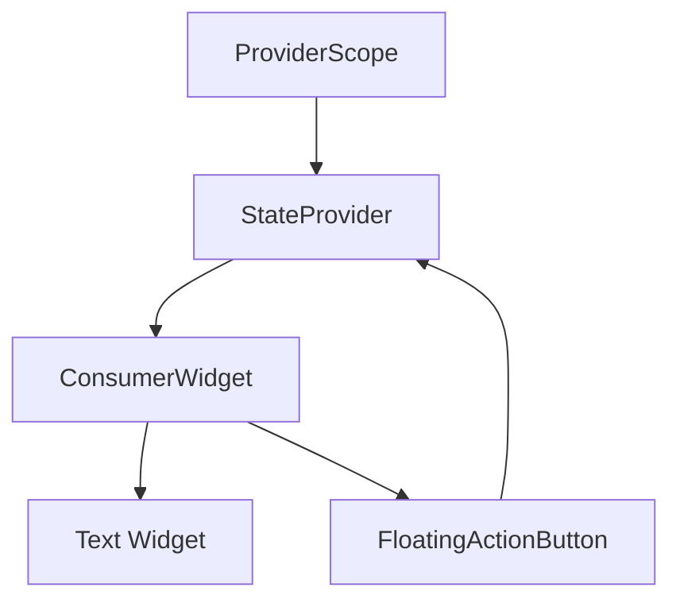

## 7.4.1 Riverpod: Enhancing State Management in Flutter

State management is a crucial aspect of building responsive and adaptive applications in Flutter. Among the various state management solutions available, Riverpod stands out for its robust features and improvements over the traditional Provider package. This section delves into Riverpod, exploring its core concepts, advantages, installation, and practical implementation.

### Introduction to Riverpod

Riverpod is a state management library for Flutter that builds upon and enhances the capabilities of the Provider package. It addresses some of the limitations of Provider by offering features such as compile-time safety, dependency injection, and improved testability. Riverpod is designed to be more flexible and powerful, making it an excellent choice for managing state in complex Flutter applications.

#### Advantages of Riverpod

- **Compile-Time Safety:** Riverpod provides compile-time checks, reducing runtime errors and enhancing code reliability.
- **Dependency Injection:** It allows for seamless dependency injection, making it easier to manage and inject dependencies across the application.
- **Better Testability:** Riverpod simplifies testing by allowing providers to be overridden, facilitating unit and integration testing.
- **No Need for Context:** Unlike Provider, Riverpod does not require a BuildContext to access providers, simplifying state access.
- **Immutability by Default:** Riverpod encourages immutable state management, promoting cleaner and more predictable code.

### Core Concepts

Understanding Riverpod's core concepts is essential for leveraging its full potential. Here, we explore the different types of providers, consumers, and hooks integration.

#### Providers

Riverpod offers various types of providers, each serving different purposes:

- **Provider:** The simplest form of provider, used for exposing a value or object that doesn't change over time.
- **StateProvider:** Manages a piece of state that can be read and written, suitable for simple state management like counters.
- **FutureProvider:** Handles asynchronous operations, such as fetching data from an API, and provides the result once available.
- **StreamProvider:** Similar to FutureProvider, but for streams, allowing widgets to react to real-time data changes.

Each provider type is designed to address specific use cases, making Riverpod versatile and adaptable to different scenarios.

#### Consumers

Riverpod introduces `ConsumerWidget` and `Consumer`, which allow widgets to listen to provider changes and rebuild when the state updates. This approach decouples the widget tree from the state management logic, promoting cleaner and more maintainable code.

#### Hooks Integration

Riverpod integrates seamlessly with `flutter_hooks`, a library that simplifies stateful widget logic by providing hooks for managing state and lifecycle events. This integration leads to more concise and readable code, enhancing developer productivity.

### Installation and Setup

To start using Riverpod in your Flutter project, follow these installation and setup steps:

1. **Add the `flutter_riverpod` Package:**

   Open your `pubspec.yaml` file and add the `flutter_riverpod` dependency:

   ```yaml
   dependencies:
     flutter:
       sdk: flutter
     flutter_riverpod: ^1.0.0
   ```

   Run `flutter pub get` to install the package.

2. **Set Up Riverpod in the Main Application:**

   Wrap your application with `ProviderScope` to initialize Riverpod:

   ```dart
   import 'package:flutter/material.dart';
   import 'package:flutter_riverpod/flutter_riverpod.dart';

   void main() {
     runApp(ProviderScope(child: MyApp()));
   }

   class MyApp extends StatelessWidget {
     @override
     Widget build(BuildContext context) {
       return MaterialApp(
         home: HomeScreen(),
       );
     }
   }
   ```

### Code Example: Managing a Counter with StateProvider

Let's implement a simple counter application using Riverpod's `StateProvider`.

1. **Declare the StateProvider:**

   ```dart
   final counterProvider = StateProvider<int>((ref) => 0);
   ```

   This provider manages an integer state, initialized to zero.

2. **Create a Widget to Consume the Provider:**

   ```dart
   class HomeScreen extends ConsumerWidget {
     @override
     Widget build(BuildContext context, WidgetRef ref) {
       final counter = ref.watch(counterProvider);

       return Scaffold(
         appBar: AppBar(title: Text('Riverpod Counter')),
         body: Center(
           child: Text(
             '$counter',
             style: TextStyle(fontSize: 40),
           ),
         ),
         floatingActionButton: FloatingActionButton(
           onPressed: () => ref.read(counterProvider.notifier).state++,
           child: Icon(Icons.add),
         ),
       );
     }
   }
   ```

   In this example, `ConsumerWidget` is used to listen to the `counterProvider`. The `ref.watch` method retrieves the current state, and `ref.read` is used to update the state when the button is pressed.

### Mermaid.js Diagrams

To better understand the provider hierarchy and data flow, consider the following Mermaid.js diagram:



This diagram illustrates the relationship between the `ProviderScope`, `StateProvider`, and the consuming widgets.

### Advantages over Provider

Riverpod offers several advantages over the traditional Provider package:

- **No Need for Context:** Riverpod eliminates the need for a BuildContext to access providers, simplifying state management and reducing boilerplate code.
- **Immutability by Default:** Riverpod encourages immutable state management, promoting cleaner and more predictable code.

### Best Practices

To maximize the benefits of Riverpod, consider the following best practices:

- **Scoped Providers:** Use providers with appropriate scopes to manage the state lifecycle effectively and prevent memory leaks.
- **Testing with Riverpod:** Riverpod simplifies testing by allowing providers to be overridden easily, facilitating unit and integration testing.

### Implementation Guidance

Riverpod offers advanced features such as family modifiers and auto-disposal, which can be leveraged for more complex state management scenarios. Here are some recommendations:

- **Family Modifiers:** Use family modifiers to create parameterized providers, allowing for dynamic provider creation based on input parameters.
- **Auto-Disposal:** Take advantage of auto-disposal to automatically clean up resources when providers are no longer needed.

Encourage readers to explore Riverpod’s extensive capabilities through practical exercises and experimentation.

### Conclusion

Riverpod is a powerful and flexible state management solution for Flutter, offering numerous advantages over traditional approaches. By understanding its core concepts, installation, and implementation, developers can build responsive and adaptive applications with ease. Riverpod's compile-time safety, dependency injection, and improved testability make it an excellent choice for managing state in complex Flutter projects.

## Quiz Time!



### What is one of the main advantages of Riverpod over Provider?

- [x] Compile-time safety
- [ ] Requires BuildContext
- [ ] Less flexible
- [ ] More boilerplate code

> **Explanation:** Riverpod provides compile-time safety, reducing runtime errors and enhancing code reliability.

### Which provider type in Riverpod is used for managing asynchronous operations?

- [ ] StateProvider
- [x] FutureProvider
- [ ] Provider
- [ ] StreamProvider

> **Explanation:** FutureProvider is used for handling asynchronous operations and provides the result once available.

### How does Riverpod simplify testing?

- [x] By allowing providers to be overridden easily
- [ ] By requiring more boilerplate code
- [ ] By using BuildContext
- [ ] By making state mutable

> **Explanation:** Riverpod allows providers to be overridden, facilitating unit and integration testing.

### What is the role of `ProviderScope` in a Riverpod application?

- [x] It initializes Riverpod and provides a scope for providers.
- [ ] It is used to declare providers.
- [ ] It is a type of provider.
- [ ] It is used for dependency injection.

> **Explanation:** `ProviderScope` initializes Riverpod and provides a scope for managing providers.

### Which Riverpod feature allows for dynamic provider creation based on input parameters?

- [ ] Auto-disposal
- [x] Family modifiers
- [ ] Hooks integration
- [ ] ConsumerWidget

> **Explanation:** Family modifiers allow for parameterized providers, enabling dynamic provider creation based on input parameters.

### What is a key benefit of using `flutter_hooks` with Riverpod?

- [x] More concise and readable code
- [ ] Increased boilerplate
- [ ] Requires BuildContext
- [ ] Less flexible state management

> **Explanation:** `flutter_hooks` integration leads to more concise and readable code, enhancing developer productivity.

### How does Riverpod handle immutability?

- [x] Encourages immutable state management
- [ ] Forces mutable state
- [ ] Requires BuildContext
- [ ] Uses mutable state by default

> **Explanation:** Riverpod encourages immutable state management, promoting cleaner and more predictable code.

### What is the purpose of `ConsumerWidget` in Riverpod?

- [x] It allows widgets to listen to provider changes and rebuild when the state updates.
- [ ] It is used to declare providers.
- [ ] It initializes Riverpod.
- [ ] It is a type of provider.

> **Explanation:** `ConsumerWidget` allows widgets to listen to provider changes and rebuild when the state updates.

### Which Riverpod provider type is suitable for real-time data changes?

- [ ] FutureProvider
- [ ] StateProvider
- [ ] Provider
- [x] StreamProvider

> **Explanation:** StreamProvider is suitable for real-time data changes, allowing widgets to react to updates.

### Riverpod eliminates the need for which Flutter concept when accessing providers?

- [x] BuildContext
- [ ] StateProvider
- [ ] FutureProvider
- [ ] ConsumerWidget

> **Explanation:** Riverpod eliminates the need for a BuildContext to access providers, simplifying state management.


