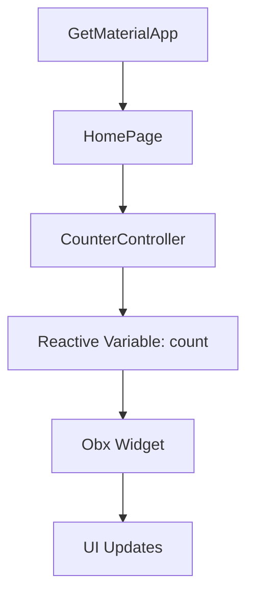

## 7.4.2 GetX

In the ever-evolving landscape of Flutter development, efficient state management, dependency injection, and routing are crucial for building responsive and adaptive applications. GetX emerges as a comprehensive solution that addresses these needs with minimal boilerplate and high performance. This section delves into the core concepts of GetX, its installation and setup, and provides practical examples to illustrate its capabilities.

### Introduction to GetX

GetX is a popular Flutter package that offers a streamlined approach to state management, dependency injection, and route management. It is designed to enhance developer productivity by reducing boilerplate code and improving application performance. GetX follows a philosophy of simplicity, where developers can achieve complex functionalities with minimal code.

#### Key Features of GetX

- **State Management:** GetX provides a reactive state management approach using observable variables, allowing for efficient UI updates.
- **Dependency Injection:** It offers a powerful dependency injection system that simplifies the management of service and controller lifecycles.
- **Route Management:** GetX includes a robust routing mechanism that supports named routes, dynamic URLs, and middleware.

### Core Concepts

#### Controllers

In GetX, controllers are central to managing state and business logic. A controller is a class that extends `GetxController`, and it is responsible for handling the state of a particular feature or module. Controllers are typically used to separate business logic from UI code, promoting a clean architecture.

```dart
import 'package:get/get.dart';

class CounterController extends GetxController {
  var count = 0.obs;

  void increment() {
    count++;
  }
}
```

In this example, `CounterController` manages a simple counter state. The `count` variable is reactive, meaning any changes to it will automatically update the UI components that are observing it.

#### Reactive State

GetX introduces reactive state management through observable variables, known as `Rx` types. These variables automatically notify listeners when their values change, enabling efficient UI updates without manual intervention.

```dart
var name = 'John'.obs;
name.value = 'Doe'; // UI components observing `name` will update automatically.
```

The `.obs` extension makes a variable reactive, and changes to its value trigger updates in the UI.

#### Dependency Injection

GetX's dependency injection system allows for easy management of service and controller lifecycles. It uses a combination of lazy loading and dependency resolution to ensure that dependencies are available when needed.

```dart
void main() {
  Get.put(CounterController()); // Registers the controller for dependency injection.
  runApp(MyApp());
}
```

By using `Get.put()`, you register a controller or service, making it available throughout the application.

### Installation and Setup

To start using GetX in your Flutter project, you need to add the `get` package to your `pubspec.yaml` file:

```yaml
dependencies:
  flutter:
    sdk: flutter
  get: ^4.6.1
```

After adding the package, run `flutter pub get` to install it. Next, set up GetX in your main application file by replacing `MaterialApp` with `GetMaterialApp`:

```dart
import 'package:flutter/material.dart';
import 'package:get/get.dart';
import 'counter_controller.dart'; // Import your controller

void main() {
  runApp(MyApp());
}

class MyApp extends StatelessWidget {
  @override
  Widget build(BuildContext context) {
    return GetMaterialApp(
      home: HomePage(),
    );
  }
}
```

`GetMaterialApp` provides additional functionalities, such as route management and dependency injection, that are not available in the standard `MaterialApp`.

### Code Example: Building a Counter App

Let's create a simple counter app using GetX to demonstrate its reactive state management capabilities.

```dart
import 'package:flutter/material.dart';
import 'package:get/get.dart';

class CounterController extends GetxController {
  var count = 0.obs;

  void increment() {
    count++;
  }
}

class HomePage extends StatelessWidget {
  final CounterController controller = Get.put(CounterController());

  @override
  Widget build(BuildContext context) {
    return Scaffold(
      appBar: AppBar(title: Text('GetX Counter')),
      body: Center(
        child: Obx(() => Text(
              'Count: ${controller.count}',
              style: TextStyle(fontSize: 24),
            )),
      ),
      floatingActionButton: FloatingActionButton(
        onPressed: controller.increment,
        child: Icon(Icons.add),
      ),
    );
  }
}

void main() {
  runApp(GetMaterialApp(home: HomePage()));
}
```

#### Explanation

- **Controller:** The `CounterController` manages the counter state using a reactive variable `count`.
- **UI Updates:** The `Obx` widget listens to changes in `count` and updates the UI automatically.
- **Dependency Injection:** The controller is registered using `Get.put()` and accessed in the `HomePage`.

### Mermaid.js Diagrams

To visualize the relationship between controllers, views, and reactive variables in GetX, consider the following diagram:



This diagram illustrates how `GetMaterialApp` initializes the `HomePage`, which interacts with the `CounterController`. The controller manages the reactive variable `count`, which is observed by the `Obx` widget to trigger UI updates.

### Advantages of GetX

#### Performance

GetX is known for its efficiency in managing state, reducing unnecessary rebuilds, and optimizing resource usage. Its reactive state management ensures that only the components that need updating are rebuilt, enhancing performance.

#### Simplicity

GetX's straightforward syntax and minimal boilerplate make it easy to implement state management, dependency injection, and routing. Developers can focus on building features without getting bogged down by complex configurations.

### Best Practices

#### Organizing Controllers

Organize controllers logically based on app features or modules. This approach promotes maintainability and scalability as your application grows.

#### Avoiding Overuse of Reactive Variables

While reactive variables are powerful, overusing them can lead to code that is difficult to read and maintain. Use reactive variables judiciously and only when necessary to trigger UI updates.

### Implementation Guidance

To further explore GetX's capabilities, consider implementing the following:

- **Dependency Injection:** Experiment with GetX's dependency injection by creating services that provide data to controllers.
- **State Management:** Use controllers to manage complex state logic, such as fetching data from APIs or handling user input.
- **Advanced Features:** Explore GetX's middleware and global state management to handle authentication, logging, or analytics.

By following these guidelines, you can leverage GetX to build responsive and adaptive Flutter applications with ease.

### Conclusion

GetX offers a comprehensive solution for state management, dependency injection, and routing in Flutter applications. Its minimal boilerplate, high performance, and simplicity make it an attractive choice for developers looking to streamline their development process. By understanding and implementing GetX's core concepts, you can build efficient and maintainable applications that adapt to various user needs and device constraints.

## Quiz Time!



### What is the primary philosophy behind GetX?

- [x] Minimal boilerplate and high performance
- [ ] Complex configurations and extensive setup
- [ ] Manual state management and routing
- [ ] Heavy reliance on third-party plugins

> **Explanation:** GetX is designed to enhance developer productivity by reducing boilerplate code and improving application performance.

### In GetX, what is the role of a controller?

- [x] To manage state and business logic
- [ ] To handle UI rendering
- [ ] To manage network requests
- [ ] To store application settings

> **Explanation:** Controllers in GetX are responsible for managing state and business logic, separating it from UI code.

### How does GetX handle reactive state management?

- [x] Using observable variables (`Rx` types)
- [ ] Through manual state updates
- [ ] By using global variables
- [ ] Through external state management libraries

> **Explanation:** GetX uses observable variables (`Rx` types) to manage reactive state, automatically updating UI components when values change.

### What is the purpose of `Get.put()` in GetX?

- [x] To register a controller or service for dependency injection
- [ ] To update the UI
- [ ] To fetch data from an API
- [ ] To navigate between routes

> **Explanation:** `Get.put()` is used to register a controller or service, making it available for dependency injection throughout the application.

### Which widget in GetX listens to changes in reactive variables?

- [x] Obx
- [ ] StatefulWidget
- [ ] StatelessWidget
- [ ] Container

> **Explanation:** The `Obx` widget in GetX listens to changes in reactive variables and updates the UI accordingly.

### What is a key advantage of using GetX for state management?

- [x] Efficiency in managing state and reducing unnecessary rebuilds
- [ ] Complexity in setup and configuration
- [ ] Requirement for extensive boilerplate code
- [ ] Limited support for routing

> **Explanation:** GetX is efficient in managing state, reducing unnecessary rebuilds, and optimizing resource usage.

### How should controllers be organized in a GetX application?

- [x] Logically based on app features or modules
- [ ] Randomly throughout the project
- [ ] All in a single file
- [ ] Based on UI components

> **Explanation:** Organizing controllers logically based on app features or modules promotes maintainability and scalability.

### What is a potential downside of overusing reactive variables in GetX?

- [x] Code that is difficult to read and maintain
- [ ] Improved performance
- [ ] Simplified state management
- [ ] Enhanced readability

> **Explanation:** Overusing reactive variables can lead to code that is difficult to read and maintain, so they should be used judiciously.

### What does `GetMaterialApp` provide that `MaterialApp` does not?

- [x] Additional functionalities like route management and dependency injection
- [ ] A different theme
- [ ] Built-in network handling
- [ ] Automatic database integration

> **Explanation:** `GetMaterialApp` provides additional functionalities such as route management and dependency injection, which are not available in the standard `MaterialApp`.

### True or False: GetX can only be used for state management in Flutter applications.

- [ ] True
- [x] False

> **Explanation:** False. GetX is a comprehensive solution that includes state management, dependency injection, and route management, making it versatile for various application needs.


