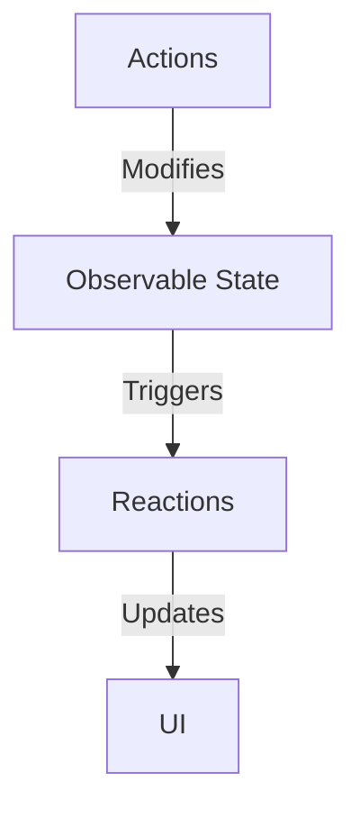

## 7.4.3 MobX

State management is a crucial aspect of building responsive and adaptive applications in Flutter. Among the various state management solutions available, MobX stands out for its simplicity and power, rooted in reactive programming principles. In this section, we will delve into MobX, exploring its core concepts, installation process, practical implementation, and best practices to harness its full potential in your Flutter applications.

### Introduction to MobX

MobX is a state management library that leverages reactive programming to manage application state efficiently. It is designed to make state management simple and scalable by using observables, actions, and reactions. These core concepts allow MobX to automatically keep the UI in sync with the underlying state, reducing boilerplate code and enhancing developer productivity.

**Reactive Programming Foundation:**

Reactive programming is a paradigm that focuses on asynchronous data streams and the propagation of change. In MobX, this is achieved through observables that notify observers when changes occur, actions that modify these observables, and reactions that respond to changes, updating the UI or executing side effects.

### Core Concepts

#### Observables

Observables are the cornerstone of MobX. They represent the state that can change over time. When an observable changes, MobX automatically notifies all observers, ensuring that the UI reflects the latest state.

```dart
import 'package:mobx/mobx.dart';

// Part of code generation setup
part 'counter.g.dart';

class Counter = _Counter with _$Counter;

abstract class _Counter with Store {
  @observable
  int value = 0;
}
```

In the example above, `value` is an observable property. Any changes to `value` will trigger updates to any observers watching it.

#### Actions

Actions are methods that modify the state of observables. They encapsulate the logic for changing state, ensuring that all modifications are tracked and can trigger reactions.

```dart
abstract class _Counter with Store {
  @observable
  int value = 0;

  @action
  void increment() {
    value++;
  }
}
```

Here, the `increment` method is an action that modifies the `value` observable. Actions help maintain a clear separation between state and behavior.

#### Reactions

Reactions are listeners that respond to changes in observables. They can update the UI or perform other side effects when the state changes.

```dart
Observer(
  builder: (_) => Text(
    '${counter.value}',
    style: TextStyle(fontSize: 24),
  ),
)
```

In this Flutter widget, the `Observer` listens to changes in the `counter.value` observable and rebuilds the `Text` widget whenever the value changes.

### Installation and Setup

To use MobX in your Flutter project, you need to add the necessary packages and set up code generation.

1. **Add Dependencies:**

   Add `mobx` and `flutter_mobx` to your `pubspec.yaml` file:

   ```yaml
   dependencies:
     flutter:
       sdk: flutter
     mobx: ^2.0.0
     flutter_mobx: ^2.0.0

   dev_dependencies:
     build_runner: ^2.0.0
     mobx_codegen: ^2.0.0
   ```

2. **Run Code Generation:**

   Use the following command to generate the necessary code for MobX:

   ```bash
   flutter packages pub run build_runner build
   ```

   This command will generate the `*.g.dart` files required for MobX to function.

### Code Example: Counter App

Let's implement a simple counter app using MobX to demonstrate observable state, actions, and UI updates.

```dart
import 'package:flutter/material.dart';
import 'package:flutter_mobx/flutter_mobx.dart';
import 'package:mobx/mobx.dart';

// Part of code generation setup
part 'counter.g.dart';

class Counter = _Counter with _$Counter;

abstract class _Counter with Store {
  @observable
  int value = 0;

  @action
  void increment() {
    value++;
  }
}

void main() {
  runApp(MyApp());
}

class MyApp extends StatelessWidget {
  final Counter counter = Counter();

  @override
  Widget build(BuildContext context) {
    return MaterialApp(
      home: Scaffold(
        appBar: AppBar(title: Text('MobX Counter')),
        body: Center(
          child: Observer(
            builder: (_) => Text(
              '${counter.value}',
              style: TextStyle(fontSize: 24),
            ),
          ),
        ),
        floatingActionButton: FloatingActionButton(
          onPressed: counter.increment,
          child: Icon(Icons.add),
        ),
      ),
    );
  }
}
```

In this example, the `Counter` class manages the state with an observable `value` and an action `increment`. The `Observer` widget ensures that the UI updates whenever `value` changes.

### Mermaid.js Diagrams

To visualize the flow of data and state changes in MobX, we can use Mermaid.js diagrams. Below is a diagram illustrating the interaction between observables, actions, and reactions:



This diagram shows how actions modify the observable state, which in turn triggers reactions that update the UI.

### Advantages of MobX

#### Reactivity

MobX's reactive nature ensures that the UI automatically stays in sync with state changes. This reduces the need for manual updates and minimizes the risk of UI inconsistencies.

#### Scalability

MobX scales well with complex state scenarios by organizing state into manageable stores. This modular approach allows developers to maintain and extend the application state efficiently.

### Best Practices

#### Modular Stores

Organize state into separate stores based on app features or modules. This modular approach enhances maintainability and scalability.

#### Avoiding Side Effects in Actions

Keep actions pure and avoid unintended side effects to maintain predictable state changes. This practice ensures that state transitions are clear and traceable.

### Implementation Guidance

To fully leverage MobX in your Flutter applications, consider creating and using multiple MobX stores. This approach allows you to encapsulate different parts of your application's state and logic, making your codebase more organized and easier to manage.

#### Example: Multiple Stores

Suppose you have an app with user authentication and a product catalog. You can create separate stores for managing user and product states.

```dart
class UserStore = _UserStore with _$UserStore;

abstract class _UserStore with Store {
  @observable
  String username = '';

  @action
  void setUsername(String name) {
    username = name;
  }
}

class ProductStore = _ProductStore with _$ProductStore;

abstract class _ProductStore with Store {
  @observable
  List<String> products = [];

  @action
  void addProduct(String product) {
    products.add(product);
  }
}
```

By separating concerns into different stores, you can manage each aspect of your app's state independently.

### Advanced Features

MobX offers advanced features like computed properties and asynchronous actions. Computed properties derive new state from existing observables, while asynchronous actions handle operations like network requests.

#### Computed Properties

```dart
abstract class _Counter with Store {
  @observable
  int value = 0;

  @computed
  bool get isEven => value % 2 == 0;
}
```

The `isEven` computed property derives its value from the `value` observable, automatically updating when `value` changes.

#### Asynchronous Actions

```dart
abstract class _DataStore with Store {
  @observable
  String data = '';

  @action
  Future<void> fetchData() async {
    final response = await fetchDataFromApi();
    data = response;
  }
}
```

Asynchronous actions allow you to handle asynchronous operations while keeping the state management logic clean and organized.

### Conclusion

MobX provides a powerful and flexible approach to state management in Flutter applications. By leveraging its reactive programming principles, developers can build responsive and adaptive UIs that automatically stay in sync with the underlying state. With its modular store architecture, MobX scales well for complex applications, making it a valuable tool for Flutter developers.

### Further Exploration

To deepen your understanding of MobX, consider exploring its official documentation and community resources. Additionally, experiment with MobX's advanced features in your projects to fully appreciate its capabilities.

## Quiz Time!



### What is the primary purpose of observables in MobX?

- [x] To track state changes and notify observers
- [ ] To perform side effects
- [ ] To modify state
- [ ] To manage UI components

> **Explanation:** Observables in MobX are used to track state changes and notify observers, ensuring that the UI stays in sync with the state.

### What role do actions play in MobX?

- [x] They modify observables and trigger reactions
- [ ] They listen for changes in observables
- [ ] They update the UI directly
- [ ] They manage asynchronous operations

> **Explanation:** Actions in MobX are responsible for modifying observables and triggering reactions, which in turn update the UI.

### How does MobX ensure UI consistency?

- [x] By automatically syncing the UI with state changes
- [ ] By requiring manual UI updates
- [ ] By using a centralized state store
- [ ] By enforcing strict typing

> **Explanation:** MobX ensures UI consistency by automatically syncing the UI with state changes through its reactive system.

### What is the purpose of the `Observer` widget in Flutter MobX?

- [x] To rebuild the UI when observables change
- [ ] To manage state changes
- [ ] To perform asynchronous operations
- [ ] To define computed properties

> **Explanation:** The `Observer` widget in Flutter MobX rebuilds the UI whenever the observables it depends on change.

### What is a best practice when using actions in MobX?

- [x] Keep actions pure and avoid side effects
- [ ] Use actions to directly update the UI
- [ ] Perform network requests within actions
- [ ] Use actions to manage navigation

> **Explanation:** A best practice in MobX is to keep actions pure and avoid side effects to ensure predictable state changes.

### How can MobX be scaled for complex applications?

- [x] By organizing state into modular stores
- [ ] By using a single global store
- [ ] By avoiding the use of actions
- [ ] By manually updating the UI

> **Explanation:** MobX can be scaled for complex applications by organizing state into modular stores, enhancing maintainability and scalability.

### What is a computed property in MobX?

- [x] A property that derives its value from other observables
- [ ] A property that performs asynchronous operations
- [ ] A property that directly modifies state
- [ ] A property that triggers UI updates

> **Explanation:** A computed property in MobX derives its value from other observables and automatically updates when those observables change.

### How are asynchronous operations handled in MobX?

- [x] Through asynchronous actions
- [ ] Through synchronous actions
- [ ] Through observables
- [ ] Through reactions

> **Explanation:** Asynchronous operations in MobX are handled through asynchronous actions, which allow for clean and organized state management.

### Which of the following is an advantage of MobX?

- [x] Reactivity and automatic UI updates
- [ ] Manual state synchronization
- [ ] Complex setup process
- [ ] Lack of modularity

> **Explanation:** An advantage of MobX is its reactivity, which ensures automatic UI updates in response to state changes.

### True or False: MobX requires manual UI updates to reflect state changes.

- [ ] True
- [x] False

> **Explanation:** False. MobX automatically updates the UI in response to state changes, eliminating the need for manual updates.


