## 7.4.4 Comparative Analysis

State management is a critical aspect of Flutter development, especially when building responsive and adaptive UIs. With numerous state management solutions available, choosing the right one can significantly impact your application's architecture, performance, and maintainability. This section provides a comprehensive comparative analysis of five popular state management solutions in Flutter: Provider, Bloc, Riverpod, GetX, and MobX. We will explore their complexity, scalability, performance, ease of use, community support, features, and flexibility to help you make an informed decision.

### Complexity

**Provider:**
- **Complexity Level:** Low to Medium
- **Overview:** Provider is often recommended for its simplicity and is a great starting point for beginners. It leverages Flutter's inherited widget mechanism to propagate state changes down the widget tree.
- **Example Use Case:** Ideal for small to medium-sized applications where state changes are relatively straightforward.

**Bloc:**
- **Complexity Level:** Medium to High
- **Overview:** Bloc (Business Logic Component) introduces a more structured approach by separating business logic from UI. It uses streams to manage state, which can be more complex for beginners.
- **Example Use Case:** Suitable for large applications requiring a clear separation of concerns and complex state management.

**Riverpod:**
- **Complexity Level:** Medium
- **Overview:** Riverpod is an evolution of Provider, offering a more robust and flexible API. It eliminates some of the limitations of Provider, such as context-related issues.
- **Example Use Case:** Useful for applications that need a more powerful and flexible state management solution without the overhead of Bloc.

**GetX:**
- **Complexity Level:** Low
- **Overview:** GetX is known for its simplicity and minimal boilerplate. It provides a reactive programming model and is easy to integrate.
- **Example Use Case:** Perfect for developers looking for a quick and easy state management solution with additional features like navigation and dependency injection.

**MobX:**
- **Complexity Level:** Medium
- **Overview:** MobX uses observables and reactions to manage state, offering a reactive approach. It can be complex due to its reliance on annotations and code generation.
- **Example Use Case:** Best for developers familiar with reactive programming and looking for a solution that seamlessly integrates with Flutter's widget tree.

### Scalability

**Provider:**
- **Scalability:** Moderate
- **Discussion:** While Provider is suitable for small to medium apps, it can become cumbersome as the application grows due to the need for manual wiring of dependencies.

**Bloc:**
- **Scalability:** High
- **Discussion:** Bloc excels in large applications with complex state management needs. Its clear separation of business logic makes it easier to scale and maintain.

**Riverpod:**
- **Scalability:** High
- **Discussion:** Riverpod's flexibility and lack of context dependency make it highly scalable. It supports advanced features like dependency injection and lazy loading.

**GetX:**
- **Scalability:** Moderate
- **Discussion:** GetX is scalable to an extent but might require additional structuring for very large applications due to its simplicity and minimal boilerplate.

**MobX:**
- **Scalability:** High
- **Discussion:** MobX scales well with its reactive approach, but the reliance on code generation can be a barrier for some developers.

### Performance

**Provider:**
- **Performance:** Good
- **Analysis:** Provider is efficient for most use cases, but excessive widget rebuilds can occur if not managed properly.

**Bloc:**
- **Performance:** Excellent
- **Analysis:** Bloc's use of streams ensures efficient state management, minimizing unnecessary rebuilds and improving performance.

**Riverpod:**
- **Performance:** Excellent
- **Analysis:** Riverpod offers performance optimizations over Provider, such as improved dependency management and reduced rebuilds.

**GetX:**
- **Performance:** Excellent
- **Analysis:** GetX is highly performant due to its reactive model and efficient state updates.

**MobX:**
- **Performance:** Good
- **Analysis:** MobX provides good performance with its reactive system, but the overhead of observables can impact performance if not used judiciously.

### Ease of Use

**Provider:**
- **Ease of Use:** High
- **Learning Curve:** Low
- **Discussion:** Provider is beginner-friendly with straightforward integration and minimal boilerplate.

**Bloc:**
- **Ease of Use:** Moderate
- **Learning Curve:** High
- **Discussion:** Bloc requires a deeper understanding of streams and reactive programming, which can be challenging for newcomers.

**Riverpod:**
- **Ease of Use:** Moderate
- **Learning Curve:** Medium
- **Discussion:** Riverpod simplifies some of Provider's complexities but still requires a good understanding of state management concepts.

**GetX:**
- **Ease of Use:** High
- **Learning Curve:** Low
- **Discussion:** GetX is easy to use with minimal setup, making it accessible for developers of all skill levels.

**MobX:**
- **Ease of Use:** Moderate
- **Learning Curve:** Medium
- **Discussion:** MobX is relatively easy to use once the initial setup and understanding of observables are complete.

### Community and Ecosystem

**Provider:**
- **Community Support:** Strong
- **Documentation Quality:** High
- **Discussion:** Provider is well-documented with a large community, making it easy to find resources and support.

**Bloc:**
- **Community Support:** Strong
- **Documentation Quality:** High
- **Discussion:** Bloc has a robust community and excellent documentation, with many tutorials and examples available.

**Riverpod:**
- **Community Support:** Growing
- **Documentation Quality:** High
- **Discussion:** Riverpod is gaining popularity, with increasing community support and comprehensive documentation.

**GetX:**
- **Community Support:** Moderate
- **Documentation Quality:** Moderate
- **Discussion:** GetX has a dedicated community, but documentation can be sparse or outdated at times.

**MobX:**
- **Community Support:** Moderate
- **Documentation Quality:** Moderate
- **Discussion:** MobX has a smaller community compared to others, but it is growing steadily with improving documentation.

### Features and Flexibility

**Provider:**
- **Features:** Basic state management, dependency injection
- **Flexibility:** Moderate
- **Discussion:** Provider offers essential features for state management but lacks advanced capabilities.

**Bloc:**
- **Features:** Stream-based state management, clear separation of concerns
- **Flexibility:** High
- **Discussion:** Bloc provides a structured approach with high flexibility for complex applications.

**Riverpod:**
- **Features:** Advanced dependency management, context-free API
- **Flexibility:** High
- **Discussion:** Riverpod offers flexibility with features like auto-disposal and improved dependency handling.

**GetX:**
- **Features:** Reactive state management, navigation, dependency injection
- **Flexibility:** High
- **Discussion:** GetX combines state management with additional features, offering high flexibility.

**MobX:**
- **Features:** Reactive state management, observables, reactions
- **Flexibility:** High
- **Discussion:** MobX provides a flexible reactive system, ideal for developers familiar with reactive programming.

### Visual Comparison

To better understand the differences between these state management solutions, let's create a comparative table using Mermaid.js:

```mermaid
graph TD;
    A[Provider] -->|Complexity| B[Low to Medium];
    A -->|Scalability| C[Moderate];
    A -->|Performance| D[Good];
    A -->|Ease of Use| E[High];
    A -->|Community| F[Strong];
    A -->|Features| G[Basic];

    H[Bloc] -->|Complexity| I[Medium to High];
    H -->|Scalability| J[High];
    H -->|Performance| K[Excellent];
    H -->|Ease of Use| L[Moderate];
    H -->|Community| M[Strong];
    H -->|Features| N[Stream-based];

    O[Riverpod] -->|Complexity| P[Medium];
    O -->|Scalability| Q[High];
    O -->|Performance| R[Excellent];
    O -->|Ease of Use| S[Moderate];
    O -->|Community| T[Growing];
    O -->|Features| U[Advanced];

    V[GetX] -->|Complexity| W[Low];
    V -->|Scalability| X[Moderate];
    V -->|Performance| Y[Excellent];
    V -->|Ease of Use| Z[High];
    V -->|Community| AA[Moderate];
    V -->|Features| AB[Reactive];

    AC[MobX] -->|Complexity| AD[Medium];
    AC -->|Scalability| AE[High];
    AC -->|Performance| AF[Good];
    AC -->|Ease of Use| AG[Moderate];
    AC -->|Community| AH[Moderate];
    AC -->|Features| AI[Reactive];
```

### Choosing the Right Tool

Selecting the appropriate state management solution depends on various factors, including project requirements, team expertise, and long-term maintenance considerations. Here are some guidelines to help you choose:

- **For Beginners:** Start with **Provider** or **GetX** due to their simplicity and ease of use.
- **For Large Applications:** Consider **Bloc** or **Riverpod** for their scalability and structured approach.
- **For Reactive Programming Enthusiasts:** **MobX** offers a powerful reactive system with observables and reactions.
- **For Quick Prototyping:** **GetX** provides a fast setup with minimal boilerplate.

### Real-World Applications

**Provider Example:**
- **Application:** A small e-commerce app managing user authentication and product listings.
- **Outcome:** Easy to implement and maintain, with minimal overhead.

**Bloc Example:**
- **Application:** A large-scale financial application with complex transaction management.
- **Outcome:** Improved maintainability and separation of concerns, facilitating team collaboration.

**Riverpod Example:**
- **Application:** A medium-sized social media app with dynamic content feeds.
- **Outcome:** Enhanced flexibility and performance, with reduced context-related issues.

**GetX Example:**
- **Application:** A simple weather app with real-time updates and navigation.
- **Outcome:** Quick development and integration, with reactive state management.

**MobX Example:**
- **Application:** A productivity app with real-time collaboration features.
- **Outcome:** Seamless integration of reactive features, enhancing user experience.

### Best Practices

- **Consider Project Needs:** Evaluate the complexity and scale of your application before choosing a state management solution.
- **Assess Team Expertise:** Choose a solution that aligns with your team's skill level and familiarity.
- **Plan for Maintenance:** Consider the long-term maintainability and scalability of the chosen approach.
- **Experiment and Iterate:** Don't hesitate to experiment with different solutions and iterate based on feedback and performance.

### Implementation Guidance

To summarize the key differences, pros, and cons of each state management solution, refer to the following table:

| Solution  | Complexity | Scalability | Performance | Ease of Use | Community Support | Features       |
|-----------|------------|-------------|-------------|-------------|-------------------|----------------|
| Provider  | Low to Medium | Moderate    | Good        | High        | Strong            | Basic          |
| Bloc      | Medium to High | High        | Excellent   | Moderate    | Strong            | Stream-based   |
| Riverpod  | Medium     | High        | Excellent   | Moderate    | Growing           | Advanced       |
| GetX      | Low        | Moderate    | Excellent   | High        | Moderate          | Reactive       |
| MobX      | Medium     | High        | Good        | Moderate    | Moderate          | Reactive       |

### Transitioning Between State Management Approaches

If you find the need to transition between state management solutions, consider the following steps:

- **Evaluate Current Limitations:** Identify the pain points and limitations of your current approach.
- **Plan the Transition:** Develop a migration plan that minimizes disruption to your existing codebase.
- **Incremental Migration:** Gradually transition parts of your application to the new solution, starting with non-critical components.
- **Test Thoroughly:** Ensure that the new implementation is thoroughly tested to prevent regressions.
- **Document Changes:** Keep detailed documentation of the transition process for future reference.

By understanding the strengths and weaknesses of each state management solution, you can make informed decisions that align with your project's goals and team capabilities. Remember, the right choice depends on your specific context and requirements, so take the time to evaluate each option carefully.

## Quiz Time!



### Which state management solution is known for its simplicity and minimal boilerplate?

- [ ] Bloc
- [ ] MobX
- [x] GetX
- [ ] Riverpod

> **Explanation:** GetX is known for its simplicity and minimal boilerplate, making it easy to integrate and use.

### Which solution is best suited for large applications with complex state management needs?

- [x] Bloc
- [ ] Provider
- [ ] GetX
- [ ] MobX

> **Explanation:** Bloc is well-suited for large applications due to its structured approach and clear separation of concerns.

### Which state management solution offers a context-free API and advanced dependency management?

- [ ] GetX
- [ ] MobX
- [x] Riverpod
- [ ] Provider

> **Explanation:** Riverpod provides a context-free API and advanced dependency management, making it flexible and powerful.

### What is a key advantage of using Bloc for state management?

- [ ] Minimal setup
- [x] Clear separation of concerns
- [ ] Reactive programming model
- [ ] Code generation

> **Explanation:** Bloc offers a clear separation of concerns, which is beneficial for maintaining large and complex applications.

### Which state management solution is ideal for developers familiar with reactive programming?

- [ ] Provider
- [ ] Bloc
- [ ] GetX
- [x] MobX

> **Explanation:** MobX is ideal for developers familiar with reactive programming due to its use of observables and reactions.

### Which solution is recommended for beginners due to its simplicity?

- [ ] Bloc
- [ ] MobX
- [x] Provider
- [ ] Riverpod

> **Explanation:** Provider is recommended for beginners due to its simplicity and ease of use.

### Which state management solution combines state management with navigation and dependency injection?

- [ ] Provider
- [ ] Bloc
- [x] GetX
- [ ] Riverpod

> **Explanation:** GetX combines state management with navigation and dependency injection, offering a comprehensive solution.

### Which solution is known for its stream-based state management?

- [ ] GetX
- [ ] MobX
- [x] Bloc
- [ ] Riverpod

> **Explanation:** Bloc is known for its stream-based state management, which helps manage complex state changes efficiently.

### Which state management solution is gaining popularity with increasing community support?

- [ ] GetX
- [ ] MobX
- [x] Riverpod
- [ ] Provider

> **Explanation:** Riverpod is gaining popularity with increasing community support and comprehensive documentation.

### True or False: MobX relies on code generation for its reactive system.

- [x] True
- [ ] False

> **Explanation:** MobX relies on code generation for its reactive system, which can add complexity but provides powerful features.


