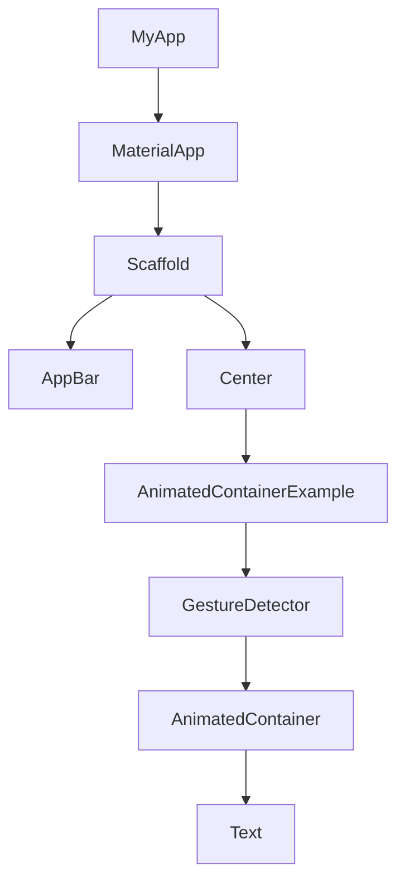

## 8.1.1 Implicit Animations

In the world of mobile app development, animations play a crucial role in creating engaging and intuitive user interfaces. Flutter, known for its expressive and flexible UI toolkit, provides developers with powerful tools to implement animations effortlessly. Among these tools, implicit animations stand out for their simplicity and ease of use. In this section, we will delve into the concept of implicit animations, explore common widgets that facilitate these animations, and provide practical examples to help you integrate them into your Flutter applications.

### Definition and Purpose

Implicit animations in Flutter are a type of animation where the framework automatically handles the transition between the old and new states of a widget. Unlike explicit animations, which require developers to manage animation controllers and define the animation's behavior explicitly, implicit animations simplify the process by allowing Flutter to interpolate between values over a specified duration.

The primary purpose of implicit animations is to animate changes in a widget's properties, such as size, color, or alignment, without the need for complex animation logic. This makes them ideal for quick enhancements and adding subtle animations to your app's UI, improving user experience by providing visual feedback and making interactions feel more natural.

### Common Implicit Animation Widgets

Flutter offers several built-in widgets that support implicit animations, each designed to animate specific properties of a widget. Let's explore some of the most commonly used implicit animation widgets:

#### AnimatedContainer

The `AnimatedContainer` widget is one of the most versatile implicit animation widgets in Flutter. It automatically animates changes to its properties, such as color, size, alignment, and more. By simply updating the properties of an `AnimatedContainer`, Flutter will smoothly transition between the old and new values over a specified duration.

#### AnimatedOpacity

`AnimatedOpacity` is used to animate the opacity of a widget. It is particularly useful for creating fade-in and fade-out effects. By changing the opacity property, you can smoothly transition a widget from fully visible to completely transparent and vice versa.

#### AnimatedPadding

`AnimatedPadding` allows you to animate changes in the padding around a widget. This can be useful for creating dynamic layouts where the spacing between elements changes in response to user interactions or state changes.

#### AnimatedDefaultTextStyle

`AnimatedDefaultTextStyle` is used to animate changes in the text style of a widget. This includes properties like font size, color, and weight. It is ideal for creating text animations that respond to changes in the application's state.

### Advantages of Implicit Animations

Implicit animations offer several advantages that make them a popular choice among Flutter developers:

- **Ease of Use:** Implicit animations are straightforward to implement, requiring minimal code and no animation controllers. This makes them accessible to developers of all skill levels.
- **Quick Enhancements:** They provide a quick way to add basic animations to your app, enhancing the UI's responsiveness and making interactions more engaging.
- **Reduced Complexity:** By handling the animation logic internally, implicit animations reduce the complexity of your codebase, allowing you to focus on building features rather than managing animations.

### Code Example: AnimatedContainer

To illustrate the use of implicit animations, let's create a simple Flutter application that uses an `AnimatedContainer` to change its color and size in response to user interaction.

```dart
import 'package:flutter/material.dart';

void main() => runApp(MyApp());

class MyApp extends StatelessWidget {
  @override
  Widget build(BuildContext context) {
    return MaterialApp(
      home: Scaffold(
        appBar: AppBar(
          title: Text('Implicit Animations Example'),
        ),
        body: Center(
          child: AnimatedContainerExample(),
        ),
      ),
    );
  }
}

class AnimatedContainerExample extends StatefulWidget {
  @override
  _AnimatedContainerExampleState createState() => _AnimatedContainerExampleState();
}

class _AnimatedContainerExampleState extends State<AnimatedContainerExample> {
  bool _isExpanded = false;

  @override
  Widget build(BuildContext context) {
    return GestureDetector(
      onTap: () {
        setState(() {
          _isExpanded = !_isExpanded;
        });
      },
      child: AnimatedContainer(
        width: _isExpanded ? 200.0 : 100.0,
        height: _isExpanded ? 200.0 : 100.0,
        color: _isExpanded ? Colors.blue : Colors.red,
        alignment: Alignment.center,
        duration: Duration(seconds: 1),
        curve: Curves.easeInOut,
        child: Text(
          'Tap me!',
          style: TextStyle(color: Colors.white, fontSize: 20),
        ),
      ),
    );
  }
}
```

**Explanation:**

- **State Management:** The `_isExpanded` boolean variable is used to toggle the state of the container between expanded and collapsed.
- **GestureDetector:** Wraps the `AnimatedContainer` to detect tap gestures, triggering the animation by toggling the `_isExpanded` state.
- **AnimatedContainer Properties:** The `width`, `height`, and `color` properties are animated. The `duration` specifies how long the animation should take, and the `curve` defines the animation's easing.

### Mermaid.js Diagrams

To better understand how `AnimatedContainer` fits within the widget tree and reacts to state changes, consider the following widget hierarchy diagram:



This diagram illustrates the hierarchical relationship between widgets in the example application, highlighting how the `AnimatedContainer` is nested within other widgets and responds to user interactions.

### Best Practices

When using implicit animations in your Flutter applications, consider the following best practices:

- **State Management:** Use appropriate state management techniques, such as `setState`, to trigger implicit animations. Ensure that state changes are efficient and do not cause unnecessary rebuilds.
- **Performance Considerations:** While implicit animations are efficient, using too many simultaneously can lead to performance issues. Limit the number of animations running at once to maintain smooth performance.
- **Consistency:** Ensure that animations are consistent with the overall design and user experience of your app. Avoid using animations that are too distracting or out of place.

### Common Pitfalls

Despite their simplicity, implicit animations can present certain challenges:

- **Overusing Implicit Animations:** Avoid cluttering the UI with excessive animations, as this can overwhelm users and detract from the app's usability.
- **Ignoring Constraints:** Ensure that animated property changes respect the layout constraints of your app. Failing to do so can lead to unexpected behaviors and layout issues.

### Implementation Guidance

To fully leverage the power of implicit animations, experiment with different widgets and properties. Start by integrating animations into specific UI elements and gradually expand their use as you become more comfortable with their capabilities. This incremental approach allows you to enhance your app's responsiveness without overwhelming your codebase.

### Conclusion

Implicit animations in Flutter provide a simple yet powerful way to enhance your application's user interface. By understanding and utilizing widgets like `AnimatedContainer`, `AnimatedOpacity`, and others, you can create smooth and engaging animations that improve the overall user experience. Remember to follow best practices, manage state efficiently, and avoid common pitfalls to make the most of implicit animations in your Flutter projects.

---

## Quiz Time!



### What is the primary purpose of implicit animations in Flutter?

- [x] To animate changes in a widget's properties without complex animation logic.
- [ ] To create complex animations with detailed control over timing and behavior.
- [ ] To manage animation controllers explicitly.
- [ ] To replace explicit animations entirely.

> **Explanation:** Implicit animations are designed to simplify the process of animating changes in a widget's properties by automatically handling the transition between states.

### Which widget is used to animate changes in a widget's opacity?

- [ ] AnimatedContainer
- [x] AnimatedOpacity
- [ ] AnimatedPadding
- [ ] AnimatedDefaultTextStyle

> **Explanation:** `AnimatedOpacity` is specifically designed to animate changes in the opacity of a widget.

### What are the advantages of using implicit animations?

- [x] Ease of use and reduced complexity
- [x] Quick enhancements to UI responsiveness
- [ ] Detailed control over animation timing
- [ ] Requires managing animation controllers

> **Explanation:** Implicit animations are easy to use and reduce complexity by handling the animation logic internally, making them ideal for quick UI enhancements.

### In the provided code example, what triggers the animation of the `AnimatedContainer`?

- [x] A tap gesture detected by the `GestureDetector`
- [ ] A button press
- [ ] A change in screen orientation
- [ ] A system event

> **Explanation:** The animation is triggered by a tap gesture detected by the `GestureDetector`, which toggles the `_isExpanded` state.

### What should you consider when using multiple implicit animations simultaneously?

- [x] Performance impact on the application
- [ ] Ensuring all animations have the same duration
- [ ] Using only one type of implicit animation
- [ ] Avoiding animations altogether

> **Explanation:** Using multiple implicit animations simultaneously can impact performance, so it's important to limit their use to maintain smooth performance.

### Which widget is used to animate changes in text style?

- [ ] AnimatedContainer
- [ ] AnimatedOpacity
- [ ] AnimatedPadding
- [x] AnimatedDefaultTextStyle

> **Explanation:** `AnimatedDefaultTextStyle` is used to animate changes in the text style of a widget.

### What is a common pitfall when using implicit animations?

- [x] Overusing animations, leading to a cluttered UI
- [ ] Not using enough animations
- [ ] Using animations only for text
- [ ] Avoiding animations in responsive design

> **Explanation:** Overusing implicit animations can lead to a cluttered UI and distract users, so it's important to use them judiciously.

### How does Flutter handle the transition in implicit animations?

- [x] By interpolating between old and new values over a specified duration
- [ ] By requiring explicit animation controllers
- [ ] By using a fixed animation curve
- [ ] By ignoring the transition entirely

> **Explanation:** Flutter handles the transition in implicit animations by interpolating between old and new values over a specified duration.

### What is the role of the `curve` property in an `AnimatedContainer`?

- [x] To define the easing function for the animation
- [ ] To set the color of the container
- [ ] To specify the duration of the animation
- [ ] To control the size of the container

> **Explanation:** The `curve` property defines the easing function for the animation, determining how the animation progresses over time.

### True or False: Implicit animations require managing animation controllers.

- [ ] True
- [x] False

> **Explanation:** False. Implicit animations do not require managing animation controllers, as Flutter handles the animation process automatically.


