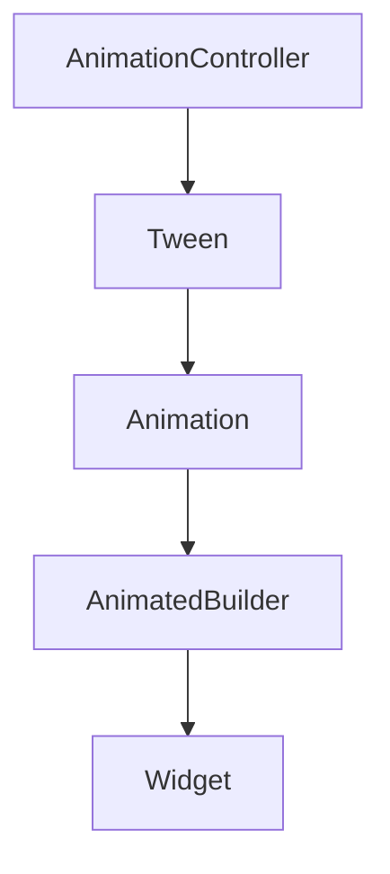

## 8.1.2 Explicit Animations

In the realm of Flutter, animations breathe life into applications, transforming static interfaces into dynamic, engaging experiences. Among the various animation techniques available, explicit animations stand out by offering developers granular control over the animation process. This section delves into the intricacies of explicit animations, exploring their core components, implementation steps, and best practices.

### Definition and Purpose

Explicit animations in Flutter are those where developers have full control over the animation's lifecycle, including its start, stop, and reverse actions. Unlike implicit animations, which handle the animation process automatically, explicit animations require developers to manage the animation's state and progression. This approach is particularly beneficial for complex and customized animations where precise control is paramount.

**Use Cases:**
- Creating animations that require synchronization with external events or user interactions.
- Implementing complex sequences where multiple animations need to be coordinated.
- Developing custom animations that are not feasible with predefined implicit animation widgets.

### Core Components

To effectively implement explicit animations, understanding the core components involved is essential:

- **AnimationController:** This is the engine of the animation, responsible for managing its duration, playback, and state. It provides methods to start, stop, and reverse animations, offering complete control over the animation timeline.

- **Tween:** A Tween defines the range of values that an animation will interpolate between. It acts as a bridge between the start and end values, allowing the animation to transition smoothly.

- **Animation:** Represents the animated value that changes over time. It is created by combining a Tween with an AnimationController, producing a value that can be used to drive the animation.

- **AnimatedBuilder:** A widget that listens to an Animation and rebuilds its child whenever the animation value changes. This allows for customized animations by applying the animated value to the widget's properties.

### Implementation Steps

Implementing explicit animations involves several key steps:

#### Setup

1. **Instantiate an AnimationController:**
   Begin by creating an `AnimationController`. This requires a `vsync` parameter, typically provided by a `TickerProvider`, which is often the `State` object of a `StatefulWidget`.

   ```dart
   class MyAnimatedWidget extends StatefulWidget {
     @override
     _MyAnimatedWidgetState createState() => _MyAnimatedWidgetState();
   }

   class _MyAnimatedWidgetState extends State<MyAnimatedWidget> with SingleTickerProviderStateMixin {
     AnimationController _controller;

     @override
     void initState() {
       super.initState();
       _controller = AnimationController(
         duration: const Duration(seconds: 2),
         vsync: this,
       );
     }

     @override
     void dispose() {
       _controller.dispose();
       super.dispose();
     }
   }
   ```

2. **Define a Tween:**
   Create a `Tween` that specifies the start and end values for the animation.

   ```dart
   Tween<double> _tween = Tween(begin: 0.0, end: 100.0);
   ```

#### Animation Binding

3. **Link the Tween to the Controller:**
   Combine the `Tween` with the `AnimationController` to produce an `Animation` object.

   ```dart
   Animation<double> _animation = _tween.animate(_controller);
   ```

#### Triggering Animations

4. **Control the Animation Flow:**
   Use methods like `forward()`, `reverse()`, or `repeat()` to control the animation's progression.

   ```dart
   void _startAnimation() {
     _controller.forward();
   }
   ```

#### Disposal

5. **Dispose of the AnimationController:**
   Always dispose of the `AnimationController` in the `dispose` method to free up resources and prevent memory leaks.

   ```dart
   @override
   void dispose() {
     _controller.dispose();
     super.dispose();
   }
   ```

### Code Example

Below is a complete Flutter code snippet demonstrating an explicit animation that moves a widget across the screen using `AnimatedBuilder` and `AnimationController`.

```dart
import 'package:flutter/material.dart';

class MovingWidget extends StatefulWidget {
  @override
  _MovingWidgetState createState() => _MovingWidgetState();
}

class _MovingWidgetState extends State<MovingWidget> with SingleTickerProviderStateMixin {
  AnimationController _controller;
  Animation<double> _animation;

  @override
  void initState() {
    super.initState();
    _controller = AnimationController(
      duration: const Duration(seconds: 2),
      vsync: this,
    );

    // Define a Tween and bind it to the AnimationController
    _animation = Tween<double>(begin: 0.0, end: 300.0).animate(_controller);

    // Start the animation
    _controller.forward();
  }

  @override
  void dispose() {
    // Dispose the controller to free resources
    _controller.dispose();
    super.dispose();
  }

  @override
  Widget build(BuildContext context) {
    return AnimatedBuilder(
      animation: _animation,
      builder: (context, child) {
        return Container(
          margin: EdgeInsets.only(left: _animation.value),
          child: child,
        );
      },
      child: const FlutterLogo(size: 50),
    );
  }
}

void main() => runApp(MaterialApp(home: Scaffold(body: MovingWidget())));
```

**Explanation:**
- **AnimationController:** Manages the animation's duration and state.
- **Tween:** Defines the movement from `0.0` to `300.0` pixels.
- **AnimatedBuilder:** Rebuilds the widget tree whenever the animation value changes, moving the `FlutterLogo` across the screen.

### Mermaid.js Diagrams

To visualize the relationship between `AnimationController`, `Tween`, and `AnimatedBuilder`, consider the following flowchart:



**Explanation:**
- The `AnimationController` drives the animation, controlling its timing and state.
- The `Tween` defines the range of values for the animation.
- The `Animation` is the interpolated value over time.
- The `AnimatedBuilder` listens to the `Animation` and updates the `Widget` accordingly.

### Best Practices

- **Lifecycle Management:** Always dispose of `AnimationController` instances in the `dispose` method to prevent memory leaks.
- **Separation of Concerns:** Keep animation logic separate from UI logic to enhance maintainability and readability.
- **Performance Optimization:** Use `AnimatedBuilder` to minimize rebuilds and optimize performance.

### Common Pitfalls

- **Forgetting to Dispose Controllers:** Failing to dispose of `AnimationController` can lead to memory leaks and performance issues.
- **Overcomplicating Animations:** Avoid creating overly complex animations that are difficult to manage and debug. Simplify where possible.

### Implementation Guidance

Explicit animations are ideal for scenarios requiring precise control and customization. Structure your code to clearly separate animation setup from widget build methods, ensuring a clean and maintainable codebase.

### Additional Resources

For further exploration of explicit animations in Flutter, consider the following resources:
- [Flutter Official Documentation on Animations](https://flutter.dev/docs/development/ui/animations)
- [Flutter Cookbook: Animations](https://flutter.dev/docs/cookbook/animation)
- [Dart and Flutter: The Complete Developer's Guide](https://www.udemy.com/course/dart-and-flutter-the-complete-developers-guide/)

By mastering explicit animations, you can create dynamic and engaging user interfaces that captivate and delight users. Experiment with different animation techniques and apply them to your projects to enhance the user experience.

## Quiz Time!



### What is the primary purpose of an AnimationController in Flutter?

- [x] It manages the animation's duration, playback, and state.
- [ ] It defines the range of values the animation will interpolate between.
- [ ] It represents the animated value that changes over time.
- [ ] It rebuilds widgets when the animation changes.

> **Explanation:** The AnimationController is responsible for managing the animation's lifecycle, including its duration, playback, and state.

### What does a Tween define in an explicit animation?

- [ ] The animation's duration and playback.
- [x] The range of values the animation will interpolate between.
- [ ] The widget that rebuilds when the animation changes.
- [ ] The animated value that changes over time.

> **Explanation:** A Tween defines the start and end values for an animation, determining the range of values it will interpolate between.

### Which widget is used to rebuild its child whenever the animation value changes?

- [ ] AnimationController
- [ ] Tween
- [x] AnimatedBuilder
- [ ] Animation

> **Explanation:** The AnimatedBuilder widget listens to an Animation and rebuilds its child whenever the animation value changes.

### What method should be called to properly dispose of an AnimationController?

- [ ] stop()
- [ ] reverse()
- [ ] forward()
- [x] dispose()

> **Explanation:** The dispose() method should be called to properly dispose of an AnimationController and free up resources.

### What is a common pitfall when working with AnimationController?

- [x] Forgetting to dispose of the controller, leading to memory leaks.
- [ ] Using Tween to define the animation's duration.
- [ ] Overusing AnimatedBuilder for simple animations.
- [ ] Not using forward() to start the animation.

> **Explanation:** A common pitfall is forgetting to dispose of the AnimationController, which can lead to memory leaks.

### When should explicit animations be used?

- [x] When precise control and customization of animations are required.
- [ ] For simple animations that can be handled by implicit animations.
- [ ] When animations should automatically handle their own lifecycle.
- [ ] For animations that do not require synchronization with user interactions.

> **Explanation:** Explicit animations are ideal for scenarios requiring precise control and customization, especially when synchronization with user interactions is needed.

### What is the role of the vsync parameter in an AnimationController?

- [x] It provides a TickerProvider to synchronize the animation with the screen refresh rate.
- [ ] It defines the range of values for the animation.
- [ ] It manages the animation's duration and playback.
- [ ] It rebuilds the widget when the animation changes.

> **Explanation:** The vsync parameter provides a TickerProvider that synchronizes the animation with the screen refresh rate, ensuring smooth animations.

### What is the benefit of using AnimatedBuilder in explicit animations?

- [x] It minimizes rebuilds and optimizes performance by only rebuilding when the animation value changes.
- [ ] It automatically disposes of the AnimationController.
- [ ] It defines the range of values for the animation.
- [ ] It manages the animation's duration and playback.

> **Explanation:** AnimatedBuilder minimizes rebuilds and optimizes performance by only rebuilding when the animation value changes.

### How can you start an animation using an AnimationController?

- [ ] dispose()
- [ ] reverse()
- [x] forward()
- [ ] repeat()

> **Explanation:** The forward() method is used to start an animation using an AnimationController.

### True or False: An AnimationController can be used without disposing of it.

- [ ] True
- [x] False

> **Explanation:** False. An AnimationController must be disposed of to prevent memory leaks and free up resources.


