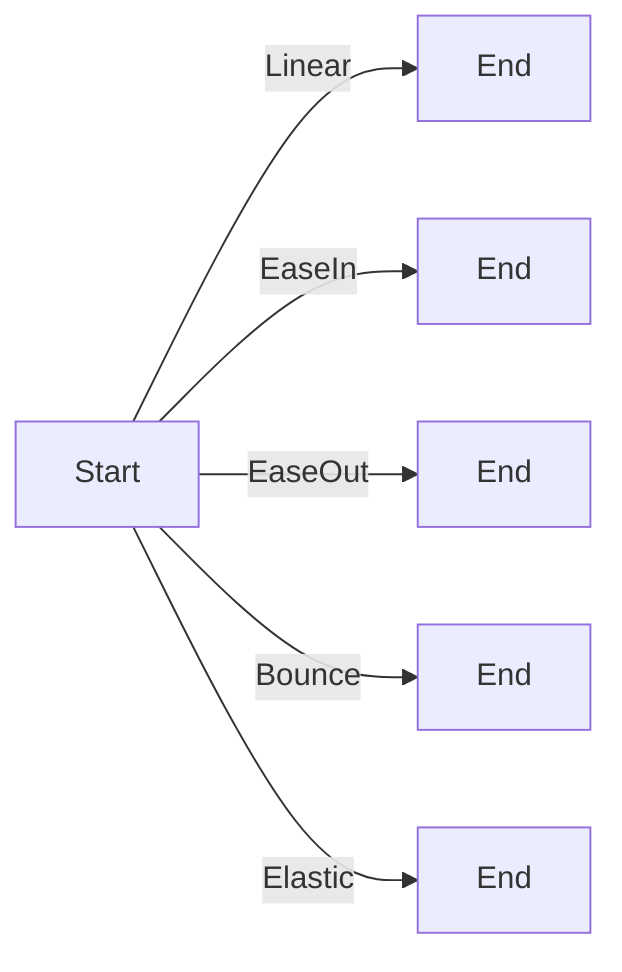

## 8.1.3 Animation Curves

In the world of mobile app development, animations play a crucial role in enhancing the user experience by providing visual feedback and guiding users through interactions. Animation curves are a fundamental aspect of creating smooth and natural animations in Flutter. They define how an animation progresses over time, allowing developers to simulate real-world physics and create engaging user interfaces.

### Definition and Purpose

Animation curves are mathematical functions that describe the progression of an animation over time. They determine the rate of change of an animation, influencing how it accelerates, decelerates, or oscillates. By manipulating the timing and pacing of animations, curves can make transitions appear more lifelike and intuitive.

#### Why Use Animation Curves?

- **Realism:** Curves can mimic natural movements, such as the way objects fall or bounce, making animations feel more realistic.
- **Engagement:** Well-designed animations can capture users' attention and make interactions more enjoyable.
- **Guidance:** Curves can help guide users through complex interfaces by providing visual cues and feedback.

### Common Animation Curves

Flutter provides a variety of built-in animation curves that cater to different animation needs. Understanding these curves and their effects is essential for creating effective animations.

#### Linear

The linear curve represents a constant speed throughout the animation. It is straightforward and predictable, making it suitable for animations where uniform motion is desired.

```dart
// Linear curve example
final animation = Tween(begin: 0.0, end: 1.0).animate(
  CurvedAnimation(
    parent: animationController,
    curve: Curves.linear,
  ),
);
```

#### EaseIn/EaseOut

- **EaseIn:** Starts slow and accelerates towards the end. Ideal for animations that need to build momentum.
- **EaseOut:** Starts fast and decelerates towards the end. Useful for animations that need to settle gently.

```dart
// EaseIn curve example
final animation = Tween(begin: 0.0, end: 1.0).animate(
  CurvedAnimation(
    parent: animationController,
    curve: Curves.easeIn,
  ),
);
```

#### Bounce

The bounce curve simulates a bouncing effect at the end of an animation. It is perfect for playful or attention-grabbing animations.

```dart
// Bounce curve example
final animation = Tween(begin: 0.0, end: 1.0).animate(
  CurvedAnimation(
    parent: animationController,
    curve: Curves.bounceOut,
  ),
);
```

#### Elastic

Elastic curves create an oscillatory motion, resembling the behavior of elastic materials. They are suitable for animations that require a spring-like effect.

```dart
// Elastic curve example
final animation = Tween(begin: 0.0, end: 1.0).animate(
  CurvedAnimation(
    parent: animationController,
    curve: Curves.elasticOut,
  ),
);
```

#### Custom Curves

For unique animation behaviors, Flutter allows developers to define custom curves by implementing the `Curve` class. This flexibility enables the creation of tailored animations that align with specific design requirements.

```dart
// Custom curve example
class MyCustomCurve extends Curve {
  @override
  double transform(double t) {
    // Custom transformation logic
    return t * t;
  }
}

final animation = Tween(begin: 0.0, end: 1.0).animate(
  CurvedAnimation(
    parent: animationController,
    curve: MyCustomCurve(),
  ),
);
```

### Implementing Curves

Animation curves can be applied to both implicit and explicit animations in Flutter, enhancing their visual appeal and effectiveness.

#### Using Curves in Implicit Animations

Implicit animations in Flutter, such as `AnimatedContainer`, allow for easy application of curves without the need for an animation controller. Simply specify the desired curve when defining the animation.

```dart
AnimatedContainer(
  duration: Duration(seconds: 1),
  curve: Curves.easeInOut,
  // Other properties...
)
```

#### Using Curves in Explicit Animations

Explicit animations offer more control over the animation process, allowing curves to be applied to tweens or directly within animation controllers.

```dart
final animation = Tween(begin: 0.0, end: 1.0).animate(
  CurvedAnimation(
    parent: animationController,
    curve: Curves.easeInOut,
  ),
);
```

### Code Example

Below is a comprehensive Flutter code snippet demonstrating the application of different curves to an explicit animation. Observe how each curve affects the animation's behavior.

```dart
import 'package:flutter/material.dart';

void main() => runApp(MyApp());

class MyApp extends StatelessWidget {
  @override
  Widget build(BuildContext context) {
    return MaterialApp(
      home: AnimationDemo(),
    );
  }
}

class AnimationDemo extends StatefulWidget {
  @override
  _AnimationDemoState createState() => _AnimationDemoState();
}

class _AnimationDemoState extends State<AnimationDemo>
    with SingleTickerProviderStateMixin {
  AnimationController _controller;
  Animation<double> _animation;

  @override
  void initState() {
    super.initState();
    _controller = AnimationController(
      duration: const Duration(seconds: 2),
      vsync: this,
    );

    _animation = Tween(begin: 0.0, end: 300.0).animate(
      CurvedAnimation(
        parent: _controller,
        curve: Curves.bounceOut, // Try changing this to Curves.linear, Curves.easeIn, etc.
      ),
    );

    _controller.forward();
  }

  @override
  void dispose() {
    _controller.dispose();
    super.dispose();
  }

  @override
  Widget build(BuildContext context) {
    return Scaffold(
      appBar: AppBar(title: Text('Animation Curves')),
      body: Center(
        child: AnimatedBuilder(
          animation: _animation,
          builder: (context, child) {
            return Container(
              width: _animation.value,
              height: _animation.value,
              color: Colors.blue,
            );
          },
        ),
      ),
    );
  }
}
```

### Mermaid.js Diagrams

To better understand the effects of different animation curves, consider the following graph, which visually compares various curves and their impact on animation timing.



### Best Practices

- **Appropriate Curve Selection:** Choose curves that align with the intended user experience and context of the animation. For example, use `easeIn` for elements entering the screen and `easeOut` for elements exiting.
- **Consistency:** Maintain a consistent use of animation curves throughout your app to ensure a unified and cohesive look and feel.
- **Experimentation:** Don't hesitate to experiment with different curves to discover the most suitable ones for various scenarios.

### Common Pitfalls

- **Overusing Complex Curves:** Avoid using overly complex curves that can distract or confuse users. Simplicity often leads to better user experiences.
- **Ignoring Performance:** Some complex curves can be computationally intensive. Ensure they do not negatively impact app performance, especially on lower-end devices.

### Implementation Guidance

- **Experiment with Curves:** Test various curves to find the most effective ones for your animations. This experimentation can lead to unique and engaging user experiences.
- **Use Custom Curves Sparingly:** While custom curves offer flexibility, they should be used sparingly and only when standard curves do not achieve the desired effect.

### Conclusion

Animation curves are a powerful tool in Flutter, enabling developers to create smooth, natural, and engaging animations. By understanding and effectively applying these curves, you can enhance the user experience and bring your app's interface to life. Whether you're using built-in curves or crafting custom ones, the key is to ensure that animations are consistent, purposeful, and aligned with the overall design of your application.

## Quiz Time!



### What is the primary purpose of animation curves in Flutter?

- [x] To define the pace and behavior of animations over time
- [ ] To determine the color of animations
- [ ] To set the duration of animations
- [ ] To control the size of animations

> **Explanation:** Animation curves are mathematical functions that define how an animation progresses over time, influencing its pace and behavior.

### Which animation curve provides a constant speed throughout the animation?

- [x] Linear
- [ ] EaseIn
- [ ] Bounce
- [ ] Elastic

> **Explanation:** The linear curve represents a constant speed, making it predictable and uniform throughout the animation.

### What is the characteristic of an EaseIn curve?

- [x] Starts slow and accelerates towards the end
- [ ] Starts fast and decelerates towards the end
- [ ] Simulates a bouncing effect
- [ ] Creates oscillatory motion

> **Explanation:** The EaseIn curve starts slow and accelerates towards the end, building momentum as the animation progresses.

### Which curve is suitable for creating a spring-like effect?

- [ ] Linear
- [ ] EaseOut
- [ ] Bounce
- [x] Elastic

> **Explanation:** Elastic curves create an oscillatory motion, resembling the behavior of elastic materials, making them suitable for spring-like effects.

### How can you apply a curve to an implicit animation in Flutter?

- [x] Specify the desired curve in the animation widget, such as `AnimatedContainer`
- [ ] Use a custom animation controller
- [ ] Implement a new widget class
- [ ] Modify the app's theme settings

> **Explanation:** In implicit animations like `AnimatedContainer`, you can directly specify the desired curve to influence the animation's behavior.

### What is a potential pitfall of using complex curves?

- [x] They can distract or confuse users
- [ ] They always improve performance
- [ ] They are easier to implement
- [ ] They reduce the need for testing

> **Explanation:** Overusing complex curves can distract or confuse users, detracting from the overall user experience.

### Why is consistency important when using animation curves?

- [x] To ensure a unified look and feel throughout the app
- [ ] To increase the app's loading speed
- [ ] To reduce the number of animations needed
- [ ] To simplify the codebase

> **Explanation:** Consistent use of animation curves helps maintain a unified look and feel, contributing to a cohesive user experience.

### When should custom curves be used in Flutter animations?

- [x] Sparingly, and only when standard curves do not achieve the desired effect
- [ ] Always, to ensure uniqueness
- [ ] Never, as they are not supported
- [ ] Only for implicit animations

> **Explanation:** Custom curves should be used sparingly and only when standard curves do not meet the specific needs of the animation.

### What is the effect of the Bounce curve?

- [ ] Provides a constant speed
- [ ] Starts slow and accelerates
- [x] Simulates a bouncing effect at the end
- [ ] Creates oscillatory motion

> **Explanation:** The Bounce curve simulates a bouncing effect at the end of an animation, making it playful and attention-grabbing.

### True or False: Animation curves can negatively impact app performance if not used carefully.

- [x] True
- [ ] False

> **Explanation:** Some complex animation curves can be computationally intensive, potentially impacting app performance if not used judiciously.


