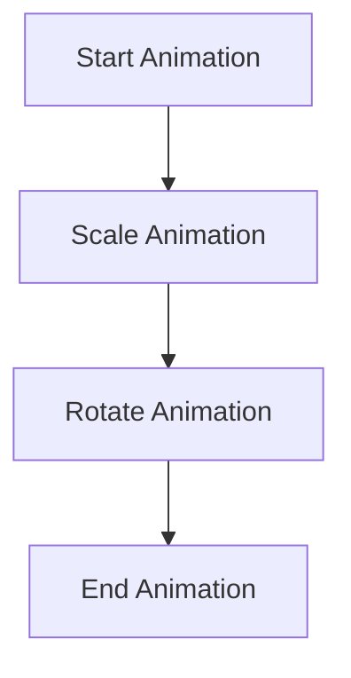

## 8.1.4 Chaining Animations

In the world of mobile applications, animations are not just about adding flair; they are crucial for guiding users, providing feedback, and enhancing the overall user experience. Chaining animations in Flutter allows developers to create complex and engaging effects by sequencing multiple animations to occur one after the other or in parallel. This section delves into the techniques, tools, and best practices for implementing chained animations effectively.

### Definition and Purpose

Chained animations refer to a series of animations that are linked together to create a cohesive visual effect. These animations can occur sequentially, staggered with delays, or in parallel, depending on the desired outcome. The primary purpose of chaining animations is to enhance user interactions by providing smooth transitions and visual feedback that make the application more intuitive and engaging.

#### Benefits of Chaining Animations

- **Enhanced User Experience:** By providing visual cues and feedback, animations help users understand the app's flow and functionality.
- **Increased Engagement:** Dynamic animations can capture users' attention and make interactions more enjoyable.
- **Improved Navigation:** Animations can guide users through complex interfaces, highlighting important actions and transitions.

### Techniques for Chaining Animations

#### Sequential Animations

Sequential animations involve executing one animation after another. This technique is useful for creating step-by-step transitions that guide the user through a process.

```dart
import 'package:flutter/material.dart';

class SequentialAnimationExample extends StatefulWidget {
  @override
  _SequentialAnimationExampleState createState() => _SequentialAnimationExampleState();
}

class _SequentialAnimationExampleState extends State<SequentialAnimationExample>
    with SingleTickerProviderStateMixin {
  AnimationController _controller;
  Animation<double> _scaleAnimation;
  Animation<double> _rotateAnimation;

  @override
  void initState() {
    super.initState();
    _controller = AnimationController(
      duration: const Duration(seconds: 4),
      vsync: this,
    );

    _scaleAnimation = Tween<double>(begin: 0.5, end: 1.0).animate(
      CurvedAnimation(parent: _controller, curve: Interval(0.0, 0.5, curve: Curves.easeIn)),
    );

    _rotateAnimation = Tween<double>(begin: 0.0, end: 2 * 3.14159).animate(
      CurvedAnimation(parent: _controller, curve: Interval(0.5, 1.0, curve: Curves.easeOut)),
    );

    _controller.forward();
  }

  @override
  void dispose() {
    _controller.dispose();
    super.dispose();
  }

  @override
  Widget build(BuildContext context) {
    return AnimatedBuilder(
      animation: _controller,
      builder: (context, child) {
        return Transform.scale(
          scale: _scaleAnimation.value,
          child: Transform.rotate(
            angle: _rotateAnimation.value,
            child: child,
          ),
        );
      },
      child: Container(
        width: 100,
        height: 100,
        color: Colors.blue,
      ),
    );
  }
}
```

**Explanation:**
- **AnimationController:** Manages the animation's lifecycle.
- **CurvedAnimation:** Applies easing to the animation.
- **Interval:** Defines the timing for each animation segment within the controller's duration.

#### Staggered Animations

Staggered animations introduce delays between animations, creating a cascading effect. This technique is particularly effective for animating lists or groups of elements.

```dart
import 'package:flutter/material.dart';

class StaggeredAnimationExample extends StatefulWidget {
  @override
  _StaggeredAnimationExampleState createState() => _StaggeredAnimationExampleState();
}

class _StaggeredAnimationExampleState extends State<StaggeredAnimationExample>
    with SingleTickerProviderStateMixin {
  AnimationController _controller;
  List<Animation<double>> _animations;

  @override
  void initState() {
    super.initState();
    _controller = AnimationController(
      duration: const Duration(seconds: 3),
      vsync: this,
    );

    _animations = List.generate(5, (index) {
      final start = index * 0.2;
      final end = start + 0.2;
      return Tween<double>(begin: 0.0, end: 1.0).animate(
        CurvedAnimation(parent: _controller, curve: Interval(start, end, curve: Curves.easeIn)),
      );
    });

    _controller.forward();
  }

  @override
  void dispose() {
    _controller.dispose();
    super.dispose();
  }

  @override
  Widget build(BuildContext context) {
    return Column(
      mainAxisAlignment: MainAxisAlignment.center,
      children: List.generate(5, (index) {
        return FadeTransition(
          opacity: _animations[index],
          child: Container(
            width: 100,
            height: 20,
            margin: EdgeInsets.symmetric(vertical: 5),
            color: Colors.blue,
          ),
        );
      }),
    );
  }
}
```

**Explanation:**
- **Interval:** Staggers the start of each animation.
- **List.generate:** Creates multiple animations with staggered intervals.

#### Parallel Animations

Parallel animations run multiple animations simultaneously, allowing for more complex visual effects.

```dart
import 'package:flutter/material.dart';

class ParallelAnimationExample extends StatefulWidget {
  @override
  _ParallelAnimationExampleState createState() => _ParallelAnimationExampleState();
}

class _ParallelAnimationExampleState extends State<ParallelAnimationExample>
    with SingleTickerProviderStateMixin {
  AnimationController _controller;
  Animation<double> _scaleAnimation;
  Animation<double> _opacityAnimation;

  @override
  void initState() {
    super.initState();
    _controller = AnimationController(
      duration: const Duration(seconds: 2),
      vsync: this,
    );

    _scaleAnimation = Tween<double>(begin: 0.5, end: 1.0).animate(
      CurvedAnimation(parent: _controller, curve: Curves.easeIn),
    );

    _opacityAnimation = Tween<double>(begin: 0.0, end: 1.0).animate(
      CurvedAnimation(parent: _controller, curve: Curves.easeIn),
    );

    _controller.forward();
  }

  @override
  void dispose() {
    _controller.dispose();
    super.dispose();
  }

  @override
  Widget build(BuildContext context) {
    return AnimatedBuilder(
      animation: _controller,
      builder: (context, child) {
        return Transform.scale(
          scale: _scaleAnimation.value,
          child: Opacity(
            opacity: _opacityAnimation.value,
            child: child,
          ),
        );
      },
      child: Container(
        width: 100,
        height: 100,
        color: Colors.blue,
      ),
    );
  }
}
```

**Explanation:**
- **Multiple Animations:** Both scale and opacity animations are controlled by the same controller and run in parallel.

### Tools and Widgets for Chaining Animations

#### AnimationController Sequencing

AnimationController is crucial for managing the timing and sequencing of animations. By using multiple controllers or listeners, you can trigger subsequent animations.

#### AnimatedBuilder

AnimatedBuilder is a widget that allows you to reuse the same builder for multiple animation sequences, providing a flexible way to manage complex animations.

#### TweenSequences

TweenSequence is a powerful tool for defining a series of tweens to be executed in sequence, allowing for intricate animation chains.

### Best Practices

- **Manage Complexity:** Keep animations simple and modular to maintain readability and manageability.
- **User Experience Focus:** Ensure animations enhance the user experience without causing confusion or delays.
- **Test Across Devices:** Ensure animations perform smoothly on different devices and screen sizes.

### Common Pitfalls

- **Overcomplicating Sequences:** Avoid overly long or complex animation chains that can overwhelm users.
- **Synchronization Issues:** Ensure animations are properly synchronized to prevent jarring transitions.

### Implementation Guidance

- **Use Callbacks and Futures:** Utilize callback functions or `Future` chaining to manage the timing of animations effectively.
- **Test and Iterate:** Continuously test and refine animations to ensure they meet user expectations and perform well across devices.

### Mermaid.js Diagrams

To better understand the flow of chained animations, consider the following flowchart:



**Explanation:**
- **Flowchart:** Visualizes the sequence of animations, showing the dependencies and order of execution.

### Conclusion

Chaining animations in Flutter is a powerful technique for creating engaging and dynamic user interfaces. By understanding and applying sequential, staggered, and parallel animations, you can enhance the user experience and make your applications more intuitive and enjoyable. Remember to keep animations simple, focus on user experience, and test across devices to ensure smooth performance.

## Quiz Time!



### What is the primary purpose of chaining animations in Flutter?

- [x] To enhance user interactions and provide visual feedback
- [ ] To increase the app's loading time
- [ ] To make the code more complex
- [ ] To reduce the number of widgets used

> **Explanation:** Chaining animations enhances user interactions by providing smooth transitions and visual feedback, improving the overall user experience.

### Which technique involves executing one animation after another?

- [x] Sequential Animations
- [ ] Parallel Animations
- [ ] Staggered Animations
- [ ] Synchronous Animations

> **Explanation:** Sequential animations involve executing one animation after another, creating step-by-step transitions.

### What is the role of the `Interval` class in staggered animations?

- [x] It defines the timing for each animation segment within the controller's duration.
- [ ] It controls the speed of the animation.
- [ ] It determines the color of the animated widget.
- [ ] It sets the size of the animated widget.

> **Explanation:** The `Interval` class defines the timing for each animation segment, allowing for staggered animations.

### Which widget allows you to reuse the same builder for multiple animation sequences?

- [x] AnimatedBuilder
- [ ] AnimationController
- [ ] TweenSequence
- [ ] FutureBuilder

> **Explanation:** AnimatedBuilder allows you to reuse the same builder for multiple animation sequences, providing flexibility in managing complex animations.

### What is a common pitfall when chaining animations?

- [x] Overcomplicating sequences
- [ ] Using too few animations
- [ ] Not using enough colors
- [ ] Making animations too short

> **Explanation:** Overcomplicating sequences can overwhelm users and make the animations difficult to manage.

### Which technique introduces delays between animations to create a cascading effect?

- [x] Staggered Animations
- [ ] Sequential Animations
- [ ] Parallel Animations
- [ ] Delayed Animations

> **Explanation:** Staggered animations introduce delays between animations, creating a cascading effect.

### What is a benefit of using parallel animations?

- [x] Running multiple animations simultaneously for compound effects
- [ ] Ensuring animations run one after the other
- [ ] Reducing the number of animations needed
- [ ] Making animations invisible

> **Explanation:** Parallel animations run multiple animations simultaneously, allowing for more complex visual effects.

### How can you manage the timing of chained animations effectively?

- [x] Use callback functions or `Future` chaining
- [ ] Increase the duration of each animation
- [ ] Use only one animation at a time
- [ ] Avoid using `AnimationController`

> **Explanation:** Using callback functions or `Future` chaining helps manage the timing of chained animations effectively.

### Why is it important to test animation chains across different devices?

- [x] To ensure smooth performance and consistency
- [ ] To increase the app's size
- [ ] To make the animations longer
- [ ] To reduce the number of animations

> **Explanation:** Testing across different devices ensures that animations perform smoothly and consistently, providing a better user experience.

### True or False: Chaining animations can help improve navigation by guiding users through complex interfaces.

- [x] True
- [ ] False

> **Explanation:** True. Chaining animations can guide users through complex interfaces, highlighting important actions and transitions.


