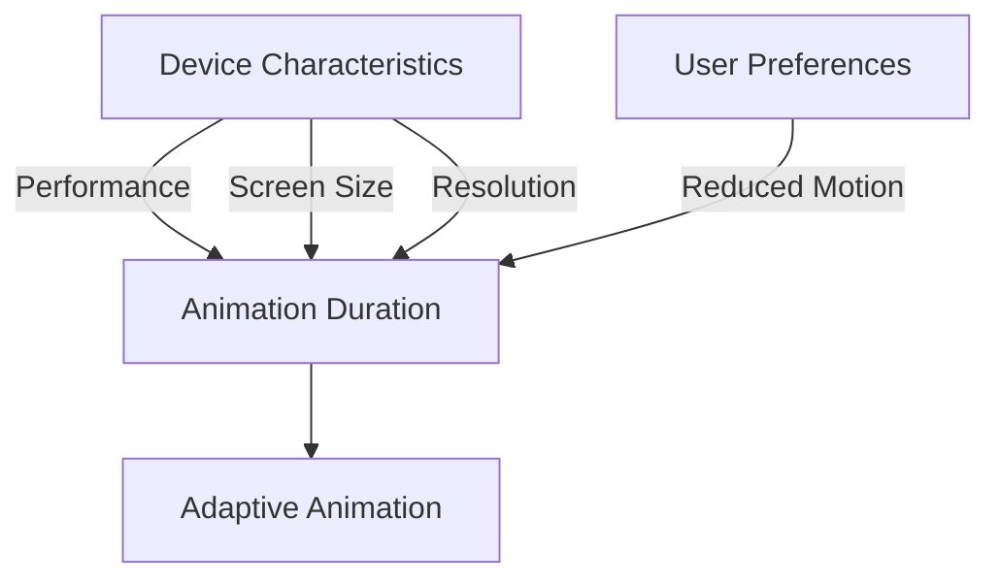

## 8.2.1 Adaptive Animation Durations

In the realm of mobile application development, animations play a pivotal role in enhancing user experience by providing visual feedback and guiding user interactions. However, the effectiveness of animations can vary significantly across different devices and user contexts. This is where adaptive animation durations come into play, allowing developers to tailor animation speeds and lengths to suit various device characteristics and user preferences. In this section, we will delve into the concept of adaptive animation durations, explore the factors influencing them, and provide practical guidance on implementing them in Flutter applications.

### Definition and Purpose

Adaptive animation durations refer to the practice of adjusting the speed and length of animations based on specific device characteristics or user preferences. The primary goal of this approach is to ensure that animations remain smooth, engaging, and accessible across a wide range of devices and user settings.

- **Enhancing User Experience:** By adapting animation durations, developers can create a more consistent and enjoyable user experience. For instance, animations that are too fast or too slow can disrupt the user's flow and lead to frustration. Adaptive durations help maintain the right balance, ensuring animations are neither jarring nor sluggish.

- **Device and Context Awareness:** Different devices have varying processing capabilities and screen characteristics. Adaptive animations take these factors into account, ensuring that animations perform optimally regardless of the device being used.

### Factors Influencing Animation Durations

Several factors can influence how animation durations should be adjusted:

- **Device Performance:** The processing power of a device can significantly impact the smoothness of animations. High-end devices can handle more complex and faster animations, while lower-end devices may struggle, leading to lag. By adjusting animation speeds based on device performance, developers can ensure a smooth experience across the board.

- **Screen Size and Resolution:** The size and resolution of a screen can affect how animations are perceived. On larger screens, animations may need to be slower to cover more distance, while smaller screens might require faster animations to maintain the same visual effect.

- **User Preferences:** User accessibility settings, such as reduced motion preferences, should be respected. Some users may prefer or require simplified animations due to motion sensitivity or other accessibility needs. Detecting and adapting to these preferences is crucial for creating inclusive applications.

### Implementing Adaptive Durations

To implement adaptive animation durations in Flutter, developers can leverage several tools and techniques:

#### Using MediaQuery

`MediaQuery` is a powerful tool in Flutter that provides information about the current device's screen size, orientation, and other characteristics. By using `MediaQuery`, developers can dynamically adjust animation durations based on the device's screen size.

```dart
import 'package:flutter/material.dart';

class AdaptiveAnimationExample extends StatelessWidget {
  @override
  Widget build(BuildContext context) {
    // Retrieve screen width using MediaQuery
    double screenWidth = MediaQuery.of(context).size.width;

    // Determine animation duration based on screen width
    Duration animationDuration = screenWidth > 600
        ? Duration(milliseconds: 500) // Longer duration for larger screens
        : Duration(milliseconds: 300); // Shorter duration for smaller screens

    return Scaffold(
      appBar: AppBar(title: Text('Adaptive Animation Example')),
      body: Center(
        child: AnimatedOpacity(
          opacity: 1.0,
          duration: animationDuration,
          child: Container(
            width: 100,
            height: 100,
            color: Colors.blue,
          ),
        ),
      ),
    );
  }
}
```

**Explanation:**
- The `MediaQuery.of(context).size.width` is used to retrieve the width of the screen.
- Based on the screen width, the animation duration is set to either 500 milliseconds for larger screens or 300 milliseconds for smaller screens.

#### Detecting User Preferences

Flutter provides ways to detect user accessibility settings, such as reduced motion preferences. By respecting these settings, developers can modify or disable animations accordingly.

```dart
import 'package:flutter/material.dart';

class ReducedMotionExample extends StatelessWidget {
  @override
  Widget build(BuildContext context) {
    // Check if the user has requested reduced motion
    bool reduceMotion = MediaQuery.of(context).reduceMotion;

    // Set animation duration based on user preference
    Duration animationDuration = reduceMotion
        ? Duration(milliseconds: 0) // Disable animation for reduced motion
        : Duration(milliseconds: 300); // Default animation duration

    return Scaffold(
      appBar: AppBar(title: Text('Reduced Motion Example')),
      body: Center(
        child: AnimatedOpacity(
          opacity: 1.0,
          duration: animationDuration,
          child: Container(
            width: 100,
            height: 100,
            color: Colors.green,
          ),
        ),
      ),
    );
  }
}
```

**Explanation:**
- The `MediaQuery.of(context).reduceMotion` property is used to check if the user has enabled reduced motion settings.
- If reduced motion is enabled, the animation duration is set to zero, effectively disabling the animation.

### Mermaid.js Diagrams

To better understand how different factors influence animation duration decisions, consider the following diagram:



**Diagram Explanation:**
- **Device Characteristics:** Includes performance, screen size, and resolution, all of which influence the animation duration.
- **User Preferences:** Specifically reduced motion settings, which can override other factors to ensure accessibility.
- **Adaptive Animation:** The result of considering all these factors to determine the optimal animation duration.

### Best Practices

- **Consistency:** Ensure that animation pacing is consistent across related UI elements. This helps users understand the flow of the application and prevents confusion.

- **Accessibility Compliance:** Always consider accessibility settings and provide options to reduce or simplify animations as needed. This is not only a best practice but also a requirement for creating inclusive applications.

### Common Pitfalls

- **Ignoring User Preferences:** Failing to respect user settings can lead to a poor user experience and accessibility issues. Always check for and adapt to user preferences.

- **Overcomplicating Logic:** Avoid overly complex logic for determining animation durations, which can make the code difficult to maintain. Use helper functions to centralize and manage adaptive duration logic.

### Implementation Guidance

- **Helper Functions:** Create helper functions to manage adaptive duration logic. This centralizes the logic and makes it easier to maintain and update.

- **Thorough Testing:** Test animations on various devices and settings to ensure they behave as intended. This includes testing with different screen sizes, resolutions, and user accessibility settings.

### Conclusion

Adaptive animation durations are a powerful tool for enhancing user experience in Flutter applications. By considering device characteristics and user preferences, developers can create animations that are smooth, engaging, and accessible. Implementing adaptive durations requires careful consideration of various factors, but the result is a more inclusive and enjoyable application for all users.

## Quiz Time!



### What is the primary goal of adaptive animation durations?

- [x] To ensure animations remain smooth, engaging, and accessible across different devices and user settings.
- [ ] To make animations as fast as possible regardless of the device.
- [ ] To ensure animations are the same length on all devices.
- [ ] To disable animations for all users.

> **Explanation:** Adaptive animation durations aim to tailor animations to different devices and user preferences, ensuring a consistent and enjoyable user experience.

### Which factor does NOT influence animation durations?

- [ ] Device Performance
- [ ] Screen Size
- [ ] User Preferences
- [x] Battery Level

> **Explanation:** While device performance, screen size, and user preferences influence animation durations, battery level is not typically a direct factor.

### How can you retrieve screen size information in Flutter?

- [x] Using MediaQuery
- [ ] Using DeviceInfoPlugin
- [ ] Using FlutterScreenUtil
- [ ] Using ScreenSizeProvider

> **Explanation:** MediaQuery provides information about the current device's screen size, orientation, and other characteristics.

### What property of MediaQuery is used to detect reduced motion preferences?

- [x] reduceMotion
- [ ] disableAnimations
- [ ] motionPreference
- [ ] animationSettings

> **Explanation:** The `reduceMotion` property of MediaQuery is used to check if the user has enabled reduced motion settings.

### What is a common pitfall when implementing adaptive animation durations?

- [ ] Using helper functions
- [x] Ignoring user preferences
- [ ] Testing on various devices
- [ ] Centralizing logic

> **Explanation:** Ignoring user preferences can lead to a poor user experience and accessibility issues.

### Why is it important to maintain consistent animation pacing across related UI elements?

- [x] To prevent user confusion and ensure a smooth flow
- [ ] To make animations faster
- [ ] To reduce code complexity
- [ ] To improve battery life

> **Explanation:** Consistent animation pacing helps users understand the flow of the application and prevents confusion.

### What should you do if a user has enabled reduced motion settings?

- [x] Modify or disable animations
- [ ] Increase animation speed
- [ ] Ignore the setting
- [ ] Use default animation durations

> **Explanation:** Respecting user accessibility settings, such as reduced motion, is crucial for creating inclusive applications.

### What is the benefit of using helper functions for adaptive duration logic?

- [x] It centralizes the logic, making it easier to maintain and update.
- [ ] It makes animations faster.
- [ ] It reduces the need for testing.
- [ ] It increases code complexity.

> **Explanation:** Helper functions centralize adaptive duration logic, simplifying maintenance and updates.

### How can you ensure animations behave as intended across various devices?

- [x] By testing on different devices and settings
- [ ] By using default animation durations
- [ ] By ignoring user preferences
- [ ] By disabling animations

> **Explanation:** Thorough testing on various devices and settings ensures that animations behave as intended.

### Adaptive animation durations should always respect which user setting?

- [x] Reduced motion preferences
- [ ] Screen brightness
- [ ] Battery saver mode
- [ ] Default font size

> **Explanation:** Reduced motion preferences are an accessibility setting that should always be respected in adaptive animation durations.


