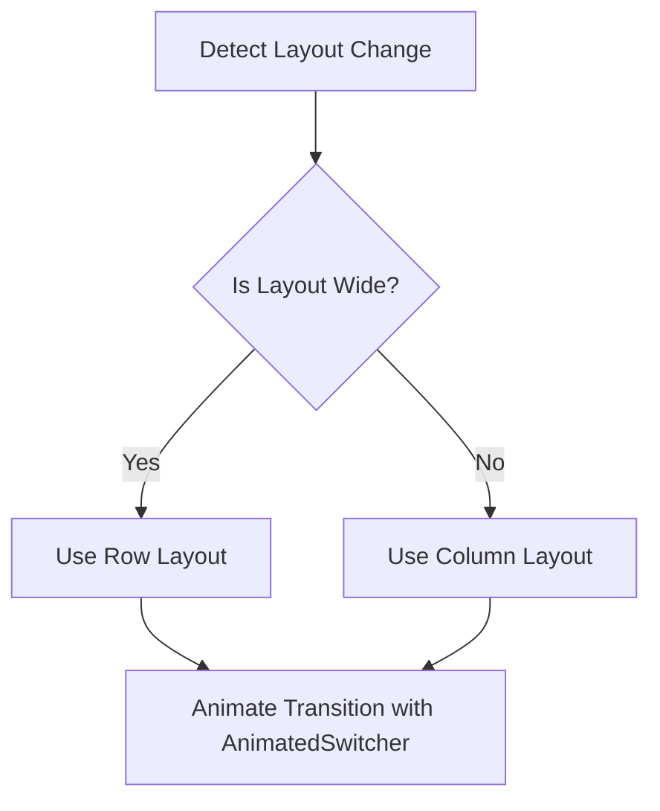

## 8.2.2 Responsive Animated Layouts

In the ever-evolving landscape of mobile app development, creating user interfaces that are both responsive and animated is crucial for delivering a seamless and engaging user experience. Responsive animated layouts in Flutter allow developers to craft UIs that not only adapt to different screen sizes and orientations but also do so with fluid animations that enhance user interaction. This section delves into the techniques and best practices for implementing responsive animated layouts in Flutter, providing you with the tools to elevate your app's design.

### Definition and Purpose

Responsive animated layouts are UI designs that dynamically adjust their structure and appearance in response to changes such as screen size, orientation, or user interactions, all while incorporating animations to ensure smooth transitions. The primary goal is to maintain a consistent and engaging user experience across various devices and scenarios.

- **Enhancing User Experience:** Combining responsiveness with animations creates a fluid and interactive experience, making transitions between different layouts feel natural and intuitive.
- **Visual Feedback:** Animations provide visual feedback to users, helping them understand changes in the UI and guiding their attention to important elements.

### Techniques for Responsive Animated Layouts

Flutter offers several widgets and techniques to implement responsive animated layouts effectively. Here, we explore some of the key tools and how they can be used to create dynamic UIs.

#### AnimatedVisibility

The `AnimatedVisibility` widget allows you to show or hide widgets with smooth transitions. This is particularly useful when you want to adjust the visibility of UI components in response to layout changes.

```dart
AnimatedVisibility(
  visible: isVisible,
  duration: Duration(milliseconds: 300),
  child: YourWidget(),
)
```

- **Use Case:** Toggle the visibility of a sidebar or menu when the screen orientation changes from portrait to landscape.

#### AnimatedSwitcher

`AnimatedSwitcher` is a powerful widget for transitioning between different widgets. It automatically animates the transition whenever the child widget changes.

```dart
AnimatedSwitcher(
  duration: Duration(milliseconds: 300),
  child: isRowLayout ? RowLayout() : ColumnLayout(),
)
```

- **Use Case:** Seamlessly switch between a `Row` and a `Column` layout when the screen size changes.

#### Implicit Animations in Layout Widgets

Flutter provides a range of implicit animation widgets like `AnimatedContainer`, `AnimatedPadding`, etc., which can animate layout properties such as size, padding, and alignment.

```dart
AnimatedContainer(
  duration: Duration(milliseconds: 300),
  padding: EdgeInsets.all(isExpanded ? 20 : 10),
  child: YourWidget(),
)
```

- **Use Case:** Animate the padding or margin of a widget as the layout adapts to different screen sizes.

### Implementing Responsive Layout Changes

To effectively implement responsive animated layouts, it's essential to detect layout changes and animate transitions smoothly.

#### Detecting Layout Changes

Utilize `MediaQuery` and `LayoutBuilder` to detect changes in screen size and orientation. These tools provide the necessary context to adapt your layout dynamically.

```dart
LayoutBuilder(
  builder: (context, constraints) {
    if (constraints.maxWidth > 600) {
      // Use a wide layout
    } else {
      // Use a narrow layout
    }
  },
)
```

- **MediaQuery:** Retrieve screen dimensions and orientation to adjust layouts accordingly.
- **LayoutBuilder:** Respond to changes in the parent widget's size and adapt the child layout.

#### Animating Layout Transitions

Apply animation widgets to animate changes in layout properties such as size, position, and alignment. This ensures that transitions are smooth and visually appealing.

```dart
AnimatedContainer(
  duration: Duration(milliseconds: 500),
  width: isExpanded ? 200 : 100,
  height: isExpanded ? 200 : 100,
  child: YourWidget(),
)
```

### Code Example: Row to Column Transition

Let's explore a practical example where a `Row` transitions to a `Column` with animated transitions using `AnimatedSwitcher`.

```dart
import 'package:flutter/material.dart';

class ResponsiveAnimatedLayout extends StatefulWidget {
  @override
  _ResponsiveAnimatedLayoutState createState() => _ResponsiveAnimatedLayoutState();
}

class _ResponsiveAnimatedLayoutState extends State<ResponsiveAnimatedLayout> {
  bool isRowLayout = true;

  @override
  Widget build(BuildContext context) {
    return Scaffold(
      appBar: AppBar(title: Text('Responsive Animated Layout')),
      body: Center(
        child: AnimatedSwitcher(
          duration: Duration(milliseconds: 300),
          transitionBuilder: (Widget child, Animation<double> animation) {
            return FadeTransition(opacity: animation, child: child);
          },
          child: isRowLayout ? buildRowLayout() : buildColumnLayout(),
        ),
      ),
      floatingActionButton: FloatingActionButton(
        onPressed: () {
          setState(() {
            isRowLayout = !isRowLayout;
          });
        },
        child: Icon(Icons.swap_horiz),
      ),
    );
  }

  Widget buildRowLayout() {
    return Row(
      key: ValueKey('row'),
      mainAxisAlignment: MainAxisAlignment.center,
      children: [
        Container(width: 100, height: 100, color: Colors.red),
        SizedBox(width: 20),
        Container(width: 100, height: 100, color: Colors.green),
      ],
    );
  }

  Widget buildColumnLayout() {
    return Column(
      key: ValueKey('column'),
      mainAxisAlignment: MainAxisAlignment.center,
      children: [
        Container(width: 100, height: 100, color: Colors.red),
        SizedBox(height: 20),
        Container(width: 100, height: 100, color: Colors.green),
      ],
    );
  }
}
```

**Explanation:**

- **AnimatedSwitcher:** This widget is used to transition between the `Row` and `Column` layouts. The `transitionBuilder` is used to define a fade transition.
- **FloatingActionButton:** Toggles the layout between `Row` and `Column` by changing the `isRowLayout` state.
- **ValueKey:** Ensures that the `Row` and `Column` widgets are treated as distinct children, allowing `AnimatedSwitcher` to animate the transition.

### Mermaid.js Diagrams

To better understand how responsive layout changes trigger animations, consider the following flowchart:



**Diagram Explanation:**

- **Detect Layout Change:** The process begins by detecting a change in layout using `MediaQuery` or `LayoutBuilder`.
- **Decision Point:** A decision is made based on the layout width to choose between `Row` and `Column`.
- **Animate Transition:** `AnimatedSwitcher` is used to animate the transition between the selected layouts.

### Best Practices

- **Smooth Transitions:** Ensure that animations during layout changes are smooth and do not disrupt the user’s interaction flow. Use easing functions to create natural transitions.
- **Performance Optimization:** Optimize animations to prevent lag, especially during rapid layout changes. Consider using `AnimatedBuilder` for more complex animations to minimize rebuilds.

### Common Pitfalls

- **Layout Jank:** Avoid animations that cause jarring or abrupt changes, leading to a distracting user experience. Test animations on different devices to ensure consistency.
- **Resource Intensive Animations:** Be cautious of animations that are too resource-heavy, which can affect performance on lower-end devices. Use profiling tools to monitor performance.

### Implementation Guidance

- **Enhance, Don't Overwhelm:** Combine responsive design with subtle animations to enhance rather than overwhelm the UI. Animations should complement the user experience, not distract from it.
- **Separation of Concerns:** Structure your code to clearly separate layout logic from animation logic for better maintainability. This approach makes it easier to update and debug your code.

### Conclusion

Responsive animated layouts in Flutter offer a powerful way to create dynamic and engaging user interfaces. By leveraging the techniques and best practices discussed in this section, you can craft UIs that not only adapt to different screen sizes and orientations but also do so with fluid animations that enhance user interaction. Remember to focus on smooth transitions, performance optimization, and a clear separation of concerns to deliver the best user experience.

### Further Reading and Resources

- [Flutter Official Documentation on Animations](https://flutter.dev/docs/development/ui/animations)
- [Medium Article: Building Responsive Layouts in Flutter](https://medium.com/flutter-community/building-responsive-layouts-in-flutter-8c908dbd4a3e)
- [YouTube Tutorial: Flutter Animations for Beginners](https://www.youtube.com/watch?v=1t-8rBCGBYw)

## Quiz Time!



### What are responsive animated layouts?

- [x] UI layouts that adjust dynamically with animations in response to screen changes.
- [ ] Static layouts that do not change.
- [ ] Layouts that only change without animations.
- [ ] Layouts that are only animated without responsiveness.

> **Explanation:** Responsive animated layouts adjust their structure dynamically in response to changes such as screen size, orientation, or user interactions, with animations enhancing the transitions.

### Which widget is used to transition between different widgets with animations?

- [ ] AnimatedContainer
- [x] AnimatedSwitcher
- [ ] AnimatedPadding
- [ ] AnimatedOpacity

> **Explanation:** `AnimatedSwitcher` is used to transition between different widgets with animations.

### How can you detect layout changes in Flutter?

- [x] Using MediaQuery and LayoutBuilder
- [ ] Using only MediaQuery
- [ ] Using only LayoutBuilder
- [ ] Using a Timer

> **Explanation:** `MediaQuery` and `LayoutBuilder` are used together to detect changes in screen size and orientation.

### What is a common pitfall when implementing responsive animated layouts?

- [ ] Using too many animations
- [x] Layout jank causing jarring changes
- [ ] Not using enough animations
- [ ] Using static layouts

> **Explanation:** Layout jank can cause jarring or abrupt changes, leading to a distracting user experience.

### Which widget allows you to show or hide widgets with smooth transitions?

- [x] AnimatedVisibility
- [ ] AnimatedOpacity
- [ ] AnimatedContainer
- [ ] AnimatedBuilder

> **Explanation:** `AnimatedVisibility` allows you to show or hide widgets with smooth transitions.

### What should be considered to ensure smooth transitions?

- [x] Use easing functions
- [ ] Use only linear animations
- [ ] Avoid using animations
- [ ] Use random animations

> **Explanation:** Easing functions help create natural and smooth transitions.

### Why is it important to separate layout logic from animation logic?

- [x] For better maintainability
- [ ] To make the code more complex
- [ ] To avoid using animations
- [ ] To reduce the number of widgets

> **Explanation:** Separating layout logic from animation logic improves maintainability and makes the code easier to update and debug.

### What is the purpose of using ValueKey in AnimatedSwitcher?

- [x] To ensure distinct children for animation
- [ ] To increase animation speed
- [ ] To decrease animation duration
- [ ] To avoid using animations

> **Explanation:** `ValueKey` ensures that the `Row` and `Column` widgets are treated as distinct children, allowing `AnimatedSwitcher` to animate the transition.

### How can performance be optimized during animations?

- [x] Minimize rebuilds using AnimatedBuilder
- [ ] Use as many animations as possible
- [ ] Avoid using keys
- [ ] Increase animation duration

> **Explanation:** Using `AnimatedBuilder` for complex animations can minimize rebuilds and optimize performance.

### True or False: Responsive animated layouts should overwhelm the UI with animations.

- [ ] True
- [x] False

> **Explanation:** Responsive animated layouts should enhance the UI with subtle animations, not overwhelm it.


