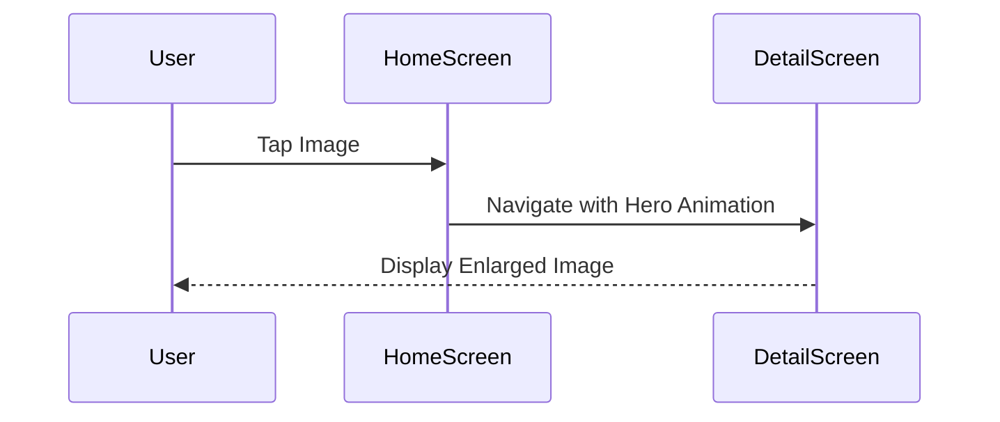

## 8.2.3 Hero Animations Across Screens

In the realm of mobile app development, creating a seamless and intuitive user experience is paramount. One of the tools Flutter provides to achieve this is the Hero animation. This feature allows developers to create visually appealing transitions between screens, enhancing the user's navigation experience by providing a visual continuity that guides the user's attention and reinforces the connection between UI elements.

### Definition and Purpose

**Hero Animations** are animated transitions that create a visual link between two UI elements across different screens. They are particularly effective in enhancing navigation by providing a seamless visual connection as users move between screens. This animation technique is named "Hero" because it allows a widget to "fly" from one screen to another, much like a hero in a story.

The primary purpose of Hero animations is to:

- **Enhance User Experience:** By visually linking elements across screens, Hero animations help users understand the relationship between different parts of the app.
- **Guide User Attention:** The animation draws the user's focus to the transition, making the navigation feel more intuitive.
- **Provide Visual Continuity:** It maintains a sense of continuity as users navigate, reducing cognitive load and making the app feel more cohesive.

### Implementing Hero Animations in Flutter

To implement Hero animations in Flutter, you need to understand the role of the `Hero` widget and how it facilitates these transitions.

#### Using the Hero Widget

The `Hero` widget in Flutter is a powerful tool that wraps around the widget you want to animate. It requires a unique `tag`, which acts as an identifier linking the Hero widgets across different screens.

- **Wrapping Widgets:** To create a Hero animation, wrap the widget you want to animate with a `Hero` widget. This could be an image, icon, or any other widget.
- **Assigning a Tag:** Each Hero widget must have a unique `tag` that matches the corresponding Hero widget on the destination screen. This tag is crucial for the animation to work correctly.

```dart
Hero(
  tag: 'hero-tag',
  child: Image.network('https://example.com/image.jpg'),
)
```

#### Matching Hero Tags

The `tag` property is the key to linking Hero widgets across screens. Both the source and destination widgets must have the same tag for the animation to occur.

- **Consistency is Key:** Ensure that the tags are identical in both the source and destination Hero widgets.
- **Unique Tags:** Each Hero animation should have a unique tag to prevent conflicts with other Hero animations in the app.

#### Animating Different Widget Types

Hero animations are versatile and can be applied to various widget types, including:

- **Images:** A common use case is animating an image from a thumbnail to a full-screen view.
- **Icons:** Icons can transition smoothly between screens, maintaining visual consistency.
- **Containers:** Any widget, including containers with complex child structures, can be animated using the Hero widget.

### Code Example

Let's walk through a practical example of implementing a Hero animation in Flutter. In this scenario, tapping an image on the home screen transitions to a detailed view with an enlarged image.

```dart
import 'package:flutter/material.dart';

void main() => runApp(MyApp());

class MyApp extends StatelessWidget {
  @override
  Widget build(BuildContext context) {
    return MaterialApp(
      home: HomeScreen(),
    );
  }
}

class HomeScreen extends StatelessWidget {
  @override
  Widget build(BuildContext context) {
    return Scaffold(
      appBar: AppBar(title: Text('Home')),
      body: Center(
        child: GestureDetector(
          onTap: () {
            Navigator.push(context, MaterialPageRoute(builder: (_) {
              return DetailScreen();
            }));
          },
          child: Hero(
            tag: 'hero-image',
            child: Image.network(
              'https://example.com/image.jpg',
              width: 100.0,
              height: 100.0,
            ),
          ),
        ),
      ),
    );
  }
}

class DetailScreen extends StatelessWidget {
  @override
  Widget build(BuildContext context) {
    return Scaffold(
      appBar: AppBar(title: Text('Detail')),
      body: Center(
        child: Hero(
          tag: 'hero-image',
          child: Image.network(
            'https://example.com/image.jpg',
            width: 300.0,
            height: 300.0,
          ),
        ),
      ),
    );
  }
}
```

**Explanation:**

- **Home Screen:** The `HomeScreen` contains a `Hero` widget wrapping an image. The `GestureDetector` is used to detect taps and navigate to the `DetailScreen`.
- **Detail Screen:** The `DetailScreen` also contains a `Hero` widget with the same `tag`. This ensures the image transitions smoothly between the two screens.
- **Navigation:** The `Navigator.push` method is used to transition between screens, triggering the Hero animation.

### Mermaid.js Diagrams

To better understand the flow of Hero animations, consider the following diagram depicting the transition between two screens:



This diagram illustrates the interaction flow, highlighting the shared Hero widget that animates between the `HomeScreen` and `DetailScreen`.

### Best Practices

To ensure smooth and effective Hero animations, consider the following best practices:

- **Unique Tags:** Ensure each Hero widget has a unique and consistent tag across screens to enable proper animation.
- **Consistent Widget Properties:** Maintain consistent properties (e.g., size, shape) of the Hero widgets to create smooth transitions.
- **Avoid Overusing Heroes:** Use Hero animations sparingly to highlight key navigation elements without overwhelming the user.

### Common Pitfalls

While implementing Hero animations, be aware of common pitfalls:

- **Mismatched Tags:** Forgetting to match Hero tags between source and destination widgets can result in failed or unexpected animations.
- **Inconsistent Layouts:** Differing widget sizes or shapes between screens can cause abrupt or jarring transitions.

### Implementation Guidance

To maximize the effectiveness of Hero animations:

- **Thorough Testing:** Test Hero animations across different screen sizes and orientations to ensure consistency.
- **Meaningful Transitions:** Use Hero animations for meaningful transitions that enhance navigation rather than for trivial UI elements.

By following these guidelines, you can leverage Hero animations to create a more engaging and intuitive user experience in your Flutter applications.

## Quiz Time!



### What is the primary purpose of Hero animations in Flutter?

- [x] To create a visual link between UI elements across screens
- [ ] To animate text within a single screen
- [ ] To change the color of widgets
- [ ] To manage state changes

> **Explanation:** Hero animations create a visual link between UI elements across different screens, enhancing user navigation and experience.

### What is required for a Hero animation to work correctly between two screens?

- [x] Matching Hero tags
- [ ] Different Hero tags
- [ ] Identical widget sizes
- [ ] Using only image widgets

> **Explanation:** Hero animations require matching Hero tags between the source and destination widgets to work correctly.

### Which widget is used to implement Hero animations in Flutter?

- [x] Hero
- [ ] AnimatedContainer
- [ ] GestureDetector
- [ ] Navigator

> **Explanation:** The Hero widget is used to implement Hero animations in Flutter by wrapping the widget to be animated.

### What should you ensure about the Hero widget's properties for smooth transitions?

- [x] Consistent properties across screens
- [ ] Different properties across screens
- [ ] Random properties
- [ ] No properties

> **Explanation:** Consistent properties (e.g., size, shape) of the Hero widgets across screens ensure smooth transitions.

### What is a common pitfall when implementing Hero animations?

- [x] Mismatched Hero tags
- [ ] Overusing GestureDetector
- [ ] Using too many colors
- [ ] Not using enough images

> **Explanation:** Mismatched Hero tags between source and destination widgets can result in failed or unexpected animations.

### How can you trigger a Hero animation in Flutter?

- [x] By navigating between screens with matching Hero tags
- [ ] By changing the widget's color
- [ ] By resizing the widget
- [ ] By using a different font

> **Explanation:** Hero animations are triggered by navigating between screens with matching Hero tags.

### What is a best practice for using Hero animations?

- [x] Use them sparingly for key navigation elements
- [ ] Use them for every UI element
- [ ] Avoid using them for navigation
- [ ] Use them only for text

> **Explanation:** Hero animations should be used sparingly to highlight key navigation elements without overwhelming the user.

### What type of widgets can participate in Hero animations?

- [x] Images, icons, and containers
- [ ] Only text widgets
- [ ] Only buttons
- [ ] Only background colors

> **Explanation:** Various widget types, including images, icons, and containers, can participate in Hero animations.

### What is the role of the `GestureDetector` in the provided code example?

- [x] To detect taps and trigger navigation
- [ ] To animate the Hero widget
- [ ] To change the widget's color
- [ ] To resize the widget

> **Explanation:** The `GestureDetector` detects taps and triggers navigation, which in turn triggers the Hero animation.

### True or False: Hero animations can be used for any UI element without considering its significance.

- [ ] True
- [x] False

> **Explanation:** Hero animations should be used for meaningful transitions that enhance navigation, not for trivial UI elements.


