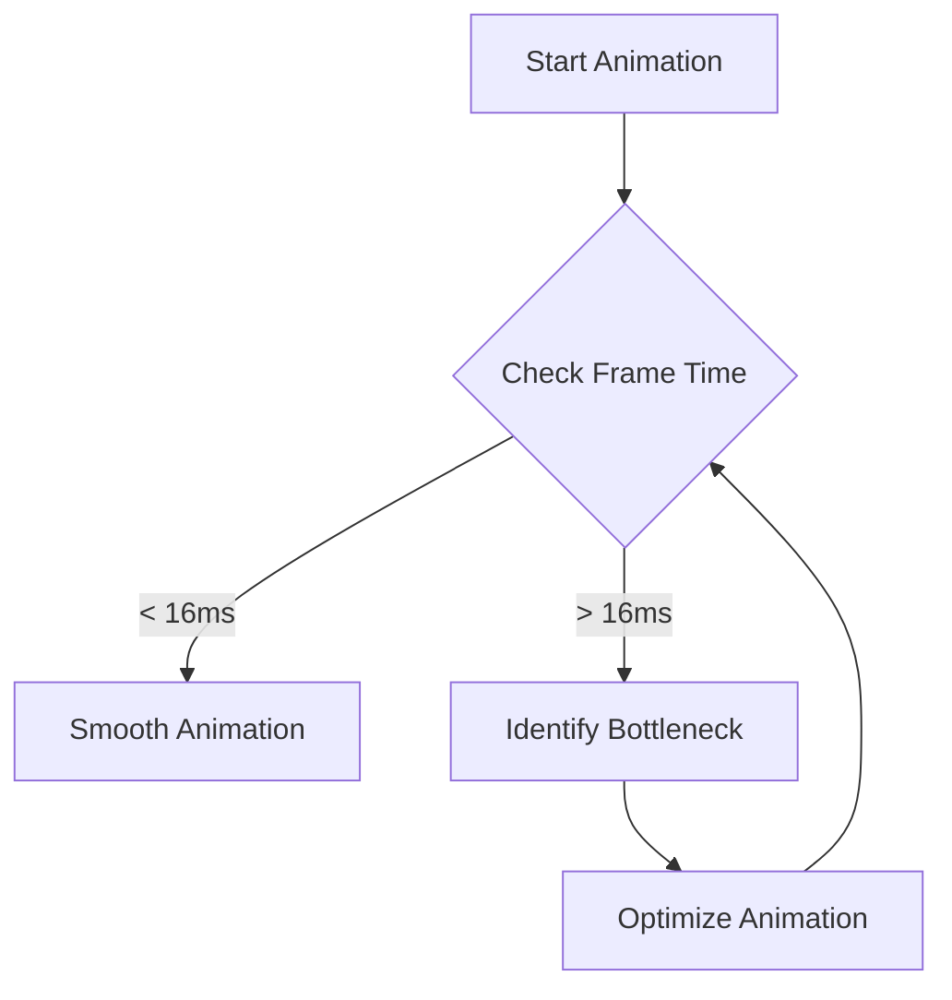

## 8.2.4 Performance Considerations in Flutter Animations

In the world of mobile app development, animations play a pivotal role in enhancing user experience by providing visual feedback and guiding users through the interface. However, while animations can make an app feel more dynamic and engaging, they can also impact performance, particularly on lower-end devices or in complex UI hierarchies. This section delves into the performance considerations when implementing animations in Flutter, offering insights into optimization techniques, profiling tools, and best practices to ensure your animations are smooth and responsive.

### Impact of Animations on Performance

Animations, when used judiciously, can significantly enhance the user experience by making interactions more intuitive and visually appealing. However, they also introduce additional computational overhead, which can affect app performance. This is especially true for:

- **Lower-End Devices:** Devices with limited processing power and memory may struggle to render complex animations smoothly, leading to frame drops and a laggy experience.
- **Complex UI Hierarchies:** Applications with deeply nested widget trees can experience performance bottlenecks when animations trigger frequent widget rebuilds.

To maintain a smooth and responsive user experience, it's crucial to optimize animations, ensuring they run efficiently across all devices.

### Optimizing Animation Performance

#### Minimize Widget Rebuilds

One of the primary performance concerns with animations is unnecessary widget rebuilds. Flutter provides several tools to help minimize these rebuilds:

- **AnimatedBuilder:** This widget allows you to separate the animation logic from the widget tree, only rebuilding the parts of the UI that actually change. By using `AnimatedBuilder`, you can avoid rebuilding the entire widget tree during each frame of the animation.

```dart
class MyAnimatedWidget extends StatelessWidget {
  final Animation<double> animation;

  MyAnimatedWidget({required this.animation});

  @override
  Widget build(BuildContext context) {
    return AnimatedBuilder(
      animation: animation,
      builder: (context, child) {
        return Transform.scale(
          scale: animation.value,
          child: child,
        );
      },
      child: Container(
        width: 100,
        height: 100,
        color: Colors.blue,
      ),
    );
  }
}
```

- **AnimatedWidget:** This is a base class for widgets that want to incorporate animations. It simplifies the process by handling the animation listener and calling `setState` automatically.

```dart
class MyAnimatedWidget extends AnimatedWidget {
  MyAnimatedWidget({Key? key, required Animation<double> animation})
      : super(key: key, listenable: animation);

  @override
  Widget build(BuildContext context) {
    final animation = listenable as Animation<double>;
    return Transform.scale(
      scale: animation.value,
      child: Container(
        width: 100,
        height: 100,
        color: Colors.blue,
      ),
    );
  }
}
```

#### Use Efficient Animation Techniques

- **Implicit Animations:** For simple transitions, implicit animations like `AnimatedContainer` or `AnimatedOpacity` are preferred. They are easier to implement and manage, as they handle the animation lifecycle internally.

- **Explicit Animations:** Use explicit animations with `AnimationController` and `Tween` only when necessary, such as when you need more control over the animation's behavior or when implementing complex animations.

#### Limit Animation Complexity

Avoid overly complex or resource-intensive animations. Simpler animations not only perform better but also tend to be more effective in enhancing user experience without overwhelming the user.

### Profiling and Monitoring

#### Flutter DevTools

Flutter DevTools is an essential tool for profiling and monitoring animation performance. It provides insights into frame rendering times, helping you identify bottlenecks and optimize your animations.

- **Frame Rendering Analysis:** Use the timeline view in DevTools to analyze frame rendering times. Look for frames that exceed the 16ms budget (for 60fps) and identify the causes of any frame drops.



### Best Practices

#### Reusable Animations

Create reusable animation components to avoid duplicating animation logic throughout your app. This not only improves maintainability but also ensures consistency in animation behavior.

#### Asynchronous Animations

Handle animations asynchronously to prevent blocking the UI thread. This can be achieved by using `Future` or `Stream` to manage animation states and transitions.

#### Efficient Asset Management

Optimize assets used in animations, such as images and vectors, to reduce memory usage and load times. Consider using vector graphics (e.g., SVG) for scalable and lightweight assets.

### Common Pitfalls

#### Overusing Animations

Excessive use of animations can clutter the UI and degrade performance. Use animations sparingly and purposefully to enhance, rather than distract from, the user experience.

#### Ignoring Frame Drops

Failing to monitor and address frame drops can lead to a laggy and unresponsive UI. Regularly profile your app to ensure animations run smoothly and make necessary adjustments to optimize performance.

### Implementation Guidance

- **Regular Performance Testing:** Continuously test animation performance during development to catch and resolve issues early. Use tools like Flutter DevTools to monitor frame rates and identify bottlenecks.
- **Simple and Subtle Animations:** Opt for simple and subtle animations that enhance the user experience without overburdening the app. These animations are more likely to perform well across a range of devices.

### Conclusion

Animations are a powerful tool in the Flutter developer's arsenal, capable of transforming the user experience when used effectively. By understanding the impact of animations on performance and employing optimization techniques, you can ensure your animations are both beautiful and efficient. Remember to profile and monitor your animations regularly, adhere to best practices, and avoid common pitfalls to maintain a smooth and responsive app experience.

## Quiz Time!



### How can animations affect app performance?

- [x] By introducing additional computational overhead
- [ ] By reducing memory usage
- [ ] By simplifying the UI hierarchy
- [ ] By increasing battery life

> **Explanation:** Animations introduce additional computational overhead, which can affect app performance, especially on lower-end devices or with complex UI hierarchies.

### What is a benefit of using AnimatedBuilder?

- [x] It minimizes unnecessary widget rebuilds
- [ ] It simplifies the animation lifecycle
- [ ] It automatically handles user interactions
- [ ] It increases the complexity of animations

> **Explanation:** AnimatedBuilder helps minimize unnecessary widget rebuilds by separating animation logic from the widget tree, only rebuilding parts of the UI that change.

### When should you prefer implicit animations?

- [x] For simple transitions
- [ ] For complex animations
- [ ] When using AnimationController
- [ ] For animations with multiple states

> **Explanation:** Implicit animations are preferred for simple transitions as they are easier to implement and manage.

### What tool can be used to profile animation performance in Flutter?

- [x] Flutter DevTools
- [ ] Android Studio Profiler
- [ ] Xcode Instruments
- [ ] Visual Studio Code

> **Explanation:** Flutter DevTools is used to profile animation performance, providing insights into frame rendering times and helping identify bottlenecks.

### What is a common pitfall when using animations?

- [x] Overusing animations
- [ ] Using implicit animations
- [ ] Profiling animations regularly
- [ ] Optimizing asset management

> **Explanation:** Overusing animations can clutter the UI and degrade performance, making it a common pitfall to avoid.

### How can asynchronous animations benefit performance?

- [x] By preventing UI thread blocking
- [ ] By increasing frame rates
- [ ] By reducing memory usage
- [ ] By simplifying animation logic

> **Explanation:** Asynchronous animations prevent blocking the UI thread, helping maintain smooth performance.

### What should you regularly test during animation implementation?

- [x] Performance
- [ ] Color schemes
- [ ] User feedback
- [ ] Code readability

> **Explanation:** Regular performance testing during animation implementation helps catch and resolve issues early.

### Why is it important to limit animation complexity?

- [x] To avoid straining device resources
- [ ] To increase the number of animations
- [ ] To reduce the need for profiling
- [ ] To simplify the UI hierarchy

> **Explanation:** Limiting animation complexity helps avoid straining device resources, ensuring smoother performance.

### What is a benefit of creating reusable animation components?

- [x] Improved maintainability
- [ ] Increased animation complexity
- [ ] Reduced performance
- [ ] Simplified user interactions

> **Explanation:** Reusable animation components improve maintainability and ensure consistency in animation behavior.

### True or False: Ignoring frame drops can lead to a laggy and unresponsive UI.

- [x] True
- [ ] False

> **Explanation:** Ignoring frame drops can indeed lead to a laggy and unresponsive UI, making it important to monitor and address them.


