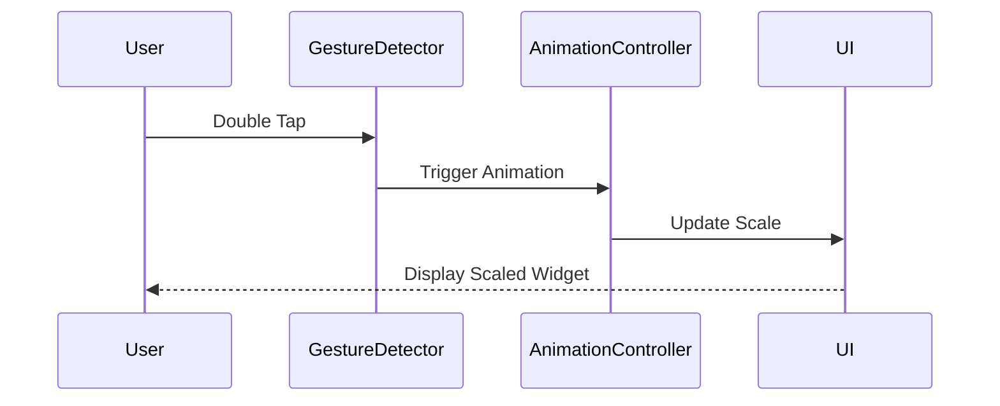

## 8.3.1 GestureDetector and InkWell

In the world of mobile app development, user interaction is a cornerstone of creating engaging and intuitive applications. Flutter, with its rich set of widgets, provides developers with powerful tools to detect and respond to user gestures, making apps more dynamic and interactive. Two such essential widgets are `GestureDetector` and `InkWell`. This section delves into these widgets, exploring their functionalities, use cases, and how they can be leveraged to create responsive animations.

### Introduction to Gesture Widgets

Gesture detection in Flutter is pivotal for crafting interactive experiences. By capturing user inputs such as taps, swipes, and drags, developers can trigger animations and transitions that enhance the user interface. Gesture widgets serve as the bridge between user actions and the app's response, enabling a seamless interaction flow.

### GestureDetector Widget

#### Functionality

The `GestureDetector` widget is a versatile tool in Flutter's arsenal, capable of detecting a wide array of gestures. Whether it's a simple tap, a double-tap, a long press, or more complex gestures like swipes and drags, `GestureDetector` can handle them all. This widget does not provide any visual feedback on its own; instead, it acts as a listener that triggers callbacks when specific gestures are detected.

#### Usage Scenarios

- **Opening a Menu on Tap:** A common use case for `GestureDetector` is to open a menu or a dialog when a user taps on a specific area of the screen.
- **Dragging Widgets:** Implementing drag-and-drop functionality is straightforward with `GestureDetector`, allowing users to move widgets around the screen.
- **Swipe to Dismiss:** Detecting swipe gestures to remove items from a list or navigate between pages.

### InkWell Widget

#### Functionality

The `InkWell` widget is part of Flutter's material design library, providing a visual feedback mechanism through a ripple effect when a user taps on a widget. This ripple effect is a hallmark of material design, offering users a clear indication that their touch has been registered. Unlike `GestureDetector`, `InkWell` is specifically designed for touch interactions, making it ideal for buttons, list items, and other interactive elements.

#### Usage Scenarios

- **Clickable Buttons:** `InkWell` is perfect for buttons that require visual feedback upon interaction.
- **List Items:** When used with list items, `InkWell` enhances the user experience by providing a tactile response to taps.
- **Navigation Elements:** Use `InkWell` for elements that trigger navigation actions, ensuring users receive immediate feedback.

### Code Example

To illustrate the use of `GestureDetector` and `InkWell`, let's explore two practical examples.

#### GestureDetector Example

In this example, we'll use `GestureDetector` to detect a double-tap gesture and trigger an animation that scales a widget.

```dart
import 'package:flutter/material.dart';

void main() => runApp(MyApp());

class MyApp extends StatelessWidget {
  @override
  Widget build(BuildContext context) {
    return MaterialApp(
      home: GestureDetectorExample(),
    );
  }
}

class GestureDetectorExample extends StatefulWidget {
  @override
  _GestureDetectorExampleState createState() => _GestureDetectorExampleState();
}

class _GestureDetectorExampleState extends State<GestureDetectorExample>
    with SingleTickerProviderStateMixin {
  AnimationController _controller;
  Animation<double> _animation;

  @override
  void initState() {
    super.initState();
    _controller = AnimationController(
      duration: const Duration(milliseconds: 300),
      vsync: this,
    );
    _animation = Tween<double>(begin: 1.0, end: 1.5).animate(_controller);
  }

  @override
  void dispose() {
    _controller.dispose();
    super.dispose();
  }

  void _handleDoubleTap() {
    if (_controller.isCompleted) {
      _controller.reverse();
    } else {
      _controller.forward();
    }
  }

  @override
  Widget build(BuildContext context) {
    return Scaffold(
      appBar: AppBar(title: Text('GestureDetector Example')),
      body: Center(
        child: GestureDetector(
          onDoubleTap: _handleDoubleTap,
          child: ScaleTransition(
            scale: _animation,
            child: Container(
              width: 100,
              height: 100,
              color: Colors.blue,
              child: Center(child: Text('Double Tap')),
            ),
          ),
        ),
      ),
    );
  }
}
```

**Explanation:**
- **AnimationController:** Manages the animation's duration and state.
- **Tween:** Defines the animation's start and end values.
- **GestureDetector:** Listens for double-tap gestures to trigger the animation.

#### InkWell Example

In this example, we'll demonstrate `InkWell` with a ripple effect on tap, triggering an animated color change.

```dart
import 'package:flutter/material.dart';

void main() => runApp(MyApp());

class MyApp extends StatelessWidget {
  @override
  Widget build(BuildContext context) {
    return MaterialApp(
      home: InkWellExample(),
    );
  }
}

class InkWellExample extends StatefulWidget {
  @override
  _InkWellExampleState createState() => _InkWellExampleState();
}

class _InkWellExampleState extends State<InkWellExample> {
  Color _color = Colors.blue;

  void _changeColor() {
    setState(() {
      _color = _color == Colors.blue ? Colors.green : Colors.blue;
    });
  }

  @override
  Widget build(BuildContext context) {
    return Scaffold(
      appBar: AppBar(title: Text('InkWell Example')),
      body: Center(
        child: InkWell(
          onTap: _changeColor,
          child: AnimatedContainer(
            duration: Duration(milliseconds: 300),
            width: 100,
            height: 100,
            color: _color,
            child: Center(child: Text('Tap Me')),
          ),
        ),
      ),
    );
  }
}
```

**Explanation:**
- **InkWell:** Provides a ripple effect on tap.
- **AnimatedContainer:** Smoothly transitions between color changes.

### Mermaid.js Diagrams

To better understand how gestures are detected and translated into animation triggers, consider the following sequence diagram:



**Explanation:**
- **User Interaction:** The user performs a double-tap gesture.
- **Gesture Detection:** `GestureDetector` captures the gesture and notifies the `AnimationController`.
- **Animation Trigger:** The `AnimationController` updates the UI, scaling the widget.

### Best Practices

#### Feedback Mechanisms

- Ensure all interactive elements provide visual feedback to confirm responsiveness. This can be achieved through animations, color changes, or material ripple effects.

#### Hit Testing

- Design gesture areas to be sufficiently large, enhancing usability and ensuring users can easily interact with the app.

### Common Pitfalls

#### Overlapping Gestures

- Avoid conflicts between multiple gesture detectors. Ensure that gestures are distinct and do not interfere with one another, which can lead to unexpected behaviors.

#### Invisible Hit Areas

- Ensure tappable areas are visible and large enough for user interaction. Invisible or too-small hit areas can frustrate users and degrade the experience.

### Implementation Guidance

- Define clear and intuitive gestures that align with user expectations. This enhances the user experience and makes the app more intuitive.
- Combine gesture detection with state management solutions like Provider or Bloc to effectively control animation flows and maintain a responsive UI.

### Conclusion

Gesture detection is a powerful feature in Flutter that, when combined with animations, can significantly enhance the interactivity and responsiveness of an application. By understanding and utilizing `GestureDetector` and `InkWell`, developers can create dynamic user interfaces that respond intuitively to user input, providing a seamless and engaging experience.

For further exploration, consider reviewing Flutter's official documentation on [GestureDetector](https://api.flutter.dev/flutter/widgets/GestureDetector-class.html) and [InkWell](https://api.flutter.dev/flutter/material/InkWell-class.html). Additionally, explore community resources and tutorials to deepen your understanding and application of these widgets in real-world scenarios.

## Quiz Time!



### What is the primary purpose of the GestureDetector widget in Flutter?

- [x] To detect a wide range of user gestures and trigger callbacks.
- [ ] To provide visual feedback through ripple effects.
- [ ] To manage state changes in an application.
- [ ] To create complex animations automatically.

> **Explanation:** The `GestureDetector` widget is designed to detect various user gestures such as taps, swipes, and drags, and trigger corresponding callbacks.

### Which widget provides a material design ripple effect on user interaction?

- [ ] GestureDetector
- [x] InkWell
- [ ] Container
- [ ] AnimatedBuilder

> **Explanation:** The `InkWell` widget provides a material design ripple effect, offering visual feedback when a user interacts with it.

### In the GestureDetector example, what gesture is used to trigger the animation?

- [ ] Single Tap
- [x] Double Tap
- [ ] Long Press
- [ ] Swipe

> **Explanation:** The example uses a double-tap gesture to trigger the animation that scales the widget.

### What is a common use case for the InkWell widget?

- [x] Creating buttons with visual feedback.
- [ ] Detecting swipe gestures.
- [ ] Managing application state.
- [ ] Building complex layouts.

> **Explanation:** `InkWell` is commonly used for creating buttons and interactive elements that require visual feedback on user interaction.

### How does the GestureDetector widget differ from InkWell in terms of functionality?

- [x] GestureDetector detects a wide range of gestures, while InkWell provides visual feedback.
- [ ] GestureDetector provides visual feedback, while InkWell detects gestures.
- [ ] Both widgets serve the same purpose.
- [ ] GestureDetector is used for animations, while InkWell is not.

> **Explanation:** `GestureDetector` is used to detect various gestures, whereas `InkWell` is primarily for providing visual feedback with a ripple effect.

### What is a potential pitfall when using multiple GestureDetector widgets?

- [x] Overlapping gestures leading to unexpected behaviors.
- [ ] Lack of visual feedback for user interactions.
- [ ] Difficulty in managing application state.
- [ ] Inability to detect complex gestures.

> **Explanation:** Using multiple `GestureDetector` widgets can lead to overlapping gestures, which may cause unexpected behaviors if not managed properly.

### Why is it important to ensure tappable areas are sufficiently large?

- [x] To enhance usability and ensure easy user interaction.
- [ ] To improve application performance.
- [ ] To reduce the size of the application.
- [ ] To prevent memory leaks.

> **Explanation:** Ensuring tappable areas are large enough enhances usability by making it easier for users to interact with the app.

### What role does the AnimationController play in the GestureDetector example?

- [x] It manages the animation's duration and state.
- [ ] It provides visual feedback through ripple effects.
- [ ] It detects user gestures.
- [ ] It manages application state.

> **Explanation:** The `AnimationController` manages the animation's duration and state, controlling the scaling effect in the example.

### Which widget is ideal for implementing drag-and-drop functionality?

- [x] GestureDetector
- [ ] InkWell
- [ ] AnimatedContainer
- [ ] StreamBuilder

> **Explanation:** `GestureDetector` is ideal for implementing drag-and-drop functionality, as it can detect drag gestures.

### True or False: InkWell can be used to detect complex gestures like swipes and drags.

- [ ] True
- [x] False

> **Explanation:** `InkWell` is primarily used for detecting tap gestures and providing visual feedback, not for complex gestures like swipes and drags.


