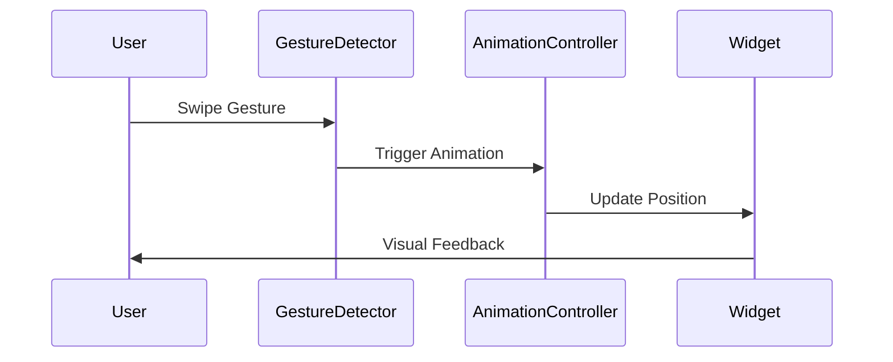

## 8.3.2 Animations Triggered by Gestures

In the realm of mobile app development, creating an engaging and responsive user interface is paramount. One effective way to achieve this is by connecting user gestures to animations. This approach not only enhances interactivity but also provides users with immediate feedback, making the application feel more intuitive and dynamic. In this section, we will delve into the various types of gesture-triggered animations in Flutter, explore how to implement them, and discuss best practices and common pitfalls.

### Connecting Gestures to Animations

User gestures, such as taps, swipes, drags, and long presses, can serve as powerful triggers for animations. By linking these gestures to animations, developers can create a seamless and engaging user experience. For instance, a swipe gesture can be used to slide a panel into view, while a tap can trigger a subtle highlight effect on a selected item.

#### Types of Gesture-Triggered Animations

1. **Tap-Based Animations:**
   - **Example:** Expanding a card or highlighting a selection.
   - **Use Case:** When a user taps on a card, it can expand to reveal more information, providing a smooth transition that captures the user's attention.

2. **Swipe-Based Animations:**
   - **Example:** Sliding panels or transitioning between screens.
   - **Use Case:** Swiping left or right to navigate through different sections of an app, such as a photo gallery or a list of articles.

3. **Drag-Based Animations:**
   - **Example:** Moving a widget across the screen or resizing elements dynamically.
   - **Use Case:** Allowing users to drag and drop items within a list, providing visual feedback as the item moves.

4. **Long Press Animations:**
   - **Example:** Showing context menus or enabling edit modes.
   - **Use Case:** Activating a context menu after a long press on an item, allowing users to perform additional actions.

### Implementing Gesture-Triggered Animations

To implement gesture-triggered animations in Flutter, you need to integrate gesture detection with animation controllers. This involves using widgets like `GestureDetector` and `InkWell` to capture gestures and `AnimationController` to manage the animation states.

#### State Management Integration

State management plays a crucial role in handling the state changes that initiate animations. Solutions like `Provider` or `Bloc` can be used to manage the state efficiently, ensuring that animations respond correctly to user interactions.

#### Animation Controllers

`AnimationController` is a powerful tool in Flutter that allows you to create controlled animations. By setting up an `AnimationController`, you can define the duration, curve, and behavior of the animation, making it responsive to user gestures.

### Code Example

Let's explore a practical example where a `GestureDetector` detects a swipe gesture and triggers a sliding animation using `AnimationController`.

```dart
import 'package:flutter/material.dart';

void main() => runApp(MyApp());

class MyApp extends StatelessWidget {
  @override
  Widget build(BuildContext context) {
    return MaterialApp(
      home: GestureAnimationDemo(),
    );
  }
}

class GestureAnimationDemo extends StatefulWidget {
  @override
  _GestureAnimationDemoState createState() => _GestureAnimationDemoState();
}

class _GestureAnimationDemoState extends State<GestureAnimationDemo>
    with SingleTickerProviderStateMixin {
  AnimationController _controller;
  Animation<Offset> _slideAnimation;

  @override
  void initState() {
    super.initState();
    _controller = AnimationController(
      duration: const Duration(milliseconds: 300),
      vsync: this,
    );

    _slideAnimation = Tween<Offset>(
      begin: Offset.zero,
      end: Offset(1.0, 0.0),
    ).animate(CurvedAnimation(
      parent: _controller,
      curve: Curves.easeInOut,
    ));
  }

  void _onSwipe() {
    if (_controller.isDismissed) {
      _controller.forward();
    } else {
      _controller.reverse();
    }
  }

  @override
  void dispose() {
    _controller.dispose();
    super.dispose();
  }

  @override
  Widget build(BuildContext context) {
    return Scaffold(
      appBar: AppBar(title: Text('Gesture Animation Demo')),
      body: GestureDetector(
        onHorizontalDragEnd: (details) => _onSwipe(),
        child: SlideTransition(
          position: _slideAnimation,
          child: Container(
            width: 200,
            height: 200,
            color: Colors.blue,
            child: Center(child: Text('Swipe Me')),
          ),
        ),
      ),
    );
  }
}
```

**Explanation:**
- **GestureDetector:** Captures horizontal drag gestures.
- **AnimationController:** Manages the animation state.
- **SlideTransition:** Animates the position of the widget based on the swipe gesture.

Here's another example where a tap gesture on an `InkWell` triggers an opacity animation to fade a widget in and out.

```dart
import 'package:flutter/material.dart';

void main() => runApp(MyApp());

class MyApp extends StatelessWidget {
  @override
  Widget build(BuildContext context) {
    return MaterialApp(
      home: TapAnimationDemo(),
    );
  }
}

class TapAnimationDemo extends StatefulWidget {
  @override
  _TapAnimationDemoState createState() => _TapAnimationDemoState();
}

class _TapAnimationDemoState extends State<TapAnimationDemo>
    with SingleTickerProviderStateMixin {
  AnimationController _controller;
  Animation<double> _opacityAnimation;

  @override
  void initState() {
    super.initState();
    _controller = AnimationController(
      duration: const Duration(milliseconds: 500),
      vsync: this,
    );

    _opacityAnimation = Tween<double>(
      begin: 1.0,
      end: 0.0,
    ).animate(CurvedAnimation(
      parent: _controller,
      curve: Curves.easeInOut,
    ));
  }

  void _onTap() {
    if (_controller.isCompleted) {
      _controller.reverse();
    } else {
      _controller.forward();
    }
  }

  @override
  void dispose() {
    _controller.dispose();
    super.dispose();
  }

  @override
  Widget build(BuildContext context) {
    return Scaffold(
      appBar: AppBar(title: Text('Tap Animation Demo')),
      body: Center(
        child: InkWell(
          onTap: _onTap,
          child: FadeTransition(
            opacity: _opacityAnimation,
            child: Container(
              width: 200,
              height: 200,
              color: Colors.red,
              child: Center(child: Text('Tap Me')),
            ),
          ),
        ),
      ),
    );
  }
}
```

**Explanation:**
- **InkWell:** Captures tap gestures.
- **FadeTransition:** Animates the opacity of the widget based on the tap gesture.

### Mermaid.js Diagrams

To visualize the process of gesture-triggered animations, consider using sequence diagrams to map gestures to state changes and subsequent animation triggers.



### Best Practices

- **Responsive Feedback:** Ensure that animations provide immediate and appropriate feedback in response to user gestures. This enhances the user's sense of control and satisfaction.
- **Gesture Conflict Resolution:** Design animations to smoothly coexist with other gesture interactions within the app. Avoid conflicts that can confuse users.

### Common Pitfalls

- **Delayed Feedback:** Avoid animations that lag behind gestures, which can reduce perceived responsiveness. Ensure animations are smooth and timely.
- **Complex Gesture Handling:** Overcomplicating gesture detection and animation logic can lead to maintenance challenges and user confusion. Keep the logic simple and clear.

### Implementation Guidance

- **Simplicity:** Keep gesture-triggered animation logic as simple and clear as possible. This makes the code easier to maintain and understand.
- **Thorough Testing:** Test gesture-animated interactions thoroughly to ensure they feel natural and intuitive. Consider edge cases and different user behaviors.

By following these guidelines and leveraging the power of Flutter's animation framework, you can create dynamic and engaging user interfaces that respond fluidly to user gestures. This not only enhances the user experience but also sets your application apart in terms of interactivity and responsiveness.

## Quiz Time!



### Which widget is commonly used to detect gestures in Flutter?

- [x] GestureDetector
- [ ] Container
- [ ] Column
- [ ] Row

> **Explanation:** The `GestureDetector` widget is used to detect gestures in Flutter, such as taps, swipes, and drags.

### What is the role of `AnimationController` in gesture-triggered animations?

- [x] It manages the animation state and controls the animation's behavior.
- [ ] It detects user gestures.
- [ ] It styles the widget.
- [ ] It handles network requests.

> **Explanation:** `AnimationController` is responsible for managing the animation state and controlling the animation's behavior, such as its duration and curve.

### What type of gesture is typically used to trigger a context menu?

- [ ] Tap
- [ ] Swipe
- [ ] Drag
- [x] Long Press

> **Explanation:** A long press gesture is typically used to trigger a context menu, allowing users to perform additional actions.

### In the provided code examples, which widget is used to animate the position of a widget based on a swipe gesture?

- [x] SlideTransition
- [ ] FadeTransition
- [ ] ScaleTransition
- [ ] RotationTransition

> **Explanation:** The `SlideTransition` widget is used to animate the position of a widget based on a swipe gesture.

### What is a common pitfall when implementing gesture-triggered animations?

- [x] Delayed feedback
- [ ] Immediate feedback
- [ ] Simple gesture handling
- [ ] Responsive feedback

> **Explanation:** Delayed feedback is a common pitfall, as it can reduce perceived responsiveness and user satisfaction.

### Which widget is used to capture tap gestures in the second code example?

- [ ] GestureDetector
- [x] InkWell
- [ ] Container
- [ ] Scaffold

> **Explanation:** The `InkWell` widget is used to capture tap gestures in the second code example.

### What is the purpose of using `CurvedAnimation` with `AnimationController`?

- [x] To apply different easing functions to the animation.
- [ ] To detect gestures.
- [ ] To style the widget.
- [ ] To handle network requests.

> **Explanation:** `CurvedAnimation` is used with `AnimationController` to apply different easing functions to the animation, creating smooth transitions.

### How can state management solutions like `Provider` or `Bloc` be used in gesture-triggered animations?

- [x] To manage state changes that initiate animations.
- [ ] To detect gestures.
- [ ] To style the widget.
- [ ] To handle network requests.

> **Explanation:** State management solutions like `Provider` or `Bloc` can be used to manage state changes that initiate animations, ensuring they respond correctly to user interactions.

### Which type of gesture is commonly used to navigate between screens?

- [ ] Tap
- [x] Swipe
- [ ] Drag
- [ ] Long Press

> **Explanation:** Swipe gestures are commonly used to navigate between screens, such as in a photo gallery or a list of articles.

### True or False: Keeping gesture-triggered animation logic simple and clear is recommended for maintainability.

- [x] True
- [ ] False

> **Explanation:** Keeping gesture-triggered animation logic simple and clear is recommended for maintainability, making the code easier to understand and manage.


